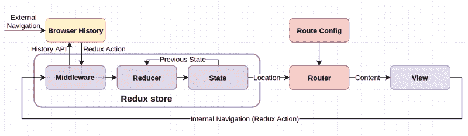
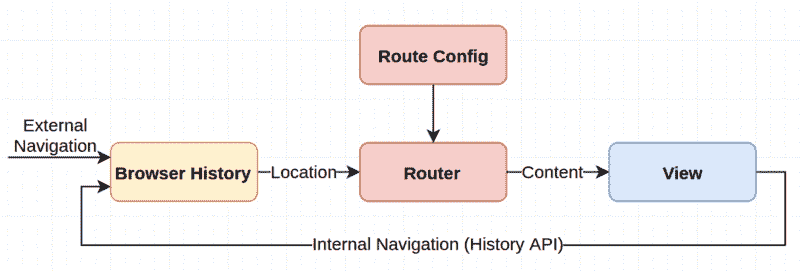
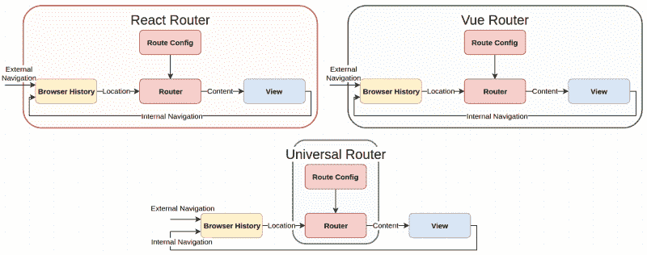
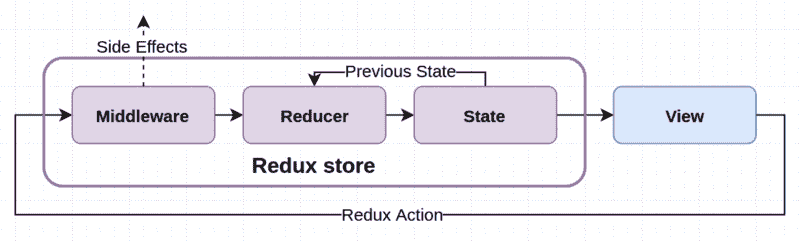
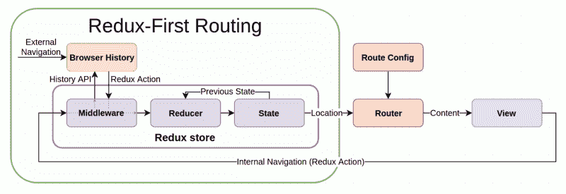
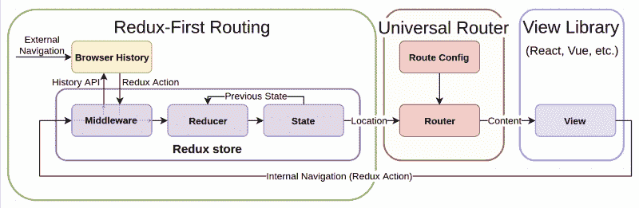

# 冗余优先路由模型简介

> 原文：<https://www.freecodecamp.org/news/an-introduction-to-the-redux-first-routing-model-98926ebf53cb/>

迈克尔·萨金特

# 冗余优先路由模型简介



路由库是任何复杂的单页面应用程序的关键组件。如果你用 React 和 Redux 开发 web 应用，你可能用过，或者至少听说过 [React Router](https://github.com/ReactTraining/react-router) 。这是 React 的一个著名路由库，也是许多用例的一个很好的解决方案。

但是 React 路由器并不是 React/Redux 生态系统中唯一可行的解决方案。事实上，为 React 和 Redux 构建的路由解决方案[不计其数，每一个都有不同的 API、特性和目标——而且这个列表还在不断增长。不用说，客户端路由不会很快消失，未来的路由库中仍有很大的设计空间。](https://github.com/brillout/awesome-react-components#router)

今天，我想让大家关注一下 Redux 中的路由主题。我将为 **Redux-first routing** 提出一个案例，这是一个范例，它使 Redux 成为路由模型的*之星*，也是许多 Redux 路由解决方案中的共同线索。在探索 React 和其他前端框架的实际使用选项之前，我将演示如何在不到 100 行代码中整合核心的、与框架无关的 API。

### 一点历史


在浏览器中，**位置** (URL 信息)和**会话历史**(当前浏览器标签访问的位置的堆栈)存储在全局`window`对象中。可以通过以下方式访问它们:

*   `window.location` ( [位置 API](https://developer.mozilla.org/en-US/docs/Web/API/Location)
*   `window.history` ( [历史 API](https://developer.mozilla.org/en-US/docs/Web/API/History) )。

历史 API 提供了以下**历史导航方法**，值得注意的是它们能够更新浏览器的历史和位置*，而不需要页面重新加载*:

*   `pushState(href)` —将新位置推送到历史堆栈上
*   `replaceState(href)` —覆盖堆栈上的当前位置
*   `back()` —导航到堆栈上的上一个位置
*   `forward()` —导航到堆栈上的下一个位置
*   `go(index)` —在任一方向上导航到堆栈上的某个位置。

历史和位置 API 一起实现了现代客户端路由范例，称为**推状态路由**——我们故事的第一个主角。

现在，提及历史和位置 API 而不提及像`[history](https://github.com/ReactTraining/history)`这样的现代**包装器库**几乎是一种犯罪。

[**react training/history**](https://github.com/ReactTraining/history)
[*用 JavaScript 管理会话历史*github.com](https://github.com/ReactTraining/history)

`history`提供一个简单而强大的 API，用于连接浏览器历史和位置，同时覆盖不同浏览器实现之间的不一致性。在许多现代路由库中，它被用作对等体或内部依赖项，我将在本文中多次引用它。

### Redux 和推状态路由


我们故事的第二个主角是 **Redux** 。现在是 2017 年，我就不介绍了，直奔主题:

通过在 Redux 应用程序中使用普通推送状态路由，我们将应用程序状态分为两个域:浏览器历史和 Redux 存储。

React 路由器看起来是这样的，它[实例化并包装](https://github.com/ReactTraining/react-router/blob/master/packages/react-router-dom/modules/BrowserRouter.js#L18-L21) `history`:

```
history → React Router ↘                        view                 Redux ↗
```

现在，我们知道[并非所有数据都必须驻留在存储库](http://redux.js.org/docs/faq/OrganizingState.html#do-i-have-to-put-all-my-state-into-redux-should-i-ever-use-reacts-setstate)中。例如，本地组件状态通常是存储特定于单个组件的数据的合适位置。

但是位置数据并不简单。它是应用程序状态的一个动态且重要的部分——属于存储区的数据类型。在商店中持有它可以实现 Redux 奢侈品，如时间旅行调试，以及从任何商店连接的组件轻松访问。

**那么，我们如何将位置转移到商店中呢？**

无法回避的事实是，浏览器在`window`中读取和存储历史和位置信息，但是我们*可以*做的是在商店中保存位置数据的*副本*，并使其与浏览器保持同步。

**这不就是`[react-router-redux](https://github.com/reactjs/react-router-redux)`给 React 路由器做的吗？**

是的，但只是为了启用 Redux DevTools 的时间旅行功能。该应用仍然依赖于 React 路由器中保存的位置数据:

```
history → React Router ↘                   ↕    view                 Redux ↗
```

使用`react-router-redux`从商店而不是 React 路由器读取位置数据是[不鼓励的](https://github.com/reactjs/react-router-redux#how-do-i-access-router-state-in-a-container-component)(由于潜在的矛盾来源)。

我们能做得更好吗？

我们能建立一个替代的路由模型吗——一个从头开始建立的可以很好地与 Redux 一起使用的模型，允许我们用 Redux 的方式 —用`store.getState()`和`store.dispatch()`读取和更新位置*？*

我们绝对可以，这叫做 *Redux-first routing* 。

### 冗余优先路由


Redux-first 路由是 pushState 路由的变体，它使 Redux 成为路由模型的明星。

**冗余优先布线解决方案满足以下标准**:

*   位置保存在 Redux store 中。
*   通过调度 Redux 动作来改变位置。
*   应用程序只从商店中读取位置数据。
*   商店和浏览器历史在后台保持同步。

这是看起来像什么的一个基本想法:

```
history   ↕ Redux → router → view
```

**等等，位置数据不是还有两个来源吗？**

是的，但是如果我们可以相信浏览器历史和 Redux 存储是同步的，我们可以构建我们的应用程序来只从存储中读取位置数据。然后，从应用程序的角度来看，只有一个真实的来源——商店。

我们如何实现冗余优先路由？

我们可以从创建一个概念模型开始，通过合并客户端路由和 Redux 数据生命周期模型的基本元素。

### 重新审视客户端路由模型



客户端路由是一个多步骤的过程，从*导航*开始，到*渲染*——*路由*本身只是这个过程中的一个步骤！让我们回顾一下细节:

*   **导航** —一切都从位置的变化开始。导航有两种:*内部*和*外部*。内部导航是从应用程序内部完成的(例如，通过历史 API)，而外部导航发生在用户与浏览器的导航栏交互或从外部站点进入应用程序时。
*   **响应导航** —当位置改变时，应用程序通过将新位置传递给路由器来做出响应。旧的路由技术依靠轮询`window.location`来完成这一点，但是现在我们有了方便的`[history.listen](https://github.com/ReactTraining/history#listening)`工具。
*   **Routing** —接下来，将新位置与其对应的页面内容进行匹配。处理这一步的代码被称为*路由器*，它通常接受一个匹配路由和页面的输入参数，称为*路由配置。*
*   **渲染** —最后，在客户端渲染内容。当然，这一步可以由像 React 这样的前端框架/库来处理。

注意，路由库不必处理路由模型的每个部分的*。*

有些库，像 React Router 和 [Vue Router](https://github.com/vuejs/vue-router) ， *do* —而其他的，像[通用路由器](https://github.com/kriasoft/universal-router)，只关心一个方面(像 *routing)* ，因此在其他方面提供了灵活性:



Routing libraries may have different scopes of responsibility. (Click to enlarge)

### 重新审视 Redux 数据生命周期模型



Redux 拥有一个单向数据流/生命周期模型，这可能不需要介绍——但这里有一个很好的衡量标准的简要概述:

*   **动作** —状态的任何变化都是通过调度 Redux 动作(一个包含`type`和可选有效负载的普通对象)开始的。
*   **中间件** —动作通过商店的中间件链，在那里动作可能被拦截，并且可能执行额外的行为。中间件通常用于处理 Redux 应用程序中的副作用。
*   **reducer** —然后动作到达根 Reducer，根 Reducer 根据前一个状态和接收到的动作计算存储的下一个状态。根归约器可以由单独的归约器组成，每个归约器处理存储状态的一部分。
*   **新状态** —商店保存 reducer 返回的新状态，并通知其[订户](http://redux.js.org/docs/api/Store.html#subscribe)这一变化(在 React 中，通过`[connect](https://github.com/reactjs/react-redux/blob/master/docs/api.md#connectmapstatetoprops-mapdispatchtoprops-mergeprops-options)`)。
*   **渲染** —最后，商店连接视图可以根据新状态重新渲染。

### 建立冗余优先路由模型


客户端路由和 Redux 数据生命周期模型的单向性质非常适合满足我们为 Redux-first 路由制定的标准的合并模型。

在这个模型中，路由器被订阅到商店，导航通过 Redux 操作完成，浏览器历史的更新由一个定制的中间件处理。让我们来看看这个模型的细节:

*   **通过 Redux 动作**进行内部导航——内部导航不是直接使用历史 API，而是通过调度镜像历史导航方法的 5 个*导航动作*中的一个来实现。
*   **通过中间件更新浏览器历史** —中间件用于拦截导航动作，并处理更新浏览器历史的副作用。由于在没有首先查阅浏览器历史的情况下，新位置不一定或不容易知道(例如，在`go`动作的情况下)，导航动作被阻止到达缩减器。
*   **响应导航** —执行流程继续进行，一个`history`监听器通过分派一个*第二动作*来响应导航(来自中间件*和*外部导航),该动作表明*包含新位置。*
*   **位置缩减器** —监听器调度的动作然后到达位置缩减器，位置缩减器将位置添加到存储中。定位减速器还决定了定位状态的*形状*。
*   **连接的路由** —商店连接的路由器可以在收到商店中位置变化的通知时反应性地确定新的页面内容。
*   **呈现** —最后，页面可能会重新呈现新的内容。

请注意，这并不是实现冗余优先路由的唯一方式——一些[变体](https://github.com/mksarge/redux-first-routing#credits)在中间件中使用了存储增强器和/或附加逻辑——但这是一个涵盖所有基础的简单模型。

### 基本实现


按照我们刚刚看到的模型，让我们实现核心 API——动作、中间件、监听器和缩减器。

我们将使用`history`包作为内部依赖项，并逐步构建解决方案。如果你想了解最终结果，你可以在这里查看[。](https://gist.github.com/mksarge/d02e8d14a5496dc98d4dde60dbebbf3c)

#### 行动

我们将从定义反映历史导航方法的 5 个导航操作开始:

```
// constants.jsexport const PUSH = 'ROUTER/PUSH';export const REPLACE = 'ROUTER/REPLACE';export const GO = 'ROUTER/GO';export const GO_BACK = 'ROUTER/GO_BACK';export const GO_FORWARD = 'ROUTER/GO_FORWARD';
```

```
// actions.jsexport const push = (href) => ({  type: PUSH,  payload: href,});
```

```
export const replace = (href) => ({  type: REPLACE,  payload: href,});
```

```
export const go = (index) => ({  type: GO,  payload: index,});
```

```
export const goBack = () => ({  type: GO_BACK,});
```

```
export const goForward = () => ({  type: GO_FORWARD,});
```

#### 中间件

接下来，让我们定义中间件。它应该拦截导航动作，调用相应的`history`导航方法，然后阻止动作到达 reducer——但是不干扰所有其他动作:

```
// middleware.jsexport const routerMiddleware = (history) => () => (next) => (action) => {  switch (action.type) {    case PUSH:      history.push(action.payload);      break;    case REPLACE:      history.replace(action.payload);      break;    case GO:      history.go(action.payload);      break;    case GO_BACK:      history.goBack();      break;    case GO_FORWARD:      history.goForward();      break;    default:      return next(action);  }};
```

如果您以前没有机会编写或研究 Redux 中间件的内部结构，请查看[这篇简介](http://redux.js.org/docs/advanced/Middleware.html)。

#### 历史监听器

接下来，我们需要一个`history`监听器，它通过发送包含新位置信息的*新*动作来响应导航。

首先，让我们添加新的操作类型和创建者。该位置有趣的部分是`pathname`、`search`和`hash`——所以这就是我们将包含在有效载荷中的内容:

```
// constants.jsexport const LOCATION_CHANGE = 'ROUTER/LOCATION_CHANGE';
```

```
// actions.jsexport const locationChange = ({ pathname, search, hash }) => ({  type: LOCATION_CHANGE,  payload: {    pathname,    search,    hash,  },});
```

然后让我们编写监听器函数:

```
// listener.jsexport function startListener(history, store) {  history.listen((location) => {    store.dispatch(locationChange({      pathname: location.pathname,      search: location.search,      hash: location.hash,    }));  });}
```

我们将做一个小的添加—一个初始的`locationChange`分派，考虑到应用程序的初始条目(它不会被历史监听器拾取):

```
// listener.jsexport function startListener(history, store) {  store.dispatch(locationChange({    pathname: history.location.pathname,    search: history.location.search,    hash: history.location.hash,  }));
```

```
 history.listen((location) => {    store.dispatch(locationChange({      pathname: location.pathname,      search: location.search,      hash: location.hash,    }));  });}
```

#### 还原剂

接下来，让我们定义位置缩减器。我们将使用一个简单的状态形状，并在 reducer 中做最少的工作:

```
// reducer.jsconst initialState = {  pathname: '/',  search: '',  hash: '',};
```

```
export const routerReducer = (state = initialState, action) => {  switch (action.type) {    case LOCATION_CHANGE:      return {        ...state,        ...action.payload,      };    default:      return state;  }};
```

#### 应用代码

最后，让我们将 API 连接到应用程序代码中:

```
// index.jsimport { combineReducers, applyMiddleware, createStore } from 'redux'import { createBrowserHistory } from 'history'import { routerReducer } from './reducer'import { routerMiddleware } from './middleware'import { startListener } from './listener'import { push } from './actions'
```

```
// Create the history objectconst history = createBrowserHistory()
```

```
// Build the root reducerconst rootReducer = combineReducers({  // ...otherReducers,  router: routerReducer,})  // Build the middlewareconst middleware = routerMiddleware(history)
```

```
// Create the storeconst store = createStore(rootReducer, {}, applyMiddleware(middleware))
```

```
// Start the history listenerstartListener(history, store)
```

```
// Now you can read location data from the store!let currentLocation = store.getState().router.pathname
```

```
// You can also subscribe to changes in the location!let unsubscribe = store.subscribe(() => {  let previousLocation = currentLocation  currentLocation = store.getState().router.pathname
```

```
 if (previousLocation !== currentLocation) {    // You can render your application reactively here!  }})
```

```
// And you can dispatch navigation actions from anywhere!store.dispatch(push('/about'))
```

这就是全部了！使用我们的微型(不到 100 行代码)API，我们已经满足了 Redux-first 路由的所有标准:

*   位置保存在 Redux store 中。✔
*   通过调度 Redux 动作来改变位置。✔
*   应用程序只从商店中读取位置数据。✔
*   商店和浏览器历史在后台保持同步。✔

[在这里一起查看所有文件](https://gist.github.com/mksarge/d02e8d14a5496dc98d4dde60dbebbf3c) —随意将它们导入到您的项目中，或者以此为起点开发您自己的实现。

#### 冗余优先路由包

我还把 API 一起放到了`[redux-first-routing](https://github.com/mksarge/redux-first-routing)`包中，你可以`npm install`并以同样的方式使用它。

[**mksarge/redux-first-routing**](https://github.com/mksarge/redux-first-routing)
[*Redux-first-routing——实现 Redux-first 路由的最小的、框架无关的基础。*github.com](https://github.com/mksarge/redux-first-routing)

它包含了一个类似于我们在这里构建的实现，但是通过`[query-string](https://github.com/sindresorhus/query-string)`包显著增加了查询解析。

等等——实际的路由组件呢？

您可能已经注意到`redux-first-routing`只涉及路由模型的导航方面:



通过将导航方面与路由模型的其他方面分离，我们获得了一些灵活性— `redux-first-routing`既是*路由器不可知的*，也是*框架不可知的*。

因此，您可以将其与通用路由器之类的库配对，为任何前端框架创建一个完整的 Redux-first 路由解决方案:



[Click here to get started with redux-first-routing + universal-router](https://github.com/kriasoft/universal-router/issues/99).

或者，您可以为您选择的框架构建固执己见的绑定——这就是我们将在本文的下一个也是最后一个部分为 React 做的事情。

### 与 React 一起使用


让我们通过查看如何在 React 中为声明式导航和路由构建存储连接组件来结束我们的探索。

#### 声明式导航

对于导航，我们可以使用一个连接到商店的组件，类似于 React Route [r 和其他 React routing sol](https://github.com/kriasoft/react-static-boilerplate/blob/master/components/Link/Link.js) 应用程序中的组件。

它简单地覆盖了锚元素`<` a/ >的默认行为，并在点击时发送`hes` 一个推送动作:

```
// Link.jsimport React from 'react';import { connect } from 'react-redux';import { push as pushAction, replace as replaceAction } from './actions';
```

```
const Link = (props) => {  const { to, replace, children, dispatch, ...other } = props;
```

```
 const handleClick = (event) => {    // Ignore any click other than a left click    if ((event.button && event.button !== 0)      || event.metaKey      || event.altKey      || event.ctrlKey      || event.shiftKey      || event.defaultPrevented === true) {      return;    }      // Prevent the default behaviour (page reload, etc.)    event.preventDefault();
```

```
 // Dispatch the appropriate navigation action    if (replace) {      dispatch(replaceAction(to));    } else {      dispatch(pushAction(to));    }  };
```

```
 return (    <a href={to} onClick={handleClick} {...other}>      {children}    </a>);};
```

```
export default connect()(Link);
```

你可以在这里找到一个更完整的实现。

#### 声明路由

虽然导航组件并不重要，但是设计路由组件的方法有无数种——这使得它成为任何路由解决方案中最有趣的部分。

**什么*到底是路由器？***

*您通常可以将路由器视为具有两个输入和一个输出的功能或黑匣子:*

```
*`route configuration ↘                      matched content  current location  ↗`*
```

*尽管路由和后续呈现可能在不同的步骤中发生，React 使得将它们捆绑到一个声明性路由 API 中变得简单而直观。让我们来看看实现这一点的两种策略。*

*策略一:一个整体的组件*

*我们可以使用一个单片的、存储连接的`<Route` r/ >组件，它:*

*   *通过 props 接受路由配置对象*
*   *从 Redux 存储中读取位置数据*
*   *每当位置改变时计算新内容*
*   *适当地呈现/重新呈现内容。*

*路由配置可以是包含所有匹配路径和页面的普通 JavaScript 对象(一个*集中式*路由配置)。*

*这可能是这样的:*

```
*`const routes = [  {    path: '/',    page: './pages/Home',  },  {    path: '/about',    page: './pages/About',  },  {    path: '*',    page: './pages/Error',  },]`*
```

```
*`React.render(  <Provider store={store}>    <Router routes={routes}>  </Provider>,  document.getElementById('app'))`*
```

*很简单，对吧？不需要嵌套的 JSX 路由，只需要一个路由配置对象和一个路由器组件。*

*如果这个策略对您有吸引力，请查看我在`[redux-json-router](https://github.com/mksarge/redux-json-router)`库中更完整的实现。它包装了`redux-first-routing`,并使用我们到目前为止研究过的策略为声明性导航和路由提供 React 绑定。*

*[**mksarge/Redux-JSON-router**](https://github.com/mksarge/redux-json-router)
[*Redux-JSON-router-Declarative，Redux-first 路由 React/Redux 浏览器应用。*github.com](https://github.com/mksarge/redux-json-router)*

***策略 2:可组合的`<Rout` e/ > comp** onents*

*虽然单片组件可能是 React 中实现声明式路由的一种简单方式，但它绝对不是唯一的 T2 方式。*

*React 的可组合特性提供了另一种有趣的可能性:使用 JSX 以一种*去中心化*的方式定义路线。当然，主要的例子是 React 路由器的`<Rout` e/ > API:*

```
*`React.render(  <BrowserRouter>    <Route path='/' component={Home}/>    <Route path='/about component={About}/>    ...  </BrowserRouter>`*
```

*其他路由库也在探索这个想法。虽然我还没有机会这么做，但我看不出有什么理由不能在`redux-first-routing`包之上实现类似的 API。*

*而不是依赖于由`<BrowserRoute`r/>t 提供的位置数据；Route/ >组件 c `ould si` mply 连接到商店:*

```
*`React.render(  <Provider store={store}>    <Route path='/' component={Home}/>    <Route path='/about component={About}/>    ...  </Provider>`*
```

*如果你对构建或使用这个感兴趣，请在评论中告诉我！要了解有关不同路由配置策略的更多信息，请查看 React 路由器网站上的介绍。*

### *结论*

*我希望这一探索有助于加深您对客户端路由的了解，并向您展示用 Redux 方式实现它是多么简单。*

*如果您正在寻找一个完整的 Redux 路由解决方案，您可以使用 readme 中列出的兼容路由器的`[redux-first-routing](https://github.com/mksarge/redux-first-routing)`包。如果你发现自己需要开发一个定制的解决方案，希望这篇文章给了你一个很好的起点。*

*如果您想了解 React 和 Redux 中客户端路由的更多信息，请查看以下文章——它们有助于我更好地理解我在这里讨论的主题:*

*   *[**让网址说话**](https://formidable.com/blog/2016/07/11/let-the-url-do-the-talking-part-1-the-pain-of-react-router-in-redux/) 泰勒·汤普森*
*   *你可能不需要 React 路由器*
*   *[**我甚至需要路由库吗？**](http://jamesknelson.com/even-need-routing-library/) 作者詹姆斯·k·纳尔逊*
*   *以及在`[react-router-redux](https://github.com/reactjs/react-router-redux)`期的无数翔实的讨论。*

*客户端路由是一个具有无限设计可能性的空间，我相信你们中的一些人已经有了类似于我在这里分享的想法。如果你想继续对话，我很乐意在评论中或通过 [Twitter](https://twitter.com/michaelksarge) 与你联系。感谢阅读！*

**编辑 22/06/17:另请查看[这篇文章](https://medium.com/faceyspacey/pre-release-redux-first-router-a-step-beyond-redux-little-router-cd2716576aea)*上的`*redux-first-router*`，这是一个使用智能动作类型来实现强大路由功能的独立项目。***