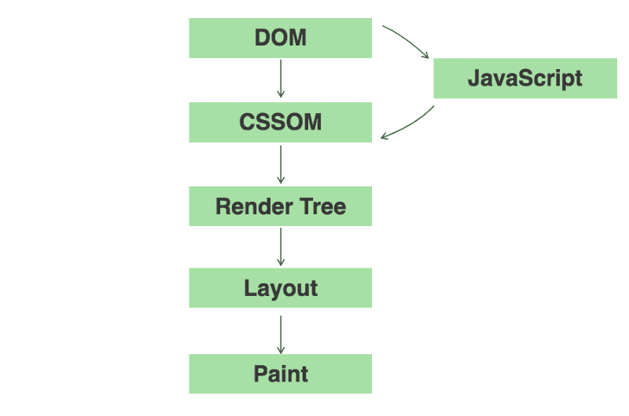
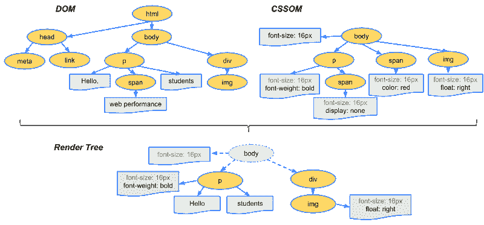
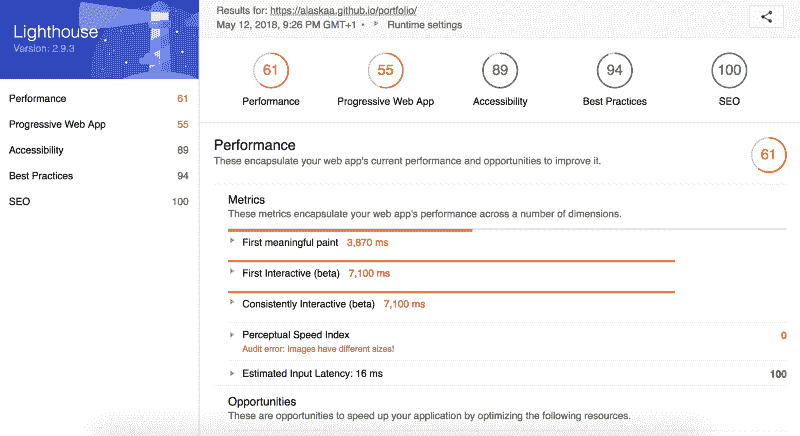

# 网页性能和关键渲染路径介绍

> 原文：<https://www.freecodecamp.org/news/an-introduction-to-web-performance-and-the-critical-rendering-path-ce1fb5029494/>

作者:西比尔·瑟尔

# 网页性能和关键渲染路径介绍

Photo by [Chris Liverani](https://unsplash.com/@chrisliverani?utm_source=medium&utm_medium=referral) on [Unsplash](https://unsplash.com?utm_source=medium&utm_medium=referral)

我们大多数人每天都与网络打交道。对于我们来说，几乎可以立即获得我们需要的所有信息已经变得很平常了。但是网页实际上是如何被组合并传递给我们的还是一个谜。

有时网页速度惊人，有时我们需要等很长时间才能看到内容——这常常导致我们相当沮丧并放弃这个页面。在下面的文章中，我会试着把事情弄清楚一点。

*免责声明*:我在这篇文章中分享的所有信息都是我从底部提到的免费课程中学到的，**在这里为感兴趣的人总结了**。

### 关键渲染路径

首先，理解浏览器实际经历的步骤是很有用的。它从普通的 HTML、CSS 和 JavaScript 文件开始，经过渲染和绘制页面，最终成为用户所看到的内容。

从不同的 HTML、CSS 和 JS 文件到绘制页面的这些步骤通常被称为关键呈现路径(或简称为 CRP)。

关键的渲染路径由五个不同的步骤组成，这些步骤最好用一个图形来解释。

The different stages of the Critical Rendering Path (DOM and CSSOM refer to Document Object Model and CSS Object Model respectively)

#### 建立 DOM 和 CSSOM

大多数网页由 HTML、CSS 和 JavaScript 组成，它们都是 CRP 的重要组成部分。为了读取和处理你的 HTML，浏览器会构造文档对象模型(DOM)。浏览器查看你的标记中的 HTML 标签(

、

、

# 和

等)，并将它们转换成令牌，这些令牌又被并行创建成节点。通过按顺序处理这些 StartTag 标记和 EndTag 标记，并查看哪个先出现，浏览器可以建立它们的层次结构并建立父级和子级。

但是，不要让这个术语吓到你。把 DOM 想象成一棵大树，它的分支代表父节点，而父节点又包含叶子，即子节点。这个树将表示我们的 HTML 中节点的依赖关系，看起来有点像这样:

Taken from W3 Schools ([https://www.w3schools.com/js/js_htmldom.asp](https://www.w3schools.com/js/js_htmldom.asp)) — The DOM Tree of Objects

在上图中，我们可以看到根元素包含了它的所有子元素，这些子元素又是包含子元素的父元素。把它倒过来，它看起来就像一棵树！

因此，DOM 代表了我们完整的 HTML 标记。如您所见，它是通过处理令牌并将其转换为节点而逐步构建起来的。事实上，我们可以利用这一点，通过返回部分 HTML 并向用户提示正在发生的事情并呈现在页面上。

构建完 DOM 后，您的浏览器将处理 CSS 并构建 CSS 对象模型(CSSOM)。这个过程非常类似于构建 DOM。但是在这个过程中，与之前相反，子节点继承了它们的父节点的样式规则，因此命名为级联样式表(CSS)。

不幸的是，我们不能像处理 DOM 那样增量地处理部分 CSS，因为如果在这个过程的后面出现了一个覆盖样式，它很容易导致应用错误的样式。这就是 CSS 呈现阻塞的原因，因为浏览器需要停止呈现，直到它接收并处理所有的 CSS。

我们的 DOM 树和 CSSOM 树将包含页面中的所有节点和依赖项。

#### 整理所有可见的内容——渲染树

浏览器需要知道哪些节点实际上在页面上可视地表示。渲染树实现了这一点，并且是 DOM 和 CSSOM 的可见内容的表示。

我们通过识别根节点开始构建渲染树，然后从 DOM 和 CSSOM 中复制所有可见的**信息。为此，我们还要检查是否搜索了具有相同选择器的标签。元数据、链接等等是**而不是**复制到渲染树中的。这同样适用于包含“显示:无因为它也是不可见的项目。**

一旦我们完成了这个过程，我们会得到类似下面的东西(注意“web performance”是如何没有被复制过来的)。

Copyright for the Image belongs to Google and Ilya Grigorik — taken from [https://developers.google.com/web/fundamentals/performance/critical-rendering-path/render-tree-construction](https://developers.google.com/web/fundamentals/performance/critical-rendering-path/render-tree-construction)

渲染树非常准确地描述了屏幕上实际显示的内容，捕捉了内容和相关的样式。当然，在现实生活的例子中，这看起来要复杂得多。

#### 让它适合你——布局

虽然我们现在知道了需要在页面上显示和呈现什么样的 ，但是知道**是如何呈现的**也很重要。为了让布局看起来正确，我们需要知道浏览器的大小。我们的布局依赖于它来计算页面上所有元素的正确位置和尺寸。

所有这些都发生在布局阶段。考虑布局步骤对于手机来说尤其重要，当我们旋转手机在横向和纵向之间切换时，我们的视角会发生变化。这意味着每次我们打开手机时，浏览器都需要重新运行布局步骤，这可能是一个相当大的性能瓶颈。

#### 绘制像素

这一步实际上是把像素画到屏幕上，由什么(渲染树)和如何(布局)指定。绘画步骤包括像素的实际绘画(例如，当调整图像大小时)，而不仅仅是定位它。这是你最终在屏幕上看到的东西。

Executing all the steps of the CRP in order. (Photo by [ALP STUDIO](https://unsplash.com/@the_alp_photography?utm_source=medium&utm_medium=referral) on [Unsplash](https://unsplash.com?utm_source=medium&utm_medium=referral))

#### 让我们总结一下

现在，让我们再次将所有这些信息放在一起，以便我们可以看到我们掌握了关键渲染路径(CRP)中必须经历的所有步骤。

1.  浏览器首先通过解析所有相关的 HTML 来构建 DOM。
2.  然后，它继续查看 CSS 和 JavaScript 资源并请求它们，这通常发生在我们通常放置外部链接的头部。
3.  然后，浏览器解析 CSS 并构建 CSSOM，然后运行 JavaScript。
4.  然后 DOM 和 CSSOM 被合并到渲染树中。
5.  然后，我们运行布局和绘制步骤，将页面呈现给用户。

### 好吧，知道这个很好——但是这有什么关系呢？

现在这些都清楚了，我们对浏览器在后台的实际操作有了更好的理解。但是这到底有什么关系呢？我们都需要知道引擎盖下发生了什么吗？

是的，我们有！

如果我们不断增加文件的大小，而不注意我们要求浏览器渲染和绘制到页面上的内容，浏览器将需要更长的时间来处理所有的资源。这通常会导致更慢、更不愉快的用户体验，这意味着页面将无法正常使用和呈现，从而导致用户的挫败感。

如果你请求一个来自农村地区的网页，尤其如此，那里的高速宽带不一定是最好的。

但幸运的是，有一些方法可以解决这个问题，我们可以使我们的网页更快！

Photo by [Peter Finger](https://unsplash.com/@pietsgallery?utm_source=medium&utm_medium=referral) on [Unsplash](https://unsplash.com?utm_source=medium&utm_medium=referral)

### 优化性能

有很多策略可以让我们的页面更快更好地为用户所用。这对于可能位于更偏远地区的用户来说尤其重要，在这些地区，网速不够快，或者通常通过移动互联网访问页面。

当我们谈到优化策略时，大致有三种技术可供我们使用。

#### 缩小、压缩和缓存

这些技术都可以应用到我们的 HTML、CSS 和 JS 中。然后，通过它们更小的尺寸，它们将减少我们在客户机和服务器之间来回发送的数据量。我们发送的字节越少，浏览器获取数据并开始处理和呈现页面的速度就越快。

#### 最小化渲染阻塞资源(CSS)的使用

正如我们上面讨论的，CSS 本身是呈现阻塞的，这意味着浏览器将停止呈现页面，直到 CSS 完全加载并被处理。

不过，我们可以通过解除某些样式和视口的渲染来缓解大型 CSS 文件的问题。我们通过在媒体查询、分析和设备定位中使用打印规则来做到这一点(如果您想知道如何操作，我建议您查看下面的资源)。在某些情况下，我们还可以通过内联一些 CSS 来减少需要加载的资源数量。

#### 最大限度地减少解析器阻塞资源的使用(JS 文档解析器)

我们还可以推迟 JavaScript 的执行，并在脚本中使用异步属性来实现这一点。这意味着页面的其余部分可以处理，与此同时，用户可以看到页面上正在发生一些事情。这也意味着我们不需要等待 JavaScript 加载。

#### 从广义上讲，我们有三种优化模式:

1.  尽量减少发送的字节数
2.  减少关键呈现路径中的关键资源数量(在构建页面时，可能不必一开始就加载分析)
3.  缩短关键的渲染路径长度(意味着减少渲染页面所需的浏览器和服务器之间的往返次数)

### 你自己试试

如果你热衷于尝试并开始优化，你可以用一些工具来衡量你的网站或其他网站的表现。最简单的可能是谷歌产品，如 [PageSpeedInsights](https://developers.google.com/speed/pagespeed/insights/) 或[谷歌灯塔](https://developers.google.com/web/tools/lighthouse/)，这是一个方便的小型谷歌 Chrome 扩展，你可以通过 Chrome 应用商店轻松安装。

只需单击扩展，然后生成报告，您将获得一份包括以下内容的报告:

Example of a Performance Audit in Google Lighthouse on my personal website — Render Blocking CSS for two different icon sets mean that my site is taking a performance hit (I’m definitely thinking how to reduce that going forward)

然后，您可以将您的性能与许多指标进行比较，例如绘制到屏幕上的第一个像素、第一次交互、站点的视觉完整性以及许多其他指标。

你最喜欢的浏览器的开发工具也是计算加载时间和性能瓶颈的好地方。保持较低的整体加载时间肯定会提高站点为最终用户提供服务的整体速度。

### 结论

希望这已经揭示了你的浏览器如何向你显示页面的内部工作方式，以及它需要在后台完成的繁重工作，以确保你的 HTML、CSS 和 JavaScript 被正确转换。

了解这些步骤有助于我们提高现有页面的性能。但它也使我们能够留意我们如何开发应用程序和网站，并考虑我们的页面如何在世界其他地区寻找人类。

#### 资源

我在这里分享的大部分知识都是通过以下途径获得的:

1.  *网站性能优化*在 [Udacity](https://eu.udacity.com/course/website-performance-optimization--ud884)
2.  *为什么性能很重要*在[谷歌开发者](https://developers.google.com/web/fundamentals/performance/why-performance-matters/)
3.  *高性能浏览器联网*由伊利亚·格里戈利克([https://hpbn.co/](https://hpbn.co/))提供
4.  高性能网站:前端工程师必备知识