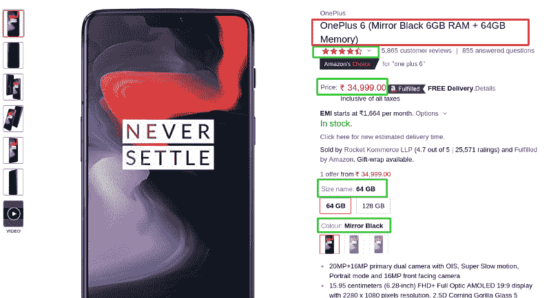
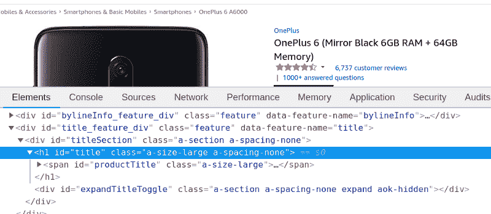
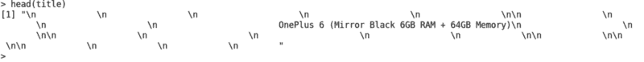
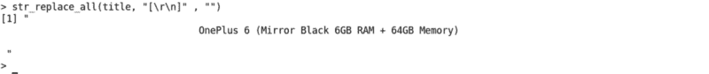
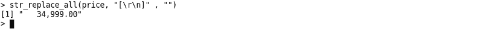
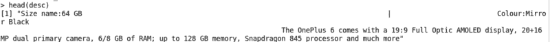
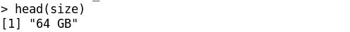
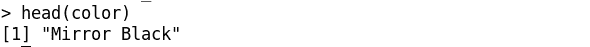
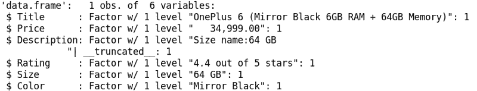
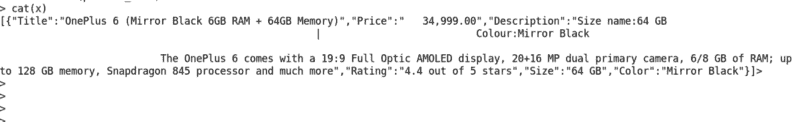

# 使用 R 的网页抓取介绍

> 原文：<https://www.freecodecamp.org/news/an-introduction-to-web-scraping-using-r-40284110c848/>

作者 Hiren Patel

# 使用 R 的网页抓取介绍


随着电子商务的蓬勃发展，企业纷纷上网。顾客也在网上寻找产品。与线下市场不同，客户可以实时比较不同地方的产品价格。

因此，有竞争力的定价已经成为商业战略中最重要的部分。

为了使你的产品价格具有竞争力和吸引力，你需要监控和跟踪你的竞争对手设定的价格。如果你知道你的竞争对手的定价策略是什么，你可以相应地调整你的定价策略，以获得优势。

因此，价格监测已经成为经营电子商务过程中的一个重要部分。

你可能想知道如何获得数据来比较价格。

### 获取价格比较所需数据的三大方法

#### 1.来自商家的反馈

你可能知道，互联网上有几个价格比较网站。这些网站与商家达成某种谅解，从他们那里直接获得数据，并用于价格比较。

这些企业使用 API，或者利用 FTP 来提供数据。一般来说，推荐佣金是使价格比较网站在财务上可行的原因。

#### 2.来自第三方 API 的产品源

另一方面，有些服务通过 API 提供电子商务数据。当使用这种服务时，第三方为数据量付费。

#### 3.网页抓取

web 抓取是从互联网上获取 Web 数据的最强大、最可靠的方式之一。它越来越多地用于价格智能，因为它是从电子商务网站获取产品数据的有效方式。

您可能无法访问第一个和第二个选项。因此，网络抓取可以来救你。您可以使用网络抓取来利用数据的力量，为您的企业获得有竞争力的价格。

Web 抓取可用于获取当前市场场景的当前价格，更广泛地用于电子商务。我们将使用网络抓取从电子商务网站获取数据。在这篇博客中，你将学习如何从亚马逊网站上搜集特定品牌下所有类别产品的名称和价格。

定期从亚马逊提取数据可以帮助你跟踪价格的市场趋势，并使你能够相应地设定价格。

### 目录

1.  [网页抓取比价](https://medium.com/p/40284110c848#45c6)
2.  [R 中的网页抓取](https://medium.com/p/40284110c848#ed51)
3.  [实施](https://medium.com/p/40284110c848#5130)
4.  [结束注释](https://medium.com/p/40284110c848#b3ba)

### 1.用于价格比较的网络抓取

正如市场智慧所说，价格决定一切。顾客根据价格做出购买决定。他们对产品质量的理解基于价格。简而言之，价格是驱动消费者的因素，因此也是驱动市场的因素。

所以**比价网站**需求量很大。顾客可以通过查看不同品牌同一产品的价格，轻松浏览整个市场。这些价格比较网站从不同的网站提取相同产品的价格。

除了价格，价格比较网站还收集产品描述、技术规格和功能等数据。他们以一种比较的方式将全部信息投射在一页纸上。

这回答了潜在买家在搜索中提出的问题。现在，潜在买家可以比较产品及其价格，以及功能、付款和运输选项等信息，这样他们就可以确定最佳交易。

定价优化对业务有影响，因为这种技术可以将利润率提高 10%。

电子商务是关于竞争性定价的，它也已经扩展到其他商业领域。以旅行为例。现在就连旅游相关网站也实时从航空公司网站**刮价格**提供不同航空公司的价格对比。

这方面的唯一挑战是实时更新数据，并且随着源站点上价格的不断变化，每秒都保持最新。价格比较网站使用 Cron 作业或在查看时更新价格。但是，这将取决于网站所有者的配置。

这就是这个博客可以帮助你的地方——你将能够设计出一个你可以定制来满足你需要的抓取脚本。您将能够从许多不同的网站上提取产品信息、图片、价格和所有其他与产品相关的详细信息。有了这个，你就可以为比价网站创建你强大的数据库。

### 2.R 中的网页抓取

价格比较变得很麻烦，因为获取网络数据并不容易——有像 HTML、XML 和 JSON 这样的技术来分发内容。

因此，为了获得您需要的数据，您必须有效地浏览这些不同的技术。r 可以帮助您访问存储在这些技术中的数据。但是，这需要您在开始之前对 R 有一点深入的了解。

#### R 是什么？

Web 抓取是一项高级任务，没有多少人执行。用 R 进行 Web 抓取当然是技术和高级编程。对 R 的充分理解对于以这种方式进行 web 抓取是必不可少的。

首先，R 是一种统计计算和图形语言。统计学家和数据挖掘者经常使用 R，因为它不断发展的统计软件，以及它对数据分析的关注。

R 在这群人中如此受欢迎的一个原因是它的绘图质量，包括任何需要的数学符号和公式。

r 非常棒，因为它提供了大量可以处理数据挖掘任务的函数和包。

rvest、RCrawler 等是用于数据收集过程的 R 包。

在这一部分中，我们将会看到使用 R 进行 web 抓取需要什么样的工具。我们将通过亚马逊网站的用例来看到它，我们将从那里尝试获取产品数据并以 JSON 形式存储它。

#### 要求

在这个用例中，R 的知识是必不可少的，我假设您已经对 R 有了基本的了解。你至少应该知道任何一个 R 接口，比如 RStudio。base R 安装界面没问题。

如果你不知道 R 和其他相关的接口，你应该浏览一下这个教程。

现在让我们了解一下我们将要使用的包是如何安装的。

#### 包装:

**1。[rvest](https://cran.r-project.org/web/packages/rvest/)**

Hadley Wickham 在 r 中编写了用于 web 抓取的 rvest 包。rvest 在从 web 页面中提取您需要的信息时非常有用。

除此之外，您还需要安装 [selectr](https://cran.r-project.org/web/packages/selectr/) 和‘XML 2’包。

**安装步骤:**

```
install.packages(‘selectr’)
```

```
install.packages(‘xml2’)
```

```
install.packages(‘rvest’)
```

rvest 包含了基本的网页抓取功能，相当有效。使用下面的函数，我们将尝试从网站中提取数据。

*   `read_html(url)` :从给定的 URL 中抓取 HTML 内容
*   `html_nodes()`:识别 HTML 包装器。
*   `html_nodes(“.class”)`:基于 CSS 类调用节点
*   `html_nodes(“#id”)`:根据<部门> id 调用节点
*   `html_nodes(xpath=”xpath”)`:基于 xpath 调用节点(我们将在后面讨论)
*   `html_attrs()`:标识属性(对调试有用)
*   `html_table()`:将 HTML 表格转换成数据框
*   `html_text()`:剥离 HTML 标签，只提取文本

**2。[stringr](https://cran.r-project.org/web/packages/stringr/)**

当您想到与数据清理和准备相关的任务时，stringr 就会发挥作用。

stringr 中有四组基本的函数:

*   stringr 函数很有用，因为它们使您能够处理字符向量中字符串内的单个字符
*   有一些空白工具可以用来添加、删除和操作空白
*   有些区域敏感操作的操作因区域而异
*   有模式匹配功能。这些函数识别模式描述的四个部分。正则表达式是标准的，但也有其他工具

**安装**

`install.packages(‘stringr’)`

**3。[JSON lite](https://cran.r-project.org/web/packages/jsonlite/)**

jsonline 包之所以有用，是因为它是一个针对 web 优化的 JSON 解析器/生成器。

它非常重要，因为它支持 JSON 数据和关键的 R 数据类型之间的有效映射。使用它，我们能够在 R 对象和 JSON 之间进行转换，而不会丢失类型或信息，也不需要任何手动的数据争论。

这对于与 web APIs 的交互非常有用，或者如果您想使用 JSON 创建数据进出 R 的方式。

#### 装置

`install.packages(‘jsonlite’)`

在我们开始之前，让我们看看它是如何工作的:

一开始就应该清楚，每个网站都是不同的，因为进入网站的编码是不同的。

Web 抓取是一种识别并使用这些编码模式来提取您需要的数据的技术。您的浏览器使您可以通过 HTML 访问该网站。Web 抓取只是简单地解析从浏览器提供给你的 HTML。

网页抓取有一套工作流程，通常是这样的:

*   从 R 访问页面
*   指示 R 在页面上“看”到哪里
*   使用 rvest 包在 R 中将数据转换成可用的格式

现在让我们转到实现，以便更好地理解它。

### 3.履行

我们来实现一下，看看效果如何。我们会去亚马逊网站刮一个叫“一加 6”的产品的比价，一个手机。

这里可以看到[。](https://www.amazon.in/OnePlus-Mirror-Black-64GB-Memory/dp/B0756Z43QS?tag=googinhydr18418-21&tag=googinkenshoo-21&ascsubtag=aee9a916-6acd-4409-92ca-3bdbeb549f80)

#### 步骤 1:加载我们需要的包

我们需要在控制台中，在 R 命令提示符下启动该进程。一旦我们到达那里，我们需要加载如下所示的包:

```
#loading the package:> library(xml2)> library(rvest)> library(stringr)
```

#### 步骤 2:从 Amazon 读取 HTML 内容

```
#Specifying the url for desired website to be scrappedurl <- ‘https://www.amazon.in/OnePlus-Mirror-Black-64GB-Memory/dp/B0756Z43QS?tag=googinhydr18418-21&tag=googinkenshoo-21&ascsubtag=aee9a916-6acd-4409-92ca-3bdbeb549f80’
```

```
#Reading the html content from Amazonwebpage <- read_html(url)
```

在这段代码中，我们从给定的 URL 中读取 HTML 内容，并将该 HTML 分配给`webpage`变量。

#### 第三步:从亚马逊上搜集产品细节

现在，作为下一步，我们将从网站中提取以下信息:

**标题:**产品的标题。
**价格:**产品的价格。
**描述:**产品的描述。
**评分:**用户对产品的评分。
尺寸:产品的尺寸。
颜色:产品的颜色。

该屏幕截图显示了这些字段是如何排列的。



接下来，我们将利用 HTML 标签，如产品标题和价格，使用 Inspect 元素提取数据。

为了找出 HTML 标签的类别，请使用以下步骤:

**= >转到 chrome 浏览器= > [转到 t](https://www.amazon.in/OnePlus-Mirror-Black-64GB-Memory/dp/B0756Z43QS?tag=googinhydr18418-21&tag=googinkenshoo-21&ascsubtag=aee9a916-6acd-4409-92ca-3bdbeb549f80) o 这个 URL = >右键= > ins** pect 元素

注意:如果你没有使用 Chrome 浏览器，请查看这篇文章。

基于 CSS 选择器，比如 class 和 id，我们将从 HTML 中抓取数据。要找到产品标题的 CSS 类，我们需要右键单击标题并选择“Inspect”或“Inspect Element”。



正如你在下面看到的，我在`html_nodes`的帮助下提取了产品的标题，其中我传递了标题的 id—— `h1#title`——和存储了 HTML 内容的`webpage`。

我还可以使用`html_text`获取标题文本，并在`head ()`函数的帮助下打印标题文本。

```
#scrape title of the product> title_html <- html_nodes(webpage, ‘h1#title’)> title <- html_text(title_html)> head(title)
```

输出如下所示:



我们可以使用空格和\n 来获取产品的标题。

下一步是在 stringr 库中的`str_replace_all()`函数的帮助下删除空格和新行。

```
# remove all space and new linesstr_replace_all(title, “[\r\n]” , “”)
```

输出:



现在，我们需要按照相同的过程提取产品的其他相关信息。

**产品价格:**

```
# scrape the price of the product> price_html <- html_nodes(webpage, ‘span#priceblock_ourprice’)> price <- html_text(price_html)
```

```
# remove spaces and new line> str_replace_all(title, “[\r\n]” , “”)
```

```
# print price value> head(price)
```

输出:



**产品描述:**

```
# scrape product description> desc_html <- html_nodes(webpage, ‘div#productDescription’)> desc <- html_text(desc_html)
```

```
# replace new lines and spaces> desc <- str_replace_all(desc, “[\r\n\t]” , “”)> desc <- str_trim(desc)> head(desc)
```

输出:



**产品评级:**

```
# scrape product rating > rate_html <- html_nodes(webpage, ‘span#acrPopover’)> rate <- html_text(rate_html)
```

```
# remove spaces and newlines and tabs > rate <- str_replace_all(rate, “[\r\n]” , “”)> rate <- str_trim(rate)
```

```
# print rating of the product> head(rate)
```

输出 **:**


**产品尺寸:**

```
# Scrape size of the product> size_html <- html_nodes(webpage, ‘div#variation_size_name’)> size_html <- html_nodes(size_html, ‘span.selection’)> size <- html_text(size_html)
```

```
# remove tab from text> size <- str_trim(size)
```

```
# Print product size> head(size)
```

输出:



**产品颜色:**

```
# Scrape product color> color_html <- html_nodes(webpage, ‘div#variation_color_name’)> color_html <- html_nodes(color_html, ‘span.selection’)> color <- html_text(color_html)
```

```
# remove tabs from text> color <- str_trim(color)
```

```
# print product color> head(color)
```

输出:



#### 步骤 4:我们已经成功地从所有字段中提取了数据，这些数据可用于比较来自另一个站点的产品信息。

让我们把它们编译组合起来，做出一个数据框架，并检查它的结构。

```
#Combining all the lists to form a data frameproduct_data <- data.frame(Title = title, Price = price,Description = desc, Rating = rate, Size = size, Color = color)
```

```
#Structure of the data framestr(product_data)
```

输出:



在这个输出中，我们可以看到数据帧中所有抓取的数据。

#### 步骤 5:以 JSON 格式存储数据:

随着数据的收集，我们可以对其执行不同的任务，如比较、分析，并得出关于它的业务见解。基于这些数据，我们可以考虑在这个基础上训练机器学习模型。

数据将以 JSON 格式存储，以便进一步处理。

遵循给定的代码并获得 JSON 结果。

```
# Include ‘jsonlite’ library to convert in JSON form.> library(jsonlite)
```

```
# convert dataframe into JSON format> json_data <- toJSON(product_data)
```

```
# print output> cat(json_data)
```

在上面的代码中，我包含了使用`toJSON()`函数将 dataframe 对象转换成 JSON 形式的`jsonlite`库。

在这个过程的最后，我们以 JSON 格式存储数据并打印出来。如果我们愿意，也可以将数据存储在 csv 文件或数据库中，以便进一步处理。

输出:



根据这个实际例子，你也可以从[https://www.oneplus.in/6](https://www.oneplus.in/6)的产品中提取相同的相关数据，并与亚马逊进行比较，以计算出该产品的公允价值。同理，你可以用数据和其他网站进行对比。

### 4.结束注释

正如你所看到的，R 可以给你很大的杠杆作用，从不同的网站抓取数据。有了这个如何使用 R 的实际例子，您现在可以自己探索它，并从 Amazon 或任何其他电子商务网站提取产品数据。

给你提个醒:**某些网站有防刮擦政策**。如果你做过头了，你会被屏蔽，你会开始看到验证码，而不是产品细节。当然，你也可以学习使用不同的服务绕过验证码。然而，你确实需要理解抓取数据的[合法性，以及你正在用抓取的数据做什么。](http://www.prowebscraper.com/blog/six-compelling-facts-about-legality-of-web-scraping/)

请随时给我发送您对这篇文章的反馈和建议！