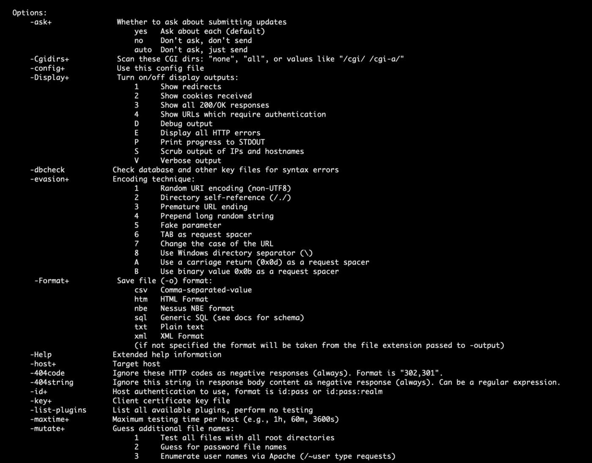
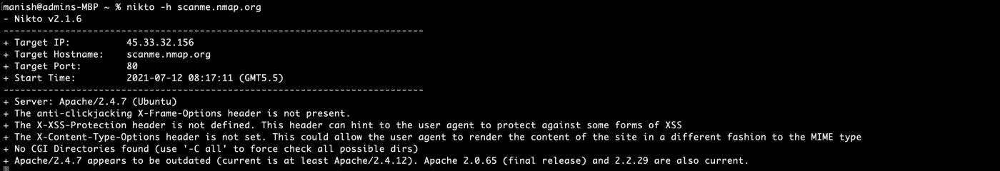
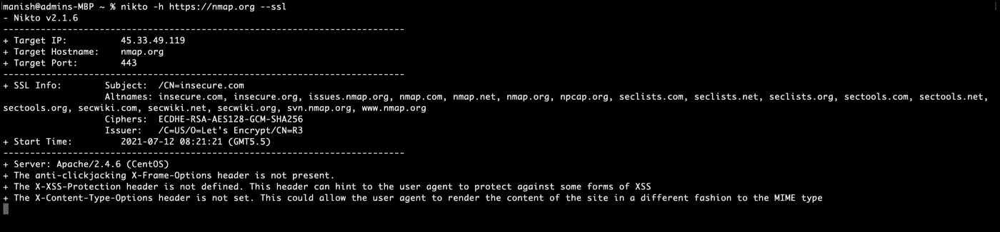
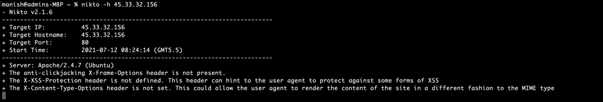

# 使用 Nikto 扫描 Web 服务器——初学者指南

> 原文：<https://www.freecodecamp.org/news/an-introduction-to-web-server-scanning-with-nikto/>

网站是世界上几乎每个企业或组织的重要组成部分。从你附近的花店到全球品牌，几乎每个人都使用网站作为他们品牌的一部分。

不幸的是，网站也是最不安全的网关之一，攻击者可以通过它来利用您的公司。

由于大多数网站都没有强大的技术团队支持，因此了解网站和 web 应用程序的安全性对于保护您的组织非常重要。

## Nikto 简介

Nikto 是一个开源的 web 服务器和 web 应用程序扫描器。Nikto 可以针对多种安全威胁对 web 服务器进行全面的测试，包括超过 6700 个潜在的危险文件/程序。Nikto 还可以检查过时的 web 服务器软件和特定版本的问题。

Nikto 由 CIRT 苏洛公司编写和维护。它是用 Perl 编写的，最初于 2001 年末发布。

它目前由戴维·洛奇维护([你可以在这里找到他的博客](https://tautology.org.uk/blog/))，尽管其他贡献者也参与了这个项目。

以下是 Nikto 可以做的一些很酷的事情:

*   查找 SQL 注入、XSS 和其他常见漏洞
*   识别已安装的软件(通过标题、图标和文件)
*   猜测子域
*   包括对 SSL (HTTPS)网站的支持
*   以纯文本、XML、HTML 或 CSV 格式保存报告
*   “搜寻”web 服务器上的内容
*   报告异常标题
*   检查服务器配置项，如多个索引文件、HTTP 服务器选项等
*   完全支持 HTTP 代理
*   猜测授权凭证(包括许多默认用户名/密码组合)
*   配置了模板引擎，可以轻松定制报告
*   导出到 Metasploit

## 如何安装 Nikto

由于 Nikto 是一个基于 Perl 的程序，它可以在安装了必要的 Perl 解释器的大多数操作系统上运行。

如果您使用的是 Kali Linux，Nikto 是预装的，并且会出现在“漏洞分析”类别中。

如果你在 Kali 上没有 Nikto(出于某种原因)，你可以从 [GitHub](https://github.com/sullo/nikto) 中获取 Nikto 或者直接使用“apt install nikto”命令。

要在 Windows 上安装 Nikto，您必须首先安装 Perl 解释器。可以从这里下载:[https://www.activestate.com/activeperl](https://www.activestate.com/products/perl/)

对于 MacOS，可以用自制。

[所有平台的完整安装说明可在此处找到](https://github.com/sullo/nikto/wiki)。

## 如何使用 Nikto 扫描

现在您已经知道 Nikto 是什么以及如何安装它，让我们继续运行一些扫描。

> 警告:
> 
> 在我们开始扫描之前，我想强调一下，我对你试图攻击系统所造成的任何损害不负任何责任。这样做是违法的。
> 
> 在尝试扫描系统或网络之前，你应该有书面许可。

由于 Nikto 是一个命令行工具，您可以使用 help 命令来获取选项列表:

```
> nikto -Help
```



### 如何扫描域

要执行简单的域扫描，请使用`-h`(主机)标志:

```
> nikto -h scanme.nmap.org
```

Nikto 将对给定域的端口 80 执行基本扫描，并根据所执行的扫描向您提供完整的报告:



Nikto Domain Scan

### 如何扫描启用了 SSL 的域

对于启用了 HTTPS 的域，您必须指定`-ssl`标志来扫描端口 443:

```
> nikto -h https://nmap.org -ssl
```



Nikto SSL Enabled Scan

### 如何扫描 IP 地址

有时你只是想扫描一个托管 web 服务器的 IP 地址。

为此，使用与域扫描相同的`-h`标志:

```
> nikto -h 45.33.32.156
```



Nikto IP Address Scan

### 如何从文本文件中扫描多个 IP 地址

要扫描多个 IP 地址或域，只需将它们放入由换行符分隔的文本文件中。Nikto 将知道必须对每个域/ IP 地址执行扫描。

假设我们有一个名为 domains.txt 的文件，它有两个域名:

*   scanme.nmap.org
*   nmap.org。

要使用 Nikto 扫描它们，请运行以下命令:

```
> nikto -h domains.txt
```

Nikto 将开始逐个扫描域:


Nikto Multi Domain Scan

### 如何导出扫描结果

Nikto 扫描需要一段时间才能完成。如果您是专业的笔测试人员，除非 web 应用程序有重大变化，否则您不希望经常重复扫描。

要导出扫描结果，请使用后跟文件名的`-o`标志:

```
> nikto -h scanme.nmap.org -o scan.txt
```

您也可以使用`-Format`标志来指定输出格式。您可以选择 CSV、HTML、nbe ( [Nessus](https://www.cs.cmu.edu/~dwendlan/personal/nessus.html) 格式)、SQL、txt 和 XML:

```
> nikto -h scanme.nmap.org -o scan.csv -Format csv
```


Nikto Output formats

## **如何将 Nikto 与 Metasploit 配对**

Metasploit 是一个强大的框架，可以让您做从扫描到利用系统的任何事情。专业的笔测试人员几乎每天都在使用 Metasploit。我最近写了一篇关于 Metasploit 的详细文章，你可以在这里找到它。

Nikto 提供了一种将扫描导出到 Metasploit 的方法，这样当您试图利用基于 Nikto 的扫描结果的系统时就变得更加容易。

为此，将`-Format msf+`标志附加到扫描的末尾:

```
$ nikto -h <domain/ip> -Format msf+
```

## **Nikto 替代品**

在你的笔测试库中有一个备份工具总是好的。Nikto 的一些最佳替代方案是:

*   [****Arachni****](https://www.arachni-scanner.com/) :开源、模块化、高性能的 Ruby 框架，专注于评估 web 应用的安全性。
*   [****OWASP Zed 攻击代理(ZAP)****](https://www.zaproxy.org/) :一个集成的笔测试工具，提供自动扫描器以及一组允许您手动查找安全漏洞的工具。
*   [****Skipfish****](https://tools.kali.org/web-applications/skipfish) :全自动、主动的 web 应用安全侦察工具。用 C 语言编写，具有快速、高度优化的 HTTP 处理和最小的 CPU 占用空间——轻松实现每秒 2000 个请求和响应目标。

## TLDR；

Nikto 是一个开源的扫描器，可以帮助你在你的网站和网络应用中发现潜在的安全威胁。

它完全自动化漏洞扫描，可以发现服务配置错误、不安全文件/程序等问题，以及数以千计的其他安全问题。

很好的替代品包括花生四烯酸、OWASP ZAP 和鲣鱼。

## 参考

*   [https://cirt.net/Nikto2](https://cirt.net/Nikto2)
*   [https://github.com/sullo/nikto](https://github.com/sullo/nikto)
*   [https://linuxhint.com/scanning_vulnerabilities_nikto/](https://linuxhint.com/scanning_vulnerabilities_nikto/)

**喜欢这篇文章？** [******加入我的简讯******](http://tinyletter.com/manishmshiva)***每周一*早上*。*你也可以在这里 [**访问我的网站**](https://www.manishmshiva.com/) 。**