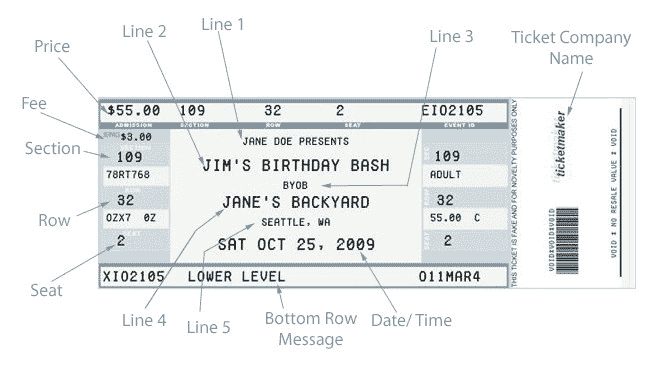
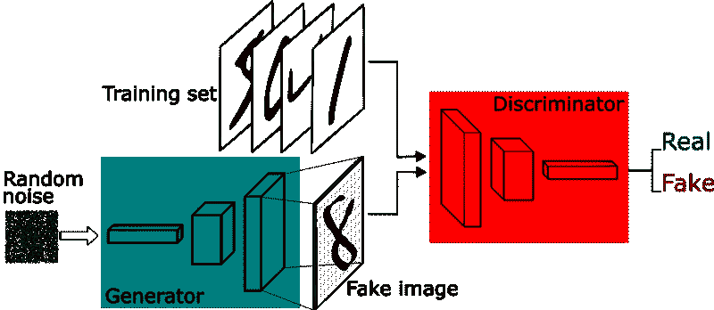
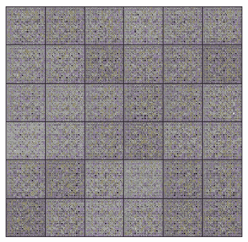
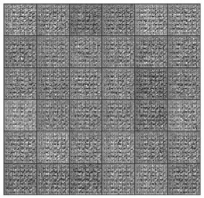
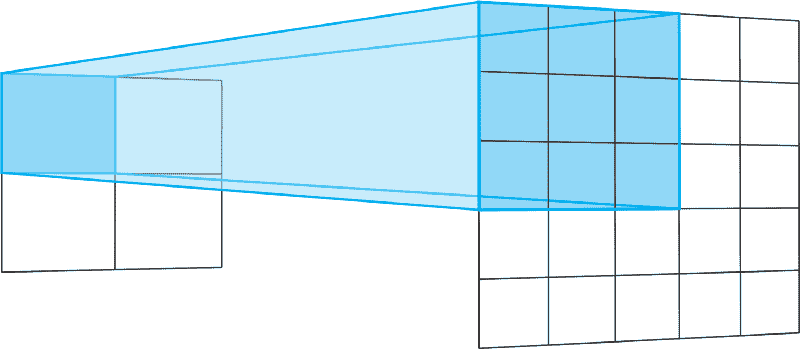
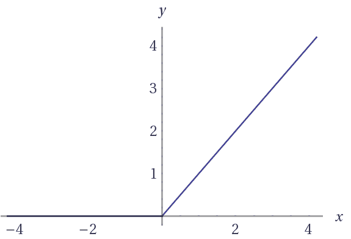
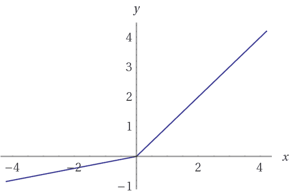
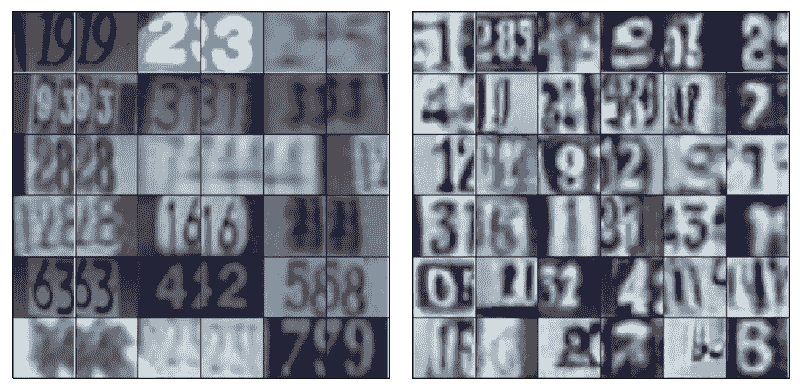
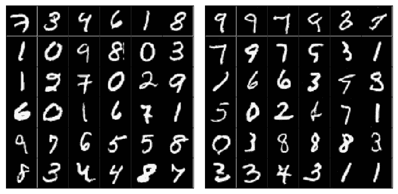

# 生成对抗网络的直观介绍

> 原文：<https://www.freecodecamp.org/news/an-intuitive-introduction-to-generative-adversarial-networks-gans-7a2264a81394/>

泰勒·席尔瓦

### 变暖

假设你的邻居正在举办一个非常酷的派对，你很想去参加。但是，有一个问题。要参加聚会，你需要一张特别的票——票早就卖完了。

等等我！这不是一篇生成性的对抗性网络文章吗？是的，它是。但是现在请容忍我，这是值得的。

好吧，既然期望很高，聚会组织者雇佣了一个合格的安全机构。他们的主要目标是不允许任何人破坏聚会。为了做到这一点，他们在会场入口处安排了很多警卫来检查每个人的门票的真实性。

既然你没有任何武术天赋，唯一的办法就是用一张**非常有说服力的**假票骗过他们。

然而，这个计划有一个很大的问题——你从来没有真正看到过彩票的样子。

即使你根据你的创意设计了一张票，你也几乎不可能在第一次审判中骗过警卫。另外，你要有一个非常像样的党的通行证的复制品，才能露脸。

为了帮助解决这个问题，你决定叫你的朋友 Bob 来帮你做这件事。

鲍勃的任务很简单。他会试图用你的假通行证参加聚会。如果他被拒绝了，他会回来给你一些有用的建议，告诉你票应该是什么样的。

基于这个反馈，你制作了一个新版本的票证，并把它交给 Bob，Bob 去再试一次。这个过程不断重复，直到你能够设计一个完美的复制品。



*That’s a must go party. I actually took that image from a fake ticket generator website!*

抛开这个轶事中的“小漏洞”,这基本上就是生成敌对网络(GANs)的工作方式。

现在 GANs 的应用大多在计算机视觉领域。其中的一些应用包括训练[半监督分类器](https://towardsdatascience.com/semi-supervised-learning-with-gans-9f3cb128c5e)，以及从低分辨率图像生成高分辨率图像。

这篇文章对 GANs 进行了介绍，并提供了生成图像问题的实际操作方法。你可以在这里复制这篇文章[的笔记本。](https://github.com/sthalles/blog-resources/blob/master/dcgan/DCGAN.ipynb)

### 生成对抗网络



Generative Adversarial Network framework.

gan 是由 Goodfellow 等人设计的生成模型。2014 年。在 GAN 设置中，由神经网络表示的两个可微分函数被锁定在一个游戏中。两个参与者(生成器和鉴别器)在这个框架中有不同的角色。

生成器试图产生来自某种概率分布的数据。那就是你试图复制派对门票。

鉴别者就像一个法官。它决定输入是来自生成器还是来自真实的训练集。这将是党的安全比较你的假票和真票，以找出你的设计缺陷。



We used a 4 layer convolution network for (both discriminator and generator) with batch normalization. The model was trained to generate SVHNs and MNIST images. Above, are the SVHN’s (left) and MNIST (right) generator samples during training.

总之，游戏如下:

*   生成器试图最大化使鉴别器将其输入误认为真实的概率。
*   并且鉴别器引导发生器产生更真实的图像。

在完美的平衡中，生成器将捕获一般的训练数据分布。结果，鉴别器总是不能确定它的输入是否真实。


*Adapted from the DCGAN paper. The Generator network implemented here. Note the non-existence of fully connected and pooling layers.*

在 [DCGAN 论文](https://arxiv.org/abs/1511.06434)中，作者将一些深度学习技术的组合描述为训练 GAN 的关键。这些技术包括:(I)全卷积网和(ii)批量归一化(BN)。

第一个强调了*步长卷积*(而不是合并层)，用于增加和减少特征的空间维度。第二种方法将特征向量归一化，以在所有层中具有零均值和单位方差。这有助于稳定学习和处理较差的权重初始化问题。

事不宜迟，让我们深入研究实现细节，并在进行过程中更多地讨论 GANs。我们提出了一个深度卷积生成对抗网络(DCGAN)的实现。我们的实现使用 Tensorflow，并遵循在 [DCGAN 论文](https://arxiv.org/abs/1511.06434)中描述的一些实践。

### 发电机

该网络有 4 个卷积层，后面都是 BN(除了输出层)和校正线性单元(ReLU)激活。

它将一个随机向量 *z* (从正态分布中抽取)作为输入。在将 *z* 整形为 4D 形状后，我们将其输入生成器，开始一系列的上采样层。

每个上采样层代表步长为 2 的转置卷积运算。转置卷积类似于常规卷积。

通常，规则的回旋从宽而浅的层到窄而深的层。转置卷积则相反。它们从深而窄的层到宽而浅的层。

转置卷积运算的跨度定义了输出层的大小。“相同”填充和步幅为 2 时，输出要素的大小将是输入图层的两倍。

这是因为，每当我们在输入层移动一个像素时，我们在输出层将卷积核移动两个像素。换句话说，输入图像中的每个像素用于在输出图像中绘制一个正方形。



Transpose convolving a 3x3 kernel over a 2x2 input with stride 2 is equivalent to convolving a 3x3 kernel over a 5x5 input with stride 2\. Using no padding “VALID”, for both.

简而言之，生成器从这个非常深但很窄的输入向量开始。每次转置卷积后， *z* 变宽变浅。所有转置卷积都使用一个 *5x5* 内核的大小，深度从 512 一直减少到 3——代表一个 RGB 彩色图像。

```
def transpose_conv2d(x, output_space):    return tf.layers.conv2d_transpose(x, output_space,       kernel_size=5, strides=2, padding='same',      kernel_initializer=tf.random_normal_initializer(mean=0.0,                                                      stddev=0.02))
```

最后一层输出一个 *32x32x3* 张量——通过[双曲正切](https://reference.wolfram.com/language/ref/Tanh.html) ( *tanh* )函数在值-1 和 1 之间压缩。

这个最终的输出形状由训练图像的大小来定义。在这种情况下，如果为 SVHN 进行训练，生成器会生成 *32x32x3* 的图像。但是，如果为 MNIST 训练，它会生成一个 *28x28* 的灰度图像。

最后，请注意，在将输入向量 *z* 馈送到生成器之前，我们需要将其缩放到-1 比 1 的区间。那就是按照选择使用 *tanh* 功能。

```
def generator(z, output_dim, reuse=False, alpha=0.2, training=True):    """    Defines the generator network    :param z: input random vector z    :param output_dim: output dimension of the network    :param reuse: Indicates whether or not the existing model variables should be used or recreated    :param alpha: scalar for lrelu activation function    :param training: Boolean for controlling the batch normalization statistics    :return: model's output    """    with tf.variable_scope('generator', reuse=reuse):        fc1 = dense(z, 4*4*512)        # Reshape it to start the convolutional stack        fc1 = tf.reshape(fc1, (-1, 4, 4, 512))        fc1 = batch_norm(fc1, training=training)        fc1 = tf.nn.relu(fc1)        t_conv1 = transpose_conv2d(fc1, 256)        t_conv1 = batch_norm(t_conv1, training=training)        t_conv1 = tf.nn.relu(t_conv1)        t_conv2 = transpose_conv2d(t_conv1, 128)        t_conv2 = batch_norm(t_conv2, training=training)        t_conv2 = tf.nn.relu(t_conv2)        logits = transpose_conv2d(t_conv2, output_dim)        out = tf.tanh(logits)        return out
```

### 鉴别器

鉴别器也是 4 层 CNN，具有 BN(除了它的输入层)和泄漏 ReLU 激活。许多激活功能将与这种基本的 GAN 架构配合使用。然而，泄漏 ReLUs 非常受欢迎，因为它们有助于梯度流更容易通过架构。

常规 ReLU 函数的工作原理是将负值截断为 0。这具有阻止梯度流过网络的效果。泄漏 ReLUs 允许一个小的负值通过，而不是函数为零。**也就是说，该函数计算特征和一个小因子**之间的最大值。

```
def lrelu(x, alpha=0.2):     # non-linear activation function    return tf.maximum(alpha * x, x)
```

泄漏 ReLU 代表了解决*将死 ReLU* 问题的一种尝试。当神经元停留在 *ReLU* 单元对所有输入总是输出 0 的状态时，就会出现这种情况。对于这些情况，梯度被完全关闭以通过网络回流。

这对于 GANs 尤其重要，因为发生器必须学习的唯一方法是从鉴频器接收梯度。



(left) ReLU, (right) Leaky ReLU activation functions. Note that leaky ReLUs allows a small slope when x is negative.

鉴别器首先接收一个 32×32×3 的图像张量。与发生器相反，鉴别器执行一系列*步长 2* 卷积。每种方法都是通过将特征向量的空间维度减少一半来实现的，同时也将学习到的过滤器数量增加了一倍。

最后，鉴别器需要输出概率。为此，我们在最终逻辑上使用*逻辑 Sigmoid* 激活函数。

```
def discriminator(x, reuse=False, alpha=0.2, training=True):    """    Defines the discriminator network    :param x: input for network    :param reuse: Indicates whether or not the existing model variables should be used or recreated    :param alpha: scalar for lrelu activation function    :param training: Boolean for controlling the batch normalization statistics    :return: A tuple of (sigmoid probabilities, logits)    """    with tf.variable_scope('discriminator', reuse=reuse):        # Input layer is 32x32x?        conv1 = conv2d(x, 64)        conv1 = lrelu(conv1, alpha)        conv2 = conv2d(conv1, 128)        conv2 = batch_norm(conv2, training=training)        conv2 = lrelu(conv2, alpha)        conv3 = conv2d(conv2, 256)        conv3 = batch_norm(conv3, training=training)        conv3 = lrelu(conv3, alpha)        # Flatten it        flat = tf.reshape(conv3, (-1, 4*4*256))        logits = dense(flat, 1)        out = tf.sigmoid(logits)        return out, logits
```

注意，在这个框架中，鉴别器充当常规的二元分类器。一半时间它从训练集接收图像，另一半时间从生成器接收图像。

回到我们的冒险，复制党的门票，唯一的信息来源是我们的朋友鲍勃的反馈。换句话说，Bob 在每次试验中向您提供的反馈质量对于完成工作至关重要。

同样，每次鉴别器注意到真假图像之间的差异时，它都会向发生器发送信号。该信号是从鉴别器向发生器反向流动的梯度。通过接收它，生成器能够调整其参数以更接近真实的数据分布。

**这就是鉴别器的重要性。事实上，生成器和鉴别器在区分数据方面一样好。**

### 损耗

现在，让我们来描述这个架构中最棘手的部分——损失。首先，我们知道鉴别器接收来自训练集和生成器的图像。

我们希望鉴别器能够区分真假图像。每次我们通过鉴别器运行一个小批量时，都会得到 logits。这些是模型中未缩放的值。

然而，我们可以将鉴别器接收的小批量分成两种类型。第一个，仅由来自训练集的真实图像组成，第二个，仅由假图像组成，即由生成器创建的图像。

```
def model_loss(input_real, input_z, output_dim, alpha=0.2, smooth=0.1):    """    Get the loss for the discriminator and generator    :param input_real: Images from the real dataset    :param input_z: random vector z    :param out_channel_dim: The number of channels in the output image    :param smooth: label smothing scalar    :return: A tuple of (discriminator loss, generator loss)    """    g_model = generator(input_z, output_dim, alpha=alpha)    d_model_real, d_logits_real = discriminator(input_real, alpha=alpha)    d_model_fake, d_logits_fake = discriminator(g_model, reuse=True, alpha=alpha)    # for the real images, we want them to be classified as positives,      # so we want their labels to be all ones.    # notice here we use label smoothing for helping the discriminator to generalize better.    # Label smoothing works by avoiding the classifier to make extreme predictions when extrapolating.    d_loss_real = tf.reduce_mean(        tf.nn.sigmoid_cross_entropy_with_logits(logits=d_logits_real, labels=tf.ones_like(d_logits_real) * (1 - smooth)))    # for the fake images produced by the generator, we want the discriminator to clissify them as false images,    # so we set their labels to be all zeros.    d_loss_fake = tf.reduce_mean(        tf.nn.sigmoid_cross_entropy_with_logits(logits=d_logits_fake, labels=tf.zeros_like(d_model_fake)))    # since the generator wants the discriminator to output 1s for its images, it uses the discriminator logits for the    # fake images and assign labels of 1s to them.    g_loss = tf.reduce_mean(        tf.nn.sigmoid_cross_entropy_with_logits(logits=d_logits_fake, labels=tf.ones_like(d_model_fake)))    d_loss = d_loss_real + d_loss_fake    return d_loss, g_loss
```

因为两个网络同时训练，GANs 也需要两个优化器。每一个分别用于最小化鉴别器和发生器的损失函数。

我们希望鉴别器对真实图像输出接近 1 的概率，对虚假图像输出接近 0 的概率。为此，鉴频器需要两个损耗。因此，鉴频器的总损耗是这两个部分损耗之和。一个用于最大化真实图像的概率，另一个用于最小化虚假图像的概率。



*Comparing real (left) and generated (right) SVHN sample images. Although some images look blurred and some others are difficult to recognize, it’s noticeable that the data distribution was captured by the model.*

在训练开始时，会出现两种有趣的情况。首先，生成器不知道如何创建与训练集中的图像相似的图像。第二，鉴别器不知道如何将它收到的图像分类为真的或假的。

因此，鉴别器接收两种截然不同的批次。一个由来自训练集的真实图像组成，另一个包含非常嘈杂的信号。随着训练的进行，生成器开始输出看起来更接近训练集中图像的图像。之所以会发生这种情况，是因为生成器通过训练来学习组成训练集图像的数据分布。

与此同时，鉴别器开始变得非常擅长区分样品的真伪。因此，这两种类型的小批量产品在结构上开始变得越来越相似。**这样一来，结果使得鉴别者无法识别图像的真假。**

对于损失，我们使用普通的交叉熵和 Adam 作为优化器的好选择。



*Comparing real (left) and generated (right) MNIST sample images. Because MNIST images have a simpler data structure, the model was able to produce more realistic samples when compared to the SVHNs.*

### 结束的

GANs 是目前机器学习领域最热门的话题之一。这些模型有可能开启无监督学习方法，将 ML 扩展到新的领域。

自从它诞生以来，研究者们已经开发了许多训练 GANs 的技术。在训练 GANs 的改进技术中，作者描述了图像生成和半监督学习的最新技术。

如果你想更深入地了解这些主题，我推荐你阅读[生成模型](https://blog.openai.com/generative-models/#gan)。

另外，看一看:

[**一头扎进高级 GANs:探索自我关注与光谱常态**](https://medium.freecodecamp.org/dive-head-first-into-advanced-gans-exploring-self-attention-and-spectral-norm-d2f7cdb55ede)
[*最近，生成模型吸引了很多关注。其中大部分来自生成性对抗网络…*medium.freecodecamp.org](https://medium.freecodecamp.org/dive-head-first-into-advanced-gans-exploring-self-attention-and-spectral-norm-d2f7cdb55ede)[**生成性对抗网络半监督学习(GANs)**](https://towardsdatascience.com/semi-supervised-learning-with-gans-9f3cb128c5e)
[*如果你曾经听说过或研究过深度学习，你可能听说过 MNIST、SVHN、ImageNet、PascalVoc 和其他人…*towardsdatascience.com](https://towardsdatascience.com/semi-supervised-learning-with-gans-9f3cb128c5e)

如果你需要更多，那就是我的[深度学习](https://sthalles.github.io)博客。

**享受，感谢阅读！**


感谢[萨姆·威廉姆斯](https://www.freecodecamp.org/news/an-intuitive-introduction-to-generative-adversarial-networks-gans-7a2264a81394/undefined)这张令人敬畏的“拍手”gif！查看[他的帖子](https://medium.freecodecamp.org/want-more-claps-and-followers-how-to-make-a-clap-me-gif-in-5-minutes-db85a24950f6)。