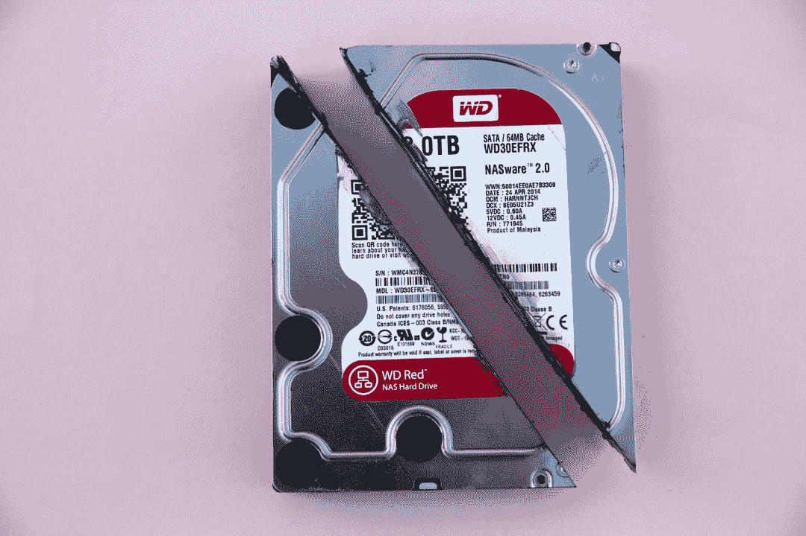

# Android 存储概述

> 原文：<https://www.freecodecamp.org/news/an-overview-of-android-storage/>

储物是我们都知道的东西，但总是想当然。不久前，存储容量的每一次飞跃都是递增的，似乎是不可能的。如今，当我们考虑我们的设备有多少信息时，我们不会给予第二个想法(也不会关心差异)。

更重要的一点是观察存储在内存中的内容的演变。在智能手机出现之前，我们偶尔会保存一两张照片、一些游戏和大量短信。但是现在，任何标准的手机都将包含应用程序、文档、照片、视频、音乐文件等等。让我们看看如何为我们的应用程序利用设备的存储空间。

我们将在本文中讨论的内容是:

1.  Android 手机上不同类型的存储
2.  存储类型之间的差异
3.  如何在应用程序中使用存储

每个应用程序都可以访问两种不同类型的存储: ******内部****** 和 ******外部****** 。这两种类型的存储有很大的不同，了解它们将有助于您设计下一个应用程序。

在开始之前，关于存储和缓存，有一点必须说明。存储是为了你想永久保存的东西，而缓存是为了临时保存东西。


Photo by [Erda Estremera](https://unsplash.com/@erdaest?utm_source=ghost&utm_medium=referral&utm_campaign=api-credit) / [Unsplash](https://unsplash.com/?utm_source=ghost&utm_medium=referral&utm_campaign=api-credit)

## 内存储器

当每个应用程序在操作系统上运行时，它都有自己的内部存储。此存储是私有的，仅供应用程序使用。也就是说，其他应用程序和用户都不能访问它。使用内部存储时要记住的另一件事是它的可用性。与外部存储不同，内部存储始终可供您的应用程序使用。

不过，使用这种存储方式也有缺点。如果用户移除应用程序，存储在应用程序内部存储器中的所有数据也会被移除。想象一下，如果你在手机上安装了一个游戏，然后某个地方决定删除它，会发生什么。如果你有机会重新安装游戏，你会希望保存你的游戏进度。

那么，我们如何将一个文件保存到内存中呢？

```
public void saveFileInternalStorage() {

        String FILENAME = "hello_world_file";
        String inputToFile = "Hello From Internal Storage!";

        try {
            FileOutputStream fileOutputStream = openFileOutput(FILENAME, Context.MODE_PRIVATE);
            fileOutputStream.write(inputToFile.getBytes());
            fileOutputStream.close();
            Toast.makeText(getApplicationContext(),
                    "File " + FILENAME + " has been saved successfully",
                    Toast.LENGTH_SHORT).show();
        } catch (FileNotFoundException e) {
            e.printStackTrace();
            Toast.makeText(getApplicationContext(),
                    "File " + FILENAME + " has not been saved successfully due to an exception " + e.getLocalizedMessage(),
                    Toast.LENGTH_SHORT).show();
        } catch (IOException e) {
            e.printStackTrace();
            Toast.makeText(getApplicationContext(),
                    "File " + FILENAME + " has not been saved successfully due to an exception " + e.getLocalizedMessage(),
                    Toast.LENGTH_SHORT).show();
        }
 }
```

Saving a file called hello_world_file

正如您在代码示例中看到的，我们正在保存一个名为******Hello _ world _ file******的文件，其中包含文本******“Hello From Internal Storage！”****** 。我创建了两个 catch 子句，只是为了演示在尝试这样做时可能出现的异常，但是您可以使用通用异常对象将它们最小化为一个 catch 子句。

注意方法******openfile output******会打开已经存在的文件，否则会创建一个。该方法的第二个参数是文件模式。此参数指定文件的范围和对它的访问。默认值是 MODE_PRIVATE，这使得该文件只能由您的应用程序访问。

这个参数的另外两个值是 MODE_WORLD_READABLE 和 MODE_WORLD_WRITEABLE，但是从 API 17 开始就不再推荐使用了。与其他应用程序共享私人文件使用一套不同的逻辑，你可以在这里阅读更多关于[的内容。最后，当写入文件时，我们将字符串转换为字节，并确保在最后关闭文件。](https://developer.android.com/training/secure-file-sharing)



Photo by [Markus Spiske](https://unsplash.com/@markusspiske?utm_source=ghost&utm_medium=referral&utm_campaign=api-credit) / [Unsplash](https://unsplash.com/?utm_source=ghost&utm_medium=referral&utm_campaign=api-credit)

## 外部存储器

与名称所暗示的相反，这种存储的定义是它并不总是可访问的。这可能意味着它可以是外部 SD 卡(辅助外部存储器)，但也可以是设备上的存储器(主外部存储器)。

为了说明这一点，外部存储是指当您通过 USB 电缆将设备连接到电脑时可以访问的存储。您可能已经猜到，存储在这种类型的存储器中的任何内容都可以被您设备上的其他应用程序访问，但是如果您卸载该应用程序，这些内容将被保留。

在演示如何将文件保存到外部存储器之前，我们需要做两件事:

1.  确保有足够的空间来保存文件
2.  运行时请求许可

确保有足够的存储空间需要以下代码行:

```
//Check if you can read/write to external storage
public boolean isExternalStorageWritable() {
    String state = Environment.getExternalStorageState();
    if (Environment.MEDIA_MOUNTED.equals(state)) {
        return true;
    }
    return false;
}
```

Checking if we can write and read to external storage

为了访问外部存储，我们需要向我们的 AndroidManifest.xml 添加以下权限:

```
<uses-permission android:name="android.permission.WRITE_EXTERNAL_STORAGE" />
```

Write external storage permission

此外，自 API 23 以来，危险权限不是在安装时授权的，而是在运行时授权的。写入外部存储被归为一类，因此我们需要添加逻辑来允许用户决定是否授予应用程序权限。

```
public void saveFileExternalStorage(View view) {
        if (isExternalStorageWritable()) {
            if (ContextCompat.checkSelfPermission(this, Manifest.permission.WRITE_EXTERNAL_STORAGE) ==
                PackageManager.PERMISSION_GRANTED) {
                    writeFileToExternalStorage();
                } else{
                    ActivityCompat.requestPermissions(this,
                            new String[]{Manifest.permission.WRITE_EXTERNAL_STORAGE}, 0);
                }
            }
        }

        @Override
        public void onRequestPermissionsResult(int requestCode, String[] permissions, int[] grantResults) {
            switch (requestCode) {
                case 0:
                {
                    writeFileToExternalStorage();
                    break;
                }
            }
        }
```

Check if the user has granted permission

我们的******writeFileToExternalStorage******看起来是这样的:

```
public void writeFileToExternalStorage() {
            String root = Environment.getExternalStorageDirectory().toString();
            File myDir = new File(root + "/saved_files");
            if (!myDir.exists()) {
                myDir.mkdirs();
            }
            try {
                File file = new File(myDir, "myfile.txt");
                FileOutputStream out = new FileOutputStream(file);
                out.write(inputToFile.getBytes());
                out.close();
                Toast.makeText(getApplicationContext(),
                        "File myfile.txt" + " has been saved successfully to external storage",
                        Toast.LENGTH_SHORT).show();
            } catch (Exception e) {
                e.printStackTrace();
            }
        }
```

Write a file to external storage

如果你想看这里展示的所有代码的例子，你可以去这个 [GitHub 仓库](https://github.com/TomerPacific/MediumArticles/tree/master/AndroidStorage)。


Photo by [Steve Johnson](https://unsplash.com/@steve_j?utm_source=ghost&utm_medium=referral&utm_campaign=api-credit) / [Unsplash](https://unsplash.com/?utm_source=ghost&utm_medium=referral&utm_campaign=api-credit)

## 很高兴知道

以上只是两个简单的例子，说明了如何为您的应用程序使用不同类型的存储。因为我们处理的是系统管理的资源，所以我们也应该意识到与之相关的行为。

默认情况下，您的应用程序将被安装到内部存储( ******参见内部解释****** )，但是从 API level 8 开始，您可以将属性******install location******添加到您的清单中，以允许您的应用程序被安装到外部存储。这样做的一个原因是，如果您的应用程序非常大，并且您希望用户将它安装在设备的外部存储上，因为那里有更多的空间。

该属性有三个值:

*   ******auto******——意味着你没有一个特定的偏好将应用程序安装在哪里。该应用程序将尝试安装到内部存储，但如果它已满，它会将其安装在外部存储中
*   ******内部****** -应用程序只会安装到内部存储器，如果那里没有足够的空间，它将不会被安装
*   ******preferExternal******-表示您希望您的应用程序安装到外部存储，但是如果那里没有足够的空间，它将安装在内部

对于 auto 和 preferExternal 选项，用户可以选择将应用程序从外部存储移动到内部存储，反之亦然。

请记住，一旦用户将其设备连接到计算机并使其能够共享数据或卸载 SD 卡，所有从外部存储运行的应用程序都会被销毁。如果您的应用程序使用以下功能之一，则不应将其安装到外部存储:

> **各种服务(特别是报警服务* s *)，输入法引擎，动态壁纸，应用小工具，账户管理器，同步适配器，设备管理器和广播接收器监听开机完成。**