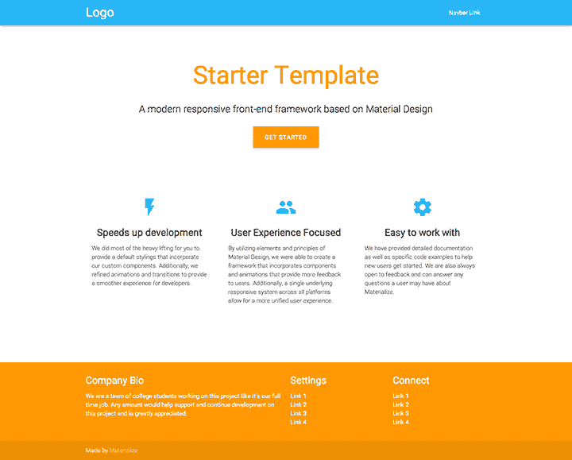

# 使用 Materialize 快速介绍材质设计

> 原文：<https://www.freecodecamp.org/news/an-quick-introduction-to-material-design-using-materialize-8a9b223c64f1/>

### 什么是材料设计？

材料设计是谷歌创造的一种设计语言。根据 [material.io](https://material.io/guidelines/) ，材料设计旨在结合:

> …优秀设计的经典原则与技术和科学的创新和可能性。它旨在开发一个单一的底层系统，允许跨平台和设备大小的统一体验。移动规则是基础，但触摸、语音、鼠标和键盘都是一流的输入方法。

### 为什么要用材料设计？

材料设计为所有设备提供了无缝的用户体验。响应的过渡和动画，以及填充和深度效果，如阴影和闪电，使它感觉优雅和用户友好。谷歌几乎在所有的应用上都使用了材质设计(比如 Keep 和 Calendar)。

### 你如何在你的网络应用中使用材料设计？

Materialize 是一个类似 Bootstrap 的响应式前端组件库。它提供了 Bootstrap 必须提供的一切，但不同之处在于 Materialize 遵循材料设计原则。这里有一个示例模板。



### 以下是 Materialize 提供的功能列表:

*   格子
*   桌子
*   徽章、按钮、面包屑
*   卡片、筹码、收藏品
*   页脚，表单
*   导航条
*   还有很多！

### 如何开始

与 Bootstrap 不同，Materialize 不需要 popper.js，它只需要 jQuery。这是你开始的全部需要。将此添加到您的 HTML 中，您就可以开始了！

```
<!-- Compiled and minified CSS -->
<link rel="stylesheet" href="https://cdnjs.cloudflare.com/ajax/libs/materialize/0.100.2/css/materialize.min.css">
<!--Compiled and minifed jQuery -->
<script type="text/javascript" src="https://code.jquery.com/jquery-3.2.1.min.js"></script>
<!-- Compiled and minified JavaScript -->
<script src="https://cdnjs.cloudflare.com/ajax/libs/materialize/0.100.2/js/materialize.min.js"></script>
```

### [颜色](http://materializecss.com/color.html)

使用 Materialize，您可以更改任何 HTML 元素的颜色，只需给它一个您想要的颜色的类名。例如，如果您想要将段落标签的颜色设置为红色，请执行以下操作:

```
<p class=”red”>Lorem Ipsum</p>
```

此外，您还可以通过给颜色另一个类名`lighten-1`或`darken-1`来使颜色变亮或变暗。比如`<h1 class=”blue lighten-1”>Sample Tex` t < /h1 >。1 可以替换为最大为 5 的变亮数字和最大为 4 的变暗数字。较高的数值会应用较浅或较深的颜色阴影。

### [按钮](http://materializecss.com/buttons.html)

要具体化一个按钮，只需给它一个类名`btn`。你也可以通过给它另一个类`waves-effect`来添加一个很酷的动画。如果需要更大的按钮，可以使用`btn-large`类。例如:

```
<button class=”btn”>
  Click
</button> <!-- Materialized button without click animation -->
<button class="btn waves-effect">
  Click
</button> <!-- Materialized button with click animation -->
<button class="btn-large">
  Click
</button> <!-- Large Button -->
```

### [影子](http://materializecss.com/shadow.html)

> 在材质设计中，所有东西都应该有一个特定的 z 深度，这个深度决定了元素离页面有多远。

要对元素应用阴影效果，可以使用`z-depth-2`类(2 可以用数字 1-5 代替)。例如:

```
<div class="z-depth-2"><!-- Really cool stuff --></div> 
```

### 结论

我在这里只是触及了表面。物化中有更多可用功能(比如转换、卡片、旋转木马和模态)。你可以从[文档](http://materializecss.com/getting-started.html)中学习如何使用所有组件。类名非常简单，网格对于快速创建响应列非常有帮助。祝你好运！