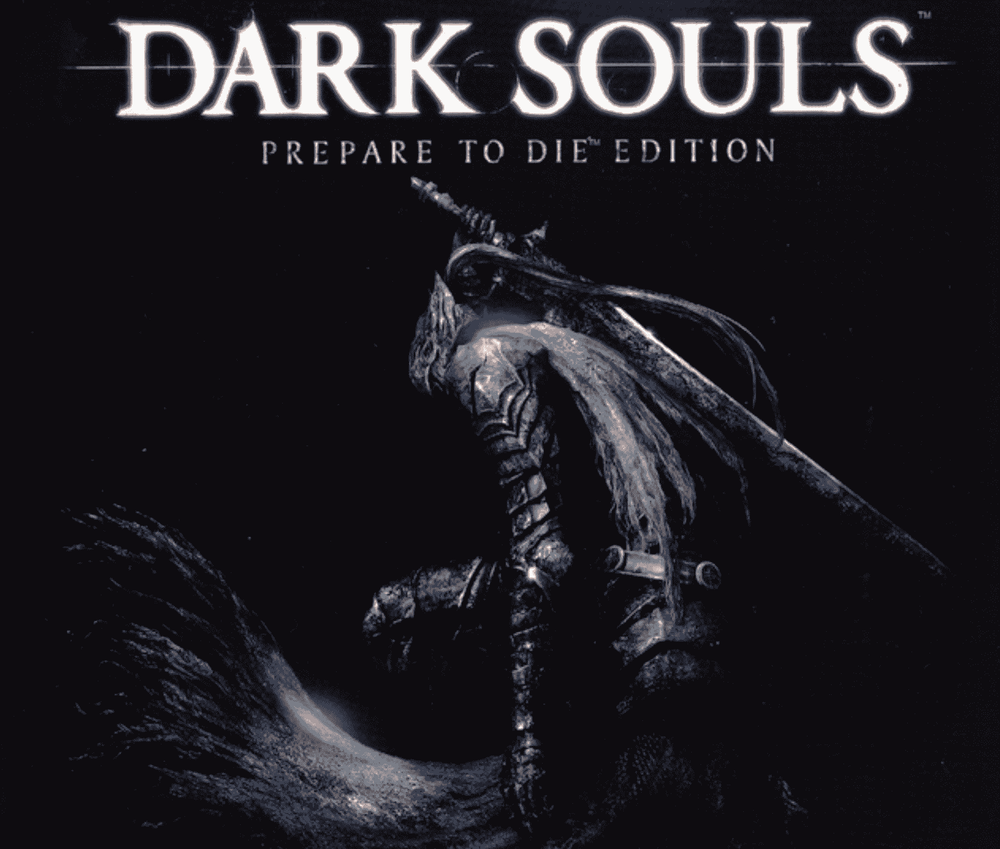

# 2020 年更新:#ProjectEuler100 和# AWS 认证挑战

> 原文：<https://www.freecodecamp.org/news/an-update-on-the-projecteuler100-and-awscertified-challenges/>

每年新年前后，我都鼓励人们参加#100DaysOfCode 挑战。今年，我更进一步。

但首先，让我告诉你关于#100DaysOfCode。

Alex Kallaway 在 2016 年创立了#100DaysOfCode 挑战赛。

我有幸在多伦多和亚历克斯一起出去玩，我甚至写了一篇关于挑战的深度历史。

#100DaysOfCode 挑战是巨大的。有多大？给你一个想法:挑战参与者每 20 秒发一次#100DaysOfCode 标签。

Twitter 机器人# 100 daysofcode 什么也不做，只是随机转发带有标签的推特用户，它的推特粉丝比许多财富 500 强公司都多。

#100DaysOfCode 挑战是这样进行的:

1.  连续 100 天，你每天至少写一点点代码。每天你都在推特上发布你做了什么。
2.  每天你回复别人的推文来支持他们。

就是这样。超级简单。这是一个公共承诺设备，内置支持网络，帮助您保持动力。

对于任何一种基于耐力的挑战来说，这都是一个强大的模型。

今年，我想将#100DaysOfCode 挑战的卓越简单性转化为更高级的开发者挑战。

这两个新挑战非常适合那些没有时间参加#100DaysOfCode 挑战的高级开发人员。

这些挑战也非常适合已经完成一两轮#100DaysOfCode 的人，并希望尝试更高级的东西。

于是#ProjectEuler100 挑战赛和#AWSCertified 诞生了。

在本文中，我将简要解释这些挑战，并展示一些参与者迄今为止取得的成就。

## 关于#ProjectEuler100 挑战的更新

欧拉项目是一个创建于 2001 年的网站。它包含了大约 600 个不同的算法问题，这些问题越来越难，甚至连数学博士也难以解决。

也就是说，前 100 个问题完全可以由一个新的开发者来完成。多年来，成千上万的人已经完成了前 100 个欧拉问题。

这太难了。喜欢...黑暗灵魂很难。

Dark Souls is a video game famous for being ridiculously hard. But it becomes much easier with consistent practice - just like these algorithm problems.

我喜欢欧拉问题项目。当我第一次学习编码时，我广泛地使用了它们。我太喜欢这些了，所以我们把这些欧拉项目问题添加到了 [freeCodeCamp 的采访准备部分](https://www.freecodecamp.org/learn/coding-interview-prep/project-euler/)。

我把一切都归结为所有参与者都必须遵守的 6 条简单规则。

1.  在推特上发布一张你竖起大拇指的照片，并宣布你将参加#ProjectEuler100 挑战。
2.  创建 GitHub 存储库。
3.  每当你完成一个问题，将你的解决方案添加到你的 GitHub 库，并使用#ProjectEuler100 标签发布一个链接。
4.  然后浏览#ProjectEuler100 标签，并对至少两条来自其他开发者的推文给予支持性反馈。
5.  继续下一个项目欧拉问题。你不能跳过去。你必须按顺序完成所有 100 道题。但是你可以使用任何编程语言来解决这些问题。
6.  一旦你完成了所有的 100 个，在推特上发布一张你的庆祝照片，你的笔记本电脑打开了你的 GitHub repo。

到目前为止，已经有超过 700 人加入了这个名为 [#ProjectEuler100 Discord 聊天室](https://discord.gg/xpWc7Wk)。

这个名为 [#ProjectEuler100 的推特机器人](https://twitter.com/ProjectEuler100)已经有了 300 名粉丝。

由于这个挑战是完全自定进度的，一些超级积极的开发人员已经到达了挑战的后半部分。

以下是人们在推特上谈论这项挑战的一些事情:

> 用 goroutines 解决了 [#projecteuler](https://twitter.com/hashtag/projecteuler?src=hash&ref_src=twsrc%5Etfw) 的第 12 个问题，真是太幸福了！！！[# projecter 100](https://twitter.com/hashtag/ProjectEuler100?src=hash&ref_src=twsrc%5Etfw)[# Golang](https://twitter.com/hashtag/Golang?src=hash&ref_src=twsrc%5Etfw)
> 
> 在一台相当低规格的机器上[pic.twitter.com/rjp7Bv1ZzH](https://t.co/rjp7Bv1ZzH)
> 
> — Anjan Roy (@meanjanry) [January 12, 2020](https://twitter.com/meanjanry/status/1216303281221226496?ref_src=twsrc%5Etfw)