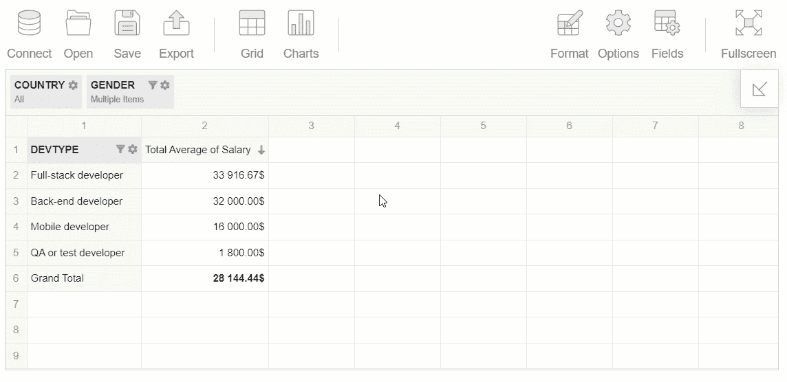
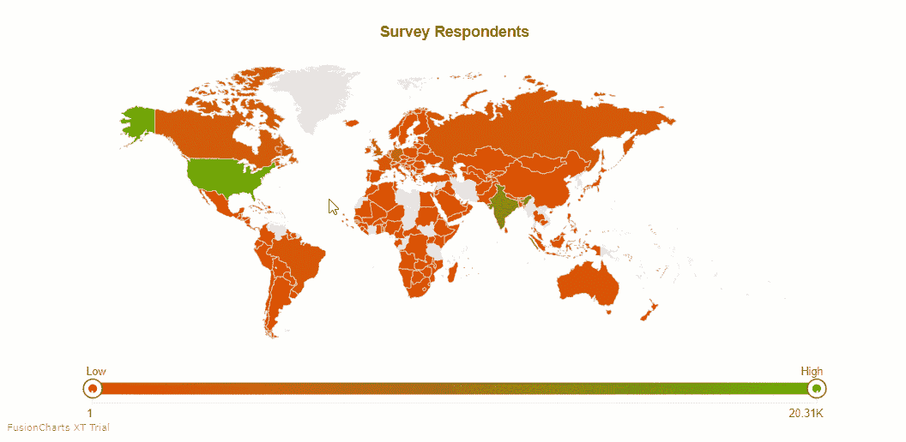
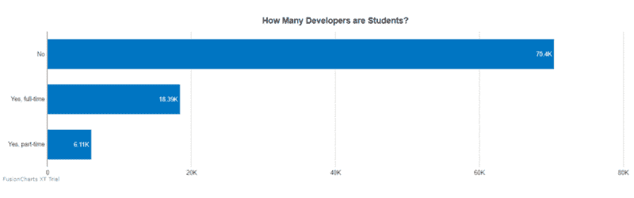
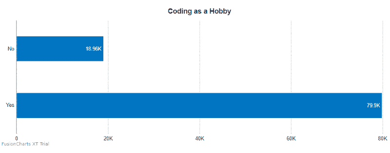
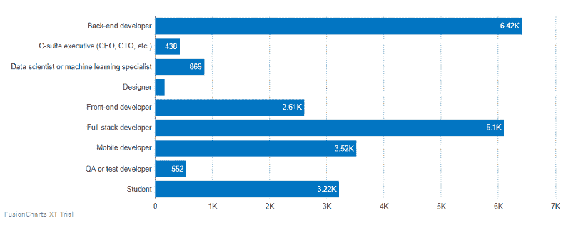
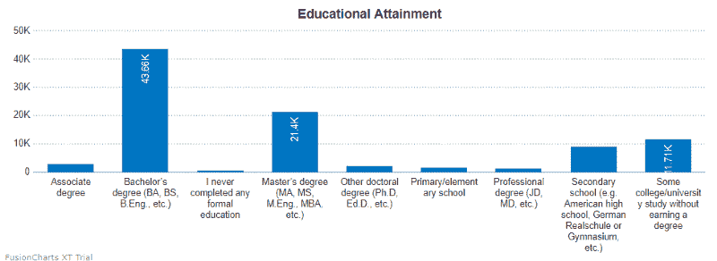
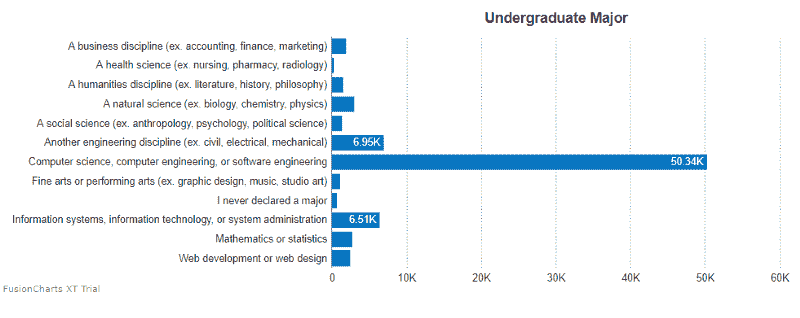
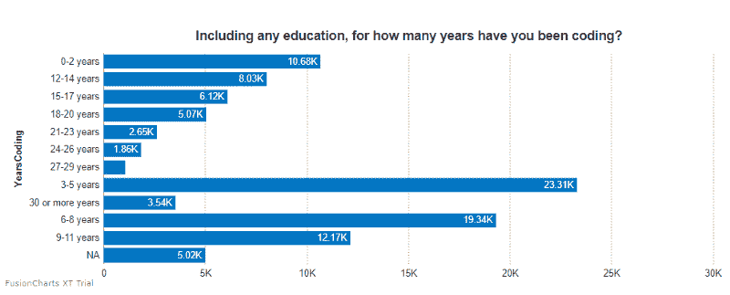
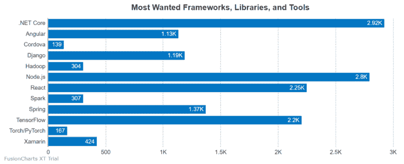

# 我如何用 JavaScript 数据透视表和图表库分析开发人员趋势

> 原文：<https://www.freecodecamp.org/news/analysis-of-developers-trends-with-javascript-pivot-table-and-charting-library-b7b6e16ab71b/>

嗨，开发者社区！

今天我想分享一下我根据 [StackOverflow 的开发者调查结果](https://insights.stackoverflow.com/survey/?r=fr3)分析开发者偏好的经验。当然，有很多现成的**分析报告**，但从头开始创建个人项目并提高我们的数据分析技能总是令人兴奋得多。这正是我要做的。:)

### **挑战**

从一开始，我就面临着一个挑战，那就是找到一个能够处理 10 万条文本记录的工具。由于这是一个巨大的数据集，该工具需要功能强大，并尽可能少地使用浏览器内存。同时应该是简单易用的。幸运的是，我找到了一个 **web 透视表**组件。乍一看，它很有前途，帮助我实现了所有与报道相关的意图。

除了它的报告功能，我注意到它支持与图表库的集成。我选择了 **FusionCharts。**它还集成了不同的 JavaScript 框架，并提供了复杂的图表。使用数据透视表和图表的组合，我设法创建了一个关于数据分析和可视化的小项目。

### **目标&目标**

我的分析目的包括*创建报告*和*可视化调查结果*。我决定关注开发人员的个人资料、他们的就业状况、最受欢迎的技术、语言、框架和库，并整合这些信息以获得新的见解。

例如，发现热爱特定技术的开发人员的背景对我来说很有趣。下一步，我想分析选择不同技术之间的关系。

这篇文章将以一个逐步教程的形式出现，我将试图涵盖使用这两种工具的最重要的方面。

我很高兴与您分享创建交互式仪表板的过程，该仪表板具有钻取、拖放和图表功能。

开始吧！

#### **将库安装到您的项目中**

作为第一步，您需要添加库脚本、用于 FusionCharts 的 Flexmonster 连接器以及将呈现组件的容器。

```
<script src="https://cdn.flexmonster.com/flexmonster.js"></script>
<script src="https://cdn.flexmonster.com/lib/flexmonster.fusioncharts.js"></script>
<script src="https://static.fusioncharts.com/code/latest/fusioncharts.js"></script>

<div id="pivotContainer"></div>
<div id="fusionchartContainer"></div>
```

如果您想要创建多个图表，请为它们添加更多容器。

#### **集成数据透视表**

将报告工具添加到项目中，并设置其基本配置:

```
var pivot = new Flexmonster({
    container: "pivotContainer",
    toolbar: true
});
```

要了解如何用各种属性扩展数据透视表的可能性，您可以查看关于 [init API 调用](https://www.flexmonster.com/api/new-flexmonster/?r=fr3)的文章。

#### **准备并导入数据**

作为数据集，我选择了开发者的调查结果。它包含 195 MB 的原始文本数据。

将数据加载到数据透视表中的一种方法是定义返回 JSON 数据的函数。但是由于代码大小的限制，我不能在 CodePen 演示中显示全部数据。为了不弄乱我的代码，我在 CDN 上加载了一个文件，并设置了一个指向我的数据源的路径:

```
dataSource: {
    filename: "surveyresults.csv"
}
```

#### **设定一个切片**

在网格上排列层次-将它们放入行、列和度量中。此外，您可以添加报告过滤器来保持网格整洁，并对数据进行排序，以首先查看最相关的记录。

```
"slice": {
    "reportFilters": [{
            "uniqueName": "Country"
        },
        {
            "uniqueName": "Gender"
        }
    ],
    "rows": [{
        "uniqueName": "DevType"
    }],
    "columns": [{
        "uniqueName": "[Measures]"
    }],
    "measures": [{
        "uniqueName": "Salary",
        "aggregation": "average"
    }],
    "sorting": {
        "column": {
            "type": "desc",
            "tuple": [],
            "measure": {
                "uniqueName": "Salary",
                "aggregation": "average"
            }
        }
    }
}
```

稍后，您可以在运行时使用拖放特性**更改切片——只要您需要从不同的角度查看。**



#### **将图表和透视网格绑定在一起**

让我们让图表显示数据透视表中的数据。为此，给 Flexmonster 的`reportcomplete`事件附加一个事件处理程序。一旦透视网格准备好充当数据提供者，它就会被触发。

代码如下所示:

```
reportcomplete: function() {
    pivot.off("reportcomplete");
    createFusionChart();
}
```

现在让我们来看看使仪表板交互的那部分代码。

定义一个负责从报告中获取数据、创建和绘制图表的函数。

在 **createFusionChart()** 中，调用透视表实例上的 **getData()** 方法，从当前报表或需要的切片中获取数据。该方法将其预处理为给定类型的图表，并将数据传递给*回调处理程序*和*更新处理程序*。这些处理程序指定了第一次显示报告时或者数据更新(过滤、排序等)时会发生什么。在 *callbackHandler* 中，需要实例化一个图表，并向其发送数据。在 *updateHandler* 中，只需将更新的数据设置到图表中，并再次呈现它。

万岁！图表和数据透视表呈现在同一页上。现在，图表显示来自网格的数据，并对应用于报告的任何更改做出反应。

同样，您可以根据需要添加任意数量的图表。

对于这个数据可视化，我选择了地图、条形图和柱形图。

#### **我得到了什么**

在完成所有这些步骤后，我得到了一个完全基于报告工具和图表的**交互式仪表板**。让我与你分享我从调查结果数据中获得的一些见解。

#### **人口统计**



从图表中可以很容易地看出，大多数参加调查的开发人员居住在美国、印度和加拿大。

#### **职业**

超过 1.8 万名受访者是全日制学生:



此外，大约 80，000 名开发人员说他们在业余时间编写代码:



找出最常见的开发人员类型很有趣。他们是后端、全栈和移动开发者:



#### **教育**

大多数受访者至少拥有学士学位:



超过 50.34 万名开发人员主修计算机科学、计算机和软件工程:



在过去的五年中，超过 2.3 万名开发人员学会了编码:



#### **框架、库和工具**

让我们来看看开发人员希望在下一年使用的最受欢迎的框架、库和工具:



如你所见。NET Core，Node.js，React，TensorFlow 得票最多。

### **将所有这些整合在一起**

通过使用开发人员友好的 API 和数据透视表指南以及图表库，我已经能够对开发人员社区的趋势有一个大致的了解。我鼓励你更深入地研究数据，并与你的朋友和队友分享独特的见解。

我希望这篇教程能启发你创建你的可视化项目。

感谢您的阅读！

**有用的链接**

*   [CodePen 现场演示](https://codepen.io/ronika/pen/mooKab/?r=fr3)
*   [如何将 Flexmonster 与 FusionCharts 集成](https://www.flexmonster.com/doc/integration-with-fusioncharts/?r=fr3)
*   [融合图表:图表库](https://www.fusioncharts.com/charts?product=fusioncharts/?r=fr3)