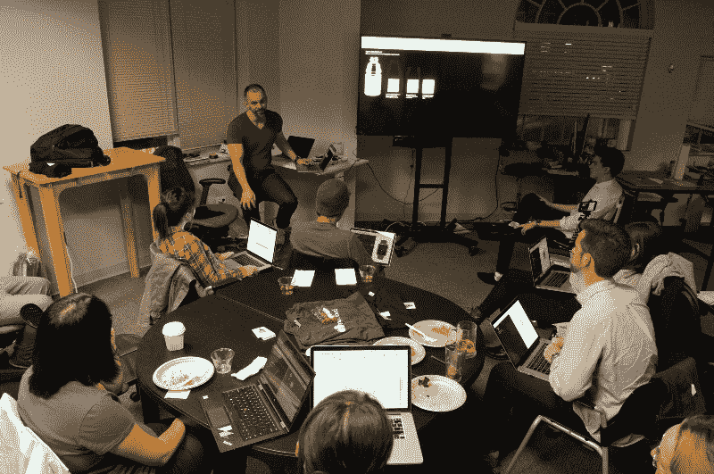
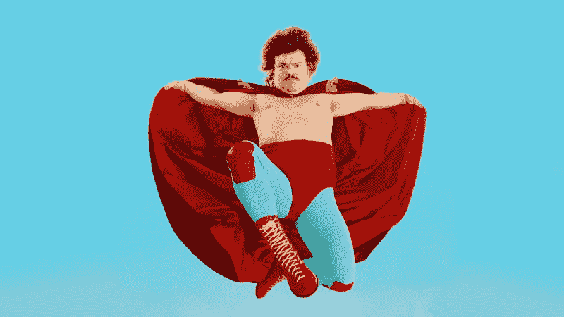
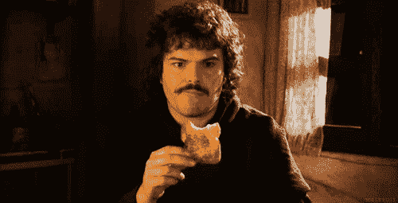
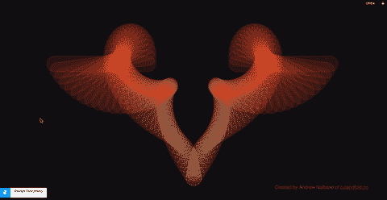
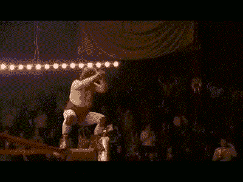
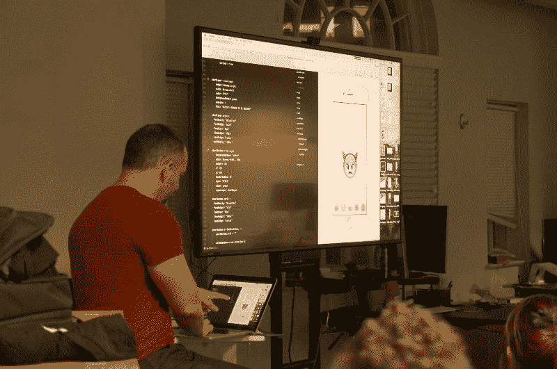
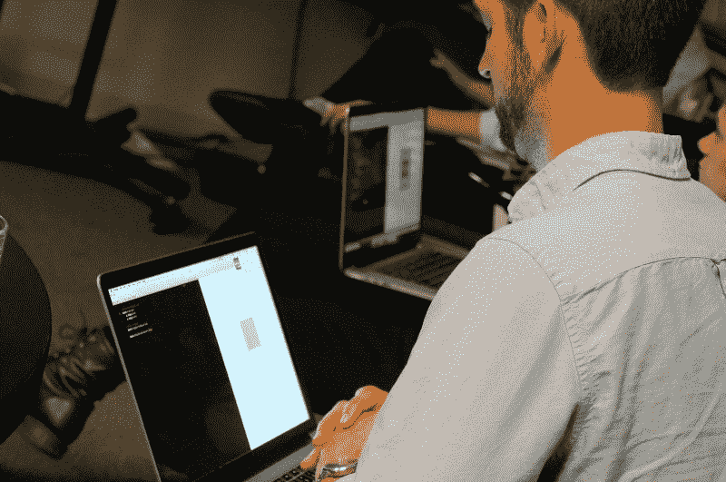
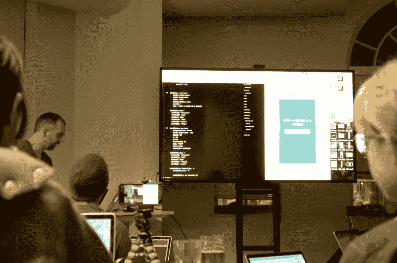
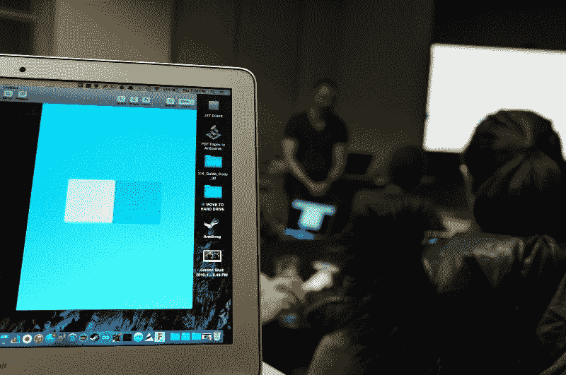
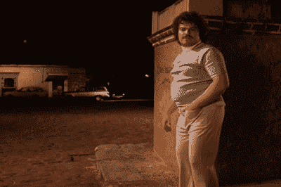

# 我所在的城市没有任何设计活动，所以我自己组织了一次。

> 原文：<https://www.freecodecamp.org/news/anatomy-of-an-interaction-design-meetup-656e61295775/>

作者马蒂·劳里塔

# 我所在的城市没有任何设计活动，所以我自己组织了一次。

> “两种人格的相遇就像两种化学物质的接触:如果有任何反应，两者都会转化。”——卡尔·荣格

做一些你从未做过的事情本来就令人兴奋。

几个月前，当我写信给[Framer](https://framerjs.com/)询问为什么没有在波士顿安排任何 Framer 活动时，他们回复说，“那么，你为什么不举办一个呢？”

说实话，我一般不会组织活动。我想我是一个有点过于微观管理的人，既享受它又保持它平稳运行。这就像请伍迪·艾伦主持一个喜剧节目，同时又要迎合它。但这一次，出于某种原因，我答应了。

When someone asks you to host a meetup, jump in!

如果 Framer 没有把我和两个非常外向、有组织、令人敬畏的犯罪伙伴联系起来，艾米丽·卡林和 T2·吉迪恩·戈尔丁，事情就不会这么顺利。

所以，正如 Nacho Libre 所说，“让我们开始吧。”

我很快了解到，成功的聚会有五个要素:

*   位置
*   食物
*   酒
*   特邀演讲人
*   某种议程的表象

我们很快锁定了地点，食物和酒。找到一个优秀的演讲者是一个更大的挑战。

过了一段时间，我们联系到了安德鲁·纳尔班德(Andrew Nalband)，他是一位资深设计师和狂热的框架用户。他用 Framer 开发了这样的杀手级交互:

You can try the interactive version here: [http://share.framerjs.com/zydimzquxu7b/](http://share.framerjs.com/zydimzquxu7b/)

在快速浏览了其他活动后，我们有了一个议程，我很快将它插入了一个花哨的小邀请函中。

所以，我们的原料都准备好了，是时候起飞了！

### 该事件

人们在 6:30 左右开始排队，我们有丰富的食物和饮料，有一个舒适的社交氛围。

我们对参与者进行了预先调查，因此我们对每个人的技能水平有所了解。大多数人从未使用过像 Framer 这样基于代码的交互工具，所以我们决定从底层开始。

演示主要由 Andrew 的介绍和演示组成。他介绍了该工具的基础知识，以及一些在实践中令人鼓舞的例子。

我喜欢安德鲁的演讲，是因为他很舒服地切换到了“教育者”模式。他深入基础知识，带领每个人浏览界面，什么是图层，动画是如何工作的。我们事先不知道他要谈些什么，但他完全粉碎了这个想法！

人们如此全神贯注，以致安德鲁能讲整整一个小时。

我也上去分享了一些原型，但自从我负责摄影后就没有照片了？

我们在脸书直播了整个事件。这里可以看[。](https://www.facebook.com/groups/framerjs/search/?query=marty%20laurita)

### 反射时间

最大的教训是，正如其他人发现的那样，在开始时将人们分开可能是好的，以最大限度地提高活动的有效性。

虽然这次活动取得了巨大的成功，但我确实得到了一些反馈，一些人希望更多地进行演练，而另一些人则是为了更好地了解 framer 如何融入设计工作流。

在接下来的活动中，我们一定会努力满足这些需求，并且更加出色！

我要感谢本次活动的赞助商:[组织者](http://framerjs.com)、 [Tamr](http://www.tamr.com/) 和[成年人协会](https://www.societyofgrownups.com/)。没有你的支持，它不会如此伟大！

还有，谢谢你的阅读！如果你有任何想法，我希望你能在评论中给我反馈。

另外，一定要看看我上一篇关于 FramerJS 原型的文章。

*如果您喜欢，请点击？所以其他人会在媒体上看到这个。*