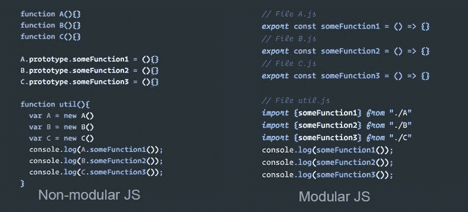
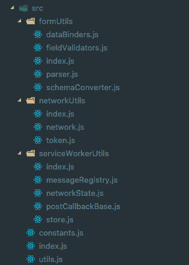
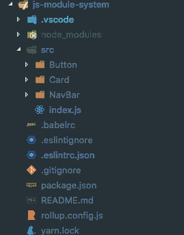
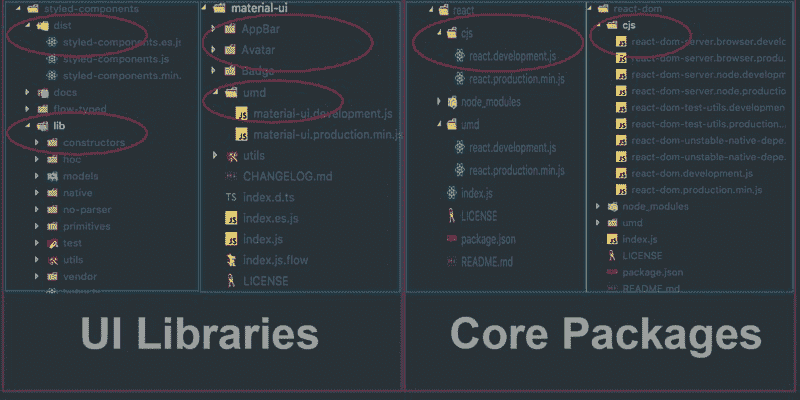
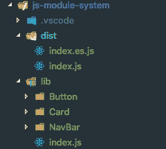

# 学习 JavaScript 模块系统的基础知识，并构建自己的库

> 原文：<https://www.freecodecamp.org/news/anatomy-of-js-module-systems-and-building-libraries-fadcd8dbd0e/>

卡姆莱什·钱德纳尼

# 学习 JavaScript 模块系统的基础知识，并构建自己的库


最近我们都听说了很多关于“JavaScript 模块”的事情。每个人都可能想知道如何利用它们，它们是如何在我们的日常生活中扮演重要角色的？

### **那么 JS 模块系统到底是个什么鬼？？**

随着 JavaScript 开发越来越普及，名称空间和依赖关系变得越来越难以处理。已经开发了不同的解决方案来以模块系统的形式处理这个问题。



### 为什么理解 JS 模块系统很重要？

我给你讲个故事吧。

> 讲故事对人类来说就像吃饭一样基本。事实上，更是如此，因为食物使我们生存，故事使我们的生活值得活下去——理查德·卡尼

为什么我要谈论这些东西？因此，我的日常工作是设计和构建项目，我很快意识到项目之间需要许多共同的功能。我总是一遍又一遍地将这些功能复制粘贴到新项目中。

问题是，每当一段代码发生变化，我都需要在我的所有项目中手动同步这些变化。为了避免所有这些繁琐的手动任务，我决定提取常用的功能，并用它们组成一个 npm 包。通过这种方式，团队中的其他人可以将它们作为依赖项重用，并在推出新版本时简单地更新它们。

这种方法有一些优点:

*   如果在核心库中有一些改变，那么只需要在一个地方进行改变，而不需要重构所有应用程序的代码。
*   所有的应用程序都保持同步。每当进行更改时，所有应用程序只需运行“npm update”命令。



Source code of library

所以，下一步是发布这个库。对吗？？

这是最艰难的部分，因为有一堆东西在我的脑海里跳动，比如:

1.  我怎样才能让这棵树摇晃起来？
2.  我应该针对哪些 JS 模块系统(commonjs，amd，harmony)。
3.  我应该传输源代码吗？
4.  我应该捆绑源代码吗？
5.  我应该发布哪些文件？

在创建图书馆的过程中，我们每个人都有过这样的问题。对吗？

现在，我将尝试回答上述所有问题。

### 不同类型的 JS 模块系统？

**1\. CommonJS**

*   由**节点**执行
*   当您安装了模块时，用于**服务器端**
*   没有运行时/异步模块加载
*   通过"**导入需要**
*   通过“**模块导出。导出**
*   当你导入时，你会得到一个对象
*   没有**树摇动，**因为当你导入时你得到一个对象
*   没有静态分析，因为你得到一个对象，所以属性查找是在运行时
*   你总是得到一个对象的副本，所以模块本身没有动态变化
*   较差的循环依赖管理
*   简单语法

**2。AMD:异步模块定义**

*   由**要求实施**
*   用于**客户端(浏览器)**需要动态加载模块时
*   通过“要求”导入
*   复杂语法

**3。UMD:通用模块定义**

*   **CommonJs + AMD** 的组合(即 CommonJs + AMD 异步加载的语法)
*   可用于两种 **AMD/CommonJs** 环境
*   UMD 从本质上创造了一种使用这两者之一的方法，同时也支持全局变量定义。因此，UMD 模块能够在**客户端和**服务器上工作。

**4。ECMAScript Harmony (ES6)**

*   用于两个**服务器/客户端**端
*   **支持模块的运行时/静态加载**
*   当你**导入时，**你得到的是**绑定值**(实际值)
*   通过“进口”进口，通过“出口”出口
*   **静态分析** —您可以在编译时(静态地)确定导入和导出—您只需查看源代码，不必执行它
*   **树可摇动，**因为有 ES6 支持的**静态分析**
*   总是得到一个**实际值**,以便实时改变模块本身
*   比 CommonJS 更好的循环依赖管理

现在你已经了解了不同类型的 JS 模块系统以及它们是如何发展的。

尽管所有的工具和现代浏览器都支持 ES Harmony 模块系统，但我们永远不知道在发布库时，我们的消费者会如何利用它们。因此，我们必须始终确保我们的库能够在所有环境中工作。

让我们更深入地研究并设计一个样例库，以正确的方式回答与发布库相关的所有问题。

我已经建立了一个小型的 UI 库(你可以在 [GitHub](https://github.com/kamleshchandnani/js-module-system) 上找到源代码)，我将分享我对传输、捆绑和发布它的所有经验和探索。



Directory Structure

这里我们有一个小的 UI 库，它有 3 个组件:按钮、卡片和导航条。让我们一步一步的转档发布吧。

### 发布前的最佳实践？

1.  **树在晃动？**

*   **树摇动**是 JavaScript 上下文中常用的术语，用于消除死代码。它依赖于 ES2015 模块语法的[静态结构](http://exploringjs.com/es6/ch_modules.html#static-module-structure)，即`[import](https://developer.mozilla.org/en-US/docs/Web/JavaScript/Reference/Statements/import)`和`[export](https://developer.mozilla.org/en-US/docs/Web/JavaScript/Reference/Statements/export)`。ES2015 模块捆绑器[汇总](https://github.com/rollup/rollup)推广了该名称和概念。
*   Webpack 和 Rollup 都支持**树摇动，**意味着我们需要记住某些事情，以便我们的代码是树摇动的。

2.**发布所有模块变体**

*   我们应该发布所有的模块变体，比如`UMD`和`ES`，因为我们永远不知道我们的消费者会在哪个浏览器/webpack 版本中使用这个库/包。
*   即使像 [**Webpack**](https://webpack.js.org) 和 [**Rollup**](https://rollupjs.org) 这样的捆绑器都理解 es 模块，但是如果我们的消费者使用的是 **Webpack 1.x，**那么它就不能理解 ES 模块。

```
// package.json
```

```
{"name": "js-module-system","version": "0.0.1",...
```

```
"main": "dist/index.js","module": "dist/index.es.js",
```

```
...}
```

*   `package.json`文件的`main`字段通常用于指向库/包的`UMD`版本。
*   **你可能想知道——我如何发布我的库/包的`ES`版本？？**
    p`ackage.json` 的 m `odule` 字段用来指向 E `S` 版本的库/包。以前，许多字段都像 j `s:next` 和 j `s:main` 一样被使用，但是 m `odule` 现在被标准化了，并且被打包者用作库/包版本的查找。

> **鲜为人知的事实:** Webpack 使用 [resolve.mainfields](https://webpack.js.org/configuration/resolve/#resolve-mainfields) 来确定`package.json`中的哪些字段被检查。

> **性能提示:**总是尝试发布你的库/包的`ES`版本，因为现在所有的现代浏览器都支持`ES`模块。所以你可以减少传输文件，最终你会减少给用户的代码。这将提高应用程序的性能。

那么现在下一步是什么？转贴还是捆绑？我们应该使用什么工具？

啊，最棘手的部分来了！让我们开始吧。**？**

### Webpack vs Rollup vs Babel？

这些都是我们在日常生活中用来发布应用程序/库/包的工具。我无法想象没有他们的现代 web 开发—**#***。因此，我们无法比较它们，所以这是一个错误的问题！❌*

*每种工具都有自己的优势，并根据您的需求服务于不同的目的。*

*现在让我们来看看这些工具:*

#### ***网络包***

*[Webpack](https://webpack.js.org) 是一个很棒的模块 **bundler？**这被广泛接受，主要用于建造水疗中心。它提供了所有开箱即用的特性，如 c [ode 分裂、](https://webpack.js.org/guides/code-splitting/) a [同步加载](https://webpack.js.org/guides/code-splitting/#dynamic-imports)捆绑包、t [ree 摇动、](https://webpack.js.org/guides/tree-shaking/)等等。它使用 C **ommonJS** 模块系统。*

***PS:**[web pack-4 . 0 . 0](https://github.com/webpack/webpack/issues/6064)alpha 已经出了？。希望随着稳定版本的发布，它将成为所有类型模块系统的通用捆绑器。*

#### ***RollupJS***

*[Rollup](https://rollupjs.org/) 也是类似于 Webpack 的模块 **bundler** 。然而，rollup 的主要优点是它遵循了包含在 **ES6** 修订版中的代码模块的新的标准化格式，因此您可以使用它来捆绑您的库/包的 **ES 模块**变体。它不支持捆绑包的**异步加载**。*

#### ***巴别塔***

*Babel 是一个 JavaScript 的 **transpiler** ,以其将 ES6 代码转换成在你的浏览器(或服务器)上运行的代码的能力而闻名。记住，它只是**传输文件**，并不捆绑你的代码。*

*我的建议是:对库使用 Rollup，对应用程序使用 Webpack。*

### *Transpile (Babel-ify)源代码或捆绑源代码*

*这背后又有一个故事。？*

*当我建造这个图书馆的时候，我花了大部分时间试图找出这个问题的答案。我开始挖掘我的 node_modules 来查找所有伟大的库并检查它们的构建系统。*

*

Libraries vs Packages build output comparision* 

*在查看了不同库/包的构建输出后，我清楚地了解了这些库的作者在发布之前可能已经考虑了哪些不同的策略。以下是我的观察。*

*正如您在上面的图片中所看到的，我已经根据它们的特性将这些库/包分成了两组:*

1.  *用户界面库(`styled-components`，`material-ui`)*
2.  *核心包(`react`，`react-dom`)*

*如果你是一个好的观察者？你可能已经发现了这两组之间的区别。*

***UI 库**有一个`dist`文件夹，里面有作为目标的 **ES** 和 **UMD/CJS** 模块系统的捆绑缩小版本。有一个`lib`文件夹，其中包含库的**传输的**版本。*

***核心包**有只有一个文件夹，其中有 **CJS** 或 **UMD** 模块系统的捆绑缩小版作为目标。*

***但是为什么 UI 库和核心包的构建输出会有差异呢？？***

#### ***用户界面库***

*想象一下，如果我们只是发布我们库的捆绑版本，并将其托管在 CDN 上。我们的消费者将直接在一个`<scrip` t/ >标签中使用它。现在如果我的消费者想用 jus`t the <`；按钮/ >组件，他们必须加载整个库。此外，在浏览器中，没有捆绑器来处理树抖动，我们最终会将整个库代码发送给消费者。我们不想这样。*

```
*`<script type="module">import {Button} from "https://unpkg.com/uilibrary/index.js";</script>`*
```

*现在，如果我们简单地将`src`转换成`lib`并在 CDN 上托管`lib`，我们的消费者实际上可以获得他们想要的任何东西，而没有任何开销。“船少，装得快”。✅*

```
*`<script type="module">import {Button} from "https://unpkg.com/uilibrary/lib/button.js";</script>`*
```

#### *核心包*

*核心包从不通过`<scrip` t/ >标签使用，因为它们需要成为主应用程序的一部分。所以我们可以安全地发布这类包的捆绑版本(U MD，ES ),把构建系统留给消费者。*

*例如，他们可以使用 **UMD** 变种，但不使用摇树，或者他们可以使用 **ES** 变种，如果捆绑者能够识别并获得摇树的好处。*

```
*`// CJS requireconst Button = require("uilibrary/button");`*
```

```
*`// ES importimport {Button} from "uilibrary";`*
```

*但是……我们的问题是什么:我们应该转换(Babelify)源代码还是捆绑它？？*

*对于 UI 库，我们需要**trans pile**source with**Babel**with`es`module system 作为目标，并放置在`lib`中。我们甚至可以在 CDN 上主持`lib`。*

*我们应该使用`cjs/umd`模块系统的**汇总**和`es`模块系统作为目标**捆绑**并缩小**和**源。修改`package.json`以指向正确的目标系统。*

```
*`// package.json`*
```

```
*`{"name": "js-module-system","version": "0.0.1",...`*
```

```
*`"main": "dist/index.js",      // for umd/cjs builds"module": "dist/index.es.js", // for es build`*
```

```
*`...}`*
```

*对于**核心包**，我们不需要`lib`版本。*

*我们只需要使用`cjs/umd`模块系统的**汇总**和`es`模块系统作为目标**捆绑**并缩小**和**源。修改`package.json`指向正确的目标系统，同上。*

***提示**:对于那些愿意通过`<scrip` t/ >标签下载整个库/包的用户，我们也可以在 CDN 上托管`dist`文件夹。*

### *这个应该怎么建？*

*在`package.json`中，我们应该为每个目标系统准备不同的脚本。你可以在 GitHub repo 中找到[汇总配置](https://github.com/kamleshchandnani/js-module-system/blob/master/rollup.config.js)。*

```
*`// package.json`*
```

```
*`{..."scripts": {"clean": "rimraf dist","build": "run-s clean && run-p build:es build:cjs build:lib:es","build:es": "NODE_ENV=es rollup -c","build:cjs": "NODE_ENV=cjs rollup -c","build:lib:es": "BABEL_ENV=es babel src -d lib"}...}`*
```

### *我们应该发表什么？*

*   *许可证*
*   *自述文件*
*   *变更日志*
*   *元数据(`main`、`module`、`bin` ) — **package.json***
*   *通过 **package.json** 的`files`属性进行控制*

*在`package.json`中，`"files"`字段是一个文件模式数组，它描述了当您的包作为一个依赖项安装时要包含的条目。如果在数组中命名一个文件夹，那么它也将包含该文件夹中的文件。*

*在我们的例子中，我们将在`"files"`字段中包含`lib`和`dist`文件夹。*

```
*`// package.json`*
```

```
*`{..."files": ["dist", "lib"]...}`*
```

*图书馆终于可以出版了。只需在终端中键入`npm run build`命令，就可以看到如下输出。仔细查看`dist`和`lib`文件夹。？*

*

Ready to publish ?* 

### *包裹*

*哇！时间去了哪里？这是一次冒险，但我真诚地希望它能让您更好地理解 JavaScript 模块系统，以及如何创建自己的库并发布它。*

*请确保您注意以下事项:*

1.  *使它成为可摇动的树。？*
2.  *目标至少是 **ES 和谐**和 **CJS** 模块系统。？*
3.  *使用**巴别塔**和**捆绑器**作为库。？*
4.  *将**捆扎机**用于旧件包装。？*
5.  *设置`package.json`的`module`字段指向你的模块的 **ES** 版本(PS:它有助于树抖动)。？*
6.  *发布已经**传输了**的文件夹以及**捆绑了**版本的 you 模块。？*

### *本周趋势？*

1.  *[Webpack-V4](https://github.com/webpack/webpack/issues/6064) alpha 发布。？*
2.  *ParcelJs :超快的零配置 web 应用捆绑器。？*
3.  *[Turbo](https://medium.com/@ericsimons/introducing-turbo-5x-faster-than-yarn-npm-and-runs-natively-in-browser-cc2c39715403) :比纱& NPM 快 5 倍，并且在浏览器内原生运行？*

**感谢[Juho vepsl inen](https://www.freecodecamp.org/news/anatomy-of-js-module-systems-and-building-libraries-fadcd8dbd0e/undefined)和 [Lakshya Ranganath](https://www.freecodecamp.org/news/anatomy-of-js-module-systems-and-building-libraries-fadcd8dbd0e/undefined) 的评论&反馈， [Sean T. Larkin](https://www.freecodecamp.org/news/anatomy-of-js-module-systems-and-building-libraries-fadcd8dbd0e/undefined) 和 [Tobias Koppers](https://www.freecodecamp.org/news/anatomy-of-js-module-systems-and-building-libraries-fadcd8dbd0e/undefined) 在 [ReactiveConf](https://www.freecodecamp.org/news/anatomy-of-js-module-systems-and-building-libraries-fadcd8dbd0e/undefined) 分享 webpack 的见解， [Addy Osmani](https://www.freecodecamp.org/news/anatomy-of-js-module-systems-and-building-libraries-fadcd8dbd0e/undefined) 在[用 AMD 编写模块化 JavaScript，CommonJS](https://addyosmani.com/writing-modular-js/)**

****P.S .如果你喜欢这个，一定要推荐(靠鼓掌？)，f [在 twitter 上关注我，](https://twitter.com/_kamlesh_)并与您的朋友分享！？****