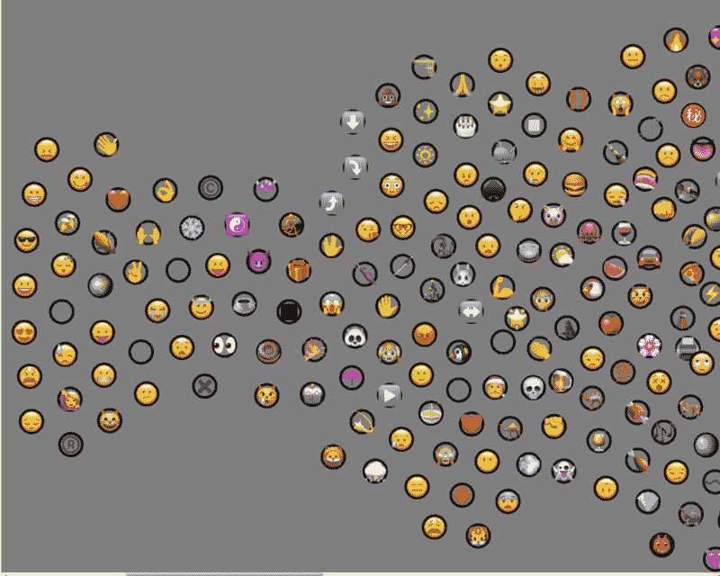
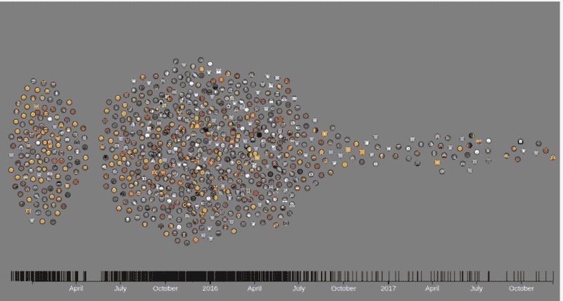
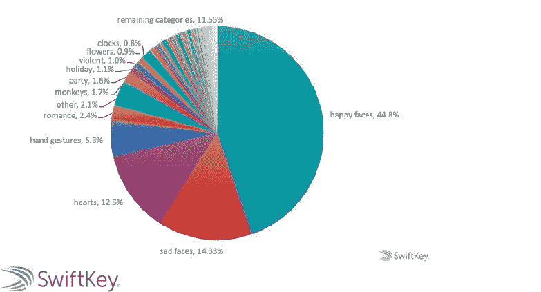
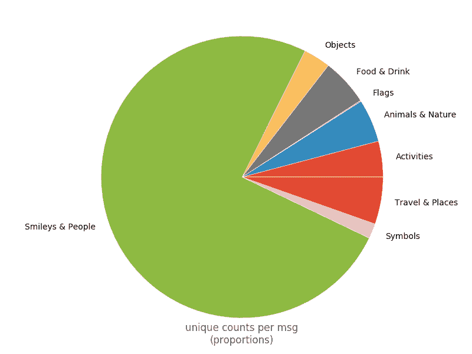
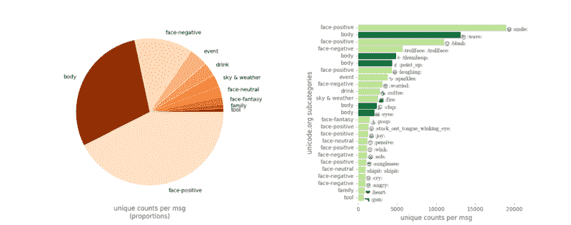
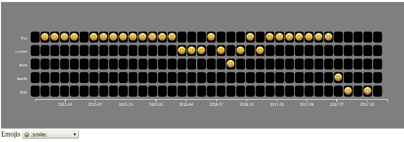
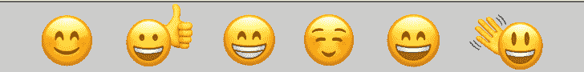

# 根据我对 3.5GB 聊天日志的分析，表情符号开发者使用最多

> 原文：<https://www.freecodecamp.org/news/and-the-most-popular-developer-emoji-is-d660a9687be7/>

埃瓦里斯托·卡拉巴略

# 根据我对 3.5GB 聊天日志的分析，表情符号开发者使用最多

表情符号彻底改变了我们在社交媒体上的交流方式。

许多研究表明，人们在不同的社交媒体平台上使用表情符号的方式存在差异。例如， [Instagram](https://blog.hubspot.com/marketing/instagram-emojis-infographic) 、 [Twitter](http://emojitracker.com/) 或[脸书](http://metro.co.uk/2017/07/17/facebook-reveals-which-emojis-are-sent-the-most-for-world-emoji-day-6785309/)中的热门表情列表有一些相似之处，但也有非常独特的模式。当在列表中向下移动时，这些差异变得更大。

社交平台动态可能会影响表情符号的使用，这让我很好奇人们可能会在社交平台中如何使用表情符号来学习编码。

在这篇文章中，我研究了新开发者如何使用表情符号，特别是在 freeCodeCamp 的 Gitter 主聊天室中。

Gitter 中至少有两种渲染表情符号的方式:

*   使用*化名*(就像现存的[网上小抄](https://gist.github.com/rxaviers/7360908)所列的那些)。
*   使用 *UTF-8 表格*，或者直接从你的关键词中写出表情符号，或者从在线资源中复制/粘贴角色。

两者在消息中的渲染方式不同，前者渲染现有的 Gitter 图像，后者根据您的机器设置进行渲染。第一种方法“使用别名”是最流行的，也是本次讨论的主题。

为了让您快速了解我在寻找什么，我想快速探索以下问题的答案:

*   表情符号的使用是否有鲜明的模式？
*   那么最流行的表情符号是什么？
*   有多少人使用表情符号？
*   用户对表情符号词汇的精通程度如何？

所以让我们开始回答这些问题。

### 让我们来点表情符号对话

在进行我的分析后，我发现约 23%的参与聊天者也是表情符号用户。我将**参与聊天者**定义为发送了至少 10 条消息的人。相反，如果我们将参与和不参与表情符号用户与所有参与聊天者进行比较，这个数字会上升到 45%。

与其他平台相比，表情符号用户的数量可能听起来很少。然而，值得注意的是:

*   聊天室的许多用户都是短命的
*   有些用户更喜欢保守的交流方式
*   一些用户可能不知道表情符号别名

总的来说，我们的表情符号用户提供了至少 753，000 个表情符号(如果每条信息只计算一次，则为 600，000 个)，平均每 100 条信息有 32 个表情符号。

Depiction of a beeswarm chart with the approx date emoji were seen for the first time in the main chatroom. There were about 800 records with full data. (D3.js v4, my bl.ock).

总之，我们的表情符号用户显示了大约 800 个别名的集体素养，大约是正在使用的表情符号的[全部列表的 25%。](https://unicode.org/emoji/charts-11.0/full-emoji-list.html)[我勾画了一个蜂群形象](https://bl.ocks.org/evaristoc/d5531fb65c599370f777370e44f14242)？在 D3.js 上显示，他们中的许多人是在 2015 年 7 月至 2016 年 7 月期间首次在聊天室中引入的，增长率为每周 10 - 20 个新表情符号。

然而，当以个人为单位时，我们的表情符号用户平均掌握了大约 3 个不同表情符号的词汇。这种差异是因为很少有用户支持使用表情符号，一个特定的表情符号大师展示了大约 500 种不同的表情符号。？

### 聊天室里的“非典型”表情符号？

为了更好地了解人们在聊天室里是如何表情化的，我将我的发现与 SwiftKey 在 2015 年发布的一份报告进行了比较。自报告发布以来，表情符号列表有了实质性的更新，但它似乎是目前仍在使用的[最好的免费参考。但是不可能找到 SwiftKey 使用的表情符号分类。我使用了 unicode.org](http://edition.cnn.com/2017/01/18/health/emoji-use-personality-traits-study/index.html)[给出的类别和子类别作为近似值:](http://unicode.org/emoji/charts/emoji-list.html)

Emoji SwiftKey's categories as a percentage of all emoji use (source: SwiftKey 2015 Report)

我首先在类别层面评估了表情符号的使用，结果与 SwiftKey 报告中的结果非常相似。发布在 freeCodeCamp 聊天室的大部分表情符号都属于“表情符号&人”类别，包括面部、手势、人物角色、身体部位和心脏。

Emoji freeCodeCamp’s categories as proportions of count per message. Emoji users ❤️ "Smileys & People".

因为基于高层次分类的比较通常过于肤浅，所以我尝试了另一种比较，专注于 2015 年至 2017 年使用最多的 25 个表情符号，而是使用它们的**子类别**。这 25 个表情符号总共占了那段时间发布的所有表情符号的 15%左右。

表情符号和子类别的列表表明，我们的表情符号用户可能仍然符合表情符号用户的典型模式。聊天室中大量使用“正面面孔”子类别中的图标，与 SwiftKey 报告中使用的“快乐面孔”相吻合。

“消极面孔”子类别也是如此，很像 SwiftKey 报告中的“悲伤面孔”。稍有不同的是“:trollface:”的使用，这是 GitHub 中的一个图标，通常与垃圾短信和破坏活动有关，但也在 freeCodeCamp 聊天室中用作玩笑，可能与？(":便便:"或":hankey:")，也列入了有史以来的 25 大热门。

Two charts about the 25 most used emoji ever in the chatroom from 2015 to 2017, and their subcategories. Notice the extensive use of emoji hand gestures like ? (“:wave:”), ? (“:thumbsup:”), ☝️ (“:point_up:”), or ? (“:clap:”), but no kisses.

然而，这是在积极的手势和一般的“身体”图标的广泛使用，这个聊天室可能区别于其他基准。

freeCodeCamp 聊天室中使用最多的手势图标是积极的，与欢迎、支持、确认和对成功的认可有关，这是 freeCodeCamp 社区中常见的价值观。

另一个区别是较少使用像♥️“心”或？“kisses”，暗示“s *分享感情”*不是这个聊天室的主要目标。随着 T2 的性别人口统计显示大约 70-80%是男性，这可能会更加困难。这种人口统计也可以解释一些与男性相关的图标，比如？(":枪:")。

尽管我们可以发现一些与一般模式的偏差，但现在下定论还为时过早。事实上，最重要的偏差可能在于人们如何使用不太受欢迎的表情符号。

此外，最重要的区别可能不在于数字，而在于*的含义*或者群体如何根据上下文解释图标。我所指的一个很好的例子是[纳粹十字](https://en.wikipedia.org/wiki/Swastika)。表情符号的一个众所周知的例子是[茄子](https://emojipedia.org/aubergine/)。我想知道从我们的前 25 名名单中。(":fire:")对这个群体来说没有特别的意义，作为一种表达" c *对任务的承诺"*。无论如何，对于那些对社交媒体交流和表情符号感兴趣的人来说，这更是一个话题，就像我在这篇文章中提到的一样。

### 获胜者是…

作为奖励，我画了一个 D3.js 可视化的月度前 5 名表情符号。成为有史以来数量最多的表情符号名单的一部分并不意味着这个表情符号曾经进入过月度前五名，反之亦然。就像[环法自行车赛](http://www.letour.fr/en/)一样，一名车手可能在整个比赛中一直处于第六的位置，但从未赢得一天，然后被列入最有价值的比赛。类似地，一个骑手可以赢得一天，然后在剩下的时间里保持最后一名。这就是为什么这个列表看起来有点不同。

所以月度前 5 名的得主是…

Apple/iOS Picture of “Smiling Face with Open Mouth and Smiling Eyes”, its real CLRDname, or simply ? (source: h[ttp://www.iemoji.com)](http://www.iemoji.com)

Depiction of the visualization I made showing ? winning the first place several times month after month between 01–2015 and 11–2017\. No doubt about its popularity (D3.js v4, my bl.ock).

坦白说，我没想到？(":微笑:")成为最受欢迎的表情符号。我以为是？(":joy:")，鉴于苹果最近透露它是 2017 年最受欢迎的。

以下 8 个表情符号也出现在 freeCodeCamp 休闲聊天室。关于微笑:)。你认为你是一个表情符号迷吗？猜猜他们的化名！(观察:名称/关键字可能因平台而异……)

Apple/iOS emoji pictures

我使用 Python 和 [Gitter API](https://developer.gitter.im/docs/welcome) 从 freeCodeCamp 主聊天室获取消息。像[多重处理](https://docs.python.org/3.5/library/multiprocessing.html)和[表情符号](https://github.com/carpedm20/emoji/)这样的 Python 库被用来转换数据。部分转换还需要在线可用的数据，为此我还使用 Python 库定制了抓取器(requests， [urllib](https://docs.python.org/3/library/urllib.html) ， [BeautifulSoup4](https://www.crummy.com/software/BeautifulSoup/bs4/doc/) )。为了分析数据，我使用了普通的 Python 和一些熊猫。探索性可视化使用 [matplotlib](https://matplotlib.org/) 制作，而交互式可视化使用 [D3.js](https://d3js.org/) 制作。

代码版本将会在我的 [GitHub 库](https://github.com/evaristoc/fCC_emojis)上提供，还有一些最终的数据集。关于这个项目使用的原始数据集，它们现在可以在 freeCodeCamp 的 [Kaggle 账户](https://www.kaggle.com/free-code-camp)上获得。

这个项目的动机符合 freeCodeCamp 的[开放数据倡议](https://github.com/freeCodeCamp/open-data)的使命。非常感谢 freeCodeCamp 数据科学室的人们，特别感谢 [mstellaluna](https://github.com/mstellaluna) 的评论！

记住，如果你觉得这篇文章中的信息有用或者你只是喜欢它的内容，别忘了留下一些掌声？？在你离开之前！谢谢，祝编码愉快！？