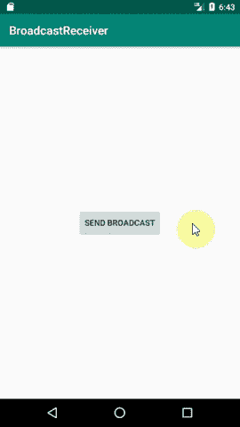

# 面向初学者的 Android 广播接收器

> 原文：<https://www.freecodecamp.org/news/android-broadcast-receivers-for-beginners/>

假设您有一个依赖于稳定互联网连接的应用程序。您希望您的应用程序在互联网连接改变时得到通知。你是怎么做到的？

一种可能的解决方案是提供一种总是检查互联网连接的服务。由于各种原因，这种实现是不好的，所以我们甚至不会考虑它。这个问题的解决方案是一个广播接收器，它会监听你告诉它的变化。

不管应用程序的状态如何，广播接收器总是会收到广播通知。无论您的应用程序当前是否正在后台运行，或者根本没有运行，都没有关系。

## 背景

广播接收器是 Android 应用程序中的组件，用于监听来自不同渠道的广播消息(或事件):

*   从其他应用程序
*   从系统本身
*   从你的申请

也就是说，当它们被编程收听的某个动作发生时，它们被调用(即，广播)。

广播只是包装在意图对象中的一条消息。广播可以是隐式的或显式的。

*   一个 ******隐式广播****** 是一个不特别针对你的应用的广播，所以它不是你的应用的专用广播。要注册一个，您需要使用一个 [IntentFilter](https://developer.android.com/reference/android/content/IntentFilter) 并在您的清单中声明它。您需要做所有这些，因为 Android 操作系统会检查清单中所有声明的意图过滤器，并查看是否有匹配。由于这种行为，隐式广播没有目标属性。隐式广播的一个例子是输入 SMS 消息的动作。
*   一个 ******显式广播****** 是一个专门针对你的应用的一个事先已知的组件。发生这种情况是因为目标属性包含应用程序的包名或组件类名。

有两种方法可以声明接收器:

1.  通过在 AndroidManifest.xml 文件中用<receiver>标签声明一个(也称为静态)</receiver>

```
<receiver android:name=".YourBrodcastReceiverClass"  android:exported="true">
    <intent-filter>
        <!-- The actions you wish to listen to, below is an example -->
        <action android:name="android.intent.action.BOOT_COMPLETED"/>
    </intent-filter>
</receiver>
```

manifest.xml

你会注意到上面声明的广播接收器有一个属性******exported = " true "******。这个属性告诉接收器它可以接收来自应用程序范围之外的广播。

2.或者通过向 registerReceiver 注册一个实例来动态地实现(称为上下文注册)

## 如何在 Android 中实现广播接收器

若要创建自己的广播接收器，必须首先扩展 broadcast receiver 父类，并重写强制方法 onReceive:

```
 public void onReceive(Context context, Intent intent) {
    //Implement your logic here
 }
```

将所有这些放在一起会产生:

```
public class MyBroadcastReceiver extends BroadcastReceiver {

    @Override
    public void onReceive(Context context, Intent intent) {
        StringBuilder sb = new StringBuilder();
        sb.append("Action: " + intent.getAction() + "\n");
        sb.append("URI: " + intent.toUri(Intent.URI_INTENT_SCHEME).toString() + "\n");
        String log = sb.toString();
        Toast.makeText(context, log, Toast.LENGTH_LONG).show();

    }
}
```

onreceive 方法运行在主线程上，正因为如此，它的执行应该是简短的。

如果执行一个长进程，系统可能会在方法返回后终止该进程。为了避免这种情况，可以考虑使用 [goAsync](https://developer.android.com/reference/android/content/BroadcastReceiver.html#goAsync()) 或者调度一个作业。你可以在这篇文章的底部阅读更多关于安排工作的信息。

## 动态注册示例

要用上下文注册接收器，首先需要实例化广播接收器的一个实例:

```
BroadcastReceiver myBroadcastReceiver = new MyBroadcastReceiver(); 
```

然后，您可以根据您希望的特定上下文来注册它:

```
IntentFilter filter = new IntentFilter(ConnectivityManager.CONNECTIVITY_ACTION);
filter.addAction(Intent.ACTION_AIRPLANE_MODE_CHANGED);
this.registerReceiver(myBroadcastReceiver, filter); 
```

当您不再需要广播接收机时，不要忘记注销它:

```
@Override
protected void onStop() {
  super.onStop();
  unregisterReceiver(myBroadcastReceiver);
}
```

## 如何在 Android 中广播事件

从应用程序中广播消息的目的是让应用程序能够响应内部发生的事件。

想象这样一个场景，在代码的某个部分，用户执行了某个动作，因此，你想在不同的地方执行一些其他的逻辑。

发送广播有三种方式:

1.  [******sendOrderedBroadcast******](https://developer.android.com/reference/android/content/Context.html#sendOrderedBroadcast(android.content.Intent,%20java.lang.String))*方法，确保一次只向一个接收机发送广播。每个广播可以依次将数据传递给下一个广播，或者停止将广播传播给后面的接收器*
2.  *[******send broadcast******](https://developer.android.com/reference/android/content/Context.html#sendBroadcast(android.content.Intent))和上面说的方法差不多，有一点不同。所有广播接收机都接收消息，并且彼此不依赖*
3.  *[******localbroadcastmanager . send broadcast******](https://developer.android.com/reference/android/support/v4/content/LocalBroadcastManager.html#sendBroadcast(android.content.Intent))方法只向应用程序内部定义的接收者发送广播，不超出应用程序的范围。*

**

## *陷阱和注意事项*

*   *不要通过隐式广播发送敏感数据，因为任何侦听它的应用程序都会收到它。您可以通过指定一个包或将权限附加到广播来防止这种情况*
*   *不要从收到的广播开始活动，因为用户体验不足。选择显示通知。*

*以下要点涉及与每个 Android 操作系统版本(从 7.0 开始)相关的广播接收器的变化。对于每一个版本，都有一定的限制，行为也发生了变化。考虑使用广播接收机时，请记住这些限制。*

*   *******7.0 及以上(API 等级 24)****** -两个系统广播已被禁用， [Action_New_Picture](https://developer.android.com/reference/android/hardware/Camera.html#ACTION_NEW_PICTURE) 和 [Action_New_Video](https://developer.android.com/reference/android/hardware/Camera.html#ACTION_NEW_VIDEO) (但在 Android O 中为注册接收者恢复)*
*   *******8.0 及以上版本(API 等级 26)******——大多数隐式广播需要动态注册，而不是静态注册(在您的清单中)。您可以在这个[链接](https://developer.android.com/guide/components/broadcast-exceptions)中找到白名单中的广播。*
*   *******9.0 及以上(API 等级 28)****** -在 Wi-Fi 系统广播上收到的信息少[Network _ State _ Changed _ Action](https://developer.android.com/reference/android/net/wifi/WifiManager.html#NETWORK_STATE_CHANGED_ACTION)。*

*Android O 的变化是你最需要注意的。做出这些改变的原因是因为它会导致性能问题、电池耗尽和伤害用户体验。发生这种情况是因为许多应用程序(甚至那些当前没有运行的应用程序)正在监听系统范围内的变化，当这种变化发生时，混乱随之而来。想象一下，每一个注册到这个动作的应用程序，都来检查它是否因为广播而需要做一些事情。考虑到像 Wi-Fi 状态这样经常变化的东西，你就会开始明白为什么会发生这些变化。*

## *广播接收机的替代品*

*为了更容易地处理所有这些限制，下面列出了在没有广播接收机的情况下可以使用的其他组件。每一个都有不同的职责和用例，所以试着找出哪一个能满足你的需求。*

*   *******LocalBroadcastManager******——正如我上面提到的，这只对应用程序内的广播有效*
*   *******调度作业****** -作业可以根据收到的信号或触发来运行，因此您可能会发现您正在收听的广播可以被作业所取代。此外，*[job scheduler](https://developer.android.com/reference/android/app/job/JobScheduler.html)将保证您的作业将会完成，但是它将考虑各种系统因素(时间和条件)来确定它应该何时运行。在创建作业时，您将覆盖一个名为******onStartJob******的方法。这个方法在主线程上运行，所以要确保它在有限的时间内完成工作。如果需要执行复杂的逻辑，可以考虑启动一个后台任务。此外，该方法的返回值是一个布尔值，其中 true 表示某些操作仍在执行，false 表示工作已经完成**

*如果你想亲身体验作为广播接收器的快乐和惊奇，你可以跟随这些链接到我建立的知识库:*

1.  *[自定义广播](https://github.com/TomerPacific/MediumArticles/tree/master/BroadcastReceivers/CustomBroadcast)(带清单声明)*
2.  *[注册广播](https://github.com/TomerPacific/MediumArticles/tree/master/BroadcastReceivers/RegisteringBroadcast)(未在清单中声明)*
3.  *[LocalBroadcastManager](https://github.com/TomerPacific/MediumArticles/tree/master/BroadcastReceivers/LocalBroadcastManager)*

*广播完毕。*