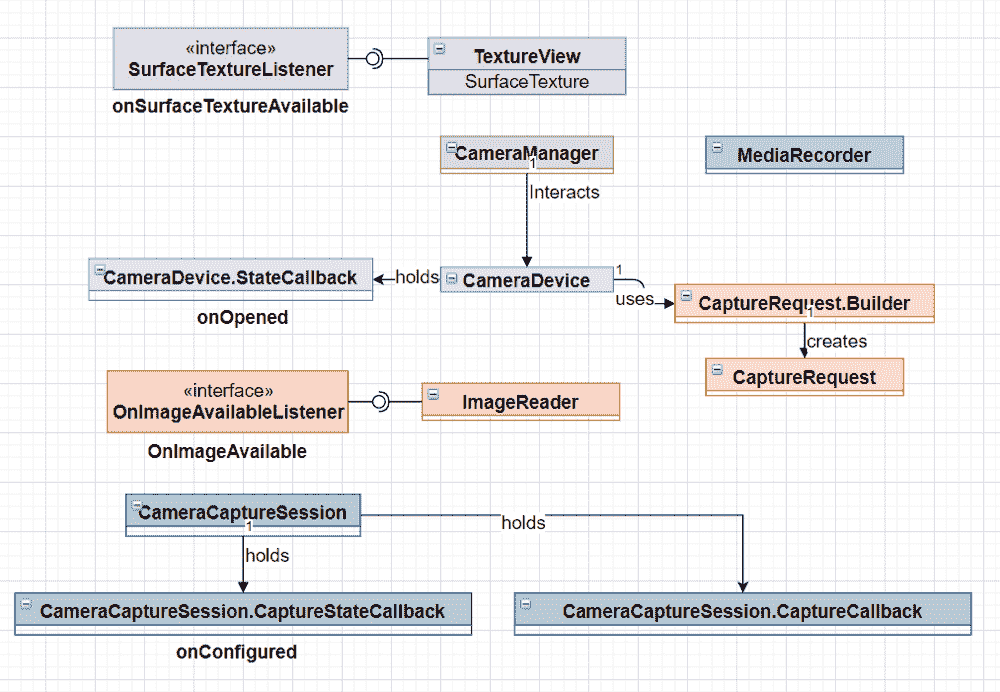
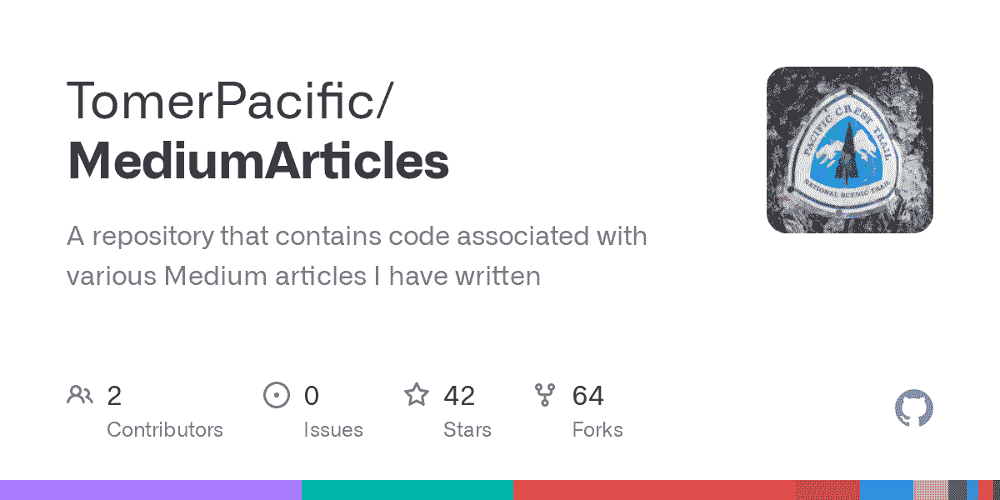

# Android camera 2–如何使用 Camera2 API 拍摄照片和视频

> 原文：<https://www.freecodecamp.org/news/android-camera2-api-take-photos-and-videos/>

我们都在手机上使用相机，我们把它作为一种功能来使用。甚至有一些应用程序已经集成了相机。

在一端，有一个与相机互动的标准方式。另一方面，有一种方法可以定制您与相机的交互。这种区分非常重要。这就是 Camera2 的用武之地。

## 什么是 Camera2？

虽然它从 API level 21 开始就已经可用，但 Camera2 API 已经成为开发人员必须处理的更复杂的架构之一。

这个 API 和它的前身已经就位，所以开发者可以在他们的应用程序中利用与相机交互的能力。

类似于与麦克风或设备音量进行交互的方式，Camera2 API 为您提供了与设备摄像头进行交互的工具。

一般来说，如果你想使用 Camera2 API，它可能不仅仅是为了拍照或录像。这是因为 API 允许您通过公开每个特定设备需要配置的各种类来深入控制摄像机。

即使你以前和相机打过交道，这和以前的相机 API 相比也是一个巨大的变化，你可能会忘记你所知道的一切。

有大量的资源试图展示如何直接使用这个 API，但是其中一些可能已经过时了，还有一些并没有展示出全貌。

因此，本文将(希望)成为您与 Camera2 API 交互的一站式商店，而不是试图自己填补缺失的部分。

## 摄像机 2 使用案例

在我们深入研究任何东西之前，重要的是要理解，如果您只想使用相机拍照或录制视频，您不需要为 Camera2 API 费心。

使用 Camera2 API 的主要原因是您的应用程序需要与相机或其功能进行一些自定义交互。

如果您对前者而不是后者感兴趣，我建议您访问 Google 的以下文档:

1.  [拍照](https://developer.android.com/training/camera/photobasics)
2.  [拍摄视频](https://developer.android.com/training/camera/videobasics)

在这里，您可以找到用相机拍摄精彩照片和视频所需的所有必要步骤。但是在这篇文章中，主要的焦点是如何使用照相机 2。

现在，我们需要向清单文件中添加一些内容:

摄像机权限:

```
<uses-permission android:name="android.permission.CAMERA" />
```

相机功能:

```
<uses-feature android:name="android.hardware.camera" />
```

您将不得不处理检查相机许可是否已经被授予，但是由于这个主题已经被广泛地涉及，我们将不在本文中处理它。

## 如何设置 Camera2 API 组件

Camera2 API 引入了几个新的接口和类。让我们将它们逐一分解，以便更好地理解如何使用它们。



Look at all those components

首先，我们将从[纹理视图](https://developer.android.com/reference/android/view/TextureView)开始。

### Camera2 TextureView 组件

TextureView 是一个用来显示内容流(比如视频)的 UI 组件。我们需要使用 TextureView 来显示来自相机的反馈，无论是预览还是在拍摄图片/视频之前。

关于 TextureView，两个重要的属性是:

*   表面纹理场
*   SurfaceTextureListener 接口

第一个是显示内容的位置，第二个有四个回调:

1.  [onsurfaceetextureavailable](https://developer.android.com/reference/android/view/TextureView.SurfaceTextureListener#onSurfaceTextureAvailable%28android.graphics.SurfaceTexture,%20int,%20int%29)
2.  [onSurfaceTextureSizeChanged](https://developer.android.com/reference/android/view/TextureView.SurfaceTextureListener#onSurfaceTextureSizeChanged%28android.graphics.SurfaceTexture,%20int,%20int%29)
3.  [onsurfaceetextureupdated](https://developer.android.com/reference/android/view/TextureView.SurfaceTextureListener#onSurfaceTextureUpdated%28android.graphics.SurfaceTexture%29)
4.  [onsurfaceetexturedestroyed](https://developer.android.com/reference/android/view/TextureView.SurfaceTextureListener#onSurfaceTextureDestroyed%28android.graphics.SurfaceTexture%29)

```
private val surfaceTextureListener = object : TextureView.SurfaceTextureListener {
        override fun onSurfaceTextureAvailable(texture: SurfaceTexture, width: Int, height: Int) {

        }
        override fun onSurfaceTextureSizeChanged(texture: SurfaceTexture, width: Int, height: Int) {

        }

        override fun onSurfaceTextureDestroyed(texture: SurfaceTexture) {

        }
        override fun onSurfaceTextureUpdated(texture: SurfaceTexture) {

        }
}
```

使用相机时，第一次回调至关重要。这是因为我们希望在 SurfaceTexture 可用时得到通知，这样我们就可以开始在它上面显示提要。

请注意，只有将 TextureView 附加到窗口后，它才可用。

自之前的 API 以来，与相机的交互已经发生了变化。现在，我们有了[摄影师](https://developer.android.com/reference/android/hardware/camera2/CameraManager)。这是一个系统服务，允许我们与 [CameraDevice](https://developer.android.com/reference/android/hardware/camera2/CameraDevice) 对象进行交互。

您需要密切关注的方法有:

*   [打开相机](https://developer.android.com/reference/android/hardware/camera2/CameraManager#openCamera%28java.lang.String,%20android.hardware.camera2.CameraDevice.StateCallback,%20android.os.Handler%29)
*   [getCameraCharacteristics](https://developer.android.com/reference/android/hardware/camera2/CameraManager#getCameraCharacteristics%28java.lang.String%29)
*   [getCameraIdList](https://developer.android.com/reference/android/hardware/camera2/CameraManager#getCameraIdList%28%29)

在我们知道 TextureView 可用并准备好之后，我们需要调用 openCamera 来打开到摄像机的连接。该方法接受三个参数:

1.  摄像线
2.  摄像设备。状态回调
3.  一名训练员

CameraId 参数表示我们想要连接到哪个摄像机。在你的手机上，主要有两个摄像头，正面和背面。每个都有自己唯一的 id。通常，它不是 0 就是 1。

我们怎么得到摄像头的 id？我们使用 CameraManager 的 getCamerasIdList 方法。它将返回一个字符串类型的数组，该数组包含从设备中识别出的所有摄像机 id。

```
val cameraManager: CameraManager = getSystemService(Context.CAMERA_SERVICE) as CameraManager
val cameraIds: Array<String> = cameraManager.cameraIdList
var cameraId: String = ""
for (id in cameraIds) {
    val cameraCharacteristics = cameraManager.getCameraCharacteristics(id)
    //If we want to choose the rear facing camera instead of the front facing one
    if (cameraCharacteristics.get(CameraCharacteristics.LENS_FACING) == CameraCharacteristics.LENS_FACING_FRONT) 
      continue
    }

    val previewSize = cameraCharacteristics.get(CameraCharacteristics.SCALER_STREAM_CONFIGURATION_MAP)!!.getOutputSizes(ImageFormat.JPEG).maxByOrNull { it.height * it.width }!!
    val imageReader = ImageReader.newInstance(previewSize.width, previewSize.height, ImageFormat.JPEG, 1)
    imageReader.setOnImageAvailableListener(onImageAvailableListener, backgroundHandler)
    cameraId = id
}
```

接下来的参数是在我们试图打开它之后对相机状态的回调。如果你想一想，这个行动只会有几种结果:

*   相机成功打开
*   摄像头断开
*   出现了一些错误

这就是你会在相机里发现的。状态回调:

```
 private val cameraStateCallback = object : CameraDevice.StateCallback() {
        override fun onOpened(camera: CameraDevice) {

        }

        override fun onDisconnected(cameraDevice: CameraDevice) {

        }

        override fun onError(cameraDevice: CameraDevice, error: Int) {
            val errorMsg = when(error) {
                ERROR_CAMERA_DEVICE -> "Fatal (device)"
                ERROR_CAMERA_DISABLED -> "Device policy"
                ERROR_CAMERA_IN_USE -> "Camera in use"
                ERROR_CAMERA_SERVICE -> "Fatal (service)"
                ERROR_MAX_CAMERAS_IN_USE -> "Maximum cameras in use"
                else -> "Unknown"
            }
            Log.e(TAG, "Error when trying to connect camera $errorMsg")
        }
    }
```

第三个论点涉及这项工作将在哪里进行。既然不想占用主线程，不如在后台做这个工作。

这就是为什么我们需要传递一个句柄给它。明智的做法是用我们选择的线程实例化这个处理程序实例，这样我们就可以将工作委托给它。

```
private lateinit var backgroundHandlerThread: HandlerThread
private lateinit var backgroundHandler: Handler

 private fun startBackgroundThread() {
    backgroundHandlerThread = HandlerThread("CameraVideoThread")
    backgroundHandlerThread.start()
    backgroundHandler = Handler(
        backgroundHandlerThread.looper)
}

private fun stopBackgroundThread() {
    backgroundHandlerThread.quitSafely()
    backgroundHandlerThread.join()
}
```

有了我们所做的一切，我们现在可以调用 openCamera:

```
cameraManager.openCamera(cameraId, cameraStateCallback,backgroundHandler)
```

然后在 **onOpened** 回调中，我们可以开始处理如何通过 TextureView 向用户呈现相机馈送的逻辑。


Photo by [Markus Spiske](https://unsplash.com/@markusspiske?utm_source=medium&utm_medium=referral) on [Unsplash](https://unsplash.com?utm_source=medium&utm_medium=referral)

### 如何显示订阅源的预览

我们用相机(cameraDevice)和 TextureView 来显示提要。但是我们需要将它们相互连接起来，这样我们才能显示提要的预览。

为此，我们将使用 TextureView 的 SurfaceTexture 属性，并构建一个 CaptureRequest。

```
val surfaceTexture : SurfaceTexture? = textureView.surfaceTexture // 1

val cameraCharacteristics = cameraManager.getCameraCharacteristics(cameraId) //2
val previewSize = cameraCharacteristics.get(CameraCharacteristics.SCALER_STREAM_CONFIGURATION_MAP)!!
  .getOutputSizes(ImageFormat.JPEG).maxByOrNull { it.height * it.width }!!

surfaceTexture?.setDefaultBufferSize(previewSize.width, previewSize.height) //3

val previewSurface: Surface = Surface(surfaceTexture)

captureRequestBuilder = cameraDevice.createCaptureRequest(CameraDevice.TEMPLATE_PREVIEW) //4
captureRequestBuilder.addTarget(previewSurface) //5

cameraDevice.createCaptureSession(listOf(previewSurface, imageReader.surface), captureStateCallback, null) //6
```

Creating the preview

在上面的代码中，首先我们从 TextureView 中获取表面纹理。然后我们使用 cameraCharacteristics 对象获取所有输出大小的列表。为了得到想要的尺寸，我们将它设置为表面纹理。

接下来，我们创建一个 captureRequest，并传入 **TEMPLATE_PREVIEW** 。我们将输入表面添加到 captureRequest 中。

最后，我们用输入和输出表面 captureStateCallback 启动一个 captureSession，并为处理程序传入 null

那么这个 captureStateCallback 是什么呢？如果您还记得本文开头的图表，它是我们正在开始的 CameraCaptureSession 的一部分。该对象通过以下回调来跟踪 captureRequest 的进度:

*   未配置
*   onConfigureFailed 失败

```
private val captureStateCallback = object : CameraCaptureSession.StateCallback() {
        override fun onConfigureFailed(session: CameraCaptureSession) {

        }
        override fun onConfigured(session: CameraCaptureSession) {

        }
}
```

当 **cameraCaptureSession** 配置成功时，我们为会话设置一个重复请求，以允许我们连续显示预览。

为此，我们使用在回调中获得的会话对象:

```
 session.setRepeatingRequest(captureRequestBuilder.build(), null, backgroundHandler)
```

您会发现我们之前创建的 captureRequestBuilder 对象是这个方法的第一个参数。我们制定了 build 方法，因此传入的最后一个参数是 CaptureRequest。

第二个参数是一个 cameracapturesession . capturecallback 侦听器，但是由于我们不想对捕获的图像做任何事情(因为这是一个预览)，所以我们传入 null。

第三个参数是一个处理程序，这里我们使用自己的 backgroundHandler。这也是为什么我们在上一节中传递 null，因为重复的请求将在后台线程上运行。


Photo by [Dicky Jiang](https://unsplash.com/@dicky_juwono?utm_source=medium&utm_medium=referral) on [Unsplash](https://unsplash.com?utm_source=medium&utm_medium=referral)

## 如何拍照

有一个相机的现场预览是可怕的，但大多数用户可能会想用它做些什么。我们将为拍照编写的一些逻辑将类似于我们在上一节中所做的。

1.  我们将创建一个捕获请求
2.  我们将使用一个 ImageReader 和它的监听器来收集拍摄的照片
3.  使用我们的 cameraCaptureSession，我们将调用捕获方法

```
val orientations : SparseIntArray = SparseIntArray(4).apply {
    append(Surface.ROTATION_0, 0)
    append(Surface.ROTATION_90, 90)
    append(Surface.ROTATION_180, 180)
    append(Surface.ROTATION_270, 270)
}

val captureRequestBuilder = cameraDevice.createCaptureRequest(CameraDevice.TEMPLATE_STILL_CAPTURE)
captureRequestBuilder.addTarget(imageReader.surface)

val rotation = windowManager.defaultDisplay.rotation
captureRequestBuilder.set(CaptureRequest.JPEG_ORIENTATION, orientations.get(rotation))
cameraCaptureSession.capture(captureRequestBuilder.build(), captureCallback, null)
```

This time we are creating a capture request with TEMPLATE_STILL_CAPTURE

但是这个 [ImageReader](https://developer.android.com/reference/android/media/ImageReader) 是什么？ImageReader 提供了对渲染到表面上的图像数据的访问。在我们的例子中，它是 TextureView 的表面。

如果您查看上一节的代码片段，您会注意到我们已经在那里定义了一个 ImageReader。

```
val cameraManager: CameraManager = getSystemService(Context.CAMERA_SERVICE) as CameraManager
val cameraIds: Array<String> = cameraManager.cameraIdList
var cameraId: String = ""
for (id in cameraIds) {
    val cameraCharacteristics = cameraManager.getCameraCharacteristics(id)
    //If we want to choose the rear facing camera instead of the front facing one
    if (cameraCharacteristics.get(CameraCharacteristics.LENS_FACING) == CameraCharacteristics.LENS_FACING_FRONT) 
      continue
    }

    val previewSize = cameraCharacteristics.get(CameraCharacteristics.SCALER_STREAM_CONFIGURATION_MAP)!!.getOutputSizes(ImageFormat.JPEG).maxByOrNull { it.height * it.width }!!
    val imageReader = ImageReader.newInstance(previewSize.width, previewSize.height, ImageFormat.JPEG, 1)
    imageReader.setOnImageAvailableListener(onImageAvailableListener, backgroundHandler)
    cameraId = id
}
```

Notice lines 12 – 14

正如您在上面看到的，我们通过传入宽度和高度、我们希望图像采用的图像格式以及它可以捕获的图像数量来实例化 ImageReader。

ImageReader 类的一个属性是一个名为 onImageAvailableListener 的侦听器。一旦拍摄了照片，这个侦听器就会被触发(因为我们将它的表面作为捕获请求的输出源传入)。

```
val onImageAvailableListener = object: ImageReader.OnImageAvailableListener{
        override fun onImageAvailable(reader: ImageReader) {
            val image: Image = reader.acquireLatestImage()
        }
    }
```

⚠️ **处理完图像后一定要关闭它，否则你将无法再拍摄另一张照片。**


Photo by [Jakob Owens](https://unsplash.com/@jakobowens1?utm_source=medium&utm_medium=referral) on [Unsplash](https://unsplash.com?utm_source=medium&utm_medium=referral)

## 如何录制视频

为了录制视频，我们需要与一个名为 [MediaRecorder](https://developer.android.com/reference/android/media/MediaRecorder) 的新对象进行交互。媒体记录器对象负责记录音频和视频，我们将使用它来完成这一任务。

在我们做任何事情之前，我们需要设置媒体记录器。有各种各样的配置需要处理，它们必须按正确的顺序排列，否则将抛出异常。

以下是允许我们捕捉视频(无音频)的配置选择示例。

```
fun setupMediaRecorder(width: Int, height: Int) {
  val mediaRecorder: MediaRecorder = MediaRecorder()
  mediaRecorder.setVideoSource(MediaRecorder.VideoSource.SURFACE)
  mediaRecorder.setOutputFormat(MediaRecorder.OutputFormat.MPEG_4)
  mediaRecorder.setVideoEncoder(MediaRecorder.VideoEncoder.H264)
  mediaRecorder.setVideoSize(videoSize.width, videoSize.height)
  mediaRecorder.setVideoFrameRate(30)
  mediaRecorder.setOutputFile(PATH_TO_FILE)
  mediaRecorder.setVideoEncodingBitRate(10_000_000)
  mediaRecorder.prepare()
}
```

The order of the setters is important

请注意 **setOutputFile** 方法，因为它需要一个指向存储视频的文件的路径。在设置完所有这些配置后，我们需要调用 prepare。

注意，mediaRecorder 也有一个 start 方法，我们必须在调用它之前调用 prepare。

设置好 mediaRecoder 之后，我们需要创建一个捕获请求和一个捕获会话。

```
fun startRecording() {
        val surfaceTexture : SurfaceTexture? = textureView.surfaceTexture
        surfaceTexture?.setDefaultBufferSize(previewSize.width, previewSize.height)
        val previewSurface: Surface = Surface(surfaceTexture)
        val recordingSurface = mediaRecorder.surface
        captureRequestBuilder = cameraDevice.createCaptureRequest(CameraDevice.TEMPLATE_RECORD)
        captureRequestBuilder.addTarget(previewSurface)
        captureRequestBuilder.addTarget(recordingSurface)

        cameraDevice.createCaptureSession(listOf(previewSurface, recordingSurface), captureStateVideoCallback, backgroundHandler)
    }
```

类似于设置预览或拍照，我们必须定义输入和输出表面。

这里，我们从 TextureView 的 surfaceTexture 创建一个表面对象，并从媒体记录器获取表面。在创建捕获请求时，我们将传入 **TEMPLATE_RECORD** 值。

我们的 captureStateVideoCallback 与我们用于静态照片的类型相同，但是在 onConfigured 回调中，我们调用 media recorder 的 start 方法。

```
val captureStateVideoCallback = object : CameraCaptureSession.StateCallback() {
      override fun onConfigureFailed(session: CameraCaptureSession) {

      }

      override fun onConfigured(session: CameraCaptureSession) {
          session.setRepeatingRequest(captureRequestBuilder.build(), null, backgroundHandler)
          mediaRecorder.start()
      }
  }
```

Here we are also setting a repeating request since we want to capture a continuous video

现在我们正在录制视频，但是如何停止录制呢？为此，我们将对 mediaRecorder 对象使用 stop 和 reset 方法:

```
mediaRecorder.stop()
mediaRecorder.reset()
```

## 结论

有很多事情要处理。所以如果你成功了，恭喜你！没有别的办法——只有通过接触代码，你才能开始理解所有的东西是如何连接在一起的。

我们非常鼓励您查看下面这篇文章中的所有代码:

[MediumArticles/Camrea2API at master · TomerPacific/MediumArticlesA repository that contains code associated with various Medium articles I have written - MediumArticles/Camrea2API at master · TomerPacific/MediumArticlesTomerPacificGitHub](https://github.com/TomerPacific/MediumArticles/tree/master/Camrea2API)

请记住，这只是 Camera2 API 的冰山一角。你还可以做很多其他的事情，比如捕捉慢动作视频，在前后摄像头之间切换，控制焦距等等。