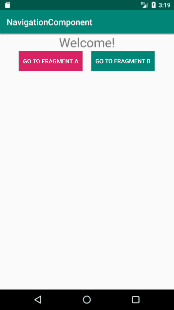
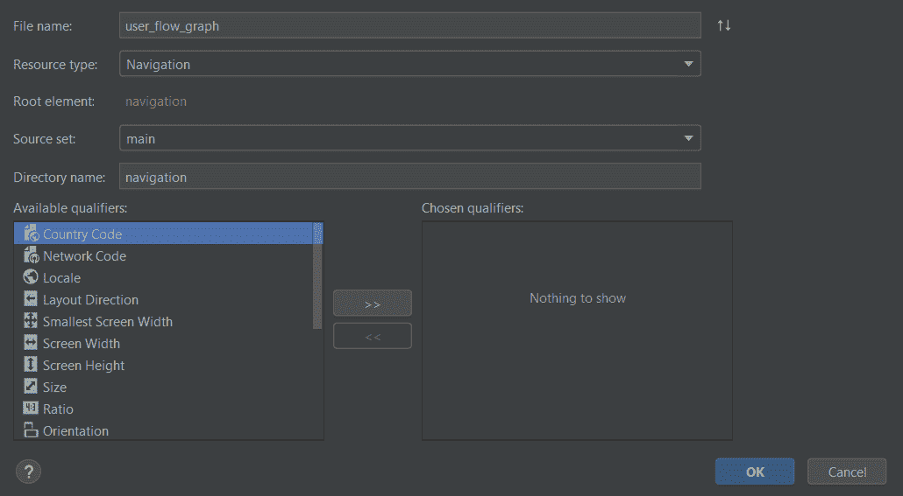
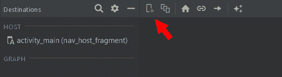
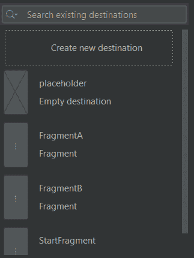
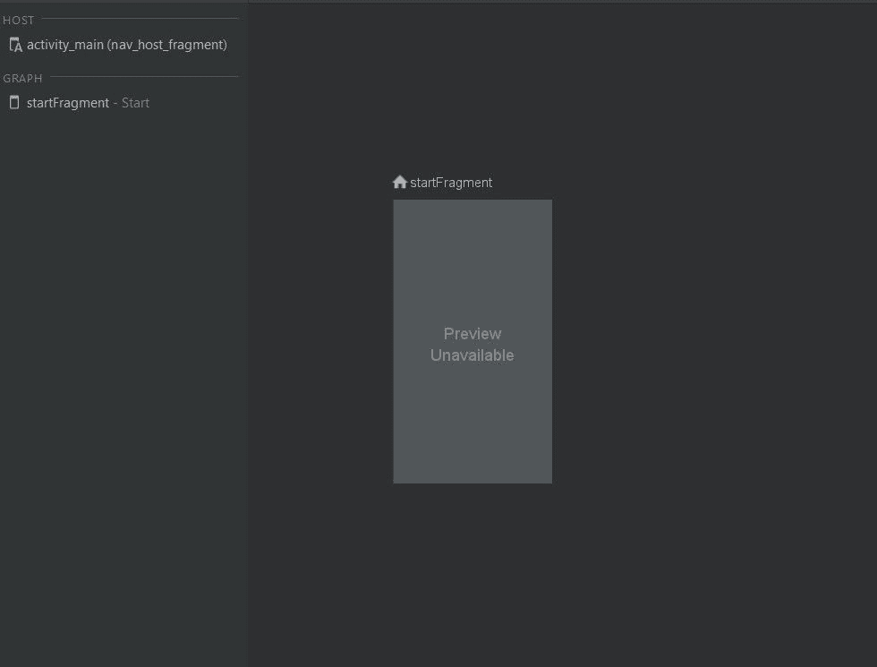
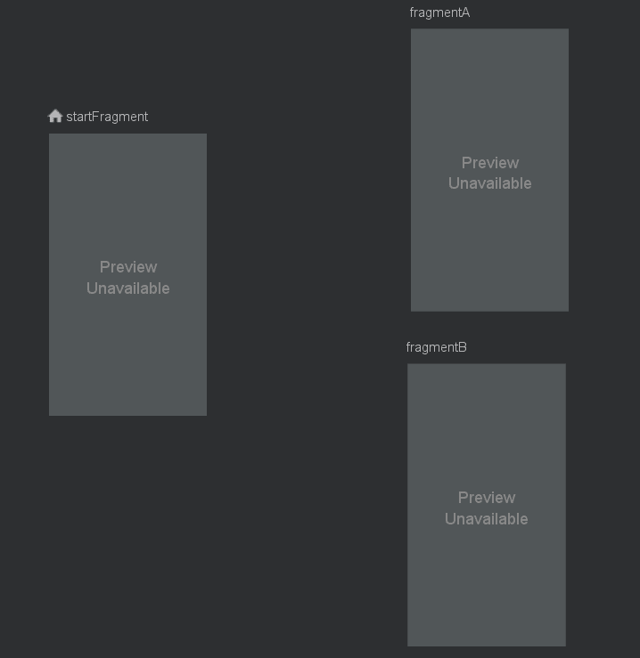
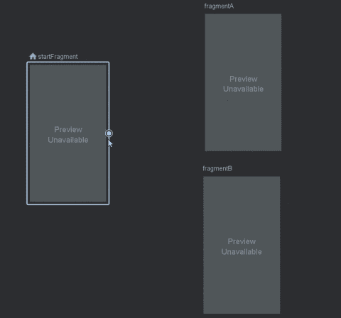
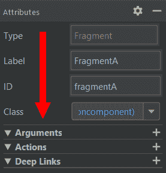
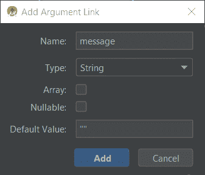

# 如何构建一个 Android 导航组件

> 原文：<https://www.freecodecamp.org/news/android-navigation-component/>

设计一个应用程序往往很麻烦，而且经常会有一个白板，上面有从不同点指向其他点的箭头。

你最初认为会是一个有一两个活动的应用程序，突然看起来有多个流程、片段和大范围的用户交互。如果我们能把白板上的内容用代码轻松复制出来，那不是很好吗？

向[导航组件](https://www.youtube.com/watch?v=Y0Cs2MQxyIs)问好。

对于不熟悉的人来说，导航组件不是另一个 UI 类，它代替了活动/片段的布局。把它想象成一张地图，在那里你有你的碎片，而不是大陆，你将需要 ******方向****** 从一个大陆到另一个大陆。它以自上而下的方式呈现你的片段和它们之间的联系。在本文中，我们将讨论这个组件的主要方面，并学习如何将它集成到我们的应用程序中。

准备起航了吗？⛵️

## 了解内幕

导航组件可从 Android Studio 3.3 及以后版本获得。要使用它，请将下列依赖项添加到项目中:

```
android {
    ...
}

dependencies {
    implementation 'androidx.navigation:navigation-fragment-ktx:2.0.0'
    implementation 'androidx.navigation:navigation-ui-ktx:2.0.0'
}
```

为了有所作为，让我们假设我们设计了一个具有以下结构的应用程序:

*   开始片段
*   碎片
*   碎片

用户可以从起始片段转到片段 A 或片段 B。



Our application

如果我们想在没有导航组件的情况下完成所有这些工作，我们就必须添加非常熟悉的代码，在单击其中一个按钮时打开一个片段。

```
val myFragment : MyFragment = MyFragment()
supportFragmentManager.beginTransaction().add(R.id.container, myFragment).commit()
```

在我们的小例子中，这相当于几行代码，相当简单，但是我想我们都同意，如果我们的应用程序更大，有更复杂的用户流，这将不能适当地伸缩。

## 请上船

要开始使用导航组件，我们需要创建一个导航图。这个图将作为我们的地图，勾勒出我们的应用程序中的用户流。要创建一个，右键单击 res 文件夹并创建一个新的资源文件。我们将自己的命名为:******user _ flow _ graph . XML******。确保将文件类型标记为导航。



Creating a new resource file

每次航行都从一个基地开始，我们的也不例外。我们家叫做******nav host******。当用户与我们的 UI 交互时，这将作为目标交换的占位符。我们需要将 NavHost 添加到活动的主布局中:

```
<?xml version="1.0" encoding="utf-8"?>
<androidx.constraintlayout.widget.ConstraintLayout xmlns:android="http://schemas.android.com/apk/res/android"
    xmlns:tools="http://schemas.android.com/tools"
    android:layout_width="match_parent"
    android:layout_height="match_parent"
    xmlns:app="http://schemas.android.com/apk/res-auto"
    tools:context=".MainActivity">

    <fragment
        android:id="@+id/nav_host_fragment"
        android:name="androidx.navigation.fragment.NavHostFragment"
        android:layout_width="0dp"
        android:layout_height="0dp"
        app:layout_constraintLeft_toLeftOf="parent"
        app:layout_constraintRight_toRightOf="parent"
        app:layout_constraintTop_toTopOf="parent"
        app:layout_constraintBottom_toBottomOf="parent"
        app:defaultNavHost="true"
        app:navGraph="@navigation/user_flow_graph" />

</androidx.constraintlayout.widget.ConstraintLayout>
```

我们已经添加了一个片段元素，它将存放我们的片段显示和交换的位置。注意******nav graph******属性，我们将它链接到我们之前创建的 XML 文件。

现在我们需要添加一个起始目的地，因为如果我们不添加，我们的应用程序将无法编译。

打开 user_flow_graph.xml 后，我们需要单击导航编辑器中的小加号图标:



Add A Destination

您可以在弹出的菜单中看到，我们可以创建一个占位符，稍后需要填充它，或者我们可以从现有的任何片段中进行选择:



Our Destination Choices

我们的用户流是从 out Start 片段开始的，先选它吧。



Our home base (notice the little ? icon)

让我们添加另外两个片段，片段 A 和片段 b。



All our destinations

当我们将鼠标悬停在一个目的地上方并将其拖动到另一个目的地时，我们通过点击出现的点来连接两个目的地。



Pretty neat. huh?

我们刚才在起始片段和片段 A、B 之间创建的，是 ******动作****** 。

## 让我颤抖吧

你可能会问自己，如果只是通过连接目的地，我们在这里的工作就完成了，并以某种神奇的方式，一切都将工作。

不会的。

我们需要告诉我们的代码导航到目的地。那么，我们如何做到这一点呢？这个过程中涉及到一些魔法。

我们要做的第一件事，是添加一个名为 ******安全参数****** 的 gradle 插件。它将确保我们在目的地之间导航时的类型安全。

```
 buildscript {
   /...
    }
    dependencies {
        ...
        classpath "androidx.navigation:navigation-safe-args-gradle-plugin:2.0.0"

    }
}
```

我们还需要将以下插件添加到我们的应用程序的 build.gradle 中:

```
apply plugin: "androidx.navigation.safeargs.kotlin" 
```

另外，确保 gradle.properties 文件中的******Android . useandroidx = true******。

在我们继续之前，让我们了解一下为什么我们需要添加所有这些配置。基本上，当我们之前创建动作时，Android Studio 会在幕后生成我们将用来激活动作的代码。这段代码由代表每个动作的方法和类组成。让我们以我们的开始片段为例。为我们已经声明的动作生成的代码将有一个名为******StartFragmentDirections******的类。这个类的方法代表了我们之前创建的动作。所以对于我们的两个片段，我们会得到:

*   startfragmentdirections . actionstartfragmenttofragmenta()
*   startfragmentdirections . actionstartfragmenttofragmentb()

既然我们的行动已经转化为代码，让我们使用它们:

```
val action = StartFragmentDirections.actionStartFragmentToFragmentA() 
```

这个过程的最后一步需要我们使用 [NavController](https://developer.android.com/reference/androidx/navigation/NavController) 。这个对象负责管理 NavHost 中的导航。您可以使用以下三种方法之一来访问它:

*   Fragment.findNavController()
*   View.findNavController()
*   activity . findnav controller(viewId:Int)

因此，综合起来，我们将拥有:

```
fragmentABtn.setOnClickListener { button ->
    val action = StartFragmentDirections.actionStartFragmentToFragmentA()
    button.findNavController().navigate(action)
}
```

## 随风扬帆

如果我们想在我们的目的地之间传递数据呢？想象一个场景，如果用户点击某个项目，我们希望在下一个目的地对该项目做些什么。为此，我们有目的地论点。打开我们的 user_flow_graph.xml 并单击片段 a。您会注意到在右侧有一个菜单，详细列出了片段 a 的各种属性。其中一个属性是参数。



要添加参数，只需点击➕图标。弹出窗口打开，我们可以在其中配置我们的参数。你可以给它一个名字，选择它的类型，并添加一个默认值。让我们向片段 A 添加一个字符串类型的参数，这将是从开始片段传递的消息。



在开始片段中，我们定义了动作并调用生成的方法，我们将传入参数。

```
fragmentABtn.setOnClickListener { button ->
    val action = StartFragmentDirections.actionStartFragmentToFragmentA("Hello From Start Fragment")
    button.findNavController().navigate(action)
}
```

要在片段 A 中访问它，我们需要:

*   访问捆绑包并获得我们的消息价值

```
class FragmentA: Fragment() {

    override fun onCreateView(
        inflater: LayoutInflater,
        container: ViewGroup?,
        savedInstanceState: Bundle?
    ): View? {
        val bundle = arguments
        val root = inflater.inflate(R.layout.fragment_a, container, false)
        val textView : TextView = root.findViewById(R.id.textView)
        textView.text = bundle?.getString("message")
        return root
    }
}
```

*   如果我们使用-ktx 依赖项，请使用 navArgs

```
class FragmentA: Fragment() {

    override fun onCreateView(
        inflater: LayoutInflater,
        container: ViewGroup?,
        savedInstanceState: Bundle?
    ): View? {
        val args : FragmentAArgs by navArgs()
        val root = inflater.inflate(R.layout.fragment_a, container, false)
        val textView : TextView = root.findViewById(R.id.textView)
        textView.text = args.message
        return root
    }
}
```

✋当使用 navArgs 时，你需要在你的 build.gradle 文件中添加对 Java8 的[支持。](https://developer.android.com/studio/write/java8-support)

你可以在这个 GitHub 库中找到这里显示的所有代码[。](https://github.com/TomerPacific/MediumArticles/tree/master/NavigationComponent)