# Android Studio 4.0–最激动人心的更新

> 原文：<https://www.freecodecamp.org/news/android-studio-4-updates/>

在一片疫情中，谷歌终于在 2020 年 5 月 28 日发布了其稳定版 **Android Studio 4.0。**

每个版本都带来了自己有趣的更新和错误修复，帮助开发人员比以往更智能地编码和更快地开发应用程序。而 Android studio 4.0 也不例外。

在本文中，我们将了解 Android studio 4.0 带来的一些令人兴奋的功能，这些功能将对开发人员有很大帮助。

你可以点击[这里](http://studio)获得下载 Android Studio 4.0 的直接链接。

以下是发行说明的一些亮点:

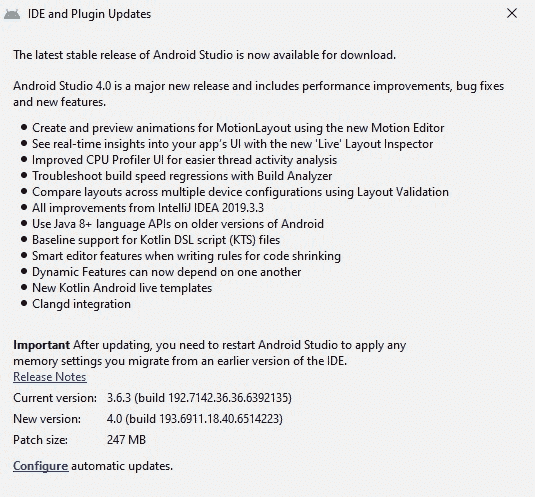

Android Studio 4.0 引入了大量有趣的功能，包括

*   构建速度窗口
*   布局多重预览
*   运动编辑器
*   实时布局检查器
*   R8 规则的智能编辑器
*   Kotlin DSL 脚本文件

下面我们就来深入了解一下 Android Studio 4.0 好玩的新功能。

## Android Studio 4.0 有哪些新功能？

下面是一个新特性的列表，以及一些关于它们如何工作和为什么它们很棒的信息。

### 1.运动编辑器

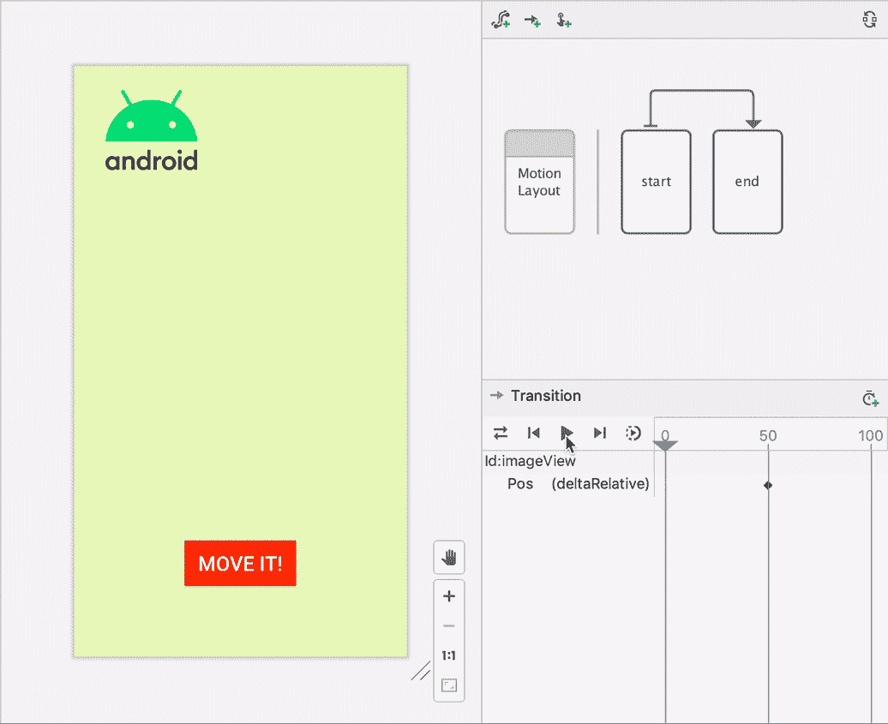

运动编辑器升级了用于运动布局的可视化设计编辑器，并且它还生成 XML。MotionLayout 是 *ConstraintLayout* 的一个子部分，帮助开发者管理[移动应用](https://www.freecodecamp.org/news/how-to-secure-mobile-apps/)中的小部件和运动动画。

它有一个可视化设计编辑器，可以帮助您创建、编辑和预览动画，而无需开发应用程序。它还允许您播放/暂停动画以进行调试。

运动布局取代了以前的约束布局，并对其进行了改进。它帮助 Android 应用程序开发人员在布局状态之间制作动画，并轻松管理关键动画。

现在，您可以使用高级的*运动编辑器*部署*运动布局 API* 来开发或编辑动画，而所有内容都存储在 XML 文件中。

唯一的区别是，你不需要手动写出来，因为现在一切都是由运动编辑器管理。您可以轻松预览动画并进行任何更改。

### 2.实时布局检查器

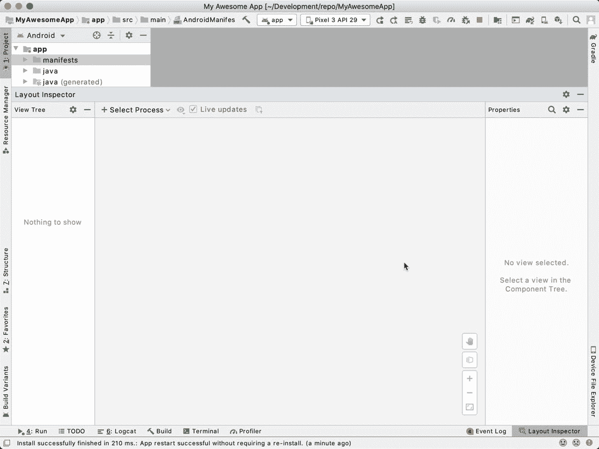

[**Image Source**](https://medium.com/androiddevelopers/layout-inspector-1f8d446d048)

Android Studio 4.0 现在允许开发人员实时洞察他们的移动应用程序的 UI。这意味着现在你可以想象你的应用程序在屏幕上的布局以及各种特性。

它还有一个动态布局层次结构，每次刷新时都会更新，并有详细的视图属性来帮助您确定资源值。

您可以通过从主菜单中选择**视图>工具窗口>布局检查器**来部署该功能。

如果您正在将应用程序部署到运行 API 级别 29 或更高的设备上，那么您可以访问一些附加功能，如动态布局。在布局检查器上也有很多详细的信息可以查看。

它的属性值解析特性允许您了解源代码中属性的来源。它还使用超链接将您导航到其位置。如果你的应用或设备运行在 Android API 29 或更高版本上，你可以利用 3D 表现的优势。

开发人员现在可以部署屏幕动画的 3D 表示，并检查其他属性。因此，当你雇佣开发人员来改造你的应用程序界面或添加新功能时，你不必担心应用程序的现代 UX/用户界面设计排版的外观，因为你可以在编码过程中同时检查。

### 3.布局验证

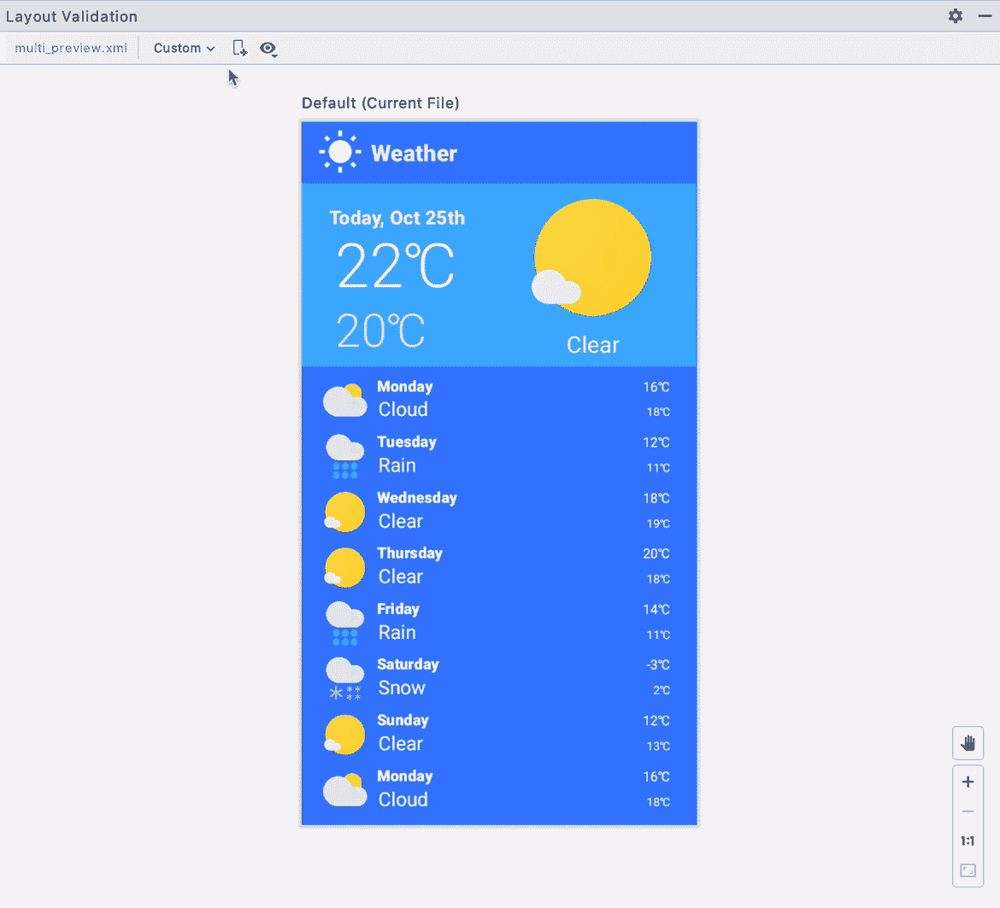

[**Image Source GIF **](https://developer.android.com/studio/debug/layout-inspector)

现在，您可以在各种设备中制作布局并同时进行配置，而不会出现任何中断。*布局验证*或*布局多*预览都是可视化工具。

以前，在 Android studio 中创建布局时，在预览模式下切换不同的屏幕尺寸和分辨率是一项挑战。但是有了这些最新的更新，就简单多了。

为什么嗯，你只需要选择像素设备，然后你就可以轻松地检查或预览集成开发环境中的变化。

您还可以使用这个工具来识别 UI 中可能存在的问题，因为您经常为特定的配置或可视屏幕大小设计 UI。

您可以通过点击 **IDE 窗口**右上角的**布局验证**标签来访问该工具。

### 4.构建分析器

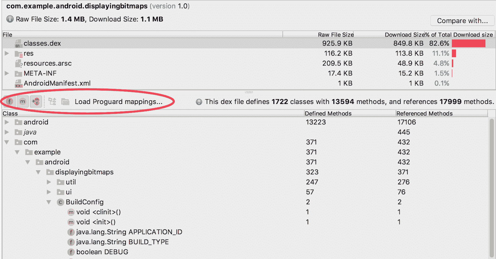

[**Image Source**](https://developer.android.com/studio/build/apk-analyzer)

Android Studio 4.0 引入了一个构建分析器工具，帮助开发人员分析和处理与构建相关的问题。对于 Android 开发者来说，应用程序开发时间一直是一个很大的开销。

这项新功能通过识别过时和错误配置的工作，快速减少时间和生产力损失。构建分析器工具显示您的作业和插件，并建议减少回归的方法。

这也有助于解决另一个问题——以前，开发人员不知道构建系统的哪个部分会花费更多的时间。现在不是这样了。

因此，新的 grade 插件 4.0 可以帮助开发人员在构建过程中分析和发现问题，例如配置不当的任务。通过在每个模块的 build.gradle 文件中包含下面的一行或多行，可以很容易地指定默认设置。

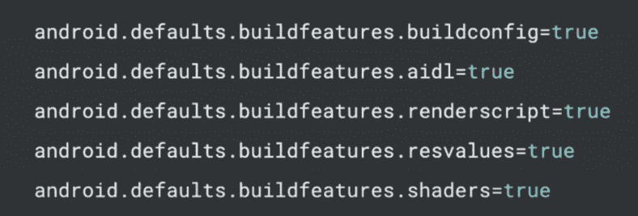

Build analyzer 还通过调用对整个应用程序构建时间最重要的插件和任务来帮助您解决和了解构建中的瓶颈。然后，它给你一些步骤来减轻回归。

### 5.面向所有 API 的 Java 8 语言库去糖

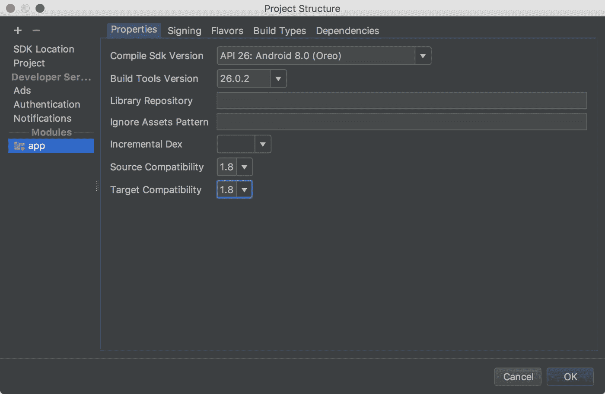

[**Image Source**](https://developer.android.com/studio/write/java8-support?hl=el)

Android 应用程序开发的另一个超级烦人的部分是试图部署 Java 8 功能。你可能会找到一些使用**流**的代码，或者想要实现一个 **lambda 函数**，或者甚至可能有一个你需要的 Java 8 API，但它并不实用。

但是有了 Android Gradle 插件，你可以用旧的 API 编译某些 Java 8 特性。

而 Android Studio 4.0 使去糖引擎能够提供对 Java 语言的支持。

### 6.构建功能

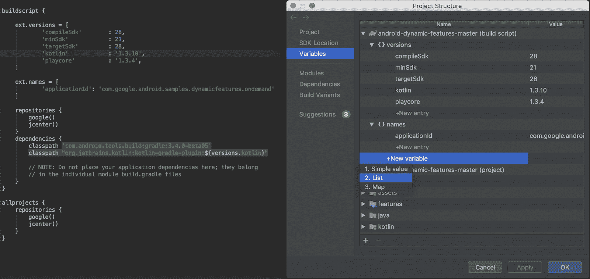

[**Image Source**](https://developer.android.com/studio/releases)

利用 Android Studio 4.0 的开发人员可以启用和禁用构建功能，如视图绑定、数据绑定或自动生成的 BuildConfig 类。

此外，您可能不需要每个项目都有这些插件和库，因此您可以禁用这些库/插件，并大幅提高大型项目的可伸缩性。

Kotlin 是印度 android 程序员使用最多的技术之一，这一特性可能会鼓励其在未来更快的应用开发中得到采用。

### 7.R8 规则的最新编辑

R8 是在 Android Gradle 插件 3.4.0 中引入的，它将收缩、去糖、德兴和模糊都结合在一个步骤中。这导致了构建性能的提高。

以前，不支持编写 R8 规则时提供自动建议的智能编辑器。但是有了 Android Studio 4.0，一个聪明的编辑器就可以编写代码收缩的规则。

在为 R8 开发规则文件时，Android Studio 现在提供了各种功能，包括完成、语法高亮和错误检查。

这个编辑器可以顺利地与您的项目一起工作，为所有模型、类和字段提供完整的符号完成，并且还包括重构和导航。

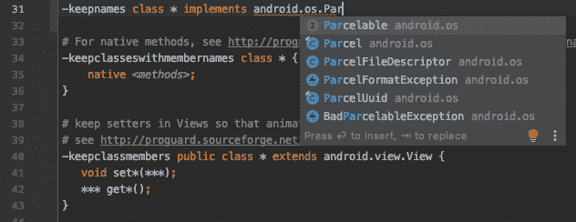

[**Image Source**](https://miro.medium.com/max/711/1*fzTTnrKnVuVpO0H_eWnWmQ.png)

### 8.片段向导

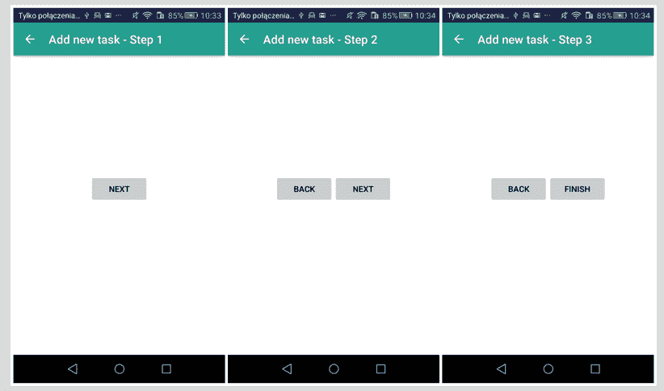

[**Image Source**](https://stackoverflow.com/questions/37432212/android-wizard-with-multiple-fragments-back-button-behavior) 

导航编辑器中现在提供了新的片段模板和片段向导。

这些模板允许开发人员使用 **ViewPager** (可在支持库中获得)快速导航片段向导内容以创建幻灯片。该工具让您可以轻松设置幻灯片动画，并增强应用程序的外观和感觉。

这些更新使得开发人员可以更容易地通过导航编辑器中提供的简单拖放模板来实现动画默认屏幕幻灯片。而且涉及的编码也更少。

基本上，Fragment 是 Android 中的一个类，它允许集成可适应不同设备屏幕方向的 UI。它将不同类型的段组合成一个屏幕元素。

片段向导中模板的引入使得使用这些不同的特性变得相当容易。当你的移动应用程序的用户界面适应不同的屏幕尺寸和方向时，这绝对是一个额外的好处。

### 9.Kotlin Android Live 模板

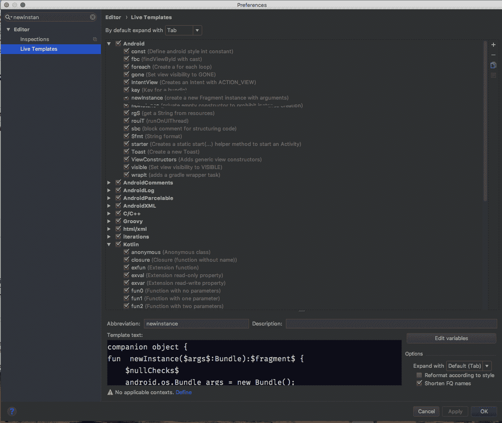

[**Image Source** ](https://stackoverflow.com/questions/51473637/how-to-create-a-kotlin-live-template-for-newinstance-fragments-using-android-stu)

最新版本的 Android Studio 内置了对 **Kotlin DSLscript** 文件的支持。您可以很容易地使用由项目结构对话框支持的全套快速修复。Android Studio 现在为 Kotlin 代码提供了 Android 专用的实时模板。

例如，只需输入**“toast”**并按下 **Tab 键**就可以快速插入一段 Toast 的样板代码。

要查看完整的实时模板列表，请在设置(或首选项)对话框中导航至**编辑器>实时模板**。

### 10.CPU Profiler UI 升级

[**Image Source**](https://developer.android.com/studio/profile/cpu-profiler.html?hl=lt)

CPU 分析器是 Android Studio 中最好的新功能之一——尤其是在性能方面。CPU profiler 旨在为您提供与跟踪记录和应用程序线程活动相关的信息。

以前，所有分析器的数据都显示在一个部分中:

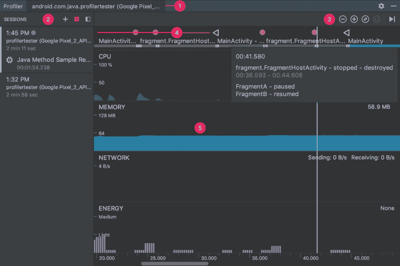

[**Image Source**](https://miro.medium.com/max/788/1*4IDJaeUhsraqzeqc9Mynrg.png)

使用 Android Studio 4.0，CPU 记录可以从主分析器时间线中分离出来，并分组管理，以便于分析。开发人员可以轻松地拖放和上下移动组中的单个项目，以便进一步定制。

此外，为了进行流畅的并排分析，您可以检查线程活动时间线中的所有线程活动(包括函数、方法和事件)，并尝试使用最新的导航快捷方式来移动数据。

系统跟踪用户界面也进行了升级，以便事件可以用独特的颜色来改善视觉效果。还可以根据优先级对线程进行排序，以显示更繁忙的线程，并且您可以更专注于查看所选线程的数据，而不是所有组合数据。

有关 CPU 性能分析器[的详细描述，请单击此处](https://developer.android.com/studio/releases#cpu-profiler-upgrades)。

### 11.功能对功能的依赖性

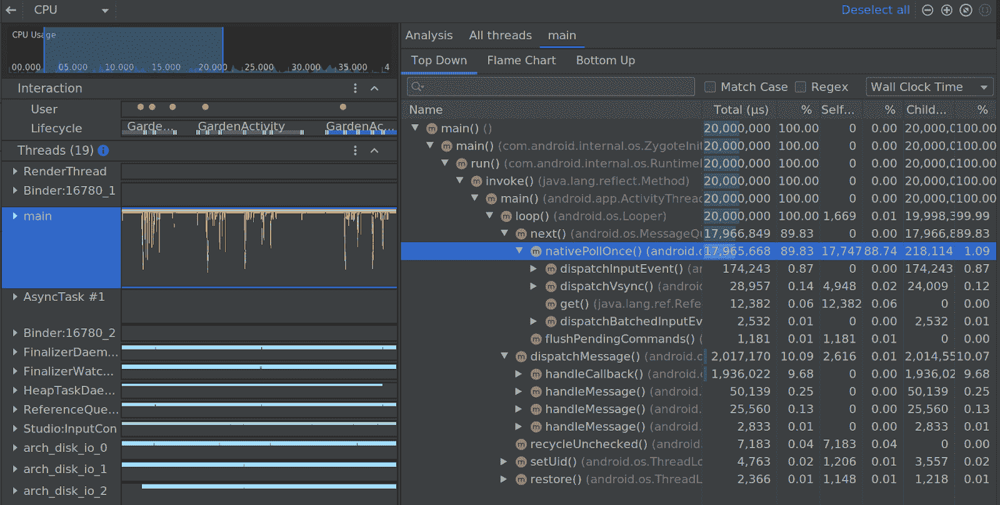

[**Image Source**](https://android-developers.googleblog.com/2020/05/android-studio-4.html)

Android Studio 4.0 允许开发人员指定哪个动态功能模块依赖于另一个功能模块。通过部署它，您可以检查应用程序是否有足够的模块来改进您的应用程序的功能。

例如，如果用户录制视频，则计算机模块会自动下载。这是因为视频模块依赖于摄像头模块。

## 结论

这些是 Android Studio 4.0 的特性，将真正帮助提高您的 Android 应用程序的性能。它们还将帮助 Android 应用程序开发人员更快、更高效地编写代码。

目前，创建 Android 应用程序是企业家和企业的主要投资兴趣。

因此，企业之间存在巨大的竞争，以选择一家能够跟上现代垂直技术发展速度并能创造有价值产品的[安卓应用开发公司](https://www.pixelcrayons.com/mobile-app-development/android-development?utm_source=freecodecamp&utm_medium=android%2Bapp%2Bdevelopment_sk&utm_campaign=website) 。

Android 4.0 的推出将使所有人的事情变得更加简单和有趣。