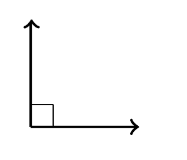
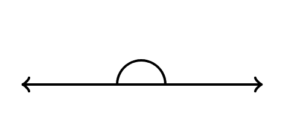
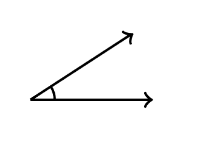
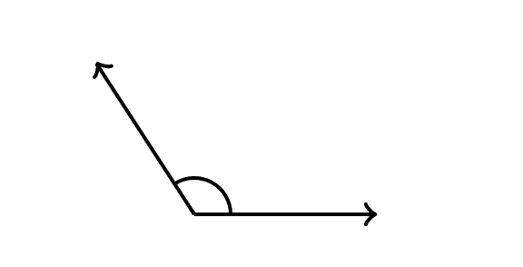

# 几何中的角度名称:锐角、钝角、直角和直角，已定义

> 原文：<https://www.freecodecamp.org/news/angle-names-in-geometry-acute/>

## **角度:锐角、钝角、直角和直角**

根据角度的大小，有四种角度。这些是:

*   直角
*   直角
*   锐角
*   钝角

### **直角**

直角是正好 90 度的角。例如，正方形或长方形的角是直角。直角的一个例子如下:

### **直角**

直角是正好 180 度的角。例如，一条直线有一个直角。下面是一个直角的例子:

### **锐角**

锐角是指角度小于 90 度的角。例如，大写字母“A”有一个锐角。锐角的一个例子如下:

### **钝角**

钝角是指角度大于 90 度但小于 180 度的角。例如，显示 5 点钟的时钟有一个钝角。钝角的一个例子如下:

## 例子

#### **例 1**

最大整数锐角的度量是什么？因为锐角是小于 90°的角度，最大的整数锐角的角度是 89°。

#### **例 2**

最小整数钝角的度量是多少？由于钝角的度量大于 90°，最小的整数钝角的度量为 91°。

#### **例 3**

大写字母“L”中角度的度量是多少，它是什么类型的角度？大写字母“L”中角度的度量是 90°，这个角度是直角。

## 更多关于数学的文章:

*   [JavaScript 数学函数讲解](https://www.freecodecamp.org/news/math-in-javascript/)