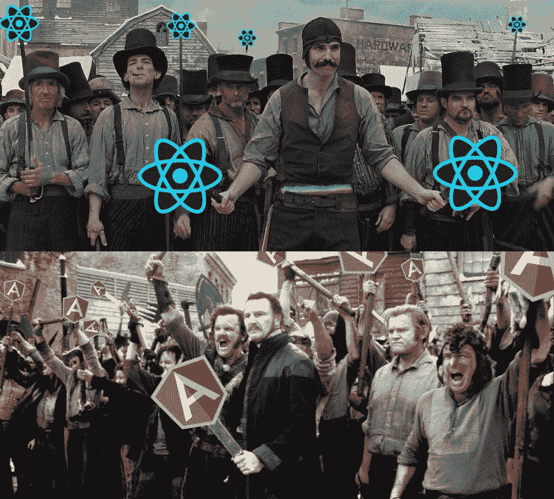
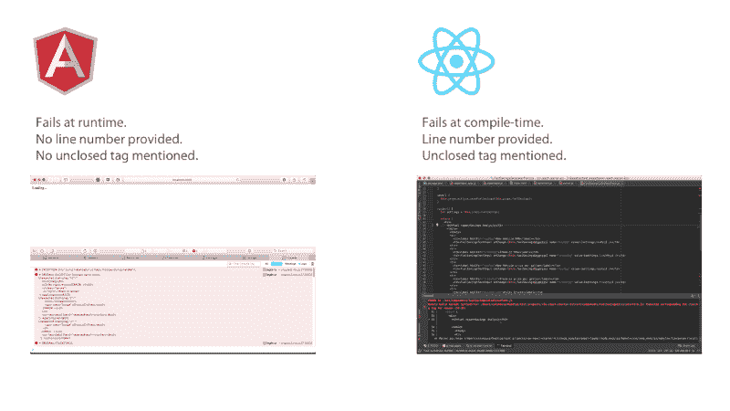

# Angular 2 对 React:会有血

> 原文：<https://www.freecodecamp.org/news/angular-2-versus-react-there-will-be-blood-66595faafd51/>

[Angular 2 已经达到测试版](https://angular.io)，似乎有望成为 2016 年热门的新框架。摊牌的时候到了。让我们看看它如何与 2015 年的宠儿相抗衡:[反应](https://facebook.github.io/react/)。

**免责声明:**我很喜欢在 Angular 1 工作，但在 2015 年转投 React。我在 ES6 ( [免费试用](http://app.pluralsight.com/signup))发布过 [React 和 Flux](https://www.pluralsight.com/courses/react-flux-building-applications) 和 [React 和 Redux 的 Pluralsight 课程。所以**是的，我有偏见。但是我两边都在攻击。**](https://app.pluralsight.com/library/courses/react-flux-building-applications)

好吧，我们开始吧。会有血。



Photo credit: [@jwcarrol](https://twitter.com/jwcarroll)

### 你在拿苹果和猩猩比！

叹气。没错，Angular 是框架，React 是库。有人说这种差异使得比较它们不合逻辑。一点也不！

> 在 Angular 和 React 之间进行选择就像在购买现成的计算机和使用现成的部件构建自己的计算机之间进行选择一样。

这篇文章考虑了这两种方法的优点。我将 React 的语法和组件模型与 Angular 的语法和组件模型进行了比较。这就像将现成计算机的 CPU 与原始 CPU 进行比较。苹果对苹果。

### 角度 2 优势

我们先来考虑 Angular 2 相对 React 的优势。

#### **低决策疲劳**

由于 Angular 是一个框架，它提供了更多现成的观点和功能。使用 React，您通常会从货架上取下许多其他库来构建一个真正的应用程序。您可能需要用于路由、强制单向流、web API 调用、测试、依赖性管理等的库。决定的数量相当多。这就是为什么 React 有这么多初学者工具包(我已经[发布了](https://github.com/coryhouse/react-flux-starter-kit) [两个](https://github.com/coryhouse/react-slingshot))。

Angular 提供了更多现成的意见，这有助于您更快地开始工作，而不会被决策吓倒。这种强制的一致性也有助于新员工更快地有宾至如归的感觉，并使开发人员在团队之间的切换更加实际。

我很钦佩 Angular 核心团队如何拥抱 TypeScript，这导致了下一个优势…

#### TypeScript =清除路径

当然，TypeScript 并不是所有人都喜欢，但是 Angular 2 对使用哪种风格的 JavaScript 的固执己见是一大胜利。网络上的 React 例子令人沮丧地不一致——它在 ES5 和 ES6 中以大致相等的数量出现，并且它目前提供了三种不同的方式来声明组件。这给新人造成了困惑。(Angular 也包括 decorators 而不是 extends——许多人也会认为这是一个优点)。

虽然 Angular 2 不需要 TypeScript，但 Angular 核心团队肯定会接受它，并默认在文档中使用 TypeScript。这意味着相关的例子和开源项目更容易让人感到熟悉和一致。Angular 已经提供了[清晰的例子，展示了如何利用 TypeScript 编译器](https://angular.io/docs/ts/latest/quickstart.html)。(尽管不可否认的是，[并不是每个人都接受 TypeScript](http://angularjs.blogspot.com/2015/09/angular-2-survey-results.html) ，但我怀疑在发布后不久它将成为事实上的标准)。这种一致性应该有助于避免开始使用 React 时出现的混乱和决策过载。

#### 减少流失

2015 年是 [JavaScript 疲劳](https://medium.com/@ericclemmons/javascript-fatigue-48d4011b6fc4#.559iqxb39)的一年。虽然 React 本身预计会随着[版本 15 即将到来](https://facebook.github.io/react/blog/)而变得相当稳定，但 React 的生态系统已经在快速搅动，特别是围绕着[长长的通量口味列表](https://github.com/kriasoft/react-starter-kit/issues/22)和[路由](https://github.com/rackt/react-router)。因此，如果您依赖于许多相关的库中的一个，那么您今天在 React 中编写的任何内容都可能会感觉过时，或者需要在未来进行重大更改。

相比之下，Angular 2 是对一个成熟、全面的框架的精心、有条不紊的改造。所以 Angular 在发布后不太可能以痛苦的方式搅动。作为一个完整的框架，当你选择 Angular 时，你可以相信一个团队会对未来做出谨慎的决定。在 React 中，您有责任将一堆不同的、快速移动的开源库集合成一个能够很好地协同工作的综合整体。这是一项耗时、令人沮丧、永无止境的工作。

#### **广泛的工具支持**

正如你将在下面看到的，我认为 React 的 JSX 是一个巨大的胜利。但是，您需要选择支持 JSX 的工具。React 变得如此受欢迎，以至于工具支持在今天很少成为问题，但是像 ide 和 linters 这样的新工具不可能一开始就支持 JSX。Angular 2 的模板将标记存储在一个字符串或单独的 HTML 文件中，因此它不需要特殊的工具支持(尽管智能解析 Angular 的字符串模板的工具正在开发中)。

#### Web 组件友好

Angular 2 的设计包含了 web 组件的标准。唉，我很尴尬，我忘了提到这一点——我最近发表了一篇关于 web 组件的课程！简而言之，与 React 的组件相比，您在 Angular 2 中构建的组件应该更容易转换成普通的原生 web 组件。当然，[浏览器支持仍然很弱](http://jonrimmer.github.io/are-we-componentized-yet/)，但从长远来看，这可能是一个巨大的胜利。

Angular 的方法有它自己的一套问题，这是讨论 React 优点的一个很好的切入点…

### 反应优势

好吧，让我们来考虑一下什么集合会有不同的反应。

#### **JSX**

JSX 是一种类似 HTML 的语法，可以编译成 JavaScript。标记和代码组成在同一个文件中。这意味着当您键入对组件的函数和变量的引用时，代码补全可以帮您一把。相比之下，Angular 的基于字符串的模板有一些常见的缺点:许多编辑器中没有代码着色，有限的代码完成支持，以及运行时失败。您通常也会想到糟糕的错误消息，但是 Angular 团队[创建了他们自己的 HTML 解析器来修复那个](https://github.com/angular/angular/issues/4417)。(Bravo！)

如果您不喜欢基于字符串的有棱角的模板，您可以将模板移动到一个单独的文件中，但是这样您就回到了我所说的“旧时代”:在头脑中将两个文件连接在一起，没有代码完成支持或编译时检查的帮助。在你享受过 React 的生活之前，这看起来没什么大不了的。在单个 ***编译时检查过的*** 文件中编写组件是 JSX 如此特殊的一大原因。



Contrasting how Angular 2 and React handle a missing closing tag

更多关于为什么 JSX 是如此大的赢家，请看 [JSX:硬币的另一面](https://medium.com/@housecor/react-s-jsx-the-other-side-of-the-coin-2ace7ab62b98#.5007n49wq)。

#### **React 快速而明确地失败**

当你在 React 的 JSX 中输入错误时，它不会编译。那是一件美好的事情。这意味着您可以立即知道哪一行有错误。当你忘记关闭一个标签或者引用一个不存在的属性时，它会立即告诉你。事实上，**JSX 编译器** **指定了出现错别字的行号**。这种行为从根本上加速了开发。

相比之下，当你在 Angular 2 中输入错误的变量引用时，什么都不会发生。 **Angular 2 在运行时悄悄失败，而不是编译时**。慢慢的*失败*。我加载应用程序，想知道为什么我的数据没有显示出来。不好玩。

#### **React 是以 JavaScript 为中心的**

在这里。这是 React 和 Angular 的根本区别。不幸的是，Angular 2 仍然以 HTML 为中心，而不是以 JavaScript 为中心。Angular 2 未能解决其最基本的设计问题:

> Angular 2 继续把“JS”放进 HTML。React 将“HTML”放入 JS。

我怎么强调这种分裂的影响都不为过。它从根本上影响了开发体验。Angular 以 HTML 为中心的设计仍然是它最大的弱点。正如我在“ [JSX:硬币的另一面](https://medium.com/@housecor/react-s-jsx-the-other-side-of-the-coin-2ace7ab62b98#.jqh5kkxlk)”中提到的，JavaScript 远比 HTML 强大。因此，**增强 JavaScript 以支持标记比增强 HTML 以支持逻辑更符合逻辑**。HTML 和 JavaScript 需要以某种方式粘合在一起，React 以 JavaScript 为中心的方法从根本上优于 Angular、Ember 和 Knockout 以 HTML 为中心的方法。

原因如下…

#### React 以 JavaScript 为中心的设计=简单

Angular 2 延续了 Angular 1 试图让 HTML 更强大的方法。所以你必须利用 Angular 2 独特的语法来完成简单的任务，比如循环和条件。例如，Angular 2 通过两种语法提供单向和双向绑定，不幸的是这两种语法非常不同:

```
{{myVar}} //One-way binding
ngModel="myVar" //Two-way binding
```

在 React 中，绑定标记不会基于这个决定而改变(它在其他地方处理，我认为它应该这样)。无论哪种情况，看起来都是这样的:

```
{myVar}
```

Angular 2 使用以下语法支持内联主模板:

```
<ul>
  <li *ngFor="#hero of heroes">
    {{hero.name}}
  </li>
</ul>
```

上面的代码片段循环遍历了一组英雄。我有多重顾虑:

*   通过前面的星号声明“主模板”是不明确的。
*   hero 前面的井号声明了一个局部模板变量。这个关键概念看起来像不必要的噪音(如果愿意，您可以使用‘var’)。
*   ngFor 通过特定于角度的属性为 HTML 添加了循环语义。

对比上面 Angular 2 的语法和 React 的纯 JS*:(不可否认，下面的关键属性是 React 特有的)

```
<ul>
  { heroes.map(hero =>
    <li key={hero.id}>{hero.name}</li>
  )}
</ul>
```

由于 JS 本身支持循环，React 的 JSX 可以简单地利用 JS 的所有功能来做这些事情，并利用 map、filter 等做更多的事情。

刚刚看了 [Angular 2 小抄](https://angular.io/docs/ts/latest/guide/cheatsheet.html)。那不是 HTML。那不是 JavaScript。真是 ***棱角分明*** 。

> **阅读 Angular:** 学习一长串 Angular 特有的语法。
> 
> 阅读 React:学习 JavaScript。

React 在语法和概念上的简单性是独一无二的。考虑在当今流行的 JS 框架/库中迭代:

```
Ember: {{# each}}
Angular 1: ng-repeat
Angular 2: ngFor
Knockout: data-bind=”foreach”
React: JUST USE JS. :)
```

除了 React 之外，所有的都使用特定于框架的替换来代替 JavaScript 中的一些原生的琐碎的东西:**一个循环**。这就是 React 的妙处。它包含了 JavaScript 处理标记的能力，所以不需要奇怪的新语法。

Angular 2 的语法奇怪之处继续与点击绑定有关:

```
(click)=”onSelect(hero)"
```

相比之下，React 再次使用普通的 JavaScript:

```
onClick={this.onSelect.bind(this, hero)}
```

由于 React 包含一个合成事件系统(Angular 2 也是如此)，您不必担心像这样内联声明事件处理程序的性能影响。

如果没有必要，为什么要用一个框架的独特语法来填充你的大脑呢？为什么不干脆拥抱 JS 的力量？

#### 奢华的开发体验

JSX 的代码完成支持、编译时检查和丰富的错误消息已经创造了一个优秀的开发体验，既节省了打字又节省了时间。但是，将所有这些与热重装和时间旅行结合起来，你将获得前所未有的快速开发体验。

[https://www.youtube.com/embed/xsSnOQynTHs?feature=oembed](https://www.youtube.com/embed/xsSnOQynTHs?feature=oembed)

#### 尺寸问题

以下是一些流行的框架和库的大小，缩小了( [source](https://gist.github.com/Restuta/cda69e50a853aa64912d) ):

**Angular 2:** 566k (766k 带 RxJS)
**Ember:**435k
**[Angular 1](https://ajax.googleapis.com/ajax/libs/angularjs/1.4.8/angular.min.js):**143k
**React+Redux:**139k

**编辑**:抱歉，我之前的数字不正确，是简单的 ToDoMVC 应用程序的数字，而不是原始框架的数字。此外，Angular 2 的数量预计会在最终版本中下降。列出的尺寸是浏览器中框架的缩小版(这里没有考虑 gzip)。

为了进行真正的比较，我在 Angular 2 和 React 中都内置了 Angular 2 的英雄之旅应用(我使用了新的[React slings hot](https://github.com/coryhouse/react-slingshot)starter kit)。结果呢？

[**角 2**](https://github.com/coryhouse/angular-2-tour-of-heroes/tree/master) **:** 764k 缩小
[**React+Redux**](https://github.com/coryhouse/react-tour-of-heroes)**:**151k 缩小

因此 **Angular 2 目前的大小是 React + Redux 应用程序大小的四倍多。(还是那句话，Angular 2 预计在最终发布前会瘦一些)。**

话虽如此，我承认对框架规模的担忧可能被夸大了:

> 大型应用程序往往至少有几百千字节的代码——通常更多——不管它们是否是用框架构建的。开发人员需要抽象来构建复杂的软件，无论它们是来自框架还是手写的，都会对应用程序的性能产生负面影响。即使你完全消除了框架，许多应用程序仍然有数百千字节的 JavaScript。——汤姆·戴尔在 [JavaScript 框架和移动性能](http://tomdale.net/2015/11/javascript-frameworks-and-mobile-performance/)

汤姆是对的。像 Angular 和 Ember 这样的框架更大，因为它们提供了更多开箱即用的特性。

然而，我担心的是:许多应用程序并不需要这些大型框架中的所有东西。在一个日益拥抱微服务、微应用和[单一责任包](http://www.npmjs.com)的世界里， **React 让您能够通过仔细选择必要的东西来“调整”您的应用**。在一个拥有[超过 20 万个 npm 模块](http://www.modulecounts.com)的世界里，这是一个强大的地方。

#### React 拥抱 Unix 哲学。

React 是一个库。这恰恰与 Angular 和 Ember 等大型综合框架的理念相反。因此，当您选择 React 时，您可以自由选择最能解决您的问题的现代最佳库。JavaScript 运行速度很快，React 允许您将应用程序的小部分换成更好的库，而不是等待并希望您的框架会有所创新。

Unix 经受住了时间的考验。原因如下:

> 小型、可组合、单一用途工具的理念永远不会过时。

React 是一个专注的、可组合的、单一用途的工具，被世界上许多最大的网站使用。这对它的未来是个好兆头(也就是说，Angular 是许多大牌使用的[)。](https://www.madewithangular.com/#/)

#### 摊牌总结

Angular 2 是对版本 1 的巨大改进。新的组件模型比 v1 的指令更容易掌握，它支持同构/通用呈现，并且使用虚拟 DOM 提供 3-10 倍的性能提升。这些变化使得 Angular 2 与 React 非常有竞争力。不可否认，它的全功能、自以为是的本质通过减少“JavaScript 疲劳”提供了一些明显的好处。

然而，Angular 2 的大小和语法让我犹豫。Angular 致力于以 HTML 为中心的设计，这使得它比 React 更简单的以 JavaScript 为中心的模型更复杂。在 React 中，你不需要学习像 ngWhatever 这样的特定于框架的 HTML 垫片。你花时间写普通的 JavaScript。这是我相信的未来。

评论？加入 Reddit 或 T2 的黑客新闻。

***科里豪斯*** 是“[用 React 和 Flux](https://www.pluralsight.com/courses/react-flux-building-applications) 构建应用程序”、“[干净代码:为人类编写代码](https://www.google.com/url?sa=t&rct=j&q=&esrc=s&source=web&cd=1&cad=rja&uact=8&ved=0ahUKEwiK1pXx89nJAhUujoMKHeuWAEUQFggcMAA&url=https%3A%2F%2Fwww.pluralsight.com%2Fcourses%2Fwriting-clean-code-humans&usg=AFQjCNEBfkBoN-IgCn_1jFUqWDAUIxcmAw&sig2=Ub9Wup4k4mrw_ffPgYu3tA)”和 Pluralsight 上多个其他课程的作者。他是 VinSolutions 的软件架构师，在国际上培训软件开发人员，比如前端开发和干净编码。科里是微软的 MVP，Telerik 开发专家，outlierdeveloper.com 的创始人。