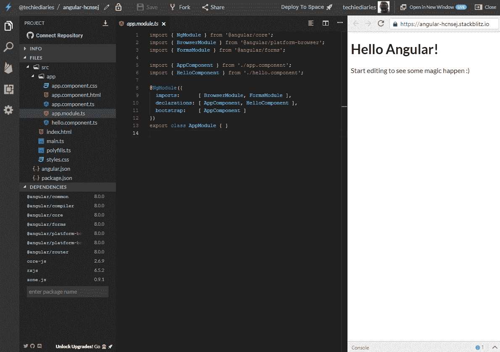
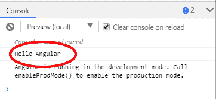
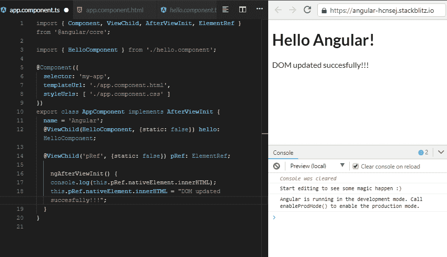

# Angular 8 DOM 查询:ViewChild 和 ViewChildren 示例

> 原文：<https://www.freecodecamp.org/news/angular-8-dom-queries-viewchild-and-viewchildren-example/>

Angular 中的`@ViewChild`和`@ViewChildren`装饰器提供了一种访问和操作 DOM 元素、指令和组件的方法。在本教程中，我们将看到一个如何使用这两个装饰器的 Angular 8 示例。

如果需要从 DOM 中查询一个元素，可以使用`ViewChild`,使用`ViewChildren`查询多个元素。

我们将使用从[https://stackblitz.com/](https://stackblitz.com/)获得的在线开发 IDE，所以此时你不需要为 Angular 设置你的本地开发机器。

前往 Stackblitz，使用您的 GitHub 帐户登录，并选择一个角度工作空间:


您应该会看到一个带有 Angular 8 项目的在线 IDE



我们的 Angular 项目包含通常的`App`组件和一个名为`HelloComponent`的子组件，在`src/app/hello.component.ts`文件中定义，代码如下:

```
import { Component, Input } from '@angular/core';

@Component({
  selector: 'hello',
  template: `<h1>Hello !</h1>`,
  styles: [`h1 { font-family: Lato; }`]
})
export class HelloComponent  {
  @Input() name: string;
} 
```

该组件接受一个`name`属性，并使用一个内联模板，该模板只显示通过父组件的 name 属性传递的值。

在组件装饰器中，我们使用 *hello* 作为组件的选择器，因此在`src/app/app.component.html`文件中定义的`App`组件的 HTML 模板中，我们使用以下代码包含子组件:

```
<hello name=""></hello>
<p>
  Start editing to see some magic happen :)
</p> 
```

在运行我们的 Angular 应用程序之后，hello 组件被呈现并成为 DOM 的一部分，因此我们可以像查询任何普通的 DOM 元素一样查询它。

## **Angular 中的 ViewChild 是什么？**

ViewChild 是一个创建视图或 DOM 查询的装饰器。根据[单据](https://angular.io/api/core/ViewChild#description)

配置视图查询的属性装饰器。变更检测器在视图 DOM 中寻找匹配选择器的第一个元素或指令。如果视图 DOM 发生变化，并且有一个新的子元素与选择器相匹配，则属性会更新。

装饰器获取以下元信息:

*   `selector` -要查询的元素的选择器。这可以是指令类型或名称。
*   `read` -从查询的元素中读取不同的令牌。
*   `static` -这是 Angular 8 中的新增功能，指示是否在变更检测运行之前解析查询结果。

`ViewChild`可以带以下选择器:

*   带有`@Component`或`@Directive`装饰符的类，即组件和指令，
*   模板引用变量，
*   提供商，
*   `TemplateRef`

现在，让我们回到我们的`src/app/app.component.ts`文件，看看我们如何使用`ViewChild`查询子组件。首先，相应地更改代码:

```
import { Component, ViewChild, AfterViewInit } from '@angular/core';

import { HelloComponent } from './hello.component';

@Component({
  selector: 'my-app',
  templateUrl: './app.component.html',
  styleUrls: [ './app.component.css' ]
})
export class AppComponent implements AfterViewInit {
  name = 'Angular';
  @ViewChild(HelloComponent, {static: false}) hello: HelloComponent;

  ngAfterViewInit() {
    console.log('Hello ', this.hello.name); 
  }
} 
```

在控制台中，你应该得到 **Hello Angular** :



现在，让我们解释代码。

首先，我们从`@angular/core`包中导入`HelloComponent`和`ViewChild`以及`AfterViewInit`:

```
import { Component, ViewChild, AfterViewInit } from '@angular/core';
import { HelloComponent } from './hello.component'; 
```

接下来，我们创建一个名为`hello`的查询，它将`HelloComponent`作为选择器，并且静态等于 false:

```
@ViewChild(HelloComponent, {static: false}) hello: HelloComponent; 
```

在 Angular 8 中，需要明确指定`ContentChild`和`ViewChild`的时序。

参见:[为什么我要指定`{static: false}`？这不是默认了吗？](https://angular.io/guide/static-query-migration#why-do-i-have-to-specify-static-false-isnt-that-the-default)

接下来，在`ngAfterViewInit()`生命周期钩子中，我们可以使用查询来访问 hello 组件的 DOM 元素。在我们的例子中，组件挂载到 DOM 后，我们访问了组件的 name 属性，它包含了 *Angular* 字符串:

```
 ngAfterViewInit() {
    console.log('Hello ', this.hello.name); 
  } 
```

我们可以从被查询的组件中访问任何属性甚至方法。

**注意**:视图查询是在调用`ngAfterViewInit`回调之前设置的。

## **使用模板引用查询标准 HTML 元素**

我们还可以使用`ViewChild`和模板引用变量来查询标准的 HTML 元素。让我们回到我们的`src/app/app.component.html`文件，将它修改如下:

```
<hello name=""></hello>

<p #pRef>
  Start editing to see some magic happen :)
</p> 
```

我们只是将`helloRef`模板引用添加到我们的 hello 组件中。现在让我们修改代码，使用组件的引用来访问组件。返回到`src/app/app.component.ts`文件，进行相应的更改:

```
import { Component, ViewChild, AfterViewInit, ElementRef } from '@angular/core';

import { HelloComponent } from './hello.component';

@Component({
  selector: 'my-app',
  templateUrl: './app.component.html',
  styleUrls: [ './app.component.css' ]
})
export class AppComponent implements AfterViewInit {
  name = 'Angular';
  @ViewChild(HelloComponent, {static: false}) hello: HelloComponent;

  @ViewChild('pRef', {static: false}) pRef: ElementRef;

    ngAfterViewInit() {
    console.log(this.pRef.nativeElement.innerHTML); 
    this.pRef.nativeElement.innerHTML = "DOM updated successfully!!!"; 
  }
} 
```

我们导入`ElementRef`并创建一个查询配置来访问带有`#pRef`模板引用的`<p>` DOM 元素，如下所示:

```
 @ViewChild('pRef', {static: false}) pRef: ElementRef; 
```

接下来，在`ngAfterViewInit()`方法中，我们可以使用`ElementRef`的`nativeElement`对象来访问和修改原生 DOM 元素:

```
 @ViewChild('pRef', {static: false}) pRef: ElementRef;

    ngAfterViewInit() {
    console.log(this.pRef.nativeElement.innerHTML);
    this.pRef.nativeElement.innerHTML = "DOM updated successfully!!!"; 
  } 
```



这是来自这个[环节](https://stackblitz.com/edit/angular-8-viewchild-example)的活生生的例子。

## **Angular 里的孩子是怎么看的？**

`ViewChildren`是另一个属性装饰器，用于在 DOM 中查询多个元素，并返回一个[查询列表](https://angular.io/api/core/QueryList)。

根据[单据](https://angular.io/api/core/ViewChildren):

您可以使用 ViewChildren 从视图 DOM 中获取元素或指令的 QueryList。每当添加、移除或移动子元素时，查询列表将被更新，并且查询列表的可观察到的变化将发出新的值。

让我们看一个例子。

转到`src/app/app.component.html`文件，按如下方式更新:

```
<hello  name="Angular 6"  ></hello>
<hello  name="Angular 7"  ></hello>
<hello  name="Angular 8"  ></hello> 
```

我们只是简单地重复三次 hello 组件。现在让我们查询 DOM。打开`src/app/app.component.ts`文件，并按如下方式进行更改:

```
import { Component, ViewChildren, AfterViewInit, QueryList } from '@angular/core';

import { HelloComponent } from './hello.component';

@Component({
  selector: 'my-app',
  templateUrl: './app.component.html',
  styleUrls: [ './app.component.css' ]
})
export class AppComponent implements AfterViewInit {
  name = 'Angular';
  @ViewChildren(HelloComponent) hellos: QueryList<any>;

  ngAfterViewInit() {

     this.hellos.forEach(hello => console.log(hello));

  }
} 
```

您应该在控制台中看到以下输出:


现在，让我们解释代码。

首先我们从`@angular/core`包中导入`ViewChildren`、`AfterViewInit`和`QueryList`。

接下来，我们创建一个查询配置来访问多个 DOM 元素:

```
@ViewChildren(HelloComponent) hellos: QueryList<any>; 
```

`@ViewChildren`返回一个存储项目列表的`QueryList`。当状态改变时，Angular 将自动更新这个查询列表。

最后，在`ngAfterViewInit()`方法中，我们可以迭代查询列表并记录每个 DOM 元素:

```
 ngAfterViewInit() {
     this.hellos.forEach(hello => console.log(hello));
  } 
```

从这个[链接](https://stackblitz.com/edit/angular-8-viewchildren-example)可以找到活生生的例子。

## **结论**

在本教程中，我们已经看到了如何在 Angular 8 中使用`ViewChild`和`ViewChildren`装饰器以及其他一些 API 如`QueryList`和`ngAfterViewInit()`来访问和修改 DOM

这个[帖子](https://www.techiediaries.com/angular-dom-queries-viewchild/)最初发布在[技术刊物](https://www.techiediaries.com/)上。