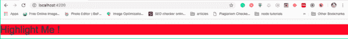
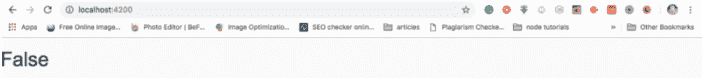

# 如何在 Angular 中使用和创建自定义指令

> 原文：<https://www.freecodecamp.org/news/angular-directives-learn-how-to-use-or-create-custom-directives-in-angular-c9b133c24442/>

古尔法姆·安萨里

玩了很久 Angular，终于想出了一个可以理解的 Angular 指令的解释。在这篇文章中，我们将首先理解指令到底是什么，以及如何在 Angular 中使用它。我们也将创建自己的自定义指令。那么我们还在等什么呢？让我们深入研究一下。

### 什么是角度方向？

指令是每当 Angular 编译器找到它时就会执行的函数**。**角度指令通过将自定义行为附加到 DOM 来增强 HTML 元素的能力。

从核心概念来看，角度指令分为三类。

1.  **属性指令**
2.  **结构指令**
3.  **组件**

#### 属性指令

属性指令负责操纵 DOM 元素的外观和行为。我们可以使用属性指令来改变 DOM 元素的样式。这些指令也用于有条件地隐藏或显示特定的 DOM 元素。Angular 提供了许多内置的属性指令，如 **NgStyle** 、 **NgClass** 等。我们还可以为我们想要的功能创建我们自己的定制属性指令。

#### **结构指令**

结构指令负责改变 DOM 的结构。它们通过在 DOM 中添加或删除元素来工作，不像属性指令那样只是改变元素的外观和行为。

通过查看语法，您可以很容易地区分结构指令和属性指令。结构化指令的名称总是以星号(*)前缀开头，而属性指令不包含任何前缀。Angular 提供的三个最流行的内置结构指令是 **NgIf** 、 **NgFor** 和 **NgSwitch** 。

#### **组件**

组件是带有模板的指令。组件和其他两种类型的指令之间的唯一区别是模板。属性和结构指令没有模板。因此，我们可以说该组件是带有模板的指令的一个更简洁的版本，更易于使用。

### **使用角度内置指令**

Angular 中有许多内置指令，您可以轻松使用。在本节中，我们将使用两个非常简单的内置指令。

**NgStyle 指令**是一个属性指令，用于根据某种条件改变任何 DOM 元素的样式。

```
<p [ngStyle]="{'background': isBlue ? 'blue' : 'red'}"> I am an Attribute Directive</p>
```

> 在上面的代码片段中，如果`isBlue`变量的值为真，我们将添加一个蓝色背景。如果`isBlue`变量的值为 false，那么上述元素的背景将为红色。

**NgIf 指令**是一个结构化指令，用于根据某种条件向 DOM 中添加元素。

```
<p *ngIf="show">I am a Structural Directive</p>
```

> 在上面的代码片段中，如果变量`show`的值为真，整个段落将保留在 DOM 中，否则将从 DOM 中删除。

### **创建自定义属性指令**

创建自定义指令就像创建角度组件一样。要创建一个自定义指令，我们必须用`@Directive`装饰器替换`@Component`装饰器。

因此，让我们开始创建我们的第一个自定义属性指令。在这个指令中，我们将通过设置一个元素的背景色来突出显示选中的 DOM 元素。

在`src/app`文件夹中创建一个`app-highlight.directive.ts`文件，并添加下面的代码片段。

```
import { Directive, ElementRef } from '@angular/core';
```

```
@Directive({
```

```
 selector: '[appHighlight]'
```

```
})
```

```
export class HighlightDirective {
```

```
 constructor(private eleRef: ElementRef) {
```

```
 eleRef.nativeElement.style.background = 'red';
```

```
 }
```

```
}
```

这里我们是从角芯导入`Directive`和`ElementRef`。`Directive`提供了`@Directive`装饰器的功能，其中我们向`appHighLight`提供了它的属性选择器，这样我们就可以在应用程序的任何地方使用这个选择器。我们还导入了负责访问 DOM 元素的`ElementRef`。

现在要让`appHighlight`指令工作，我们需要将指令添加到`app.module.ts`文件中的声明数组中。

```
import ...;
```

```
import { ChangeThemeDirective } from './app-highlight.directive';
```

```
@NgModule({
```

```
declarations: [
```

```
AppComponent,
```

```
ChangeThemeDirective
```

```
],
```

```
imports: [
```

```
...
```

```
],
```

```
providers: [],
```

```
bootstrap: [AppComponent]
```

```
})
```

```
export class AppModule { }
```

现在我们将使用新创建的自定义指令。我在`app.component.html`中添加了`appHightlight`指令，但是你可以在应用程序的任何地方使用它。

```
<h1 appHightlight>Highlight Me !</h1>
```

上述代码片段的输出将如下所示。



### 创建自定义结构指令

在上一节中，我们创建了第一个属性指令。同样的方法也用于创建结构化指令。

所以，让我们开始创建我们的结构指令。在这个指令中，我们将实现与`*ngIf`相反的`*appNot`指令。

现在在`src/app`文件夹中创建一个`app-not.directive.ts`文件，并添加下面的代码。

```
import { Directive, Input, TemplateRef, ViewContainerRef } from '@angular/core';
```

```
@Directive({
```

```
 selector: '[appNot]'
```

```
})
```

```
export class AppNotDirective {
```

```
constructor(
```

```
 private templateRef: TemplateRef<any>,
```

```
 private viewContainer: ViewContainerRef) { }
```

```
 @Input() set appNot(condition: boolean) {
```

```
 if (!condition) {
```

```
 this.viewContainer.createEmbeddedView(this.templateRef);
```

```
 } else {
```

```
 this.viewContainer.clear();        }
```

```
 }
```

```
}
```

正如您在上面的代码片段中看到的，我们正在从`@angular/core.`导入`Directive, Input, TemplateRef and ViewContainerRef`

`Directive`为`@Directive`装饰器提供相同的功能。`Input`装饰器用于两个组件之间的通信。它使用属性绑定将数据从一个组件发送到另一个组件。

`TemplateRef`表示用于实例化嵌入视图的嵌入模板。这些嵌入视图链接到要呈现的模板。

`ViewContainerRef`是一个可以附加一个或多个视图的容器。我们可以使用`createEmbeddedView()`函数在容器中附加嵌入的模板。

现在为了让`appNot`指令工作，我们需要将我们的指令添加到`app.module.ts`文件中的声明数组中。

```
import ...;
```

```
import { AppNotDirective } from './app-not.directive';
```

```
@NgModule({
```

```
declarations: [
```

```
AppComponent,
```

```
AppNotDirective
```

```
],
```

```
imports: [
```

```
...
```

```
],
```

```
providers: [],
```

```
bootstrap: [AppComponent]
```

```
})
```

```
export class AppModule { }
```

现在，是时候使用我们新创建的结构指令了。

我在`app.component.html`中添加了`appNot`指令，但是你可以在应用程序的任何地方使用它。

```
<h1 *appNot="true">True</h1><h1 *appNot="false">False</h1>
```

`*appNot`指令的设计方式是，如果`*appNot`值是与`*ngIf`指令正好相反的`false`，它会将模板元素追加到 DOM 中。

上述代码片段的输出将如下所示。



我希望这篇文章回答了你关于角度指令的大部分问题。如果你有任何疑问，欢迎在评论框中联系我。