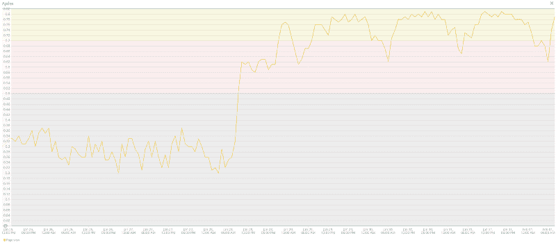
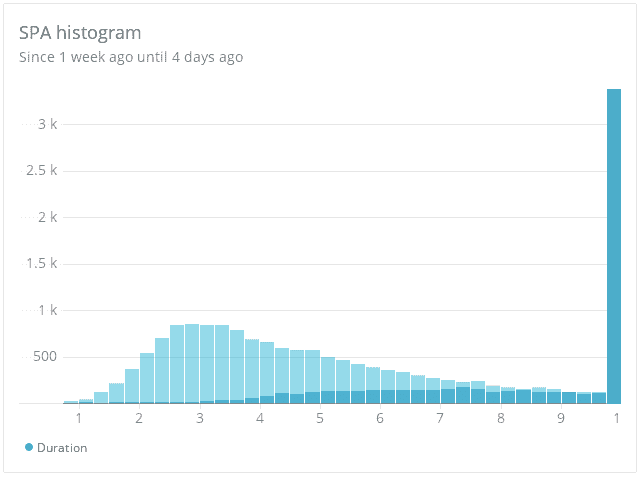

# 如何在 Angular 混合应用中实现提前编译

> 原文：<https://www.freecodecamp.org/news/angular-hybrid-app-ahead-of-time-compilation-204ced918ec7/>

卡米尔·马拉兹

# 如何在 Angular 混合应用中实现提前编译

#### 以及你为什么想这么做

超前(AOT)编译在 Angular 社区是一个大词。每个人都想让它运行起来。如果你使用 [Angular CLI](https://cli.angular.io/) 开始一个新项目，你就赢了。没有什么比[在你的终端中包含“— aot”选项](https://angular.io/guide/aot-compiler#angular-compilation)更简单的了。

但是如果您有一个定制的 Webpack 配置呢？或者你正在使用[升级模块](https://angular.io/guide/upgrade)并且你有一个混合角度应用？看看我们是如何在[管理](https://admin.sli.do)—[Slido](https://slido.com)用户管理界面中处理这个特殊问题的。

#### 提前与及时

AOT 和准时编译之间的区别在于编译发生的步骤。对于 AOT，我们正在谈论构建阶段。这发生在浏览器中运行应用程序之前。当应用程序在浏览器中运行时，就会进行 JIT 编译。

如[角度指南中所述:](https://angular.io/guide/aot-compiler#the-ahead-of-time-aot-compiler)

> “在浏览器下载和运行代码之前，Angular 提前编译器会在构建阶段将您的 Angular HTML 和类型脚本代码转换为高效的 JavaScript 代码。”

启用 AOT 的优势之一是**更快的应用程序渲染。**由于所有的应用程序部件在通过浏览器下载时已经被编译，因此应用程序的引导时间以及使用期间的渲染时间显著减少。

另一个好处是**更小的束尺寸。**当你在使用 AOT 的时候，你不需要包含 [@angular/compiler](https://angular.io/api/core/Compiler) ，因为不再需要了。编译后的应用程序可能会增加其包的大小，但这很大程度上取决于您的应用程序的具体情况。

第三，**发现模板中编译错误的可能性要高得多，**因为编译时编译器会通知你。如果你正在使用 Visual Studio 代码，你可以使用 [Angular 语言服务扩展](https://marketplace.visualstudio.com/items?itemName=Angular.ng-template)，因为它实时启用了 AOT 诊断。

#### 启用 AOT 所需的步骤

第一步，恰好是运行*NPM install[@ ng tools/web pack](https://www.npmjs.com/package/@ngtools/webpack)*。

接下来，您必须正确配置 Webpack。在这一步中，您需要配置@ngtools 附带的 AngularCompilerPlugin。使用配置参数，您将设置 tsconfig 和条目文件的位置。大多数情况下，您希望为 JIT 和 AOT 使用单独的 tsconfigs。你马上就会明白为什么了。

在您的标准 tsconfig 中，您需要排除 main.aot.ts 文件，这是使用 aot 编译的应用程序的入口点。在这个文件中，您将导入仅在构建期间可用的文件。这样你可以很容易地区分 JIT 和 AOT 编译，不会有任何错误。

AOT 的 Tsconfig 是普通的。没什么特别的。

下一个文件将展示我们如何在 JIT 和 AOT 之间拆分构建。在这种情况下，JIT 用于开发环境，而 AOT 用于生产环境。

AOT 使用 platformBrowser 而不是 platformBrowserDynamic。下一个重要步骤是导入工厂文件，这些文件将在构建期间可用。

#### 性能改进

从一开始，我们希望启用 AOT 是有原因的——让[管理](https://admin.sli.do)应用程序有更好的性能。这是一个简短的对比，比较了哪些方面有所改进，哪些方面保持不变:

如您所见，即使包的大小略有增加，初始加载时间也显著减少了。

Apdex measured before and after the release of AOT to the production.

Average load times decreased even when throughput remained the same.

Average load times compared in a histogram overlay (dark=JIT,light=AOT).

#### 包裹

启用 AOT 为我们所有的用户带来了显著的改善。初始加载时间显著改善，应用程序也加快了速度。

如果您从未考虑过在生产中启用 AOT，现在是时候了。关于这个话题你有什么问题吗？随时联系我。