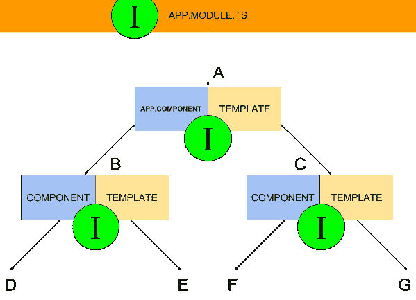

# 解释了角度服务和依赖注入

> 原文：<https://www.freecodecamp.org/news/angular-services-and-dependency-injection-explained/>

# **服务和注入器**

组件负责呈现到模板中的数据。利用外部*服务*可以简化这一职责。另外，封装无关的东西更容易维护。

将太多的职责委托给单个组件会使组件类变得复杂。如果这些责任适用于几个组件呢？复制粘贴这样的逻辑是极其拙劣的做法。未来对逻辑的任何更改都将更难实现和测试。

Angular 旨在通过服务和依赖注入来解决这个问题。这两个概念共同提供*模块化*功能。

组件也不需要提供任何无关的信息。服务代表它服务的组件导入它需要的功能。组件只需要实例化服务。从那里，他们用实例化的服务实例*服务*他们自己的需求。

至于测试和未来的修改，所有的逻辑都在一个地方。服务从其源实例化。对源代码的测试和修改适用于注入服务的任何地方。

## 服务介绍

服务是一种类型的*示意图*可在 Angular。它可以通过命令行界面(CLI)生成:`ng generate service [name-of-service]`。用一个更好的名字替换`[name-of-service]`。CLI 命令会产生以下结果。

```
import { Injectable } from '@angular/core';

@Injectable({
  providedIn: 'root'
})
export class LoggerService {
  constructor() { }
}
```

服务的逻辑在其类中是不同的。Angular 将一个类解释为基于`@Injectable`装饰器的*可注入的*服务。注射服务必须*向注射器注册*。

组件实例化一个服务，而注入器提供那个实例。请继续阅读下一节，了解更多关于喷油器的信息。

`@Injectable`元数据字段`providedIn: ‘root’`指向当前应用程序的根模块(`app.module.ts`)。它向模块的注入器注册服务，这样它就可以*将该服务注入*到它的任何子模块中。

注入器是 Angular 的依赖注入系统的构建模块。在继续服务之前，注射器是集中注意力的好地方。

## 注射器

以`app.module.ts`开头的应用程序包含一个注射器层次结构。它们存在于应用程序树中的每个模块和组件旁边。



绿色圆圈表示注射器。它们为实例化组件提供服务实例。根据服务注册到哪个注入器，它可能对组件可用，也可能不可用。

在应用程序根(`app.module.ts`)注册的服务可用于所有组件。组件的注入器可能没有注册特定的服务。如果是这种情况，并且组件请求其实例化，那么注入器将遵从其父组件。这种趋势一直持续到到达根注入器或找到服务。

看这个图，假设一个服务在 B 点的注入器注册。C 点及其以下的所有组件都将无法访问在 B 的注射器上注册的服务。注入者永远不会将服务实例委托给他们的孩子。

### 依赖注入

有多种方法可以向应用程序的注入器注册服务。

`@Injectable`的`providedIn: ‘root’`元数据字段提供了最推荐的方法。这个元数据字段随 Angular 6 一起发布。

如前所述，`providedIn: ‘root’`向根模块注入器注册了一个服务。结果，它在整个应用程序中都是可实例化的。

`providedIn: ‘root’`的新颖之处在于*撼树*。如果服务注册后没有被使用，它就会在运行时从应用程序中得到*震动*。这样它不会消耗任何资源。

另外两种方式更加直接和传统。当然，他们不提供摇树。

服务可以向组件树中的任何注入器注册。您将服务作为提供者插入到`@Component`元数据字段:`providers: []`。该服务可用于组件及其子组件

在第三个注册策略中，`providers: []`元数据作为它自己的字段存在于`@NgModule`装饰器中。从模块到底层组件树，服务都是可实例化的。

请记住，与`providedIn: ‘root’`不同，`@NgModule`注册不提供树摇动。这两种策略在其他方面是相同的。一旦服务向`@NgModule`注册，即使应用程序没有使用，它也会消耗资源。

## 服务继续

接下来是编写实际的服务。概括地说，服务代表应用程序的组件处理某些功能。

服务擅长处理常见操作。通过这样做，它们免除了组件的责任。它节省了时间，不必跨多个组件重写常见操作。它也更容易测试，因为代码在一个地方。改变只需要在一个地方发生，而不需要在其他地方寻找。

## 用例

几个例子对全面理解服务大有帮助。

*   控制台日志
*   API 请求

这两种情况在大多数应用程序中都很常见。让服务来处理这些操作将降低组件的复杂性。

### 控制台日志

这个例子建立在基础`@Injectable`骨架上。通过执行 CLI ( `ng generate service [name-of-service]]`)可以使用该框架。

```
// services/logger.service.ts

import { Injectable } from '@angular/core';

interface LogMessage {
  message:string;
  timestamp:Date;
}

@Injectable({
  providedIn: 'root'
})
export class LoggerService {
  callStack:LogMessage[] = [];

  constructor() { }

  addLog(message:string):void {
      // prepend new log to bottom of stack
      this.callStack = [{ message, timestamp: new Date() }].concat(this.callStack);
  }

  clear():void {
      // clear stack
      this.callStack = [];
  }

  printHead():void {
      // print bottom of stack
      console.log(this.callStack[0] || null);
  }

  printLog():void {
      // print bottom to top of stack on screen
      this.callStack.reverse().forEach((logMessage) => console.log(logMessage));
  }

  getLog():LogMessage[] {
      // return the entire log as an array
      return this.callStack.reverse();
  }
}
```

LoggerService 通过`@Injectable`元数据向根模块注册。因此它可以在`app.component.html`中实例化。

```
// app.component.ts

import { Component, OnInit } from '@angular/core';
import { LoggerService } from './services/logger.service';

@Component({
  selector: 'app-root',
  templateUrl: './app.component.html'
})
export class AppComponent implements OnInit {
  logs:object[] = [];

  constructor(private logger:LoggerService) { }

  updateLog():void {
      this.logger.printHead();
      this.logs = this.logger.getLog();
  }

  logMessage(event:any, message:string):void {
      event.preventDefault();

      this.logger.addLog(`Message: ${message}`);
      this.updateLog();
  }

  clearLog():void {
      this.logger.clear();
      this.logs = [];
  }

  ngOnInit():void {
      this.logger.addLog(“View Initialized”);
      this.updateLog();
  }
}
```

模板 HTML 提供了对 LoggerService 组件使用的进一步了解。

```
<!-- app.component.html -->

<h1>Log Example</h1>

<form (submit)="logMessage($event, userInput.value)">
  <input #userInput placeholder="Type a message...">
  <button type="submit">SUBMIT</button>
</form>

<h3>Complete Log</h3>
<button type="button" (click)="clearLog()">CLEAR</button>
<ul>
  <li *ngFor="let log of logs; let i=index">{{ logs.length - i }} > {{ log.message }} @ {{ log.timestamp }}</li>
</ul>
```

这有一种 ToDo 应用程序的感觉。您可以记录消息和清除消息日志。想象一下，如果来自服务的所有逻辑都被推到 AppComponent 中！这会使代码变得复杂。LoggerService 保存从核心 AppComponent 类封装的日志相关代码。

### 获取请求

这里还有一个值得玩味的例子。多亏了 [typicode 的 JSONPlaceholder¹T3，这个例子才成为可能。这个 API 是公开的，可以免费使用。](https://jsonplaceholder.typicode.com/)

```
import { Injectable } from '@angular/core';
import { HttpClient } from '@angular/common/http';
import { Observable } from 'rxjs';

// https://jsonplaceholder.typicode.com
// public API created by typicode @ https://github.com/typicode

interface Post {
  userId:number;
  id:number;
  title:string;
  body:string;
}

@Injectable({
  providedIn: 'root'
})
export class PlaceholderService {
  constructor(private http:HttpClient) { }

  getPosts():Observable<Post[]> {
      return this.http.get('https://jsonplaceholder.typicode.com/posts');
  }

  getPost(id:number):Observable<Post> {
      return this.http.get(`https://jsonplaceholder.typicode.com/posts/${id}`);
  }
}
```

这与其说是一个完整的例子，不如说是一个独立的例子。Fetch 请求作为可注入的服务工作得更好。替代方案是一个过于复杂的组件。注入的类订阅 PlaceholderService 预先配置的内容。

## 结论

服务和依赖注入一起非常有用。它们允许开发人员封装公共逻辑，并跨多个不同的组件注入。仅此一点就为将来的维护带来了巨大的便利。

注入器作为中介工作。它们在实例化组件和注册服务库之间起中介作用。注入器向其分支子节点提供这些可实例化的服务。

有关服务和依赖注入的更多信息，请参见接下来的几个链接。

## **角度资源**

*   [角度文件](https://angular.io/docs)
*   [角度依赖注入简介](https://www.freecodecamp.org/news/angular-dependency-injection-in-detail-8b6822d6457c/)
*   [什么是依赖注入，何时使用](https://www.freecodecamp.org/news/a-quick-intro-to-dependency-injection-what-it-is-and-when-to-use-it-7578c84fa88f/)
*   [最佳角码示例](https://www.freecodecamp.org/news/the-best-angular-examples/)
*   [Angular GitHub 知识库](https://github.com/angular/angular)
*   [依赖注入](https://angular.io/guide/dependency-injection-pattern)
*   [服务和 DI 简介](https://angular.io/guide/architecture-services)