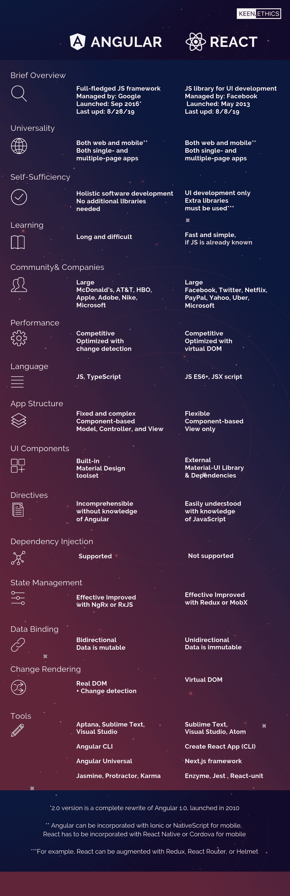
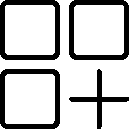
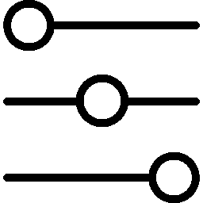

# 角度与反应:为你的应用选择哪一个

> 原文：<https://www.freecodecamp.org/news/angular-vs-react-what-to-choose-for-your-app-2/>

### Angular 和 React 的一般和技术方面的精确对比

标题为“角度 vs 反应”、“反应 vs 角度”、“角度还是反应”的文章实在太多了——你打开这一篇简直是奇迹！然而，这些文章缺少的是 Angular 与 React 的精确对比。

> 所以这就是我在这篇博文中要做的:将 [反应](https://keenethics.com/tech-front-end-react) 和 [有角](https://keenethics.com/tech-front-end-angular) 直接并置。我们将回顾和对比这两个 JavaScript 框架，并查看每个可能的特征，以确保我们不会遗漏任何一个数据。

最后，我不会告诉你选择哪种技术。但是我会给你足够的精神食粮，让你选择最适合你和你的项目的技术。



Download to get a high quality image


## 1.简要概述

### 反应

React 是一个用于 UI 开发的 JavaScript 库。它由脸书和一个开源开发者社区管理。

该框架于 2013 年 5 月推出。

最新更新发布于 2019 年 8 月 8 日——就在一个多月前。

### 有角的

Angular 是一个用于 web 和移动开发的开源 JavaScript 框架。它基于 TypeScript，由 Google 的 Angular 团队和 Angular 开发者社区管理。

Angular(也称为 Angular 2.0)于 2016 年 9 月推出，是对 2010 年推出的 AngularJS (Angular 1.0)的完全重写。

Angular 已经有六个版本，最近一次发布是在 2019 年 8 月 28 日，差不多三周前。


## 2.一般性

### 反应

React 是一个用于 web 和移动开发的框架。但是，对于移动开发，它需要与 Cordova 合并。而且，对于移动开发，还有一个额外的框架——React Native。

React 可用于构建单页面和多页面 web 应用程序。

### 有角的

Angular 适合 web 和移动开发。然而，在移动开发中，很大一部分工作是由 Ionic 完成的。此外，与 React 类似，Angular 还有一个额外的移动开发框架。React Native 的对应物是 NativeScript。

Angular 也可以用于单页和多页 web 应用程序。


## 3.自给自足

### 反应

React 是一个用于 UI 开发的框架，所以用 React 编写的应用程序需要额外的库来使用。例如，Redux、React Router 或 Helmet 优化了状态管理、路由和与 API 交互的过程。数据绑定、基于组件的路由、项目生成、表单验证或依赖注入等功能需要安装额外的模块或库。

### 有角的

Angular 是一个成熟的软件开发框架，通常不需要额外的库。上述所有功能——数据绑定、基于组件的路由、项目生成、表单验证和依赖注入——都可以通过角度包的方式实现。


## 4.学习曲线

### 反应

React 是极简的:没有依赖注入，没有经典模板，没有过于复杂的特性。如果你已经很了解 JavaScript，这个框架会很容易理解。

然而，由于没有预定义的项目结构，学习如何设置项目需要花费相当多的时间。您还需要学习 Redux 库，它在超过一半的 React 应用程序中用于状态管理。不断的框架更新也需要开发人员付出额外的努力。此外，React 中有很多最佳实践，您需要学习这些实践来正确地做事。

### 有角的

Angular 本身就是一个巨大的库，学习与之相关的所有概念将比 React 花费更多的时间。Angular 更难理解，有很多不必要的语法，组件管理也很复杂。一些复杂的特性被嵌入到框架核心中，这意味着开发人员无法避免学习和使用它们。此外，解决一个问题有很多方法。

尽管 TypeScript 非常类似于 JavaScript，但也需要一些时间来学习。由于框架是不断更新的，开发人员需要付出额外的学习努力。


## 5.社区

### 反应

React framework 是全球最流行的 JS 框架之一，支持和开发它的社区非常庞大。

使用 React，你必须是一个持续的学习者，因为框架经常更新。虽然社区试图尽可能快地更新最新的文档，但是跟上所有的变化并不容易。有时，可能会缺少文档，但该问题通常会通过主题论坛上的社区支持来解决。

React 被脸书、Twitter、网飞、Airbnb、PayPal、纽约时报、雅虎、沃尔玛、优步和微软等公司积极使用。

### 有角的

Angular 不如 React 受欢迎，并面临许多质疑，部分原因是 Angular 1.0 不受欢迎。开发人员过去认为这个框架过于复杂，因为它需要花费大量的时间来学习。然而，这个框架是由谷歌开发的，这有利于 Angular 的可信度。

Google 提供了该框架的长期支持，并不断对其进行改进。然而，更新是如此之快，以至于文档经常落后。

Angular 也被麦当劳、美国电话电报公司、HBO、苹果、福布斯、Adobe、耐克和微软等公司使用。


## 6.表演

### 反应

随着虚拟 DOM 的引入，React 的性能得到了极大的提高。因为所有的虚拟 DOM 树都是轻量级的，并且建立在服务器上，所以减少了浏览器的负载。此外，由于数据绑定过程是单向的，所以绑定不会像 Angular 那样被分配给观察者。不会产生额外的工作负载。

### 有角的

Angular 的表现更差，尤其是在复杂和动态的 web 应用程序中。

Angular 应用的性能受到双向数据绑定的负面影响。每个绑定都被分配了一个观察器来跟踪变化，并且每个循环继续进行，直到所有的观察器和相关的值都被检查完。正因为如此，绑定越多，创建的观察器就越多，这个过程就变得越麻烦。

不过 Angular 最近的更新在性能上有了很大的提升，再也不输于 React 了。而且，Angular 应用的大小略小于 React 应用的大小。


## 7.语言

### 反应

React 基于 JavaScript ES6+结合 JSX 脚本。JSX 是语法的扩展，它使得 JavaScript 代码类似于用 HTML 编写的代码。这使得代码更容易理解，错别字也更容易发现。为了在浏览器中编译 JSX 代码，React 增加了 Babel——一个代码翻译工具。

### 有角的

Angular 可以使用 JavaScript 或 TypeScript，这是专门为大型项目开发的 JS 的超集。TypeScript 比 JavaScript 更紧凑，代码更容易导航，并且容易发现输入错误。代码重构过程也变得更加简单和快速。


## 8.应用程序结构

### 反应

React 的结构为开发者提供了选择的自由。React 应用程序没有“唯一正确的结构”。然而，在每个项目开始时设计应用程序结构的必要性使得开始变得更困难和更长。

此外，React 仅提供视图层，而模型和控制器是通过使用其他库添加的。

React 应用的架构是基于组件的。代码由 React 组件组成，这些组件使用 React DOM 库呈现，并以两种方式定向:函数式(使用返回 JSX 的函数)...

```
function Hello(props){
return <div>Hello {props.name}</div>
}
```

...和基于类的(使用 ES6 类)。

```
class Hello extends React.Component {
render() {
return <h1>Hello, {this.props.name}</h1>;
}
```

### 有角的

Angular 的结构固定而复杂，适合有经验的开发者。

角度基于三个层次——模型、控制器和视图。负责模型的对象由控制器初始化，并与视图一起显示。

应用程序代码由不同的 Angular 组件组成，每个组件编写在四个独立的文件中:实现组件的 TypeScript、定义视图的 HTML 文件、定义风格特征的 CSS 文件以及用于测试目的的特殊文件。这些文件的链接写在 app 指令中，它显示了应用程序的结构逻辑。角度组件也可以重复使用。

```
import { Component } from '@angular/core';
@Component({
selector: 'my-app',
templateUrl: './app.component.html',
styleUrls: ['./app.component.css']
})
export class AppComponent { }
```



## 9.UI 组件

### 反应

React 的 UI 工具是由社区开发的。React 门户上有很多免费和付费的 UI 组件。要在 React 中使用材质设计组件，您必须安装一个附加库——材质-UI 库和依赖项。

### 有角的

Angular 有一个内置的材质工具集，它提供了各种预构建的材质设计组件。有各种按钮、布局、指示器、弹出窗口和表单控件。正因为如此，UI 配置变得更加简单快捷。


## 指令

### 反应

在 React 中，模板和逻辑在一个地方解释——在组件的末尾。它允许读者快速理解代码的意思，即使他们不知道语法。

### 有角的

在 Angular 中，每个模板都返回一个属性——一个如何设置对象的指令。角度指令的语法复杂而精密，这使得没有任何使用该技术经验的读者难以理解。



## 11.状态管理

### 反应

在 React 中，每个组件都有自己的状态。React 开发人员可以创建特殊的组件来保存整个应用程序或其特定部分的状态。这里的主要缺点在于，全局状态需要存储在应用程序的多个不同部分，数据需要在不同的组件树级别之间手动传递。

```
class Clock extends React.Component {
  constructor(props) {
    super(props);
   this.state = {date: new Date()};
 }
  render() {
    return (
      <div>
        <h1>Hello world!</h1>
        <h2>Now is {this.state.date.toLocaleTimeString()}.</h2>
      </div>
    );
  }
}
```

为了解决这个问题，有一个专门的状态管理库——Redux。它的想法是将全局状态表示为单个有状态对象，在 reducers(特殊的 Redux 函数)的帮助下，在应用程序的不同部分进行更改。

状态管理库 MobX 提供了另一个解决方案。与 Redux 将全局状态存储在单个不可变的有状态对象中不同，MobX 只存储最少的必需状态，而其余的状态可以派生出来。

### 有角的

在 Angular 中，元件数据存储在元件特性中。父组件将数据传递给子组件。某些部分的状态变化可以被识别和重新计算，但在大型 app 中，它会导致多方向的树系列更新，这将很难跟踪。这些特性可以在状态管理库(如 NgRx 或 RxJS)的帮助下得到改进，这将确保数据流是单向的。

```
export class HeroListComponent implements OnInit {
  heroes: Hero[];
  selectedHero: Hero;
  constructor(private service: HeroService) { }
  ngOnInit() {
    this.heroes = this.service.getHeroes();
  }
  selectHero(hero: Hero) { this.selectedHero = hero; }
} 
```


## 12.依赖注入

### 反应

React 不完全支持依赖注入，因为它不完全符合函数式编程和数据不变性的思想。相反，它对所有组件都有一个全局状态。

### 有角的

Angular 的最大优势在于，与 React 不同，它支持依赖注入。因此，Angular 允许不同的商店有不同的生命周期。

```
import { Injectable } from '@angular/core';
import { HEROES } from './mock-heroes';
@Injectable({
  // we declare that this service should be created
  // by the root application injector.
  providedIn: 'root',
})
export class HeroService {
  getHeroes() { return HEROES; }
}
```


## 13.数据绑定

### 反应

数据绑定代表模型和视图之间的数据同步过程。React 应该增加了 Redux ，它允许您处理不可变的数据，并使数据流单向。单向绑定是可预测的，这有助于调试过程。

### 有角的

Angular 处理双向数据绑定和可变数据。虽然可变和不可变数据的优势是一个热烈讨论的问题，但使用双向数据绑定肯定比使用单向方法更容易。同时，双向数据绑定会对性能产生负面影响，因为 Angular 会自动为每个绑定开发一个观察器。

Angular 中的数据绑定方式:

```
{{expression}}   Interpolation
[target]="expression"    Property
bind-target="expression"    Attribute
```

```
(target)="statement" Event
on-target="statement" Event
```

```
[(target)]="expression" Two-way
bindon-target="expression" Two-way
```


## 14.更改渲染

### 反应

React 使用虚拟文档对象模型(DOM ),这使得在一个元素中轻松实现微小的数据更改，而无需更新整个树的结构。该框架创建数据结构的内存缓存，计算更改，并有效地更新浏览器中显示的 DOM。通过这种方式，整个页面似乎在每次更改时都会呈现，而实际上，库只呈现更改过的子组件。

React 团队一直在改进 Fiber——一种旨在提高变化渲染效率的机制。

### 有角的

Angular 使用真正的 DOM，即使单个元素发生了变化，它也会更新整个树结构。真实的 DOM 被认为比虚拟的 DOM 更慢、效率更低。

为了弥补这个缺点，Angular 使用变化检测来识别需要改变的组件。因此，Angular 上的真实 DOM 和 React 上的虚拟 DOM 一样有效。


## 15.工具

### 反应

React 由多个代码编辑器支持。例如，React 中的代码可以用 [Sublime Text](https://www.sublimetext.com/) 、 [Visual Studio](https://visualstudio.microsoft.com/) 和 [Atom](https://atom.io/) 进行编辑。要引导项目，可以使用 Create React App (CLI)工具。进而使用 Next.js 框架完成服务器端渲染。

要测试用 React 编写的整个应用程序，您需要多种工具。例如， [Enzyme](https://github.com/airbnb/enzyme) 用于组件测试， [Jest](https://jestjs.io/) 用于测试 JS 代码，React-unit 用于单元测试等等。要在开发模式下调试应用程序，可以使用浏览器扩展 React Dev 工具。

另一个有趣的工具是 [React 360](https://github.com/facebook/react-360) ，这是一个用于创建 AR 和 VR 应用的库。

### 有角的

与 React 类似，Angular 也受到各种代码编辑工具的支持。例如，你可能会使用诸如 [Aptana](http://www.aptana.com/) 、 [Sublime Text](https://www.sublimetext.com/) 和 [Visual Studio](https://visualstudio.microsoft.com/) 这样的代码编辑器。使用 [Angular CLI](https://cli.angular.io/) 可以快速设置项目。在 [Angular Universal](https://github.com/angular/universal) 的帮助下完成服务器端渲染。

与 React 不同，Angular 可以用一个工具进行全面测试。角度端到端测试的平台有[茉莉](https://jasmine.github.io/2.0/introduction.html)、[量角器](http://www.protractortest.org/#/)和[卡玛](https://karma-runner.github.io/latest/index.html)。在开发模式下调试应用程序的另一个工具是浏览器扩展[占卜](https://augury.rangle.io/)。

## 总结

Angular 是一个成熟的移动和网络开发框架。 **React** 是一个仅用于 UI 开发的框架，在附加库的帮助下，它可以变成一个成熟的解决方案。

乍看起来，React 似乎更简单，而且开始从事 React 项目花费的时间更少。然而，作为 React 主要优势的简单性被抵消了，因为您必须学习使用额外的 JavaScript 框架和工具。

Angular 本身比较复杂，需要相当一段时间才能掌握。然而，它是一个强大的工具，提供了全面的 web 开发体验，一旦你学会了如何使用它，你就收获了果实。

**没有更好的框架了。两者都在持续更新，以跟上竞争对手**。例如，尽管 React 因其虚拟 DOM 而被认为获胜，Angular 通过实现变化检测而得分相等。虽然 Angular 被认为是胜利的，因为它是由谷歌这样的权威公司开发的，但巨大的专用 React 社区完全补偿了谷歌的声誉，并使 React 类似于 Angular。

**最后，React vs Angular 完全是个人喜好问题，是技巧和习惯问题**。作为一名编程初学者，从 React 开始可能会受益更多。作为一名有经验的开发人员，您只需继续使用您更了解的东西。

不要忘记挑战自己，开始学习新的框架，反应或角度。作为项目经理或外包开发者的企业主，你应该和你的 web 开发团队一起选择最适合你们的框架，无论是 Angular 还是 React。

## 你对 Angular 或 React 项目有什么想法吗？

我的公司 KeenEthics 在 [react 开发](https://keenethics.com/tech-front-end-react)方面经验丰富，我们也为您的项目提供优秀的 [agularjs 开发人员](https://keenethics.com/tech-front-end-angular)。如果您需要以下服务，请随时联系**。**

如果你喜欢这篇文章，你一定会读到另一篇关于两个 JS 框架的精彩对比: [React vs Svelte:如何构建消息传递组件](https://keenethics.com/blog/react-vs-svelte-how-to-build-messaging-components)。

## 附言

我要感谢所有对本文有贡献的人，包括 Sergey Gornostaev 和 Volodya Andrushchak，全栈软件开发人员@ KeenEthics。

KeenEthics 博客上发布的原文可以在这里找到: [Angular vs React:你的 App 选哪个](https://keenethics.com/blog/angular-vs-react-what-to-choose-for-your-app)。