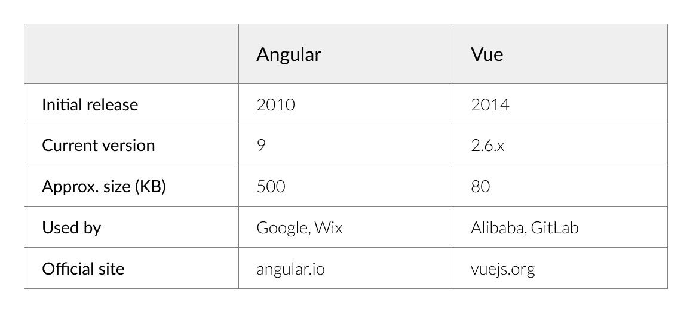
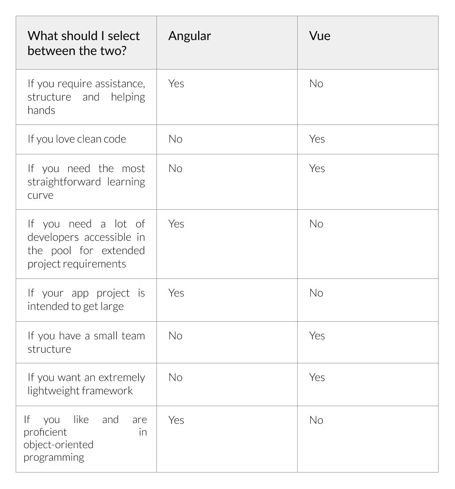

# angular vs . Vue——2020 年编程哪个最好？

> 原文：<https://www.freecodecamp.org/news/angular-vs-vue-which-is-best-for-programming-in-2020/>

Angular 是 Google 先进成熟的 JavaScript 框架。它很实用，很有用，但是构建应用程序需要时间。

另一方面，Vue 更适合要求较低的应用，通常用于快速原型开发。

尽管 [Angular](https://angular.io/) 大受欢迎，谷歌在为谷歌图表库开发反应式包装器时还是选择了 Vue。

越来越多的其他大公司使用 Vue，帮助它成为当今可用的顶级前端工具之一。

这个话题——React vs Vue——现在很流行，看起来会像另一个常见的辩论一样受欢迎(见 [React vs Angular](https://technostacks.com/blog/react-vs-angular/) )。

那么哪个更适合你的项目呢？让我们更详细地看一下每个框架。

## 这一切是如何开始的

**Angular** ，由谷歌打造，最初发布于 2010 年。它是一个基于 TypeScript 的 JavaScript 框架。Angular 被认为是 T2 最流行的编程语言之一。

2016 年 Angular 2 发布时，许多变化都被揭示出来了。它最近的稳定版本是 Angular 9，于 2020 年 2 月发布。如果你对 [Angular 8 和 Angular 9](https://technostacks.com/blog/features-and-differences-of-angular9-and-angular8) 之间的区别感兴趣，这里有一个有用的资源。

Vue.js 由一名前谷歌员工于 2014 年创建。从那以后，它成长了很多，尽管它没有这样一个庞大组织的支持。

目前的稳定版是 2.6，发布于 2019 年 2 月，至今定期增量发布。Vue 3，目前在 alpha 中，设置为转移到 TypeScript。

以下是他们的基本统计数据:



现在我们来总结一下 Angular 和 Vue，帮助您选择适合自己的框架。

## Angular 和 Vue 在 2020 年的位置

如果我们在 2020 年比较 Angular 和 Vue，堆栈溢出趋势告诉我们， [Angular 在 React](https://insights.stackoverflow.com/trends?tags=jquery%2Cangularjs%2Cangular%2Creactjs) 之后被提及最多。尽管如此，Vue 的受欢迎程度近年来仍在持续增长。

尽管 Vue 越来越受欢迎，但它可能不是特定项目的正确选择。例如，Angular 更适合于庞大的 UI 应用程序。

这两个框架都非常流行，但是数量并不相等。根据 2019 年的[堆栈溢出调查，大约 30%的开发人员在他们即将到来的项目中使用 Angular，而大约 15%的开发人员使用 Vue。](https://insights.stackoverflow.com/survey/2019)

## 让我们根据以下条件来理解 Angular 和 Vue

### 数据绑定

Angular 在范围中使用双向绑定。它还支持异步服务，这对于试图整合第三方构建的元素的程序员很有帮助。

Vue 利用元素间的单向数据流。此外，它可以轻松地促进数据流，并使重要的应用程序开发变得快速而简单。程序员可以使用库来处理异步服务。

Vue 数据绑定和 Angular 中的一样。我们使用相同的双花括号和模型属性来绑定值。

让我们看一个例子:

在 data()函数中声明变量:

```
data(){
return {
name:"Raja",
a:10,
b:20,
emp:{name:'Mano',age:20,gender:'Male'}
}
}
```

与 Angular 相比，Vue 中的变量声明有一个变化。我们使用等号(=)在 Angular 中赋值，而在 Vue 中，需要使用冒号(:)。

### Vue.js 中的变量声明语法

```
variable_name:value
```

Vue.js 遵循相同的 TypeScript 标准。所以你用上面的语法(一个冒号)使用你所有的角度变量类型。

对于创建奇异变量、对象、数组和对象数组，它与 Angular 中的相同。

使用双花括号将变量放入用户界面- {{}}

```
<div id="app">
<h3>Name:{{name}}</h3>
<p>Addition of 10 and 20 is {{a+b}}</p>
<p>Emp Name : {{emp.name}}</p>
<p>Emp Age : {{emp.age}}</p>
<p>Emp Gender : {{emp.gender}}</p>
</div>
```

对于双向数据绑定，我们在 Angular 中使用 ngModel，而在 Vue.js 中，我们使用 v-model。

### 综合

将 Angular 与第三方元素和其他 JavaScript 库集成起来很简单。

Vue 也使得集成许多流行的前端库变得容易，即使一个项目已经在进行中。

### 复杂程度

Angular 比 Vue 更复杂，无论是设计还是它的 API。相比 Vue，用 Angular 构建一个复杂的 app 更费时。

Angular 的文档也要复杂得多。开发人员需要花大量时间浏览文档来理解它的核心概念。对于 Angular 的新手来说，拿起它并开始构建应用程序是很困难的。

无论是在设计层面还是在 API 层面，Vue 都更容易管理。任何懂得 HTML、CSS 和 JavaScript 的人都可以使用 Vue 在不到一天的时间内构建一个单页面应用程序。

### 灵活性

Angular 为一系列系统提供官方支持，对整个项目结构没有限制。因为它非常灵活，开发者对它评价很高。

即便如此，Angular 还是固执己见。开发人员需要坚持总体项目结构，并遵循特定的设计模式。

Vue 是灵活的，但不如 Angular 灵活。

### 表演

Angular 在性能方面没有让开发者失望。速度很快，即使有很多观察者。每当项目的规模发生变化，观察者都需要重新评估整个项目。即便如此，Angular 在许多基准测试中表现出色。

Vue 速度很快，在相同的基准测试中表现与 Angular 相似。

### 以打字打的文件

Angular 的学习曲线更陡的原因之一是因为它使用了 TypeScript。虽然那些精通 JavaScript 的人在学习 TypeScript 时应该没有问题，但初学者可能会觉得很难。

您必须学习 TypeScript 才能使用 Angular，因为它的学习资源和文档都是基于 TypeScript 的。

TypeScript 的好处是它为缩放的应用程序提供静态类型检查。这意味着开发人员在整个应用程序中获得了类型安全，从而节省了总体时间并降低了运行时出错的几率。

虽然 Vue 有 TypeScript 支持，但用得不多。也就是说，Vue 最终可能会成为一个完全基于类型脚本的平台。

## Angular 和 Vue 哪个最适合前端开发？

考虑到所有的好处和限制，Angular 在项目利用它的许多功能和特性时是最好的。

另一方面，Vue 更适合较小的开发项目和速度很重要的应用程序(这弥补了它较少的特性)。

此外，Angular 比 Vue 拥有更多的社区支持。尽管如此，Vue 越来越受欢迎导致了社区支持的增加，正如其在 Github 上越来越多的明星所证明的那样。

## 那么整体来说，Angular 和 Vue 哪个最好？

如果你想使用 Angular，你需要了解 MVC 和 TypeScript 等概念。但 Vue 的情况并非如此。

此外，Vue 提供了基本的应用程序模板和更广泛的自定义功能，这使得它比 Angular 更容易使用。

另一个要考虑的因素是架构。Angular 使用 MVVM(模型-视图-视图模型)和 MVC(模型-视图-控制器)来开发网站和基于 web 的应用程序。另一方面，Vue 关注的是 ViewModel，它有一点限制性。

### 可伸缩性呢？

Angular 在可扩展性竞争中领先。这是因为 Angular 有模块化的开发结构，而 Vue 使用基于模板的语法。这种基于模板的语法降低了大型应用程序中代码的总体可重用性。

### 装货时间呢？

Angular apps 没有用 Vue 搭建的那么轻。但是新的 Angular 版本具有提前(AOT)编译和树抖动等特性，这大大缩减了应用程序的大小。

由于加载时间在很大程度上取决于应用程序的大小，Vue 移动应用程序加载更快。

### 语法呢？

在使用这两个平台时，开发人员经常发现 Vue 在语法方面更简单。

Angular 使用 TypeScript(带有注入器和装饰器)，所以开发人员需要对该语言有一个基本的了解。他们还应该具有面向对象编程系统(OOPS)概念的经验。

让我们看看 Angular 和 Vue 中的一些代码:

1.  **角度**

```
<div>
  <h2>Hello {{name}}</h2>
</div>
```

```
Import {  Component  } from ‘@angular/core’ ;

@Component ({
  selector:  ‘my – app’,
  templateUrl:  ‘src/app/app.component.html’
})

export class AppComponent {
  constructer() {}
  name: string = ‘Angular 2’;
}
```

**2 .视图〔t1〕**

```
<!DOCTYPE html>
<html lang="en">
    <meta>
       <meta charset="UTF-8">
        <title>Hello world example</title>
     </meta> 

<body>

    <div id="hello-world-example">
        <h1>{{ hello world }}</h1>
    </div>

    <script>
       new vue({
           el: "#hello-world-example",
           data()  {
              return  {
                  msg: "Hello World!"
               }
          }
     });
     </script>

  </body>
</html>
```

## 关键要点

Vue 变得比 Angular 更受欢迎了吗？Vue 非常轻量级，相对容易学习。它让你以自己的方式开发引人注目的应用程序。

此外，Laravel 社区认为它是最受欢迎的前端框架。

另一方面，Angular 是一个更加成熟的框架，拥有许多技术工具。

下面的总结可以帮助你做出决定。



如果你还是拿不定主意，那就两个都试试，看看你更喜欢哪个。

我们在 [**Technostacks**](https://technostacks.com) 有一群专业开发人员，他们都精通开发和设计无缝项目。我们利用包括 Angular 和 Vue 在内的所有最新技术来构建强大而完美的在线体验。