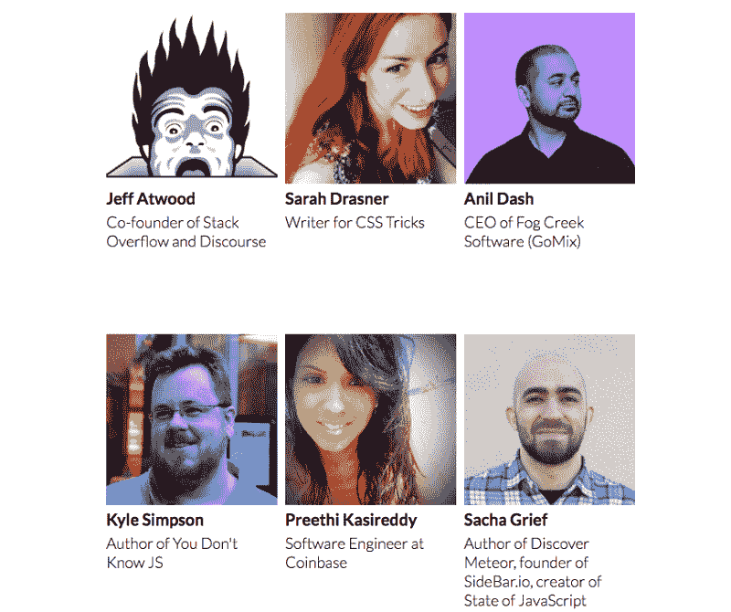

# 宣布#Open2017，面向开发者的新年前夕直播

> 原文：<https://www.freecodecamp.org/news/announcing-open2017-the-online-new-years-eve-event-for-developers-cf7bf57e6ac9/>

以下是新年前夜留在家里的几个理由:

*   对于致命的酒后驾车死亡来说，这是一年中最糟糕的一天
*   很拥挤
*   冷死了

Time’s Square during last year’s New Year’s Eve celebration, packed with brave souls who can go all night without a bathroom break.

最重要的是，如果你出去，你会错过#Open2017。

#Open2017 是一个长达 4 小时的互动直播，面向开发者，由开发者提供。

我们将在纽约市落球前一小时开始，然后继续直播，直到旧金山的午夜。

没错，我们将四次敲响新年的钟声，每次都带来激动人心的新客人:

*   [杰夫·阿特伍德](http://twitter.com/codinghorror)共同创建了堆栈溢出和话语，并经营着热门的[编码恐怖](https://blog.codinghorror.com/)博客。
*   莎拉·德拉斯纳通过她的[网络动画工作室](https://webanimationworkshops.com/)和 [CSS 窍门](https://css-tricks.com/)教授网络动画。
*   [Anil Dash](https://www.freecodecamp.org/news/announcing-open2017-the-online-new-years-eve-event-for-developers-cf7bf57e6ac9/undefined) 是一名博客作者、连续创业者，也是 Fog Creek 软件( [GoMix](http://gomix.com) )的新任 CEO。
*   [凯尔·辛普森](https://twitter.com/getify)是《你不知道的 T2》JS 的作者。
*   Preethi Kasireddy 是一名风险投资家出身的软件工程师。你可能已经看过[在这里用媒体](https://medium.freecodecamp.com/learning-how-to-learn-the-most-important-developer-skill-7bf62dfaf67d)写的一些东西。
*   [Sacha Greif](https://www.freecodecamp.org/news/announcing-open2017-the-online-new-years-eve-event-for-developers-cf7bf57e6ac9/undefined) 是 [Discover Meteor](https://www.discovermeteor.com/) 的作者，组织了 JavaScript 的[状态调查。](https://medium.freecodecamp.com/the-state-of-javascript-2016-results-4beb4ff06961#.vnwpiy18b)
*   Jeff Meyerson 是[软件工程日报](https://softwareengineeringdaily.com/)的主持人。
*   Alexander Kallaway 是一名网络开发人员，也是 [#100DaysOfCode](https://twitter.com/search?f=tweets&vertical=default&q=%23100daysofcode&src=typd) 的创建者。
*   泰勒·麦金尼斯是 ReactTraining.com T2 的创作者。
*   本·哈尔彭是 [@ThePracticalDev](http://twitter.com/thepracticaldev) 的创作者。
*   Haseeb Qureshi 是 AirBnB 的一名软件工程师。
*   比尔·苏鲁尔是 DevMastery.com T2 的创始人。
*   [Shubheksha](https://www.freecodecamp.org/news/announcing-open2017-the-online-new-years-eve-event-for-developers-cf7bf57e6ac9/undefined) 维护[如何为开源](https://github.com/FreeCodeCamp/how-to-contribute-to-open-source)做贡献。
*   Heather Kusmierz 负责我们的前端课程。
*   Mrugesh Mohapatra 是一名软件工程师，也是我们开源项目的核心贡献者。
*   [Justin Richardson](http://twitter.com/hallaathrad) 是一名前端开发人员，负责管理我们 1，500 个本地学习小组。
*   杰克逊·贝茨主持我们的论坛。
*   凯瑟琳·金领导着我们当地的一个学习小组。

我的搭档将是 Briana Swift，一位长期的自由代码营贡献者，现在也在 GitHub 工作。 [Wesley McCann](http://github.com/septimus) 将负责本次活动的音频/视频。

我们的社区将一起回顾 2016 年，谈论技术，并探索 2017 年的编码将会是什么样子。

整个活动将对所有人免费开放。

如果您想收听并参与我们的实时聊天，您可以:

1.  将#Open2017 添加到您的日历中(如果您使用谷歌日历，只需[点击此链接](https://calendar.google.com/calendar/event?action=TEMPLATE&tmeid=djNsNm9haHRsN3NyODVrdnZidWJpdTlxbDAgZnJlZWNvZGVjYW1wLmNvbV92MzBzY2NubGNvMWo0anRtMGswNXJyczAxZ0Bn&tmsrc=freecodecamp.com_v30sccnlco1j4jtm0k05rrs01g%40group.calendar.google.com))。
2.  [订阅我们社区的 YouTube 频道](https://www.youtube.com/freecodecamp?sub_confirmation=1)，这样当我们开始播放视频时，您会收到电子邮件通知。
3.  发微博谈论这件事。

期待在那里见到你！

感谢您在百忙之中抽出时间阅读本文。如果你喜欢，点击？所以其他人会在媒体上看到这个。

