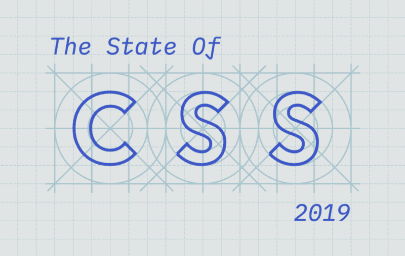
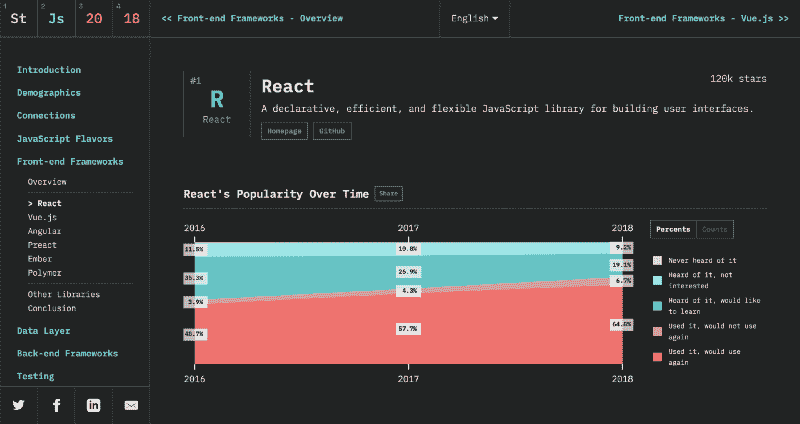
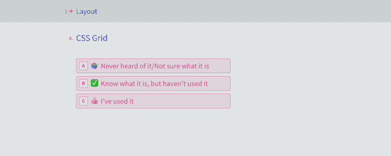
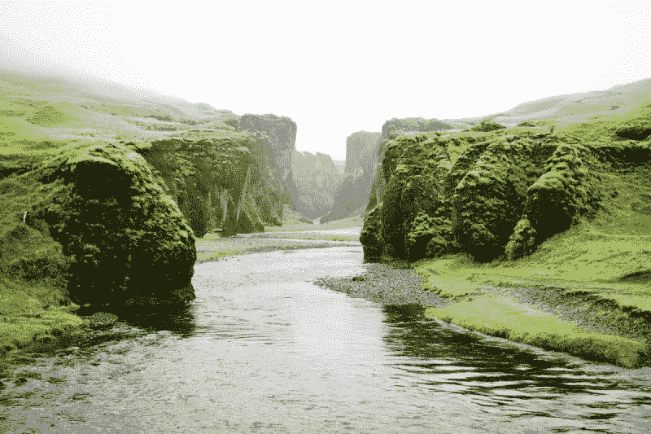

# 宣布 2019 年 CSS 调查状况

> 原文：<https://www.freecodecamp.org/news/announcing-the-state-of-css-2019-survey-e1e4268df64d/>

萨沙·格里菲

# 宣布#StateOfCSS 2019 调查

#### 在 JavaScript 的状态之后，帮助我们识别最新的 CSS 趋势

我使用 CSS 已经有 10 多年了，所以现在我对它已经非常了解了。我可以处理 flexbox，我已经掌握了 SASS，我甚至知道 ems 和 rems 的区别。

但是等等，现在也有网格了？和位置:粘性？我听说的 CSS-in-JS 是怎么回事？？原来，也许我终究不是那么了解 CSS

如果你有同样的感觉，首先让我说这是完全正常的。CSS 最近一直在以创纪录的速度发展，如果不小心的话，即使是最专注的开发人员也会落后。

其次，我有一些好消息要告诉你:这正是我们发起第一次 CSS 状态调查的原因。

#### ➡️ ️ [现在就参加调查吧！](https://stateofcss.com/?source=announcement)

### 从 JavaScript 到 CSS

你可能听说过 JavaScript 调查的[状态，我们从 2016 年开始每年都在进行。今年，我们有超过 20，000 名开发人员参加了调查，事实证明，这是一个关于 JavaScript 生态系统最新趋势的极有价值的数据和见解来源。](https://stateofjs.com/)

所以接下来看一看网络谜题的另一半是很自然的。

The 2018 State of JavaScript Survey

因为 CSS 和 JS 是完全不同的东西，所以我们从头开始重新思考我们的方法。例如，我们引入了一种新的问题类型，它不询问库或框架，而是询问语言本身的特性:

### 生死关头

这尤其有趣，因为它发生在许多人都在谈论前端(HTML、CSS)的“前面”和前端(JavaScript 及其许多框架和库)的“后面”之间的“T0”巨大鸿沟的时候。

On one side, HTML & CSS. On the other, JavaScript.

现在，虽然有很多人乐于弥合这种分歧，并接受前端的两个方面，但专注于一个领域而不是另一个领域也没有什么错。

但无论如何，这项调查将是一个很好的机会，让我们对当前存在的社区有一个大致的了解，并看看它在未来几年将如何演变。

### 感谢和后续步骤

非常感谢[弗洛里安](https://www.freecodecamp.org/news/announcing-the-state-of-css-2019-survey-e1e4268df64d/undefined)，[珍·西蒙斯](https://www.freecodecamp.org/news/announcing-the-state-of-css-2019-survey-e1e4268df64d/undefined)，[洛克兰·邦恩](https://www.freecodecamp.org/news/announcing-the-state-of-css-2019-survey-e1e4268df64d/undefined)，[大卫·卢尔](https://github.com/davidluhr)，以及所有给我反馈并帮助我修复一些令人烦恼的 CSS 错误的人(我知道这很讽刺…)！

我们会将调查持续到三月中旬，然后用一个月左右的时间来处理结果。所以希望我们能在四月底有所表现。如果你想知道结果何时公布，请不要犹豫[注册我们的简讯](https://stateofcss.com/?source=announcement)。

说了这么多，剩下的就是让你[参加调查](https://stateofcss.com/?source=announcement)，让我们知道 2019 年 CSS 的状态是什么样子。我们很想知道答案！

萨夏&拉斐尔