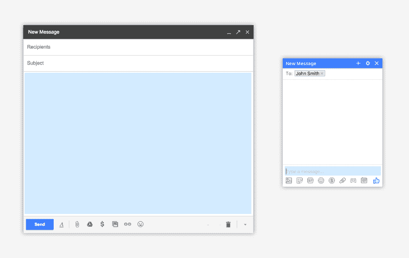
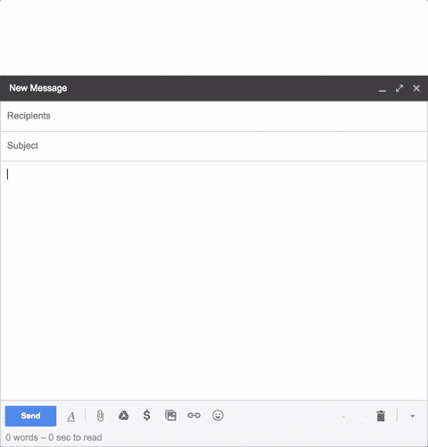

# 我如何构建 TinyMails:一个 chrome 扩展，帮助你写更短的电子邮件

> 原文：<https://www.freecodecamp.org/news/announcing-tinymails-a-simple-extension-that-helps-you-write-shorter-emails-ff89329a4f21/>

作者:弗洛伦特·克里韦洛

# 我如何构建 TinyMails:一个 chrome 扩展，帮助你写更短的电子邮件

我已经抱怨简洁的死亡有一段时间了。个人通信——尤其是电子邮件——一如既往地冗长。

其中一部分是因为现在生成大量内容要容易得多(电脑比打字机快，打字机比手写快)。

当你写一封电子邮件时，你的电子邮件客户会用一个漂亮的巨型文本栏来问候你，似乎在说:“现在是时候写你梦寐以求的小说了！”相比之下，IM 应用程序的文本字段小得可笑(蓝色):

诚然，电子邮件的内容比即时消息更丰富，但我也认为，如果这个盒子更小一些(并且像 Facebook Messenger 一样，在你键入时自动扩展)，人们会被迫写更短的电子邮件。

因此，本着“不要抱怨 X，而是构建 Y”的精神，我构建了 [TinyMails](https://www.producthunt.com/posts/tinymails) ，这是我的第一个 Chrome 扩展。当你写电子邮件时，TinyMails 会显示你写了多少字，以及估计阅读它需要多长时间。随着电子邮件变得越来越长，它还会逐渐使评估文本变得越来越红。

你可以在这里的 [Chrome 网上商店](https://chrome.google.com/webstore/detail/tinymails/flpmjncnhickgfkjgmeloenfjgpgcpni)下载它，在 ProductHunt 上给它[投票，然后被动-主动地把它发送给你认识的每一个在电子邮件中倾向于啰嗦的人(我在签名中加了一个链接)。](https://www.producthunt.com/posts/tinymails)

### 技术方面的东西

出于好奇，我将[扩展的源代码放在 GitHub](https://github.com/Altimor/TinyMails) 上。我使用了令人惊叹的 [InboxSDK](https://www.inboxsdk.com) ，它提供了一个高级 API 来处理 Gmail / Inbox，允许我专注于我的扩展的实际逻辑，并在 2 或 3 个小时内构建它。

当我对它进行编码和分析时，我注意到它的计算量比我想象的要多得多。一部分原因是 JavaScript 就是 JavaScript。但是我也这样做——每次按下一个键时——我克隆组成文本字段的整个 DOM，以便我能够从字数统计中删除签名。事实证明这不是微不足道的，所以我让它每秒钟最多做 5 次。这足以感受到实时性，但比之前的行为更节能。

请随时在 Twitter ( [@Altimor](https://twitter.com/Altimor) )上寻求反馈/建议，如果你喜欢，可以留下评论:)