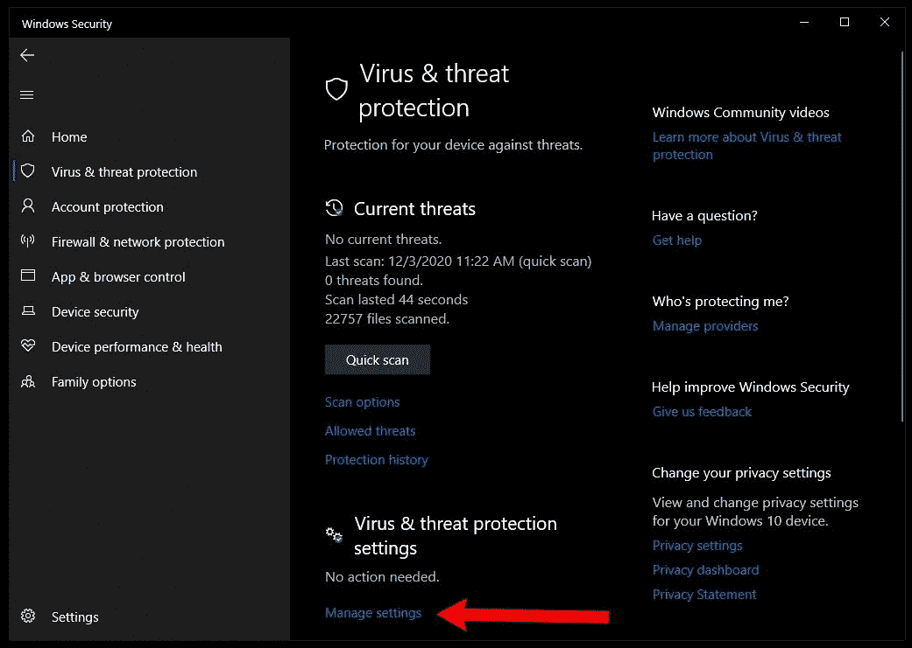
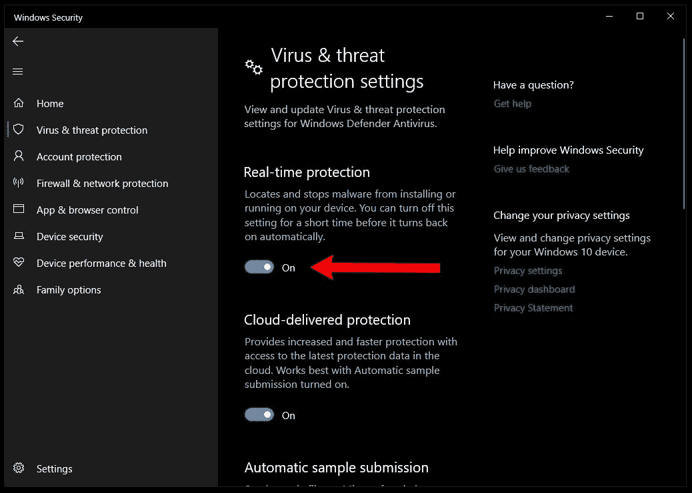
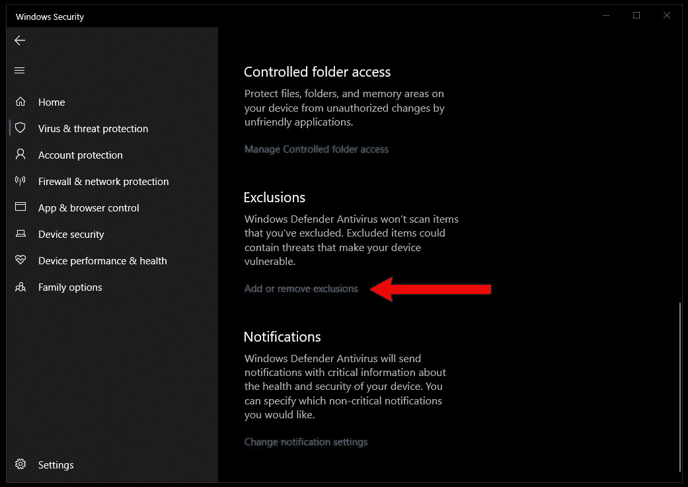
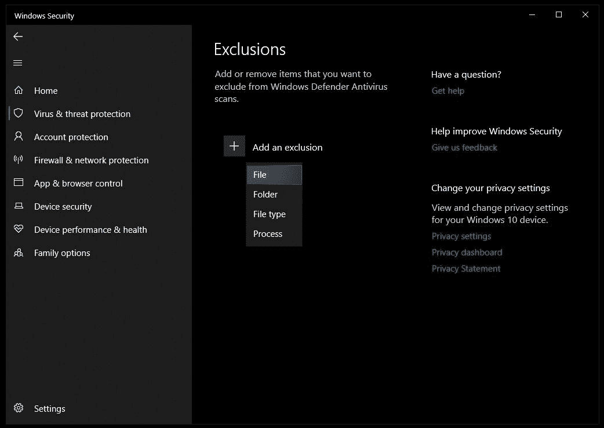
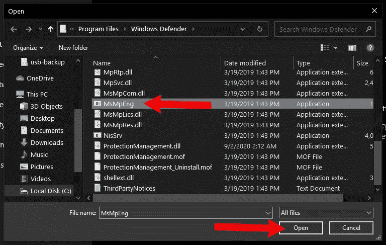
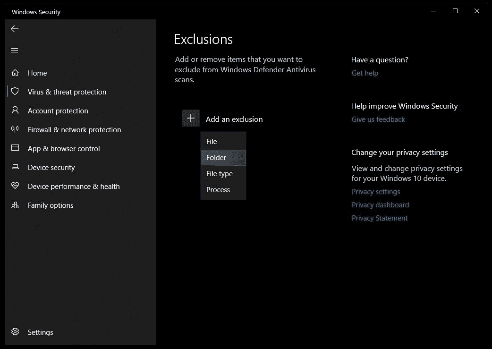
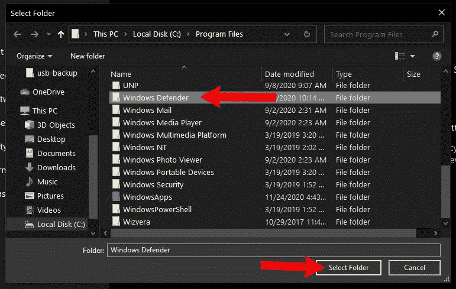

# 反恶意软件服务可执行文件:什么是 MsMpEng.exe，为什么它运行在 Windows 10 中？

> 原文：<https://www.freecodecamp.org/news/antimalware-service-executable-what-is-msmpeng-exe-and-why-is-it-running-in-windows-10/>

如果您曾经检查过 Windows 任务管理器以了解您的计算机运行如此缓慢的原因，您可能会注意到一个称为反恶意软件服务可执行文件的进程使用了大量的可用 CPU 或内存。

反恶意软件服务可执行文件或 MsMpEng.exe 是 Windows 10 附带的 Windows 安全套件的一部分。Windows 安全包括从反恶意软件工具到防火墙、帐户管理和保护服务等一切。

您的计算机在某些时候可能运行缓慢，因为 Windows 安全正在执行自动恶意软件检测扫描。偶尔，此扫描可能会遇到某些文件、文件夹或软件的问题，即使它们是安全的。

在本文中，我们将介绍一些可以提高 Windows 安全性能的方法。

## #1:检查第三方反恶意软件

一般来说，建议你在电脑上一次只运行一个反恶意软件/反病毒/反间谍软件。

同时运行 Windows Security 和 Malwarebytes 等第三方软件可能会导致双方都将对方视为潜在威胁的问题。这可能导致两者都无法正常工作的情况。

Windows 安全被认为是非常安全的，所以删除第三方安全软件是安全的。只需卸载第三方软件并重启计算机。

然后要检查 windows security 是否在运行，按 Windows 键，输入“Windows Security”，点击“Windows Security”打开应用程序:

Open the Windows Security app

单击“病毒和威胁防护”，然后单击“病毒和威胁防护设置”下的“管理设置”:

The Virus & threat protection menu

进入“病毒和威胁防护设置”菜单后，确保“实时防护”开关打开:

或者，如果您想使用第三方安全软件，只需首先安装和配置即可。然后重复上述步骤，关闭“实时保护”开关。

这将防止 Windows 安全扫描并可能将您的第三方软件标记为不安全。

## #2:阻止 Windows 安全扫描某些文件和文件夹

如前所述，在扫描某些文件、文件夹和可执行程序时，Windows 安全有时会遇到问题。

虽然您确实希望 Windows 安全尽可能多地扫描您的系统，但是您可以安全地排除一些内容，以减少它使用的 CPU 和内存量。

### 阻止 Windows 安全扫描 MsMpEng.exe

您可以尝试的第一件事是阻止反恶意软件服务可执行进程扫描自身。

按 windows 键，输入“Windows 安全”，点击“Windows 安全”打开 Windows 安全 app。

单击“病毒和威胁防护”，然后单击“病毒和威胁防护设置”下的“管理设置”:

The "Virus & threat protection" menu

在“病毒和威胁防护设置”菜单中，向下滚动到“排除”并单击“添加或删除排除”:

然后单击带有文本“添加例外项”的加号按钮，并单击“文件”:

然后在文件浏览器窗口中，选择`C:\Program Files\Windows Defender\MsMpEng`并点击“打开”:

现在，在扫描恶意软件时，Windows 安全将跳过反恶意软件服务可执行文件/MsMpEng.exe，并且应该比以前使用更少的可用 CPU 和内存。

### 阻止 Windows 安全扫描 Windows Defender 目录

类似于跳过反恶意软件服务可执行文件的最后一种方法，可以从反恶意软件扫描中排除整个 Windows Defender 目录。

遵循最后一种方法的步骤，但在单击“添加排除”按钮后，请选择“文件夹”:

然后在弹出的文件浏览器窗口中，选择`C:\Program Files\Windows Defender`并点击“选择文件夹”:

现在，Windows 安全将跳过 Windows Defender 文件夹中的所有内容，包括 MsMpEng.exe 文件本身。

## #3:考虑升级你的电脑

如果其他解决方案都不起作用，升级你的电脑部件可能是值得的。截至 2020 年，新电脑通常配置至少 8 GB 的内存和固态硬盘(SSD)，而不是旧的硬盘(HDD)。而且，越来越多的软件是按照这些最低规格编写的。

如果你的电脑比较旧，内存比较少，硬盘速度比较慢，可以考虑增加内存，在固态硬盘上全新安装 Windows 10。

这不会解决使用 100% CPU 的反恶意软件服务可执行文件的问题，但更多的 RAM 和更快的 SSD 将确保反恶意软件扫描整体上更快地完成。此外，你会发现从启动电脑到打开和保存文件，一切都比以前快得多。

虽然 PC 升级超出了本教程的范围，但作为一种选择还是值得考虑的——只是一些新的(或旧的！)零件会让一台旧电脑感觉像一台完全不同的机器。

## 概括起来

反恶意软件服务可执行文件/MsMpEng.exe 可能会导致系统变慢，原因有很多。但通常它只会在扫描恶意软件时使用大量可用的 CPU 和内存。

所以真正的诀窍是加快恶意软件扫描本身——检查冲突的安全软件，限制它必须扫描的文件和文件夹，或者考虑升级你的电脑硬件。

这些方法对你有用吗？或者您找到了解决问题的其他方法？不管怎样，请在推特上告诉我。