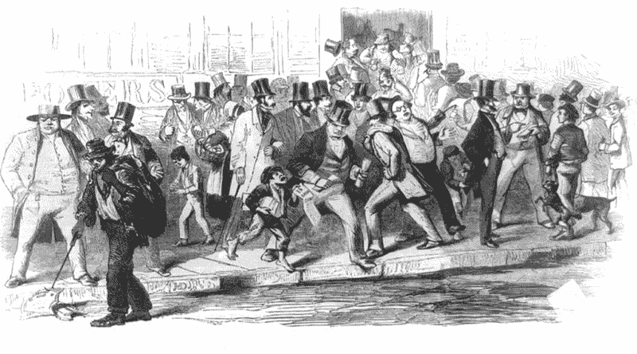
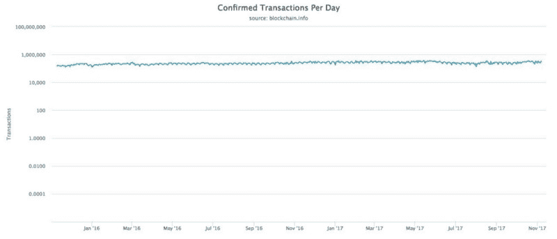
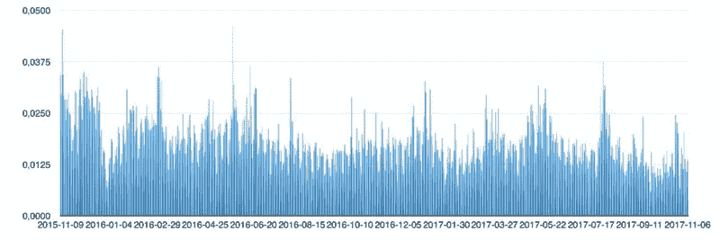
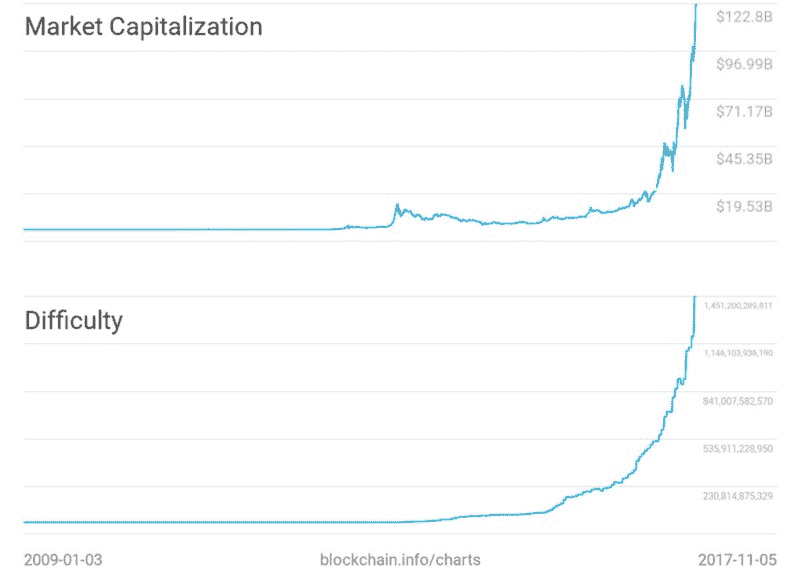
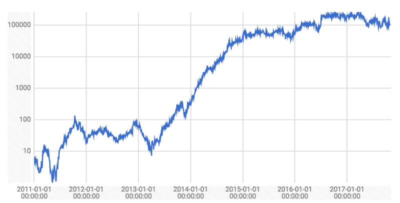

# 比特币的悖论

> 原文：<https://www.freecodecamp.org/news/antinomy-of-bitcoin-44a4654358c3/>

伊利亚·佩斯托夫

# 比特币的悖论

有大量关于加密货币的文章。早些时候，极客和与该技术相关的人谈到了它。但是现在，普通网民都在谈论它。对他们来说，最令人不安的事实是，2009 年 10 月 5 日，第一家比特币交易所新自由标准(Liberty Standard)将 1 比特币(BTC)的汇率设定为 1 美元兑 0.0007 比特币(T1)。比特币自此翻了 100 多万倍。

许多人记得(带着讽刺意味)一个人在 2010 年花 1 万 BTC 买了两个披萨的故事。但是，经济是一门平衡的科学。如果没有这些人把 BTC 变成了披萨饼，比特币就不会有今天的价格。并且越来越相信无担保的劳动收入。事实上，一家企业的年利润率约为 20% 并不能迫使他们怀疑任何 ICO 成功的稳定性。只有世界上最好的投资基金在 T2 获得了 100 倍的投资回报。但是，这是由于他们投资组合中的独角兽，而不是整个投资组合。

众所周知，区块链是下一个大事件。加密货币已经改变并将继续改变世界。但是，比特币的未来会是怎样的呢？

有一些著名的金融家，比如摩根大通(管理着 2.5 万亿美元的资产)的首席执行官杰米·戴蒙，他称比特币是一种欺诈。贝莱德(管理着 5.7 万亿美元资产)首席执行官[说](https://cointelegraph.com/news/blackrock-ceo-larry-fink-bitcoin-for-money-launderers-only)“比特币是洗钱的指标”。

有很多怀疑论者，但有更多的加密货币追随者。很多人都知道怎么玩风险，但有奖名额不是所有人的。以此类推，从长远来看，只有大约 5%的扑克玩家真正赢了。

### 那么比特币到底是不是泡沫？

关于比特币已经有很多观点了。为什么你会对我这样一个不知名的人的作品感兴趣？这篇文章不代表我的观点，因为我试图只用事实和数字。这对你做出自己的结论会很有意义。这篇文章不是陈述，而是向读者提出的问题。

Vice.com 的一篇文章最近披露，比特币挖矿平均每笔交易使用 215 千瓦时。假设 1 千瓦时的平均价格是 9 美分(中国的电费)。每笔交易需要 19.35 美元。有了这个价值，把它投射到 Visa 的活动中就变得有趣了。2016 年，Visa 处理了超过[830 亿笔交易](http://investor.visa.com/news/news-details/2016/Visa-Inc-Reports-Strong-Fiscal-Fourth-Quarter-and-Full-Year-2016-Results/default.aspx)，获得了 67 亿美元的收入。

昨天，比特币网络中有[274858 笔交易](https://blockchain.info/ru/charts/n-transactions?timespan=1year)。我用 Excel 表格做了简单的计算。原来去年有 100，444，450 笔比特币交易。因此，每年大约需要 19 亿美元的电费。这只是为了维持比特币网络内的交易。如果比特币交易数量与 Visa 处理的交易数量相等，那么每年将需要超过 1.5 万亿美元**T3。只是为了维持比特币网络。这个总数的异常是显而易见的。**

但是，比特币网络被限制在每秒 7 笔交易的速度。这是由于中本聪设置了 1 MB 的协议块大小限制。这提供了针对黑客攻击的保护。

去年的平均操作数要求每秒大约 3 个事务的速度。有一个名为 SegWit2X 的计划，试图增加块的大小。这些计划[被暂停](https://www.coindesk.com/2x-called-off-bitcoin-hard-fork-suspended-lack-consensus/)。

The daily amount of confirmed transactions in the logarithmic scale for the last 2 years

事实是，比特币原本是用于金额可观的低频操作。它没有能力达到 Visa 的全球化水平。比特币的资本化最近已经超过 1000 亿美元。当时每天的交易额是 9 亿多美元。

我想分析过去两年的 [**预计交易量**](https://blockchain.info/charts/estimated-transaction-volume-usd?timespan=2years) 与 [**市值**](https://blockchain.info/charts/market-cap?timespan=2years) 的数据关系。因此，平均值等于 1.79%(中位数为 1.7%)。从获得的结果中可以得出什么结论？

*   只有约 1.8%的比特币在网络上流通。其余的 98.2%存在账户中，以期待增长。
*   BTC 的增长并不符合供求规律。相比之下，Visa 的**总额**——8.9 万亿美元，**支付额**—6.3 万亿美元(这是总数的 70%)。
*   现金**交易量**的增长与**市值**的增长成正比。而这并没有增加百分比。

The ratio of the transaction volume and market capitalization for the last 2 years

早些时候，我确信 BTC 的增长是因为加密货币发行的增长。但事实并非如此。

我之前的说法，“如果没有这些人把 BTC 变成了披萨，比特币就不会有今天的价格”，没有任何意义。我想强调的是，我并没有怀疑当前 BTC 汇率的证据到底是什么。我很想找到原因。大写和难度之间的关系很明显。

Difficulty and market capitalization charts of the entire Bitcoin history

因此，我们得到了惊人的规律性。一方面，交易成本(难度)随着这些交易的货币量而增长。这与大体上由矿商形成的市场一起增长。但是，这种“收支平衡”仅由比特币总数的 1.8%提供。如果资本化与 Visa 相当，那么 1 美元的运营需要价值**1，400** 美元的电力。19.35 美元* Visa 的**比特币总量** / **市值**。此外，比特币还有费用——互联网、设备等费用。

比特币挖矿的难度是人为调控的。而且和网络的累计计算能力成正比。在比特币是泡沫的说法中，你肯定听到了我之前的观点。是的，如果*所有节点都断开*网络，除了一台旧电脑，它会得到和今天全网速度一样的比特币。而“*如果所有节点都断开*，就会有人开始反方向计算区块，网络就会被黑。

众所周知，比特币挖矿的速度是恒定的，不依赖于计算能力的总量。因此，我想看看矿工的[难度](https://blockchain.info/charts/difficulty?timespan=all&scale=1)和[收益的变化。但是由于没有可用的数据，我创建了一个图表来反映有多少难度单位匹配 1 美元。计算能力几乎呈指数级增长。这导致近段时间比特币挖矿的盈利能力增强。这当然是由于 BTC 价格的惊人增长。](https://blockchain.info/charts/miners-revenue?timespan=all&scale=1)

Dependence of difficulty level and miners revenue in logarithmic scale

在这样一个市场中，不合理的运作方式，即所赚的钱少于运作的成本，变得很普遍。但是这些产能增长的时间和速度还不得而知。别忘了[块奖励减半](http://www.bitcoinblockhalf.com/)每天都在临近。

毫无疑问，交易的电力成本是有限度的。如果矿工农场开始关闭，那么计算能力将开始下降。结果，交易的成本会降低到一定的标准，当它看起来不再不合理的时候。

### 但当这一切发生时，BTC 汇率会下跌吗？

我想一个细心的读者会说“是”。我们已经定义了资本化与矿工的相关性，并揭示了这种恶性循环。是的，但这并不意味着 BTC 汇率会下跌。我们了解到，与供求规律的矛盾不会阻止比特币的增长。经济学家亚当·斯密(Adam Smith)将[描述为](https://en.wikipedia.org/wiki/The_Wealth_of_Nations)，国际收支不允许坚持 20%。那么为什么我们的规律性必须保持呢？比特币的价格将和市场支付的价格一样高。正如乔治·索罗斯曾经提到的，经济不可能是客观的，因为主观的人永远是它的最后一个元素。比特币汇率是我们对加密货币的经验性理解。但是，令人惊讶的是这个想法是多么的矛盾。