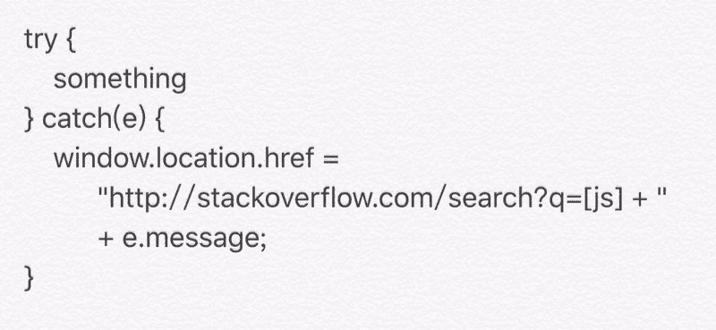

# API 错误代码是有历史记录的——试试这个

> 原文：<https://www.freecodecamp.org/news/api-error-codes-are-prehistory-try-this-instead-b3abd156f9fa/>

### 警示故事

很久以前，一个年轻的女孩看到她的母亲，她正在打开一块新买的牛肉准备烘烤。母亲切掉了肉的两端。

“妈妈，你为什么这么做？”年轻女孩问。

“这样味道更好，”母亲一边把饭放进烤箱，一边回答道。

“怎么会这样？”

“我不记得了，去问你的祖母，她教了我所有这些技巧和诀窍。”

这孩子很好奇，跑到她祖母家附近。

"奶奶，你知道为什么切烤牛肉的边会更好吃吗？"

“这得看果汁的流向，”祖母回答道。

"我们不能用叉子打洞吗？"

"我的母亲总是这样准备他们，当然，她是一个伟大的厨师。"

这个孩子不仅好奇，而且很有毅力，跑到了她哥哥住的地方。她讲述了她母亲和祖母告诉她的话，并重复了她的问题。

长者突然大笑起来。

“我确实总是切烤牛肉的尾部，但只是因为我的烤箱太小，装不下一整块。”

这个存在于[无限变化](https://www.snopes.com/fact-check/grandmas-cooking-secret/)中的小故事，提出了关于人类生活的重要观点。旧习惯很难根除，即使几十年来它们都没有意义(如果曾经有过的话)。计算机科学虽然发展速度很快，但很容易受到这种有害传统的影响。

### 错误处理

以错误处理为例。我们对 HTTP 状态代码、小型 unix“错误”和冗长的 windows 错误代码已经习以为常……我们的 API 中充满了自定义数字，表示输入问题、SQL 操作错误或访问权限问题……

第一种低级编程语言——包括 C 和 Fortran——具有非常初级的数据类型。这就是为什么他们把错误仅仅作为整数来处理，他们可以比较，转换大小写，作为数组索引来查找，并且毫无痛苦地传输。这就是为什么他们最终使用 0(布尔假)来表示所有的成功，非零整数(布尔真)来表示错误——这对普通人来说不是很直观。

但是我们对日常现代高级语言中的错误有什么期望呢？他们是:

*   显式的，所以我们知道他们的意思，而不用每次都问整个网络
*   **深度分层**，这样我们可以在不破坏当前软件的情况下细化错误案例，并在遇到过于具体的错误时退回到通用处理方法
*   **上下文化**，以便额外的数据可以伴随错误，并详细说明到底哪里出错了以及为什么出错

这是许多现代语言中实现异常的方式。有(希望)有清晰含义的等级。在这些层次结构的不同分支中，每个都有不同的实例属性，例如文件名、字段名和原始操作系统错误。这些实例带来了大量的信息，包括回溯和每帧的局部变量。

但是当错误跨越这个特定过程，这个特定语言的界限的时候呢？错误代码是对此最糟糕的支持之一。

“错误 0x29273363833”是什么意思？你不知道。你不能把这个错误细分成更精确的情况。如果您想要更多的上下文信息，您必须从其他地方获取。

您几乎不知道最接近的父错误代码是什么。的确，一些系统提倡基本的回退行为——例如，如果您遇到未知的 HTTP 478 错误，您应该将其作为 HTTP 400 来处理。但是对于很多情况来说，它还是有点太粗了，一旦你使用了一个错误类的所有数字，你就倒霉了。

### 那么我有什么建议呢？

只需将异常类型映射到它们最接近的 JSON 兼容表示。碰巧是……标识符序列。

女士们，先生们，我向你们介绍一群**状态鼻涕虫**:

*   ["Exception "，" LookupError "，" KeyError"]
*   "错误|函数|无效输入|缺少值"
*   "错误|技术|连接|mysql.database_unreachable "
*   [“成功”]
*   ["success "，" instance_found_in_cache"]

正如你所看到的，我们使用列表还是字符串并没有太大的关系；即使是“鼻涕虫”这个词也不能太死板，下划线或大写字母是无害的。

**重要外卖** **消息**是这些鼻涕虫是:

*   相当明显
*   很容易映射到特定于语言的异常
*   在错误处理调度程序中很容易匹配。

应该保留点号来限定，从而区分不同包提供的同名异常。这里的一个例子是“可爱的形状”。无效的“vs”验证程序。无效”。

蛋糕上的樱桃是，状态 slugs 也可以用来区分成功的案例，就像“HTTP 2XX”家族在 web 上提倡的那样。

所以这是我想说的第一点:**使用状态 slugs 来宣布操作结果**。

**错误处理是软件健壮性和愉快用户体验的核心，因此它比汇编级数据类型更有价值**。让我们停止使用基于整数、单个 slugs 或者——最糟糕的——布尔的糟糕的错误调度。

Still better error handling than “An error occurred, plz check logs”…

关于错误处理，我想说的第二点是:**要有雄心**。

许多协议定义了阉割过的错误结构——“如果对我来说足够了，对其他人来说也足够了”。开发人员最终会添加他们自己的错误处理系统。有时初始协议的成功响应被填充了它们自己的错误结构，而错误响应没有留下定制的空间(看着你，XML-RPC)。

因此，如果有一天，你不得不指定你自己的错误格式——这总是很遗憾，但有时是不可避免的— **想想大的**。

我们对回复格式有什么期望？

*   当然，我们需要状态 slugs，来精确地查看发生了哪种成功或错误。
*   我们可能还需要翻译的消息用于 UI 显示。
*   很可能我们也需要未翻译的消息，因为在源代码中寻找它们或者翻译前端要方便得多。
*   我们需要为特定状态的数据树留出空间，这样所有相关的信息都可以以机器可处理的方式提供。
*   我们可能还需要支持多数据结构——或者更确切地说是递归的——数据结构，比如当一个 web 表单的几个字段都有自己的拒绝理由时。
*   我们可能必须传达部分成功，例如，当不能从目录中检索所有用户帐户数据时。我们可能不得不传达部分失败，例如，当无法获取权威答案时，但会返回一些缓存数据，以防对您有所帮助。

以下是一个(几乎)一刀切的 StatusPack 结构示例:

> {
> status_slugs:成功/错误调度的 slugs 列表，必填字段
> data:带上下文信息的数据树(结果，无效输入字段...)
> traceback:仅用于开发模式，可能包含带有局部变量的帧
> nested _ status:可选的 StatusPack 结构列表
> message_translated:可显示的字符串
> message_untranslated: string 或[string template，parameters] pair

由于“nested _ statuses”字段提供的可延展性，这个结构应该涵盖上面提到的用例。

如果你处理**微服务**，链接这些状态包，并在用户端正确显示它们——**特别是回溯**——可能会节省你几天的日志调查时间。

如果你想掩饰你的错误，没问题。但是不需要自己指定错误代码。只需为你的“status_slugs”创建**散列**，并通过自省你的代码库自动生成可用错误的完整列表。

That feeling when your code handles all kinds of user and network errors flawlessly

我在强调的最后一点是:**善待 API 消费者。**

当错误发生时，确保您的消费者**知道**。在这种情况下，确保你的消费者也**知道**该做什么，特别是通过编程。

*   无声的错误是地狱的前厅。删除不存在的账户**必须**返回错误。但是为这样的操作提供一个温和的“strict=False”参数，这样用户就可以发出不重要的调用，而不会因为错误而尴尬。
*   在用户提交的表单域上出现“ValueError ”(输入错误),或者在用户一无所知的变量上出现“value error ”(服务器错误),这是完全不同的情况。这些应该以不同状态的 slugs 结束。当您的 API 充当用户和其他 API 之间的中继时，这种分析可能很难实现，尤其是如果远程 API 的错误报告很差。但无论如何，试一试。
*   在你的文档中，要清楚错误类的含义，以及消费者期望的操作。通常，技术错误意味着“如果你稍后重试，它可能会工作。”另一方面，功能错误意味着“你的工作流或输入是错误的，盲目地重试是没有用的。”几年后，你的地位等级可能需要用爱和关注来微调。

这两个想法——**状态 slugs 和状态包结构**——**当然不是错误处理的缩影，但它们代表了在精度和可进化性方面的一个确定的进步。**

**我想听听这里的 API 开发者可能提出的其他错误字段或其他处理策略。请分享你的创新和来之不易的经验！**

*****2018/09/07 编辑:**修复错别字，精准“鼻涕虫”术语背后的思想。***

*****2019/06/22 编辑:**精确 StatusPack“数据”字段***