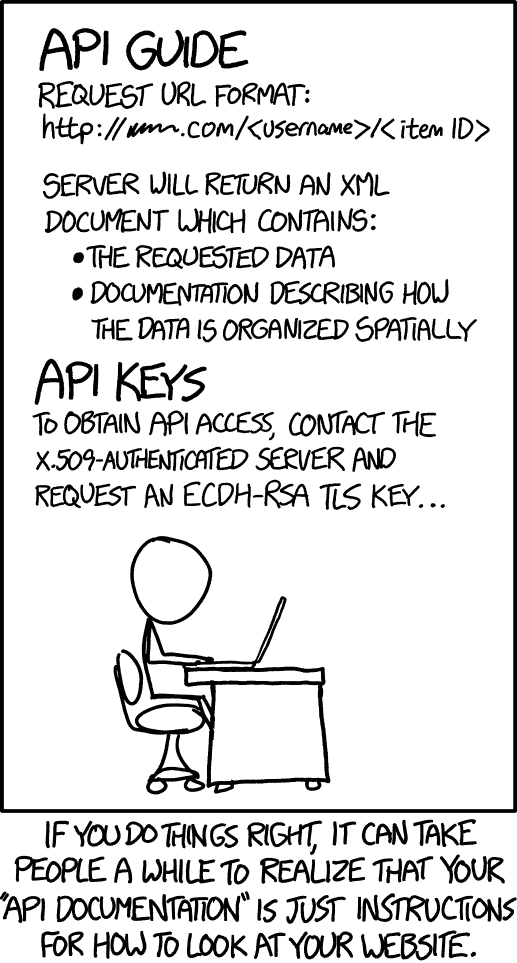

# 初学者的 API-学习如何使用这个免费视频课程的 API

> 原文：<https://www.freecodecamp.org/news/apis-for-beginners-full-course/>

API 到底是什么？你如何使用 API？我们刚刚在 freeCodeCamp.org YouTube 频道上发布了关于应用编程接口(API)的完整初学者课程。

这门课程是由 Twilio 的开发人员教育家克雷格·丹尼斯创建的。他讲授 API 是做什么的，它们为什么存在，以及它们的好处是什么。API 在编程和 web 开发中一直被使用，所以理解如何使用它们是很重要的。

您将获得一些流行的 web APIs 的实践经验，包括 Spotify 和 Twilio 的 API。只要你知道编码和网络的绝对基础，你就不会有任何问题。

在课程的第一部分(第一单元)，你将学习什么是 API，并对网络如何工作有一个大致的了解。在第二部分(单元 2)，你将开始在线探索 API。您将学习如何在 JavaScript 和 Python 中使用 Postman 和 helper 库。在最后一部分(单元 3)，您将学习如何使用 Node.js 和 Flask 创建一个项目。

课程结束时，你将对 API 有一个完整的理解，并能够对下面的漫画开怀大笑。？

From [https://xkcd.com/1481/](https://xkcd.com/1481/)

你可以观看下面的课程，或者在 freeCodeCamp.org YouTube 频道上观看[(2 小时观看)。](https://www.youtube.com/watch?v=GZvSYJDk-us)

此外，请务必查看视频附带的注释:[https://github . com/craigsdennis/intro-to-APIs-course/blob/master/course-notes . MD](https://github.com/craigsdennis/intro-to-apis-course/blob/master/course-notes.md)

[https://www.youtube.com/embed/GZvSYJDk-us?feature=oembed](https://www.youtube.com/embed/GZvSYJDk-us?feature=oembed)