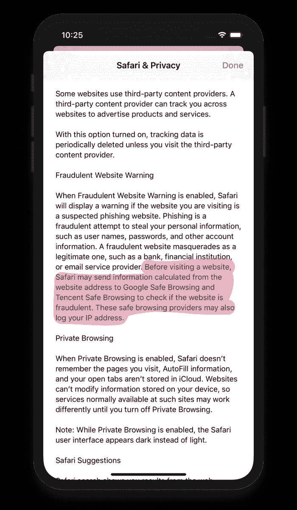
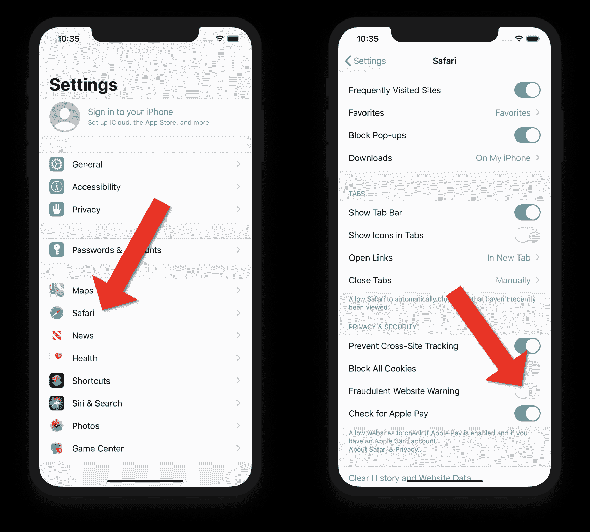

# 苹果安全浏览解释了为什么苹果把你的数据发送给谷歌和腾讯，以及如何关闭它

> 原文：<https://www.freecodecamp.org/news/apple-safe-browsing-explained-why-apple-sends-your-data-to-google-and-tencent-and-how-to-turn-it-off/>

如果你在某些版本的 iOS 上使用 Safari，那么默认情况下，你的 IP 地址会被发送到谷歌或腾讯。腾讯相当于中国的脸书，拥有广受欢迎的微信移动应用。腾讯还与中国政府密切合作。有可能阻止您的数据发送到这些公司。

如果地区代码设置为 mainland China，设备将向腾讯发送数据。所有其他设备都向谷歌发送数据。

Notification on iPhone that your data will be sent to Google and Tencent.

以下是苹果发言人在一份声明中对这一功能的描述:

> Apple 通过 Safari 欺诈网站警告来保护用户隐私和数据，Safari 欺诈网站警告是一种安全功能，可以标记已知的恶意网站。

> 启用该功能后，Safari 会对照已知网站列表检查网站 URL，如果用户访问的 URL 涉嫌欺诈行为(如网络钓鱼),则会显示警告。为了完成这项任务，Safari 从谷歌接收已知恶意网站的列表，对于地区代码设置为 mainland China 的设备，它从腾讯接收列表。

> 您访问的网站的实际 URL 绝不会与安全浏览提供商共享，并且该功能可以被关闭。

虽然您访问的实际 URL 不会被共享，但您的 IP 地址会被共享。您的 IP 地址可以透露您的大致位置和其他详细信息。共享此信息是为了确定您正在访问的网站是否是欺诈网站。

这些数据被很多人自动分享。Safari 在美国的市场份额超过 50%，因为它是 iOS 设备上的默认浏览器。

此外，即使你在 iOS 设备上使用第三方浏览器，你的数据仍可能被发送到谷歌和腾讯。当您从应用程序中查看网页时，页面会在某个版本的 Safari 浏览器中打开。由于许多应用程序都是从应用程序内部打开 Safari，因此几乎不可能避开 Safari。

要阻止您的 IP 地址被发送到谷歌和腾讯，您必须禁用“欺诈网站警告”。请记住，禁用此功能会使您更容易访问欺诈网站。

以下是如何在 iOS 中禁用“欺诈网站警告”的方法:

1.  在 iOS 设置中，选择“Safari”。
2.  向下滚动一点，将“欺诈网站警告”切换到关闭位置。

How to disable sending data to Google and Tencent.

### 什么是“安全浏览”？

“欺诈网站警告”服务使用谷歌安全浏览和腾讯安全浏览。这是一项最初由谷歌开发的服务。用户有时会遇到恶意网站和钓鱼网页。谷歌有一份这些网站的清单，并创建了“安全浏览”来帮助通知用户他们正在访问的网站可能是恶意的。

根据密码学研究者 Matthew Green 的说法，谷歌是这样提供这项被称为“更新 API”的服务的:

> 1.谷歌首先计算其数据库中每个不安全 URL 的 SHA256 **哈希** ，并将每个哈希截短为 32 位前缀以节省空间。

> 2.Google 将截断散列的数据库发送到您的浏览器。

> 3.每次你访问一个 URL，你的浏览器都会对它进行哈希运算，并检查它的 32 位前缀是否包含在你的本地数据库中。

> 4.如果在浏览器的本地副本中找到前缀，你的浏览器现在会将前缀发送到谷歌的服务器，后者会传回所有匹配 URL 的全部*256 位散列的列表，因此你的浏览器可以检查是否完全匹配。*

*想必中国的腾讯也是用同样的方法。但不是将哈希后的前缀发送给谷歌，而是发送给腾讯。*

*这个过程应该是安全的，因为您访问的实际 URL 不会发送过来，只是 URL 的散列版本。然而，一些安全研究人员指出，通过分析单个用户发送到该服务的数百个散列 URL，有可能消除该用户的匿名性。*

*Safari 并不是唯一使用谷歌安全浏览的浏览器。Google Chrome、Firefox、Vivaldi 和 GNOME 网络浏览器使用 Google 安全浏览服务。因此，如果你不希望你的数据被发送到谷歌，选择一个不在该列表中的浏览器，或者在浏览器设置中禁用该服务。*

*许多人认为，值得与谷歌和/或腾讯共享他们的 IP 地址，以获得更多保护，免受恶意网站的攻击。你必须自己决定是否值得冒这个险。*