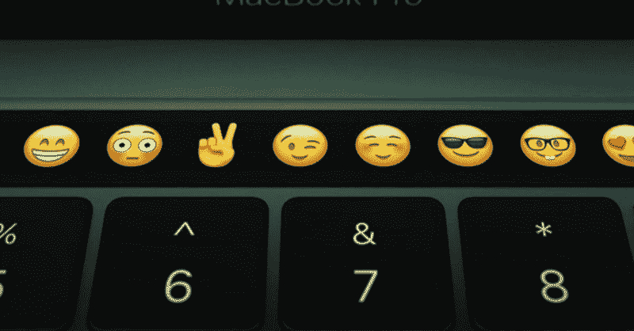

# 苹果给开发者:无处可逃。

> 原文：<https://www.freecodecamp.org/news/apple-to-developers-there-is-no-escape-298b63c2a1d8/>

对于正在考虑购买新的工作笔记本电脑的开发人员来说，以下是苹果公司今天宣布的消息:

*   他们正在扼杀 MacBook Air，这是有史以来设计最好、最受欢迎的笔记本电脑之一(我正在用它打这篇文章)
*   他们的新笔记本电脑拥有与多年前相同的内存容量和相似的处理器
*   他们用一个小表情条取代了开发者广泛使用的退出键和功能键

当然，它也将用于许多其他事情:

至少他们还没有移除耳机插孔。

但他们确实取消了几乎所有其他类型的港口。

在过去的 4 个季度中，苹果售出了多少台 MAC 电脑？一千九百万。

地球上有多少开发者？一千九百万。

有趣的巧合，嗯？

苹果显然在吃老本。他们没有听取至少一个主要客户群的意见:开发者。

### 同样的规格，不同的日子

自 2010 年以来，MacBook Pros 已经提供了高达 16g 的内存。猜猜 2016 款 MacBook Pro 哪里最爆？16 千兆字节。这还是在付费升级之后。

MacBook Pros 在 2010 年提供了双核 2.4 千兆赫处理器。猜猜股票 2016 款 MacBook Pro 13 "配什么？双核 2.0 千兆赫处理器。

感谢 [Eric Elliott](https://www.freecodecamp.org/news/apple-to-developers-there-is-no-escape-298b63c2a1d8/undefined) 指出你可以将 15 英寸版本升级到四核 2.9 千兆赫——但这个版本的价格是 3000 美元。

当你购买一台全新的 2016 年 MacBook Pro 时，你要为相当于 2010 年的硬件支付 2000 美元，并在此基础上进行一些微小的改进。虽然在过去的 6 年里有了一些进步，但价格仍然远远高于你购买非苹果硬件的价格。

你可以半价购买同等规格的笔记本电脑(没有像 Retina 显示屏和花哨的 Force Touch 触控板这样的好东西)。例如，这里有几台评价很高的笔记本电脑:

[**联想 ThinkPad Edge E460 14”高清屏幕(1366x768)、英特尔双核 i5-6200U 2.2 GHz、16GB RAM……**](http://amzn.to/2fbMwC2)
[*编辑描述* amzn.to](http://amzn.to/2fbMwC2) [**惠普 Pavilion 17 游戏笔记本电脑(英特尔 i7-6700HQ、16GB DDR4 RAM、128GB SSD + 1TB 7200rpm HDD、NVIDIA……**](http://amzn.to/2eWy0ZT)

让我们面对现实吧——当开发者购买一台 Mac 电脑时，他们真正支付的是软件。操作系统。以及围绕该操作系统构建的开发工具生态系统。

幸运的是，还有另一种类似 Unix 的操作系统可以安装在你的电脑上:Linux。

Linux 远不如 MacOS 用户友好。但随着笔记本电脑制造商提供更多资源，它可以实现这一目标，而且很快。

就连 Linux 的宿敌微软最近也在变得对开发者更加友好方面取得了长足的进步。Windows 10 现在附带了[部分 Linux 支持](http://www.howtogeek.com/265900/everything-you-can-do-with-windows-10s-new-bash-shell/)。

### 桌面 Linux 的第二次崛起？

对于开发者来说，MacBooks 越来越没有吸引力了。但从长远来看，这对每个人来说都可能是一个巨大的胜利。

随着来自 Windows 的更强的竞争，以及更多的资源投入到 Linux 发行版中，开发人员可能很快就会拥有一系列可以在廉价“商品”硬件上运行的优秀操作系统。

如果您一直对 Linux 很好奇并想了解更多，请查看我最近在 25:

[**Linux 是 25。耶！让我们用关于 Linux 的 25 个惊人事实来庆祝一下。**](https://medium.freecodecamp.com/linux-is-25-yay-lets-celebrate-with-25-rad-facts-about-linux-c8d8ac30076d)
[*25 年前的这一周，芬兰一名大学生在邮件列表上分享了他的项目:*medium.freecodecamp.com](https://medium.freecodecamp.com/linux-is-25-yay-lets-celebrate-with-25-rad-facts-about-linux-c8d8ac30076d)

感谢阅读和快乐编码！

我只写编程和技术。如果你在推特上关注我，我不会浪费你的时间。？