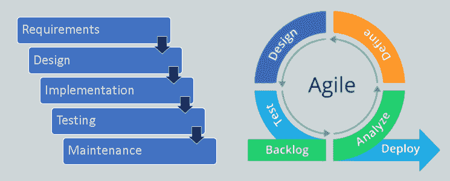
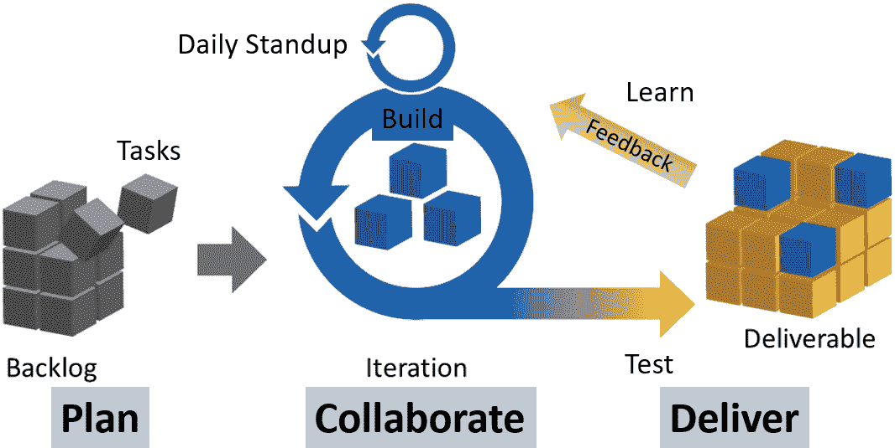
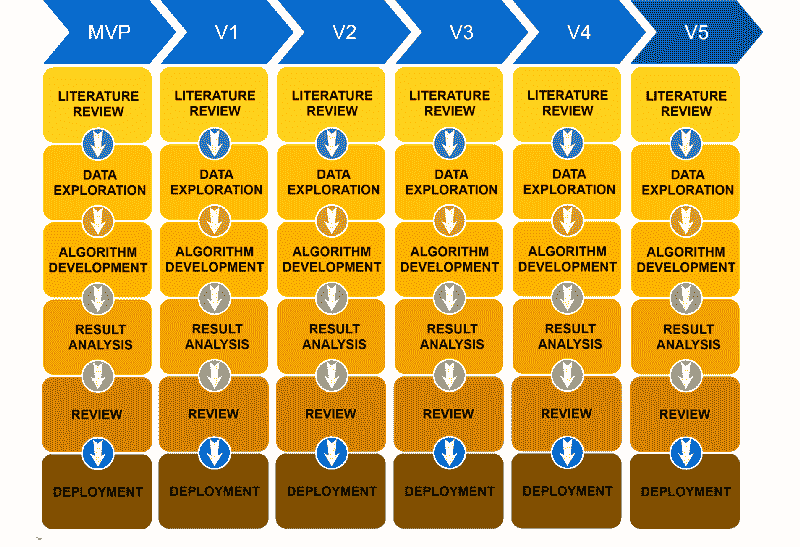

# 如何将敏捷框架应用于数据科学项目

> 原文：<https://www.freecodecamp.org/news/applying-agile-methodology-to-data-science-projects/>

在本文中，我们将讨论如何将敏捷原则和价值观应用到数据科学项目中。

项目管理方法通常用于完成项目或生产产品(通常称为工具)。一般来说，它们是将总体目标分解为按时间表组织的单个任务的过程和框架。这可以用于数据科学项目。

过去，传统的 [****瀑布方法论****](https://en.wikipedia.org/wiki/Waterfall_model) (追溯到 1970 年)一直非常流行。它从一开始就定义了产品的所有需求和参数，因此项目团队可以在连续的阶段中朝着这个目标努力。

这种方法在产品规格很少随时间变化的制造业中很成功。它需要非常广泛的前期规划，理想情况下，输出产品与开始时指定的完全相同。

但是瀑布方法开始变得不适合软件项目。正因为如此，许多流行的项目管理方法在过去几年里出现了，尤其是在软件开发行业。我来分享一个最受欢迎的。

Waterfall vs Agile. Figure by Author.

## 敏捷框架

[敏捷](https://en.wikipedia.org/wiki/Agile_software_development)是 2001 年发展起来的一种工作方式，被广泛用于管理软件开发项目。它适合于快节奏的开发周期，并且在整个设计和构建过程中可以改变规格。它是灵活的，并通过团队协作努力实现产品的迭代增量改进。简而言之，敏捷就是计划、构建、测试、学习、重复。

随着项目的展开，敏捷团队通过迭代的工作过程对不可预测的需求做出响应。以下是 [****敏捷原则****](https://agilemanifesto.org/principles.html) ，它们作为工作方式的框架(指南):

*   通过早期和持续的软件交付实现客户满意度
*   适应整个开发过程中不断变化的需求
*   工作软件的频繁交付，因为工作软件是进度的主要衡量标准
*   整个项目中业务涉众(客户)和开发人员(供应商)之间的协作和互动，包括开发团队内部的面对面交流
*   支持、信任和激励相关人员
*   敏捷框架支持一致的开发速度
*   对技术细节和设计的关注增强了灵活性
*   寻找解决方案的简单性
*   在自组织团队中定期反思如何变得更有效

敏捷项目的特点是一系列的任务，这些任务是根据情况的需要而构思、执行和调整的。然而，敏捷关注的不是做什么，而是 ****如何思考**** 。敏捷值和位次 [****优先级****](https://agilemanifesto.org/) 开启:

*   个人和交互(而不是过程和工具)
*   工作软件(而不是全面的文档)
*   客户协作(而不是合同谈判)
*   应对变化(而不是遵循预先定义的僵化计划)

Agile way of working. Figure by Author.

## 敏捷实践和数据科学

虽然敏捷原则和优先级被用于更高的生产力，但是它们中的大部分可以用于数据科学(DS)项目。

此外，数据科学家不知道如何安排项目，因为不可能确定“研究”和探索性工作类型的具体时间表。大多数 DS 项目需要通过走不同的道路和尝试不同的技术来反复试验。他们在输出中没有确定的元素，所以敏捷可以用来指导工作流程。

大多数其他项目处理客户想要什么，开发人员想要什么，以及业务寻求什么。在使用 DS 时，增加了另一个视角:**数据告诉你什么**。

除非数据科学家对数据有了基本的了解，否则他们无法从数据中得出任何意义。有大量的调查、探索、测试和调整。敏捷使用迭代和持续反馈的概念来精炼开发中的系统，以便在 ****数据价值金字塔**** 中向上移动。

Data-Value Pyramid. Figure by Author.

当在 DS 项目上工作时，洞察力不是立即可以实现的。在发现任何洞见之前，需要多次迭代。

### 如何应用敏捷实践

我将解释主要的敏捷工作实践( [****Scrum 框架****](https://en.wikipedia.org/wiki/Scrum_(software_development)) )，以及它们如何应用于 DS:

****定义业务需求和项目目标**** 。这通常是由负责产品特性和质量的产品所有者推动的。这是大画面的东西，但这是核心信念，你会参考回来，因为你建立。

在 DS 中，产品所有者可以是客户、企业或最终客户(例如，预测工具的最终用户)。了解产品负责人面临的问题，并定制项目提案以满足他们的需求。

****建立积压**** 。关注用户需求(敏捷中的“用户故事”)，您需要完成一系列任务来构建产品功能或提高产品性能。

DS 团队与产品所有者一起构建 backlog，以确定产品特性和性能目标。积压可以从以结构化的方式获取数据开始，然后才能进行分析。然后，它可能是一个功能选择或功能工程的列表，或者是一个选择、调整和优化的模型列表。

****对待办事项进行优先级排序**** ，识别出以最少的努力带来最大价值的待办事项。

在 DS 中，并不是每种方法都值得尝试，所以先介绍最有前途的方法。当主要的被传达后，你可能会发现其余的并不像最初认为的那么重要。

****做冲刺**** (实际开发工作)。Sprints 通常是两个星期的周期，在这个周期中处理积压的高优先级任务。

在 DS 中，每个 sprint 可能需要两到四周，这取决于团队的规模。在冲刺阶段，总是先完成优先级最高的任务，然后再继续下一个。

****有日常单口相声**** 。站立会议是为了让团队成员就他们在当前 sprint 中的进展互相负责。每个团队成员轮流报告他们的状态——前一天做了什么，今天做什么，任何潜在的障碍。最有效的沟通发生在 DS 团队成员面对面分享他们的工作时。

****回顾冲刺输出**** (冲刺回顾会)。在两周结束时，应该有一个功能输出供项目团队演示，并对产品进行增量改进。

数据科学家应该在尝试完善流程之前共享结果。从客户利益相关者那里获得反馈，为下一次冲刺做准备。定期反馈是迭代增量改进敏捷方法的关键原则。

****为下一次冲刺**** 做准备。找出进展顺利的任务并坚持做下去，找出需要清除的障碍。

重要的是要明白，与软件开发不同，DS 更多的是基于实验，而不是基于任务。DS 有助于探索数据，因此它应该被视为多重研究实验。再一次，构建并区分待办事项列表的优先级，这样下一次冲刺就可以进行了，并致力于下一个改进领域。

****推出最终产品**** 。当所有涉众都同意产品中不需要更多的改进时，就可以进行最终部署了。

DS 项目遵循“改进递减定律”。例如，如果一个模型已经达到了 70%的准确率，那么下一个 5-10%的提高将需要比以前付出更多的努力，而且这也取决于数据集的局限性。在团队中决定这些努力是否值得增量改进。

Photo by [You X Ventures](https://unsplash.com/@youxventures) on [Unsplash](https://unsplash.com/photos/Oalh2MojUuk)

## 客户面临的挑战

除了在 DS 团队和客户之间进行充分的沟通之外，还必须管理客户的期望。

所有的客户通常都喜欢敏捷是灵活的这一观点，并且随着项目的发展，它给予他们更多的机会来改变他们的想法。然而，他们可能没有意识到，这种灵活性也是耗费时间和金钱的。以下是您应该做的一些事情:

### 灵活性的成本

让客户明白 ****灵活性必然昂贵**** 。这就好比一张允许改变行程的灵活的全价经济舱机票会比固定机票贵得多。做出改变也意味着客户在为过去浪费的时间和精力买单。

### 设定期望值

设定客户期望提交时间，用于频繁的**(例如每两周一次)sprint 回顾会议，以评估已完成的 sprint。**

**最重要的是，每次会议中的客户代表需要( ****由更高管理层授权**** )能够对产品规格做出决定。为了让敏捷工作，客户需要提供持续的反馈和优先级设置来保持项目的进展。**

### **信任很重要**

**赢得客户的 ****信任**** ，向他们展示每一次迭代都尽了最大努力来交付价值和改进产品。**

**在拥有决策权的同时，客户也期望迭代有巨大的改进。**

**客户-供应商关系中的这种责任不平衡应该转化为相互信任和共同尝试的意愿。敏捷在 ****协作**** 中的原则意味着它是一个团队在决策和交付价值方面的努力。**

**

Photo by [You X Ventures](https://unsplash.com/@youxventures) on [Unsplash](https://unsplash.com/photos/6awfTPLGaCE)** 

## **最小可行产品**

**敏捷工作方式的一个关键特征是最小可行产品的开发(****【MVP】****)。这是 ****产品**** (或工具)最基本的配置。**

**项目目标确定后，团队就解决问题的方法提出建议。这包括在尽可能短的时间内构建 MVP(比如 DS 项目的一个月)。MVP 只有最重要的功能，但它的性能可能不是最佳的。**

**这可能看起来非常冒险——把一个未完成的版本放出来让客户测试。所以团队(包括客户)必须为此做好准备。目的是让 MVP 工作，测试它，看看它是否真的朝着解决问题和帮助业务案例的正确方向前进。**

**MVP 将会发展得更好，因为 DS 团队将会利用他们从 MVP 反馈中学到的东西来构建一个改进的版本。敏捷是关于不断部署和从你的错误中学习，并与客户一起使产品变得更好。**

**

Iterative nature of Agile. Figure taken from [TowardsDataScience](https://towardsdatascience.com/data-science-agile-cycles-my-method-for-managing-data-science-projects-in-the-hi-tech-industry-b289e8a72818).** 

> **敏捷就是计划、构建、测试、学习、重复。**

## **DS 项目可交付成果**

**敏捷的工作方式使数据科学家能够根据需求和目标确定优先级并创建路线图。通过每次迭代，数据科学家可以学到新的东西，获得更精确的结果，并在此基础上进行下一次增量改进。**

**以下是一些敏捷项目的可交付成果，用于塑造和指导项目流程:**

*   ******项目愿景陈述**** :阐明项目目标的总结。**
*   ******项目路线图**** :实现项目远景所需需求的高层视图。**
*   ******项目积压**** :按优先级排序，这是支持您的项目所需的全部列表。**
*   ******发布计划**** :工作产品(或工具)发布的时间表，但不是文档。项目在整个过程中应该是自文档化的。**
*   ******Sprint backlog**** :链接到当前 Sprint 的用户故事(需求)、目标、任务。**
*   ******增量**** :在 sprint 结束时向涉众展示的工作产品功能，可能会交给客户。目标不是交付更多，而是获得更高的 **值** 输出。**

## **摘要**

**在不久的将来，敏捷将会被更多的 DS 项目团队所采用。许多数据科学家报告说，这让他们更有效率。**

**这不是因为数据科学家变得更加熟练，而是因为敏捷可以帮助他们优化他们的项目。与其把时间花在不太可能揭示任何生产结果的模型上，不如把时间花在其他结果驱动的目的上。**

**“敏捷”(灵活)意味着你需要在计划中采用动态的方法，并在新情况出现时适应不断变化的需求。**

**敏捷环境呼吁快速行动，快速失败，讨论和评估，然后使用不同的方法或改进的方法再次尝试。它在动态环境中工作得很好，在这种环境中有可能改变或发展需求。**

**祝你的 DS 项目一切顺利！**

**参考:
[数据-科学？敏捷？周期？我管理高科技行业数据科学项目的方法。](https://towardsdatascience.com/data-science-agile-cycles-my-method-for-managing-data-science-projects-in-the-hi-tech-industry-b289e8a72818)**