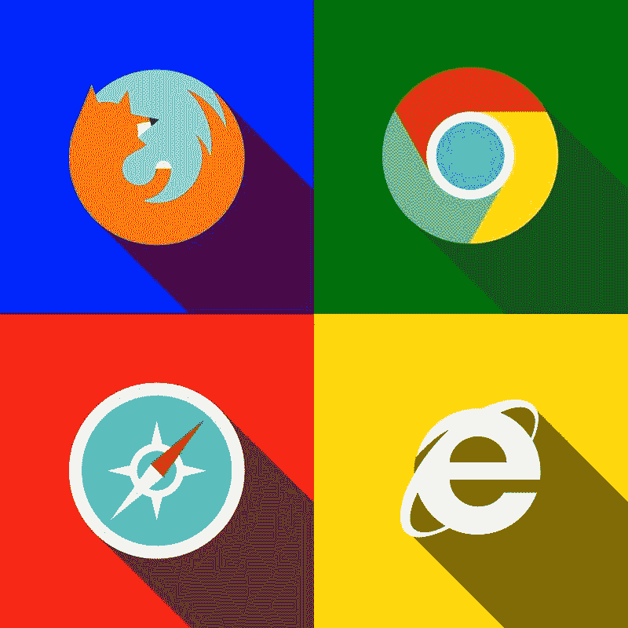
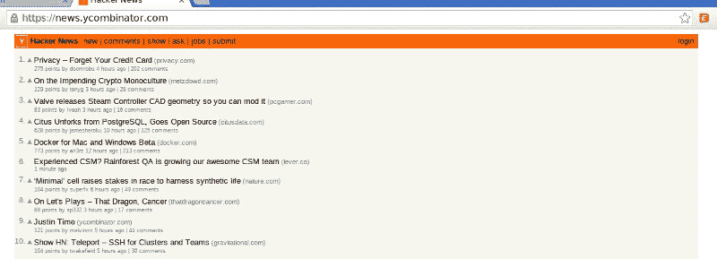
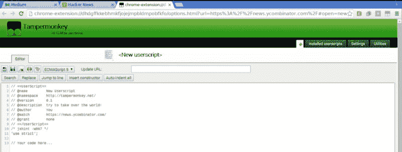
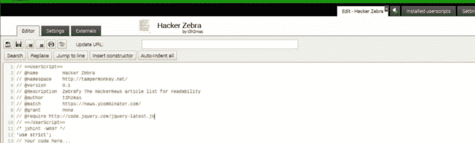
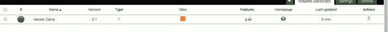
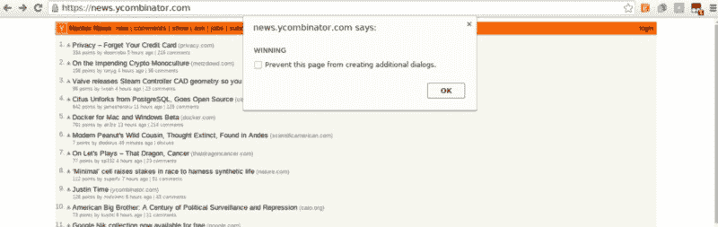
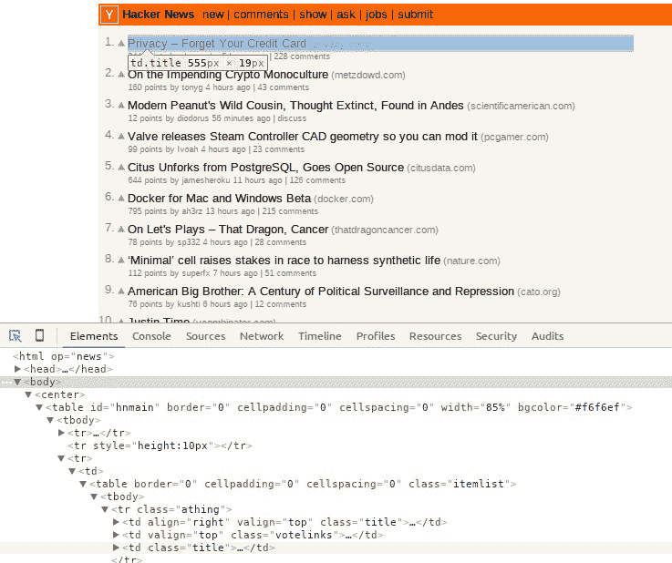
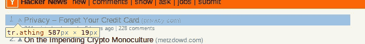
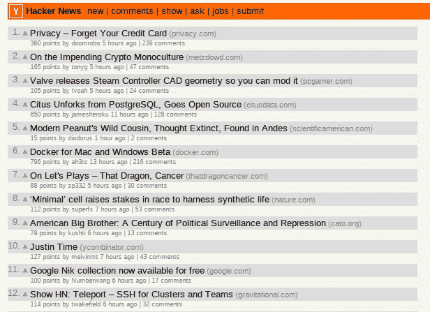
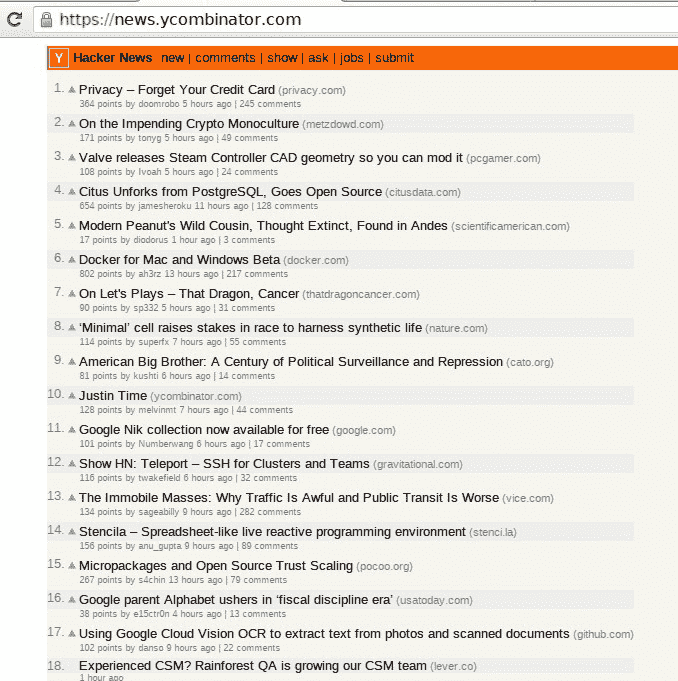

# 应用 JavaScript:用户脚本

> 原文：<https://www.freecodecamp.org/news/applying-javascript-user-scripts-2e505643644d/>

托马斯·诺伊

# 应用 JavaScript:用户脚本



[Art credit](http://incautusofficial.deviantart.com/art/Flat-Browsers-391657414)

编写用户脚本是使用 JavaScript 技能的一种有趣方式。它带你离开编辑器，进入浏览器，进行实时反馈和验证。

#### 什么是用户脚本？

> Userscripts *(又名 Userscripts、User Scripts 或. user.js)* 是 web 浏览器的开源许可插件，可以在加载网页时改变网页。他们给用户权力让网站做他们想让他们做的事，而不是原本打算做的事。

用户脚本是用 JavaScript 编写的，允许你在浏览器上调整网页的外观和感觉。脚本只会影响您的浏览器，而不会影响实际的网页。

#### 快速警告

> 使用用户脚本时，您应该注意隐私问题，并且不应该从您不信任的来源安装它们。用户脚本可以代表您执行操作，并可能访问您有权访问的网站上的任何信息，或者您进入网站的任何信息。它们通常被允许执行普通网站上的脚本所不能执行的功能，比如在你的电脑上存储信息，并在网站之间共享。写得不好的用户脚本也可能被恶意网站利用。

*解释摘自*[https://github . com/open user js/open user js . org/wiki/user script-初学者-HOWTO](https://github.com/OpenUserJs/OpenUserJS.org/wiki/Userscript-Beginners-HOWTO)

#### 为什么是用户脚本？

自由代码营有许多伟大的现实世界项目，将丰富你的技能和投资组合。我个人喜欢用我在 JavaScript、jQuery 和 CSS 中学到的技能来改变我的日常浏览。

一些用户脚本非常受欢迎，并被做成浏览器扩展。http://redditenhancementsuite.com/的 Reddit 增强套件就是一个例子。

您也可以使用您的用户脚本作为浏览器扩展的基础！

### 入门指南

用户脚本是从浏览器扩展本身运行的。油脂猴子(火狐)是允许人们定制他们的浏览体验的先锋插件。为您的浏览器安装合适的插件。

对于火狐: ***脂猴***

[**grease monkey**](https://addons.mozilla.org/en-US/firefox/addon/greasemonkey/)
[*开发频道让你在发布给将军之前测试这个附加软件的实验新版本…*addons.mozilla.org](https://addons.mozilla.org/en-US/firefox/addon/greasemonkey/)

对于 Chrome: ***篡改猴子***

[**Tampermonkey**](https://chrome.google.com/webstore/detail/tampermonkey/dhdgffkkebhmkfjojejmpbldmpobfkfo?hl=en)
[*最流行的基于眨眼的浏览器的用户脚本管理器*chrome.google.com](https://chrome.google.com/webstore/detail/tampermonkey/dhdgffkkebhmkfjojejmpbldmpobfkfo?hl=en)

在这个教程中，我将使用 Chrome 和 Tamper Monkey。

安装油脂猴或捣固猴后，过程不应有任何重大差异。

为了以防万一，这里有一个安装油脂猴(以及用它做一些事情)的快速链接。)

[**Greasemonkey 初学者教程**](http://hayageek.com/greasemonkey-tutorial/#install-greasemonkey)
[*在 Greasemonkey 教程中，我已经讲述了如何编写 Greasemonkey 用户脚本。完成本教程后，你将能够……*hayageek.com](http://hayageek.com/greasemonkey-tutorial/#install-greasemonkey)

### 该项目

我们将对黑客新闻[http://news.ycombinator.com](http://news.ycombinator.com)的主页做一个小小的改动。



HackerNews homepage

我们将使用 jQuery 使交替链接的背景颜色略有不同，以提高可读性。

#### 开始一个新脚本

点击右上角的篡改猴子图标，并从对话框中选择'*添加新脚本'*。

您应该会看到一个新的选项卡，如下所示



new script page

#### 填写信息

在开始一个新的脚本后，我们要做的第一件事是在顶部填写脚本信息。继续填写下面的属性

*   名字
*   描述
*   作者

我也会给你看我的是什么样子。

#### 添加 jQuery

就在线前

```
// ==/UserScript==
```

添加一行，文本为

```
// @require http://code.jquery.com/jquery-latest.js
```

可以认为这是为 JS 项目导入/要求 jQuery。

#### 这是我的



script info filled out

### Hello script.js！

让我们看看我们的脚本是否可以加载到 http://news.ycombinator.com 和 jQuery 上。

在这里的// *代码之后的*行添加以下代码

```
$(document).ready(function() {  alert('WINNING');});
```

并输入 **Ctrl + s** 或点击左侧的保存按钮

您可能会被带到以下页面。如果没有，请单击“已安装的用户脚本”选项卡。



installed userscripts page

厉害！我们的脚本被加载到篡改猴子。左边的绿点表示脚本已打开。截图中甚至可以看到黑客新闻的 logo。

#### 执行脚本

在你的浏览器中访问[黑客新闻](http://news.ycombinator.com),如果你一直关注并且一切顺利，你应该会看到



working alert dialog

### 启动调试器

是时候找到我们要修改的 post 元素了。输入 ***Ctrl + Shift + i*** 调出浏览器调试器。

现在我们要选择一个元素来仔细观察。用鼠标点击调试器左上角的蓝色方块将打开元素选择器。也可以使用键盘命令 ***Ctrl + Shift + c*** 。



element selector

如你所见，我找到了一个名为 *td.title* 的元素。单击后，该元素会在调试器的 elements 选项卡中突出显示(如上所示)。)

突出显示标题上方的元素，称为

```
<tr class="athing">
```

在浏览器中选择此项



BINGO

答对了。看起来我们找到了想要的元素。Hacker News 有一个干净的 HTML 布局，所以找到我们的目标元素并不困难。

如果您还记得您的 jQuery，那么要找到所有 post 元素，您所要做的就是使用选择器

```
$('.athing')
```

#### 对我们的 post 元素做些什么

既然我们有了用 jQuery 选择元素的方法，我们就可以改变元素了。让我们用下面的代码来改变文章的背景颜色。更改$(文档)。ready()代码到此

```
$(document).ready(function() {  $('.athing').css('background-color', '#DDD');});
```

*注:#DDD 是#DDDDDD 的简写；*

让我们看看结果页面。记得保存你的用户脚本，然后刷新黑客新闻页面。您可能必须关闭调试器才能查看整个页面。



altered Hacker News front page

我们说完了吗？不完全是。我们已经改变了我们所有的职位元素，而不是交替。它可能看起来像我们想要的斑马效果，但那只是因为 score/subinfo 元素没有受到影响。如果你也想改变这个元素，请随意在评论中发表你的方法。这超出了本指南的范围。

哦不？！我们该怎么办…我不想写任何循环！

#### jQuery 拯救世界

别害怕，营员们。jQuery 再次拯救了我们。

jQuery 为这样的场合提供了特殊的选择器。

现在介绍**:奇数**

[**:奇数选择器**](https://api.jquery.com/odd-selector/)
[*说明:选择奇数元素，零索引。另请参见 even。特别要注意的是，从 0 开始的索引意味着……*api.jquery.com](https://api.jquery.com/odd-selector/)

我们所要做的就是将 **:odd** 添加到我们的选择器的末尾，这样这条线看起来就像这样。 ***注:我还把颜色改成了# EEE；更好地融入。***

```
 $(‘.athing:odd’).css(‘background-color’, ‘#EEE’);
```

保存您的脚本并刷新 HackerNews，您应该会看到这个最终产品



final product

### 包扎

这就是了。现在你有了另一个创造性的出口来释放你萌芽的编码魔法！用户脚本可用于调整网站的功能或外观，添加您一直想要的功能，等等。

#### 家庭作业

编写您自己的用户脚本，为您经常使用的网站添加内容。无论是样式还是可以切换某些元素可见性的按钮，都取决于您。请在这里的评论中提供您的产品！

前进，征服露营者！

#### 更多阅读

[**Tampermonkey**](https://tampermonkey.net/documentation.php)
[*Tampermonkey 是一个免费的浏览器扩展，是 Chrome 等基于 Blink 的浏览器最受欢迎的用户脚本管理器…*tampermonkey.net](https://tampermonkey.net/documentation.php)[**grease spot Wiki**](http://wiki.greasespot.net/Main_Page)
[*grease spot 是一个社区文档，用于使用 Greasemonkey 编写用户脚本。*wiki.greasespot.net](http://wiki.greasespot.net/Main_Page)[**油腻的叉子——安全有用的用户脚本**](https://greasyfork.org/en)
[*用户脚本让你掌控自己的浏览体验。安装完成后，它们会自动让你……*greasyfork.org](https://greasyfork.org/en)[**入门:构建一个 Chrome 扩展**](https://developer.chrome.com/extensions/getstarted)
[*扩展允许你在不深入研究原生代码的情况下为 Chrome 添加功能。可以新建…*developer.chrome.com](https://developer.chrome.com/extensions/getstarted)[**如何开发一个火狐扩展**](https://blog.mozilla.org/addons/2009/01/28/how-to-develop-a-firefox-extension/)
[*这篇博文已经很过时了。如果你想要一个更新的扩展开发指南，请阅读新的 How to…*blog.mozilla.org](https://blog.mozilla.org/addons/2009/01/28/how-to-develop-a-firefox-extension/)