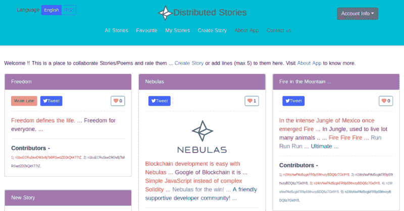

# 如何使用 Nuxt.js 和 Nebulas 构建 DApp

> 原文：<https://www.freecodecamp.org/news/architecting-dapp-using-nuxt-js-nebulas-fc00712ae341/>

对分散式应用程序(DApp)开发的兴趣和需求日益增加。因此，我决定推出一个教程来帮助您开始开发和构建模块化 DApp。我们将使用 21 世纪最流行和最广泛采用的语言之一:JavaScript。

在本教程中，我们将使用以下技术:

1.  [](https://nebulas.io/)**:一个区块链平台，允许我们用 JavaScript 编写智能合同。在这里注册[](https://incentive.nebulas.io/signup.html?invite=1L9eA)****获得推荐福利。******
2.  ******[**Nuxt。JS**](https://nuxtjs.org/) :搭建在 **Vue 之上的框架。JS** 。******
3.  ****[**NebPay**](https://github.com/nebulasio/nebPay) **:** 星云支付 JavaScript API。适用于 PC 和移动设备。****
4.  ****[**【WebExtensionWallet】**](https://github.com/nebulasio/WebExtensionWallet):用于与智能合约进行支付交互。****

****我将借助现有的 DApp、[分布式故事](http://distributedstoriesupdated.s3-website-eu-west-1.amazonaws.com/)来解释 DApp 的创作过程。它获得了 [**星云平台**](https://nebulas.io/) 上奖励计划第一季的新 DApp 奖励。****

****你可以在这里找到 DAapp [前端的源代码。智能合同代码可以在](https://github.com/honey93/distributed_stories)[的](https://explorer.nebulas.io/#/tx/63cede0eabc488c093064cc37a14ec8c991ac96d39be93db378802313c4486ef)处找到。****

****仅仅知道创建一个简单的待办事项应用程序并不总是足够的。有时，我们还必须了解如何设计大型模块化应用程序。****

****着眼于这样一个应用程序，我将给你一个使用 Nuxt.js 和 Nebulas 构建一个大的模块化 DApp 的高层次概述。您可以通过探索和调试上面共享的代码获得更深入的信息。****

#### ****我们要建造什么？****

****我们将创建一个短**故事** / **诗**协作平台，分发故事。它将允许用户通过向现有故事添加一行来创建一个新故事，并在 Twitter 上共享该故事。这里有一个演示[链接](http://distributedstoriesupdated.s3-website-eu-west-1.amazonaws.com/)。****

********

****我将在接下来的文章中解释**智能合约**和**前端架构**。****

### ******[智能合约代码](https://explorer.nebulas.io/#/tx/63cede0eabc488c093064cc37a14ec8c991ac96d39be93db378802313c4486ef)******

****DApp 前端与 SmartContract 通信，以便读取和写入数据。然后，区块链平台跨多个节点同步智能合同数据，以满足去中心化和安全性需求。这个同步过程需要一点时间，这就是为什么 NAS 形式的写入过程需要时间和金钱。****

#### ******故事**初始化****

****在下一节中，我将向您解释智能合约中定义故事对象的部分:****

```
**`"use strict";
/*
Story Constructor which will create the story by providing the necessary field fetched from the frontend using nebpay API explained at the end of this blog:
*/

var Story = function(text, image_url) {
    this.title = text;
    this.address = Blockchain.transaction.from;
    this.hash = Blockchain.transaction.hash;
    this.image_url = image_url;
    this.lines = [];
    this.votes = [];
};
/*  
Init function is used once while deploying the smart contract to 
initialize the parameters if required:  
*/
Story.prototype = {
    init: function() {

    }
};`**
```

****如上所述，每个故事都有以下字段，其中文本和 image_url 需要作为用户的参数提供。对于地址字段，可以使用区块链 API 获得散列，在这里[](https://medium.com/nebulasio/how-to-build-a-dapp-on-nebulas-part-2-5424789f7417)**中有详细说明。******

#### ********DApp 中使用的数据结构**和**存储********

****存储模块支持星云上的数据存储。它可以在付款时将数据变量永久存储在 Nebulas 上。你可以在这里深入了解它[。](https://medium.com/nebulasio/how-to-build-a-dapp-on-nebulas-part-2-5424789f7417)****

```
**`/*
With the help of the Storage Module, we are defining following maps and index property, which will help us to keep track of multidimensional data obtained from users. Nebulas recommend the capturing of multiple data points, which may help in improving Nebulas Rank and Search Feature.
*/
var Data = function() {
    LocalContractStorage.defineMapProperty(this, "favourite_stories");
    LocalContractStorage.defineMapProperty(this, "my_stories");
    LocalContractStorage.defineProperty(this, "s_index");
    LocalContractStorage.defineMapProperty(this, "stories_data");
};`**
```

#### ******拯救**和**找回**的故事****

****现在，我们将看看两个最重要的函数，它们用于借助上面的数据构造函数中声明的 Storage 和 Storage 在平台上编写和获取故事。****

```
**`/*
stories_data hash map will contain every story stored against its unique index on the Platform storage module.
Every story index added by a particular user will be stored in a hash map my_stories, in the form of an array.
*/

Data.prototype = {

/* 
Initializing the index on Smart Contract. As soon as people will keep on adding a new story, s_index will keep on increasing. 
*/

init: function () {
        this.s_index = new BigNumber(1);
      },
save_story: function (name, image_url) {
var id = this.s_index;
if (name.length > 25) {
          throw new Error("Story Length error");
        }
if (name == "") {
          throw new Error("empty story title");
        }
var story = new Story(name, image_url);
this.stories_data.put(new BigNumber(id).toNumber(), JSON.stringify(story));
var my_stories_local = this.my_stories.get(Blockchain.transaction.from) || [];
my_stories_local.push(this.s_index);
this.my_stories.put(Blockchain.transaction.from, my_stories_local);
this.s_index = new BigNumber(id).plus(1);
},

/* 
get_stories method will be used to retrieve all the stories stored on the platform.
*/
get_stories: function () {

        var stories = [];
        var total = new BigNumber(this.s_index).toNumber();
        for (let i = 1; i < total; i++) {
          stories.push(JSON.parse(this.stories_data.get(i)));
        }
        return stories;
},

/* 
Remaining Functions can be found out in the Smart Contract Code here.
*/
};
module.exports = Data;`**
```

****这就完成了智能合约的主要部分。在下一节中，我将解释 Nuxt.js 中前端代码的结构。****

### ******前端架构设计******

****随着项目的增长，越来越多的功能被添加进来，从一开始就建立一个合适的架构可以帮助我们通过使调试变得更容易来实现我们的目标。****

****下面的方法是一个很好的方法:****

```
**`/*
Go to the root directory in the source code here and find out the below-mentioned files. This Architecture helps in creating a big modular App/Dapp.
*/
pages/

 about / index.vue  : Static About us PAge

 contact / index.vue : Static Contact us Page

 create / index.vue : Page to Create the Story.

 favourite / index.vue : Stories Liked by you will be here.

 mystory / index.vue : My Stories Page.

 index.vue / index.vue : All Stories Page

store/
 index.js : Vuex code used to make API calls to Smart Contract

 neb_init.js : Importing nebpay and initializing Smart Contract     
               Address here, which gets used throughout the app.
layouts/
 default.vue: Every page follows an architecture where Header and   
              Footer are same. So setting up the default 
              architecture here.
components/

 Header.vue: Header component which is getting used in default.vue
 Footer.cue: Footer component which is getting used in default.vue
 ....`**
```

#### ****对智能合约进行 API 调用****

****我将解释一个 API 调用，使用 **nebpay** 与智能合同交互，并为登录页面获取所有故事的数据。****

****初始化 Nebpay，在 **store/neb_init.js** 中的应用中使用:****

```
**`import * as NebPay from 'nebpay.js';
/*
Contract Address can be obtained after deploying the code on Nebulas Platform using their Web Wallet.
It needs to be the Mainnet Address.
*/
var contractAddress = "n1pQHv...................Pm1";
var nebPay = new NebPay();
export { contractAddress, nebPay, result,NebPay };`**
```

****下面的 **API 调用**代码可以在 **store/index.js** 文件中找到:****

```
**`/*
nebPay API's can be used to interact with the Smart Contract and Chrome extension to perform read and write operations. More details about nebpay API's can be found out here.
*/
call: (store) => {
// args needs to be sent in below format.
var args = "[]";
nebPay.simulateCall(contractAddress, 0, "get_stories", args, {
 listener: function (data) {
  if (data.result != null) {
    store.commit("all_data", JSON.parse(data.result));
  }
 }
});
}`**
```

****上面的代码是从**组件/Allstories.vue** 中调用的。****

```
**`/*
As soon as the Allstories component gets mounted, it dispatches the call action mentioned in the above lines, which then fills the Vuex Store all_data array and gets rendered in the All Stories Component.
*/
mounted() {
  this.$store.dispatch("call");
}`**
```

****就像这样，你可以浏览源代码的每一部分，理解 DApp 的完整架构。****

****我希望这篇教程能帮助你开始 DApp 开发。如有任何疑问，请随时联系我。****