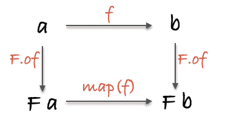

# Array.map 解释了 4 种复杂程度:从一个 5 岁的孩子到一个函数式程序员。

> 原文：<https://www.freecodecamp.org/news/array-map-explained-in-4-levels-of-difficulty/>

`Array.map`可能是 JavaScript 最有用的函数。如今放弃它就像没有锤子就戴上你的工具带。

为了进一步欣赏`map`并加深我们对它的理解，让我们按照复杂性递增的顺序来看 4 个层次的解释。

说说你得到了哪些，哪些让你惊喜！

## 目录

1.  [给一个五岁的孩子](#toafiveyearold)
2.  [给一个高中编码学生](#toahighschoolcodingstudent)
3.  [到反应显影剂](#toareactdeveloper)
4.  [给函数式程序员](#toafunctionalprogrammer)

## 给一个五岁的孩子

你知道龙珠 Z 吗？以下是我最喜欢的剧中角色！

#### 悟空


#### 贝吉塔


#### 男用短裤


他们是赛亚人，他们真的很强壮！

我把它们放在这个列表中——JavaScript 称它们为*数组*。它能让你把一堆东西放在一起:

```
saiyans = [goku, vegeta, trunks]; 
```

我有把他们变成超级赛亚人的代码，所以他们变得强大了 50 倍(真的)！这个代码被称为*函数*。

```
turnSuperSaiyan = () => { /* use your imagination */ };
turnSuperSaiyan(goku); 
```


如果我想把他们三个都转换呢？我必须运行该功能 3 次！重复那样的事情很无聊？

```
turnSuperSaiyan(goku);
turnSuperSaiyan(vegeta);
turnSuperSaiyan(trunks); 
```

幸运的是，编程可以让你很容易地重复很多次。可以一下子把他们都变成超级赛亚人！

只要把`turnSuperSaiyan`插在那里，就能得到一个由超级赛亚人悟空、贝吉塔和特兰克斯组成的*新数组*。

```
superSaiyans = saiyans.map(turnSuperSaiyan); 
```


## 给一个高中编码学生

嗨！

所以你已经学会了`for`循环。它们非常适合做重复性的工作，但是我个人已经很多年不需要它了。

不要误解我，我仍然喜欢自动化重复的工作。事实上，大多数应用程序都涉及重复性工作。

想想这些例子...

*   照片墙
*   Whatsapp
*   谷歌搜索结果
*   电子邮件
*   联系人
*   正文消息

如果你把它们归结为核心，这些日常应用只是花哨的列表。许多前端开发正在将这些列表转换成用户友好的东西。

当然，大图更复杂，但大多数应用程序的核心是操纵列表！

在 JavaScript 程序中，我们将列表表示为数组。

所有的数组都有一个特殊的方法叫做`map`。它允许你根据你给它的函数把一个数组转换成一个新的数组。

这里有一些数字。

```
numbers = [1, 2, 3, 4, 5]; 
```

和一个`double`功能。

```
double = (x) => x * 2; 
```

你能用一个`for`循环把每一个翻倍吗？

```
doubledNumbers = [];

for (let i = 0; i < numbers.length; i++) {
	doubledNumbers.push(double(numbers[i]))
}

// [2, 4, 6, 8, 10] 
```

酷！这里用`map`表达同样的想法。

```
doubledNumbers = numbers.map(double);
// [2, 4, 6, 8, 10] 
```

`map`在引擎盖下构造循环，所以你再也不用担心错别字或丢失分号了！


这不仅仅是数字。这是一些用户...

```
users = [{
  name: 'Bruce Wayne',
  location: 'Gotham City',
  heroName: 'Batman'
}, {
  name: 'Barry Allen',
  location: 'Central City',
  heroName: 'The Flash'
}, {
  name: 'Clark Kent',
  location: 'Kryptonopolis',
  heroName: 'Superman'
}]; 
```

你如何为每个用户的`name`和`heroName`创建一个新的*数组*？可能使用了一个`for`环。

```
userInfo = [];

for (let i = 0; i < users.length; i++) {
  userInfo.push({
    name: users[i].name,
    heroName: users[i].heroName
  });
}

// Result
[
  {
    "name": "Bruce Wayne",
    "heroName": "Batman"
  },
  {
    "name": "Barry Allen",
    "heroName": "The Flash"
  },
  {
    "name": "Clark Kent",
    "heroName": "Superman"
  }
] 
```

这里有一个无循环版本。

```
userInfo = users.map(u => ({
  name: u.name,
  heroName: u.heroName
}));

// Result
[
  {
    "name": "Bruce Wayne",
    "heroName": "Batman"
  },
  {
    "name": "Barry Allen",
    "heroName": "The Flash"
  },
  {
    "name": "Clark Kent",
    "heroName": "Superman"
  }
] 
```

看到这有多简单了吗？我们可以这样实现`map`:

```
map = (fn, array) => {
	const results = [];

	for (let i = 0; i < array.length; i++) {
		results.push(fn(array[i]));
	}

	return results;
} 
```

因此，对于每个元素，调用给定的函数，并将其存储在一个新的数组中！

## 对于一个反应开发者来说

嗨！

数组原型提供了一个名为`map`的方法。

它将在您的数组中循环，对每个项目调用一个给定的函数，并返回一个包含这些更改的新数组。

不使用`for`循环，只使用`map`来获取用户名并呈现 UI。

```
const App = users => {
  return (
    <ul>
      <li>My name is {users.map(u => u.name)}!</li>
    </ul>
  );
}; 
```

是的，你可以方法链，因为它返回相同的类型！

```
const App = users => {
  return (
    <ul>
      {users
        .map(u => u.name)
        .map(name => (
          <li>My name is {name}!</li>
        ))}
    </ul>
  );
}; 
```

非常有用。你的主要部件多半会用`map`。

## 对一个函数式程序员来说

Map 只是将一个函数`a -> b`提升到一个上下文`F a -> F b`中。



不幸的是，JavaScript 没有将这种表达能力扩展到数组之外...


感谢布莱恩·朗斯多夫[的恶毒解释](https://twitter.com/yazeedBee/status/1150108731759300608)！

更多类似的内容，请查看[https://yazeedb.com！](https://yazeedb.com)

请告诉我你还想看什么！[我的 DMs 已经开放](https://twitter.com/yazeedBee)接受问题、评论和建议！