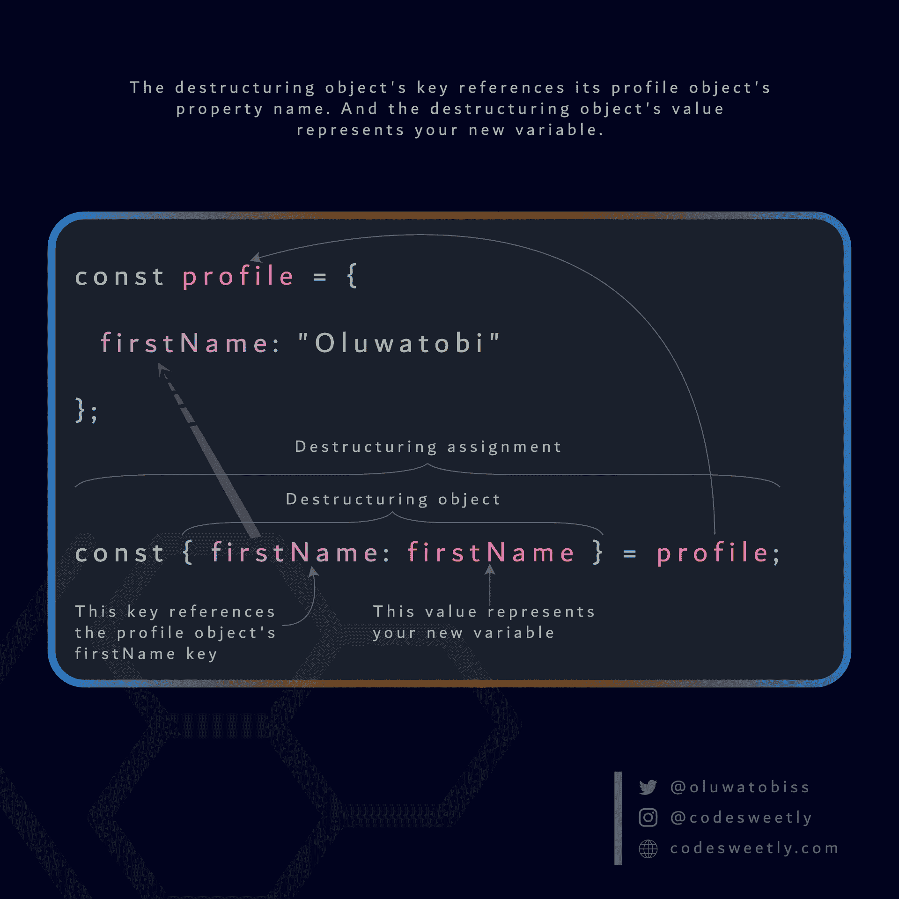

# JavaScript 中的数组和对象析构——有什么区别？

> 原文：<https://www.freecodecamp.org/news/array-vs-object-destructuring-in-javascript/>

JavaScript 中的析构赋值提供了一种简洁的方法来从数组和对象中提取值。

本文旨在向您展示 JavaScript 中数组和对象析构赋值是如何工作的。

所以，不再多说，让我们从数组析构开始吧。

## 什么是数组析构？

**数组析构**是一种独特的技术，允许你将数组的值整齐地提取到新的变量中。

例如，如果不使用数组析构赋值技术，您可以将数组的值复制到一个新变量中，如下所示:

```
const profile = ["Oluwatobi", "Sofela", "codesweetly.com"];

const firstName = profile[0];
const lastName = profile[1];
const website = profile[2];

console.log(firstName); // "Oluwatobi"
console.log(lastName); // "Sofela"
console.log(website); // "codesweetly.com"
```

[**在 StackBlitz** 上试一下](https://stackblitz.com/edit/web-platform-mrqjsu?file=script.js)

请注意，上面的代码片段有很多重复的代码，这不是干(**D**on t**R**EPE at**Y**our)的编码方式。

现在让我们来看看数组析构是如何使事情变得更整洁、更简洁的。

```
const profile = ["Oluwatobi", "Sofela", "codesweetly.com"];

const [firstName, lastName, website] = profile;

console.log(firstName); // "Oluwatobi"
console.log(lastName); // "Sofela"
console.log(website); // "codesweetly.com"
```

[**在 StackBlitz** 上试一下](https://stackblitz.com/edit/web-platform-uxrjek?file=script.js)

你看，像变魔术一样，我们已经通过将三个新变量(即，`firstName`、`lastName`和`website`)放入一个数组对象(`[...]`)中清理了我们的代码。然后，我们给它们分配了`profile`数组的值。

换句话说，我们指示计算机将`profile`数组的值提取到[赋值操作符](https://www.codesweetly.com/javascript-expression#types-of-expressions-in-javascript)左侧的变量中。

因此，JavaScript 将解析`profile`数组，并将其第一个值(`"Oluwatobi"`)复制到析构数组的第一个变量(`firstName`)中。

同样，计算机将把`profile`数组的第二个值(`"Sofela"`)提取到析构数组的第二个变量(`lastName`)中。

最后，JavaScript 将把`profile`数组的第三个值(`"codesweetly.com"`)复制到析构数组的第三个变量(`website`)中。

注意，上面的代码片段通过引用数组`profile`来解构它。但是，您也可以直接析构数组。让我们看看怎么做。

### 如何进行直接数组析构

JavaScript 让你像这样直接析构一个数组:

```
const [firstName, lastName, website] = [
  "Oluwatobi", 
  "Sofela", 
  "codesweetly.com"
];

console.log(firstName); // "Oluwatobi"
console.log(lastName); // "Sofela"
console.log(website); // "codesweetly.com"
```

[**在 StackBlitz** 上试一下](https://stackblitz.com/edit/web-platform-rndtx5?file=script.js)

假设您喜欢将变量声明与它们的赋值分开。在这种情况下，JavaScript 已经覆盖了您。让我们看看怎么做。

### 如何在将变量声明与其赋值分离时使用数组析构

无论何时使用数组析构，JavaScript 都允许您将变量声明与它们的赋值分开。

**这里有一个例子:**

```
let firstName, lastName, website;

[firstName, lastName, website] = ["Oluwatobi", "Sofela", "codesweetly.com"];

console.log(firstName); // "Oluwatobi"
console.log(lastName); // "Sofela"
console.log(website); // "codesweetly.com"
```

[**在 StackBlitz** 上试一下](https://stackblitz.com/edit/web-platform-nm1ng3?file=script.js)

如果您希望将`"Oluwatobi"`赋给`firstName`变量，而将数组中的其余元素赋给另一个变量，该怎么办呢？你是怎么做到的？下面就来了解一下。

### 如何使用数组析构将数组文本的其余部分赋给变量

JavaScript 允许您在析构数组中使用 [rest 操作符](https://www.codesweetly.com/javascript-rest-operator)将常规数组的剩余部分赋给变量。

**这里有一个例子:**

```
const [firstName, ...otherInfo] = ["Oluwatobi", "Sofela", "codesweetly.com"];

console.log(firstName); // "Oluwatobi"
console.log(otherInfo); // ["Sofela", "codesweetly.com"]
```

[**在 StackBlitz** 上试一下](https://stackblitz.com/edit/web-platform-w15axc?file=script.js)

**注意:**总是使用 rest 操作符作为析构数组的最后一项，以避免得到`SyntaxError`。

现在，如果你只想提取`"codesweetly.com"`呢？下面我们来讨论一下你可以使用的技术。

### 如何使用数组析构来提取任意索引处的值

下面是如何使用数组析构来提取常规数组中任何索引位置的值:

```
const [, , website] = ["Oluwatobi", "Sofela", "codesweetly.com"];

console.log(website); // "codesweetly.com"
```

[**在 StackBlitz** 上试一下](https://stackblitz.com/edit/web-platform-311nkt?file=script.js)

在上面的代码片段中，我们使用逗号来跳过析构数组的第一个和第二个索引位置的变量。

通过这样做，我们能够将`website`变量链接到赋值操作符右侧的常规数组的第三个索引值(即`"codesweetly.com"`)。

然而，有时您希望从数组中提取的值是`undefined`。在这种情况下，JavaScript 提供了一种在析构数组中设置默认值的方法。下面我们来详细了解一下。

### 默认值在数组析构赋值中如何工作

当您希望从数组中提取的值不存在(或者被设置为`undefined`)时，设置默认值会很方便。

下面是如何在析构数组中设置一个:

```
const [firstName = "Tobi", website = "CodeSweetly"] = ["Oluwatobi"];

console.log(firstName); // "Oluwatobi"
console.log(website); // "CodeSweetly"
```

[**在 StackBlitz** 上试一下](https://stackblitz.com/edit/web-platform-r38k67?file=script.js)

在上面的代码片段中，我们将`"Tobi"`和`"CodeSweetly"`设置为`firstName`和`website`变量的默认值。

因此，在我们试图从右侧数组中提取第一个索引值时，计算机默认为`"CodeSweetly"`——因为在`["Oluwatobi"]`中只存在第零个索引值。

那么，如果你需要交换`firstName`和`website`的值呢？同样，您可以使用数组析构来完成这项工作。让我们看看怎么做。

### 如何使用数组析构来交换变量值

您可以使用数组析构赋值来交换两个或更多不同变量的值。

**这里有一个例子:**

```
let firstName = "Oluwatobi";
let website = "CodeSweetly";

[firstName, website] = [website, firstName];

console.log(firstName); // "CodeSweetly"
console.log(website); // "Oluwatobi"
```

[**在 StackBlitz** 上试一下](https://stackblitz.com/edit/web-platform-fu7phn?file=script.js)

在上面的代码片段中，我们使用直接数组析构来用赋值操作符右侧的数组文字值重新分配`firstName`和`website`变量。

因此，`firstName`的值将从`"Oluwatobi"`变为`"CodeSweetly"`。而`website`的内容将从`"CodeSweetly"`变为`"Oluwatobi"`。

请记住，您还可以使用数组析构将值从常规数组提取到函数的参数中。下面我们再来详细说说这个。

### 如何使用数组析构将数组中的值提取到函数参数中

下面是如何使用数组析构将数组的值提取到函数的参数中:

```
// Define an array with two items:
const profile = ["Oluwatobi", "Sofela"];

// Define a function with one destructuring array containing two parameters:
function getUserBio([firstName, lastName]) {
  return `My name is ${firstName} ${lastName}.`;
}

// Invoke getUserBio while passing the profile array as an argument:
getUserBio(profile);

// The invocation above will return:
"My name is Oluwatobi Sofela."
```

[**在 StackBlitz** 上试一下](https://stackblitz.com/edit/web-platform-ckdkjb?file=script.js)

在上面的代码片段中，我们使用了一个数组析构参数将`profile`数组的值提取到`getUserBio`的`firstName`和`lastName`参数中。

**注意:**数组析构参数通常被称为*析构参数*。

这里还有一个例子:

```
// Define an array with two string values and one nested array:
const profile = ["codesweetly.com", "Male", ["Oluwatobi", "Sofela"]];

// Define a function with two destructuring arrays containing a parameter each:
function getUserBio([website, , [userName]]) {
  return `${userName} runs ${website}`;
}

// Invoke getUserBio while passing the profile array as an argument:
getUserBio(profile);

// The invocation above will return:
"Oluwatobi runs codesweetly.com"
```

[**在 StackBlitz** 上试一下](https://stackblitz.com/edit/web-platform-gvzqak?file=script.js)

在上面的代码片段中，我们使用两个数组析构参数将`profile`数组的值提取到`getUserBio`的`website`和`userName`参数中。

有时候你可能需要调用一个包含析构参数的函数，而不传递任何参数给它。在这种情况下，您需要使用一种技术来防止浏览器抛出`TypeError`。

下面我们来学习一下技巧。

### 如何在不提供任何参数的情况下调用包含数组析构参数的函数

考虑下面的函数:

```
function getUserBio([firstName]) {
  console.log(
    "Do something else that does not need the destructuring parameter."
  );
  return `My name is ${firstName}.`;
}
```

现在，让我们调用`getUserBio`函数，而不向它的析构参数传递任何参数:

```
getUserBio();
```

[**在 CodeSandBox 上试试**](https://codesandbox.io/s/wrong-way-to-invoke-a-function-containing-an-array-destructuring-parameter-vtdrl)

调用上面的`getUserBio`函数后，浏览器会抛出类似`TypeError: undefined is not iterable`的错误。

出现`TypeError`消息是因为包含析构参数的函数希望您至少提供一个参数。

因此，您可以通过给析构参数分配一个默认参数来避免这样的错误消息。

**这里有一个例子:**

```
function getUserBio([firstName] = []) {
  console.log(
    "Do something else that does not need the destructuring parameter."
  );
  return `My name is ${firstName}.`;
}
```

请注意，在上面的代码片段中，我们指定了一个空数组作为析构参数的默认参数。

因此，现在让我们调用`getUserBio`函数，而不向其析构参数传递任何参数:

```
getUserBio();
```

该函数将输出:

```
"Do something else that does not need the destructuring parameter."
"My name is undefined."
```

[**在 CodeSandBox 上试试**](https://codesandbox.io/s/the-correct-way-to-invoke-a-function-containing-an-array-destructuring-parameter-voo50?file=/src/index.js)

请记住，您不必使用空数组作为析构参数的默认参数。您可以使用不是`null`或`undefined`的任何其他值。

现在我们知道了数组析构是如何工作的，让我们来讨论对象析构，这样我们就可以看到不同之处。

## JavaScript 中什么是对象析构？

**对象析构**是一种独特的技术，允许你将一个对象的值整齐地提取到新的变量中。

例如，在不使用对象析构赋值技术的情况下，我们可以将对象的值提取到一个新变量中，如下所示:

```
const profile = {
  firstName: "Oluwatobi", 
  lastName: "Sofela", 
  website: "codesweetly.com"
};

const firstName = profile.firstName;
const lastName = profile.lastName;
const website = profile.website;

console.log(firstName); // "Oluwatobi"
console.log(lastName); // "Sofela"
console.log(website); // "codesweetly.com"
```

[**在 StackBlitz** 上试一下](https://stackblitz.com/edit/web-platform-3tyjgy?file=script.js)

请注意，上面的代码片段有很多重复的代码，这不是干(**D**on t**R**EPE at**Y**our)的编码方式。

现在让我们看看对象析构赋值是如何让事情变得更整洁和简单的。

```
const profile = {
  firstName: "Oluwatobi", 
  lastName: "Sofela", 
  website: "codesweetly.com"
};

const { firstName: firstName, lastName: lastName, website: website } = profile;

console.log(firstName); // "Oluwatobi"
console.log(lastName); // "Sofela"
console.log(website); // "codesweetly.com"
```

[**在 StackBlitz** 上试一下](https://stackblitz.com/edit/web-platform-begth4?file=script.js)

你看，像变魔术一样，我们通过将三个新变量放入 properties 对象(`{...}`)中并给它们分配`profile`对象的值来清理代码。

换句话说，我们指示计算机将`profile`对象的值提取到[赋值操作符](https://www.codesweetly.com/javascript-expression#types-of-expressions-in-javascript)左侧的变量中。

因此，JavaScript 将解析`profile`对象，并将其第一个值(`"Oluwatobi"`)复制到析构对象的第一个变量(`firstName`)中。

同样，计算机将把`profile`对象的第二个值(`"Sofela"`)提取到析构对象的第二个变量(`lastName`)中。

最后，JavaScript 将把`profile`对象的第三个值(`"codesweetly.com"`)复制到析构对象的第三个变量(`website`)中。

请记住，在`{ firstName: firstName, lastName: lastName, website: website }`中，键是对`profile`对象属性的引用——而键值代表新变量。



The anatomy of a JavaScript object destructuring assignment

或者，您可以使用速记语法使您的代码更容易阅读。

**这里有一个例子:**

```
const profile = {
  firstName: "Oluwatobi", 
  lastName: "Sofela", 
  website: "codesweetly.com"
};

const { firstName, lastName, website } = profile;

console.log(firstName); // "Oluwatobi"
console.log(lastName); // "Sofela"
console.log(website); // "codesweetly.com"
```

[**在 StackBlitz** 上试一下](https://stackblitz.com/edit/web-platform-4nhtlt?file=script.js)

在上面的代码片段中，我们将`{ firstName: firstName, age: age, gender: gender }`缩短为`{ firstName, age, gender }`。你可以在这里了解更多关于速记技巧[。](https://alligator.io/js/object-property-shorthand-es6/)

请注意，上面的片段演示了当对象的属性和变量同名时，如何将对象的值赋给变量。

但是，您也可以将属性值赋给不同名称的变量。让我们看看怎么做。

### 当属性的名称不同于变量的名称时，如何使用对象析构

JavaScript 允许您使用对象析构将属性值提取到变量中，即使属性和变量的名称不同。

**这里有一个例子:**

```
const profile = {
  firstName: "Oluwatobi", 
  lastName: "Sofela", 
  website: "codesweetly.com"
};

const { firstName: forename, lastName: surname, website: onlineSite } = profile;

console.log(forename); // "Oluwatobi"
console.log(surname); // "Sofela"
console.log(onlineSite); // "codesweetly.com"
console.log(website); // "ReferenceError: website is not defined"
```

**[在 CodeSandBox 上试试](https://codesandbox.io/s/how-to-use-object-destructuring-when-the-propertys-name-differs-from-that-of-the-variable-ppohh?file=/src/index.js)**

在上面的代码片段中，计算机成功地将`profile`对象的值提取到名为`forename`、`surname`和`onlineSite`的变量中，尽管属性和变量的名称不同。

**注:** `const { firstName: forename } = profile`相当于`const forename = profile.firstName`。

这里还有一个例子:

```
const profile = {
  lastName: { familyName: "Sofela" }
};

const { lastName: { familyName: surname } } = profile;

console.log(surname); // "Sofela"
```

[**在 StackBlitz** 上试一下](https://stackblitz.com/edit/web-platform-nbnqcl?file=script.js)

在上面的代码片段中，计算机成功地将`profile`对象的值提取到了`surname`变量中——尽管属性和变量的名称不同。

**注:** `const { lastName: { familyName: surname } } = profile`相当于`const surname = profile.lastName.familyName`。

注意到目前为止，我们已经通过引用来析构了`profile`对象。但是，您也可以直接析构一个对象。让我们看看怎么做。

### 如何直接析构对象

JavaScript 允许直接析构 properties 对象，如下所示:

```
const { firstName, lastName, website } = {
  firstName: "Oluwatobi", 
  lastName: "Sofela", 
  website: "codesweetly.com"
};

console.log(firstName); // "Oluwatobi"
console.log(lastName); // "Sofela"
console.log(website); // "codesweetly.com"
```

[**在 StackBlitz** 上试一下](https://stackblitz.com/edit/web-platform-vspaeg?file=script.js)

假设您喜欢将变量声明与它们的赋值分开。在这种情况下，JavaScript 已经覆盖了您。让我们看看如何。

### 如何在将变量声明与其赋值分离时使用对象析构

无论何时使用对象析构，JavaScript 都允许您将变量声明与它们的赋值分开。

**这里有一个例子:**

```
// Declare three variables:
let firstName, lastName, website;

// Extract values to the three variables above:
({ firstName, lastName, website } = {
  firstName: "Oluwatobi", 
  lastName: "Sofela", 
  website: "codesweetly.com"
});

// Invoke the three variables:
console.log(firstName); // "Oluwatobi"
console.log(lastName); // "Sofela"
console.log(website); // "codesweetly.com"
```

[**在 StackBlitz** 上试一下](https://stackblitz.com/edit/web-platform-3fmanq?file=script.js)

**注:**

*   确保将对象析构赋值用括号括起来。通过这样做，计算机将知道被析构的对象是一个对象文字，而不是一个块。
*   在对象析构赋值的括号后放置一个分号(`;`)。通过这样做，您将防止计算机将括号解释为可能在前一行中的函数的调用程序。

如果您希望将`"Oluwatobi"`赋给`firstName`变量，而将对象的其余值赋给另一个变量，该怎么办呢？你怎么能这样做？下面就来了解一下。

### 如何使用对象析构将对象的其余部分赋给变量

JavaScript 允许您在析构对象中使用 [rest 操作符](https://www.codesweetly.com/javascript-rest-operator/)将对象文字的其余部分赋给变量。

**这里有一个例子:**

```
const { firstName, ...otherInfo } = {
  firstName: "Oluwatobi",
  lastName: "Sofela",
  website: "codesweetly.com"
};

console.log(firstName); // "Oluwatobi"
console.log(otherInfo); // {lastName: "Sofela", website: "codesweetly.com"}
```

[**在 StackBlitz** 上试一下](https://stackblitz.com/edit/web-platform-hksus5?file=script.js)

**注意:**总是使用 rest 操作符作为析构对象的最后一项，以避免得到`SyntaxError`。

有时，您希望从 properties 对象中提取的值是`undefined`。在这种情况下，JavaScript 提供了一种在析构对象中设置默认值的方法。下面我们来详细了解一下。

### 默认值在对象析构赋值中如何工作

当您希望从对象中提取的值不存在时(或设置为`undefined`)，设置默认值会很方便。

下面是如何在析构属性对象中设置一个:

```
const { firstName = "Tobi", website = "CodeSweetly" } = {
  firstName: "Oluwatobi"
};

console.log(firstName); // "Oluwatobi"
console.log(website); // "CodeSweetly"
```

[**在 StackBlitz** 上试一下](https://stackblitz.com/edit/web-platform-pnjh9a?file=script.js)

在上面的代码片段中，我们将`"Tobi"`和`"CodeSweetly"`设置为`firstName`和`website`变量的默认值。

因此，在我们试图从右侧对象中提取第二个属性的值时，计算机默认为`"CodeSweetly"`——因为在`{firstName: "Oluwatobi"}`中只存在一个属性。

那么，如果你需要交换`firstName`和`website`的值呢？同样，您可以使用对象析构来完成这项工作。下面来看看如何。

### 如何使用对象析构来交换值

您可以使用对象析构赋值来交换两个或更多不同变量的值。

**这里有一个例子:**

```
let firstName = "Oluwatobi";
let website = "CodeSweetly";

({ firstName, website } = {firstName: website, website: firstName});

console.log(firstName); // "CodeSweetly"
console.log(website); // "Oluwatobi"
```

[**在 StackBlitz** 上试一下](https://stackblitz.com/edit/web-platform-fmyerw?file=script.js)

上面的代码片段使用直接对象析构，用赋值操作符右边的对象文字值重新分配`firstName`和`website`变量。

因此，`firstName`的值将从`"Oluwatobi"`变为`"CodeSweetly"`。而`website`的内容将从`"CodeSweetly"`变为`"Oluwatobi"`。

请记住，您还可以使用对象析构将属性中的值提取到函数的参数中。下面我们再来详细说说这个。

### 如何使用对象析构将属性中的值提取到函数的参数中

下面是如何使用对象析构将属性值复制到函数的参数中:

```
// Define an object with two properties:
const profile = {
  firstName: "Oluwatobi",
  lastName: "Sofela",
};

// Define a function with one destructuring object containing two parameters:
function getUserBio({ firstName, lastName }) {
  return `My name is ${firstName} ${lastName}.`;
}

// Invoke getUserBio while passing the profile object as an argument:
getUserBio(profile);

// The invocation above will return:
"My name is Oluwatobi Sofela."
```

[**在 StackBlitz** 上试一下](https://stackblitz.com/edit/web-platform-aucght?file=script.js)

在上面的代码片段中，我们使用了一个对象析构参数将`profile`对象的值复制到`getUserBio`的`firstName`和`lastName`参数中。

**注意:**一个对象析构参数通常被称为*析构参数*。

这里还有一个例子:

```
// Define an object with three-parent properties:
const profile = {
  website: "codesweetly.com",
  gender: "Male",
  fullName: {
    firstName: "Oluwatobi",
    lastName: "Sofela"
  }
};

// Define a function with two destructuring objects containing a parameter each:
function getUserBio({ website, fullName: { firstName: userName } }) {
  return `${userName} runs ${website}`;
}

// Invoke getUserBio while passing the profile object as an argument:
getUserBio(profile);

// The invocation above will return:
"Oluwatobi runs codesweetly.com"
```

[**在 StackBlitz** 上试一下](https://stackblitz.com/edit/web-platform-g2n2a6?file=script.js)

在上面的代码片段中，我们使用了两个析构参数将`profile`对象的值复制到`getUserBio`的`website`和`userName`参数中。

**注:**如果你不清楚上面的析构参数，可以通过查看[这一节](#how-to-use-object-destructuring-when-the-property-s-name-differs-from-that-of-the-variable)来更好的掌握。

有时候你可能需要调用一个包含析构参数的函数，而不传递任何参数给它。在这种情况下，您需要使用一种技术来防止浏览器抛出`TypeError`。

下面我们来学习一下技巧。

### 如何在不提供任何参数的情况下调用包含析构参数的函数

考虑下面的函数:

```
function getUserBio({ firstName }) {
  console.log(
    "Do something else that does not need the destructuring parameter."
  );
  return `My name is ${firstName}.`;
}
```

现在，让我们调用`getUserBio`函数，而不向它的析构参数传递任何参数:

```
getUserBio();
```

[**在 CodeSandBox 上试试**](https://codesandbox.io/s/wrong-way-to-invoke-a-function-containing-an-object-destructuring-parameter-c1hdx?file=/src/index.js)

调用上面的`getUserBio`函数后，浏览器会抛出类似`TypeError: (destructured parameter) is undefined`的错误。

出现`TypeError`消息是因为包含析构参数的函数希望您至少提供一个参数。

因此，您可以通过给析构参数分配一个默认参数来避免这样的错误消息。

**这里有一个例子:**

```
function getUserBio({ firstName } = {}) {
  console.log(
    "Do something else that does not need the destructuring parameter."
  );
  return `My name is ${firstName}.`;
}
```

注意，在上面的代码片段中，我们指定了一个空对象作为析构参数的默认参数。

因此，现在让我们调用`getUserBio`函数，而不向其析构参数传递任何参数:

```
getUserBio();
```

该函数将输出:

```
"Do something else that does not need the destructuring parameter."
"My name is undefined."
```

**[在 CodeSandBox 上试试](https://codesandbox.io/s/the-correct-way-to-invoke-a-function-containing-an-object-destructuring-parameter-7kvum?file=/src/index.js)**

请记住，您不必使用空对象作为析构参数的默认参数。您可以使用不是`null`或`undefined`的任何其他值。

## 包装它

数组和对象析构的工作方式类似。这两种析构赋值的主要区别是:

*   数组析构从数组中提取值。但是对象析构从 JavaScript 对象中提取值。

## 概观

本文讨论了 JavaScript 中数组和对象析构的工作原理。我们还看了两个析构赋值之间的主要区别。

感谢阅读！

### 这里有一个有用的资源:

我写了一本关于 React 的书！

*   这是初学者友好的✔
*   它有✔的现场代码片段
*   它包含可扩展的项目✔
*   ✔有很多容易理解的例子

[React 解释清楚](https://amzn.to/30iVPIG)的书就是你理解 ReactJS 所需要的全部。

[点击此处获取您的副本](https://amzn.to/30iVPIG)

[](https://amzn.to/30iVPIG)