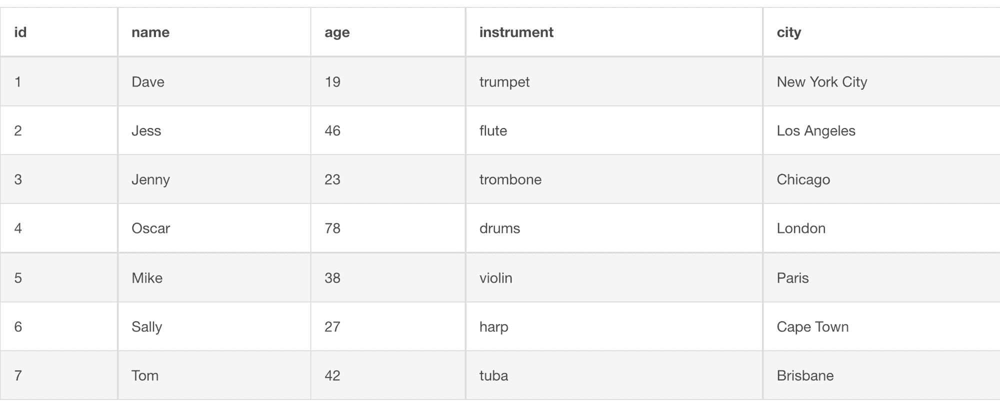
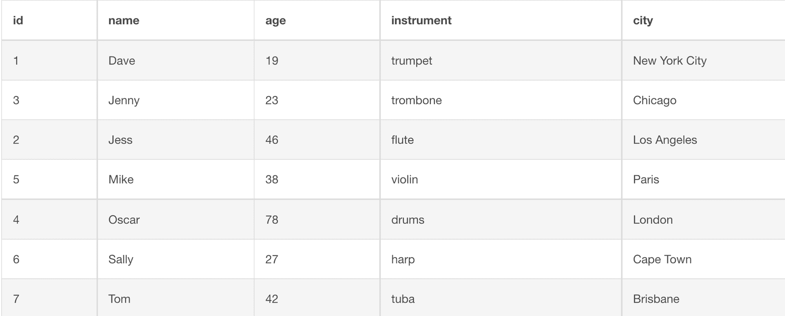
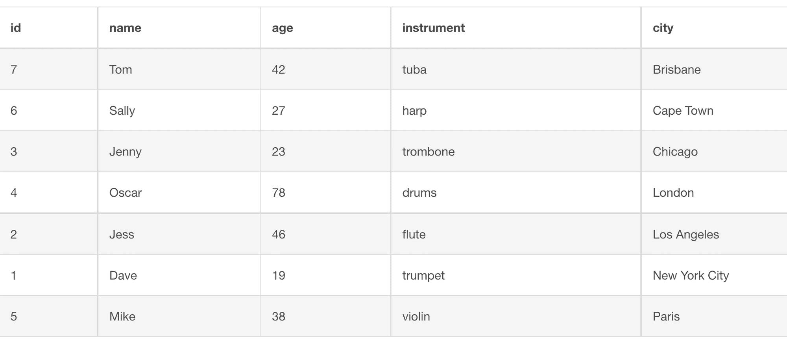
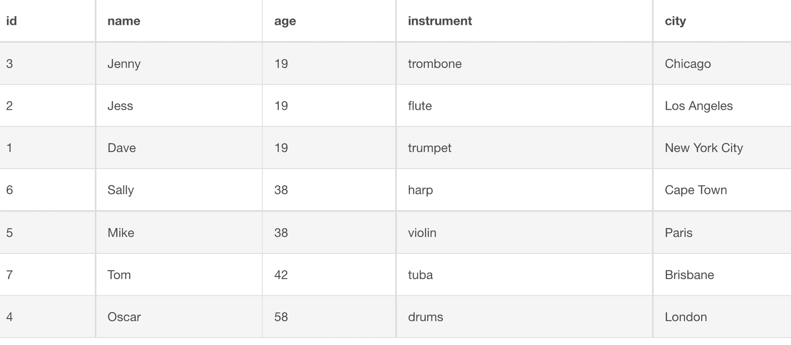
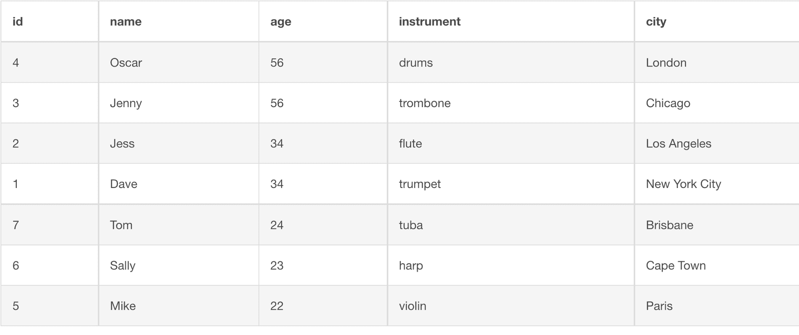

# SQL Order By 的升序排序

> 原文：<https://www.freecodecamp.org/news/ascending-order-with-sql-order-by/>

在本文中，我将展示几个代码示例，说明如何使用 SQL 中的`ORDER BY`子句对数据进行升序排序。

## 按语法排序

这是按升序对数据进行排序的基本语法:

```
SELECT columns FROM table
ORDER BY column;
```

如果你想按降序排序，那么你必须使用`DESC`关键字。

```
SELECT columns FROM table
ORDER BY column DESC;
```

SQL 中的`SELECT`语句告诉计算机从表中获取数据。

SQL 中的`FROM`子句指定了我们想要列出哪个表。

在这个例子中，我们有一个音乐家的表格，其中有列`id`、`name`、`age`、`instrument`和`city`:



现在，该表由`id`自动按升序排序。

如果我们想按升序对`name`列进行排序，那么我们必须使用以下语法:

```
SELECT * FROM musicians
ORDER BY name;
```

字符`*`告诉计算机选择表格中的所有列。



您可以看到`names`现在按字母顺序排列，而`id`不再按正确的升序排列。

如果我们想通过`city`对数据进行排序，那么我们可以使用这个语法。

```
SELECT * FROM musicians
ORDER BY city;
```



您也可以在同一命令中按升序对多列进行排序。

在这个新的音乐家示例中，我们可以按升序对`age`和`city`列进行排序。

```
SELECT * FROM musicians
ORDER BY age, city;
```



我们可以看到有三个 19 岁的音乐家，他们各自的城市按字母顺序排列在表格中。我们还可以看到这两位 38 岁的音乐家，他们的城市按照字母顺序排列。

如果我们想对一些数据进行升序排序，对另一些数据进行降序排序，那么我们必须使用关键字`ASC`和`DESC`。

在这个新的音乐家示例中，我们希望对`age`列进行降序排序，对`instrument`列进行升序排序。

下面是语法:

```
SELECT * FROM musicians
ORDER BY age DESC, instrument ASC;
```

我们必须在列名旁边使用`ASC`和`DESC`关键字来告诉计算机如何对数据进行排序。

结果将如下所示:



我们可以在表格中看到奥斯卡和珍妮都是最大的。但奥斯卡是最高的结果，因为鼓按字母顺序排在长号之前。

我们在杰斯和戴夫身上看到了同样的情况。尽管他们年龄相同，杰斯在表中的位置更高，因为按字母顺序长笛排在小号之前。

## 结论

您可以使用 SQL 中的`ORDER BY`子句对表数据进行升序排序。

```
SELECT columns FROM table
ORDER BY column;
```

如果你想按降序排序，那么你也必须使用`DESC`关键字。

```
SELECT columns FROM table
ORDER BY column DESC;
```

字符`*`告诉计算机选择表格中的所有列。

```
SELECT * FROM table
ORDER BY column;
```

如果您想对多个列进行升序排序，那么您应该在`ORDER BY`子句旁边列出您想要排序的列。

```
SELECT * FROM table
ORDER BY column1, column2;
```

如果你想对一些数据进行升序排序，对另一些数据进行降序排序，那么你必须使用关键字`ASC`和`DESC`。

```
SELECT * FROM table
ORDER BY column1 ASC, column2 DESC;
```

也就是如何在 SQL 中使用`ORDER BY`子句对数据进行升序排序。