# 如何使用 Angular 5 和 Entity Framework Core 在 HTML 中部署可编辑表格

> 原文：<https://www.freecodecamp.org/news/asp-net-core-crud-using-angular-5-and-entity-framework-core-374ac04cd3ec/>

### 介绍

在本文中，我们将在实体框架(EF)核心数据库优先方法的帮助下，使用**ASP.NET 核心 2.0** 和 **Angular 5** 创建一个 web 应用程序。我们将创建一个样本员工记录管理系统。为了读取用户的输入，我们将使用**角度形式**，并在客户端进行必要的字段验证。我们还将使用 EF Core 将角度形式的下拉列表绑定到数据库中的一个表。

我们将使用 **Visual Studio 2017** 和**SQL Server**2008 版或更高版本。

### 先决条件

*   安装。NET Core 2.0.0 以上 SDK 从[这里](https://www.microsoft.com/net/core#windowscmd)。
*   从[这里](https://www.visualstudio.com/downloads/)安装最新版本的 Visual Studio 2017 社区版。
*   从[这里](https://nodejs.org/en/download/)下载并安装 Node.js 的最新版本..
*   SQL Server 2008 或以上版本。

### 源代码

在继续之前，我建议您从 [Github](https://github.com/AnkitSharma-007/CRUD.ASPCore.Angular5.WebAPI.EF) 获取源代码。

### 创建表

我们将使用两个表来存储我们的数据。

1.  `tblEmployee`:用于存储员工的详细信息。它包含 EmployeeID、姓名、城市、部门和性别等字段。
2.  `tblCities`:包含城市列表。它用于填充 tblEmployee 表的*城市*字段。tblCities 包含两个字段，CityID 和 CityName。

执行以下命令创建两个表:

```
CREATE TABLE tblEmployee (  EmployeeID int IDENTITY(1,1) NOT NULL PRIMARY KEY,  Name varchar(20) NOT NULL ,  City varchar(20) NOT NULL ,  Department varchar(20) NOT NULL ,  Gender varchar(6) NOT NULL   )  GO    CREATE TABLE tblCities (  CityID int IDENTITY(1,1) NOT NULL PRIMARY KEY,  CityName varchar(20) NOT NULL   )  GO
```

现在我们将一些数据放入`tblCities`表中。我们将使用这个表在我们的 web 应用程序中绑定一个下拉列表。可以使用此下拉列表选择所需的城市。使用以下 insert 语句。

```
INSERT INTO tblCities VALUES('New Delhi');  INSERT INTO tblCities VALUES('Mumbai');  INSERT INTO tblCities VALUES('Hyderabad');  INSERT INTO tblCities VALUES('Chennai');  INSERT INTO tblCities VALUES('Bengaluru');
```

现在，我们的数据库部分已经完成。因此，我们将继续使用 Visual Studio 2017 创建 MVC 应用程序。

### 创建 ASP.NET MVC web 应用程序

打开 Visual Studio 并选择文件>>新建>>项目。

选择项目后，将会打开一个“新项目”对话框。选择。NET Core 里面的 Visual C#菜单从左侧面板。

然后，选择“ASP。NET Core Web Application”从可用的项目类型。将项目名称设为“EFNgApp”*，按 OK。*

*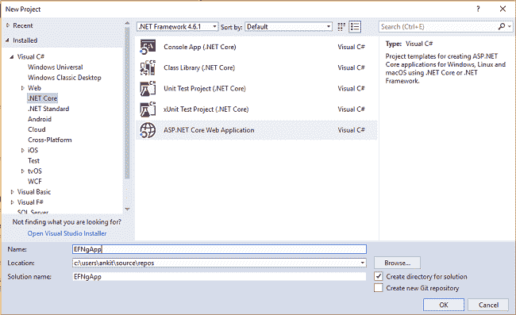*

*单击 OK 后，将打开一个新对话框，要求您选择项目模板。您可以在模板窗口的左上角看到两个下拉菜单。选择”。NET Core”和“ASP。NET Core 2.0”。然后，选择“角度”模板并按确定。*

*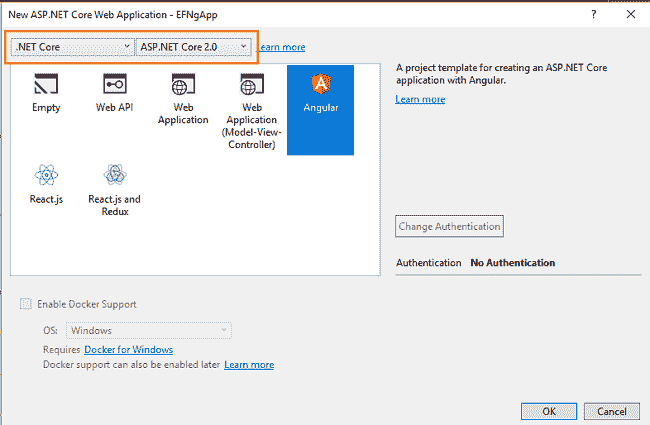*

*现在，我们的项目将被创建。在下图中，您可以看到解决方案资源管理器中的文件夹结构。*

**

*这里，我们有“控制器”和“视图”文件夹。在本教程中，我们不会用到 Views 文件夹，因为我们将使用 Angular 来处理 UI。*

**控制器*文件夹将包含我们的 Web API 控制器。我们感兴趣的是应用程序客户端所在的“ClientApp”文件夹。*

*在“ClientApp/app/components 文件夹”中，我们已经创建了几个组件。VS 2017 中的 Angular 模板默认提供了这些。这些组件不会影响我们的应用程序，但是出于本教程的考虑，我们将从 ClientApp/app/components *中删除“fetchdata”和“counter”文件夹。**

### *将模型添加到应用程序中*

*我们使用实体框架核心数据库优先的方法来创建我们的模型。导航到工具>>获取软件包管理器>>软件包管理器控制台。*

*我们必须为我们的目标数据库提供者安装这个包，在这个例子中是 SQL Server。现在运行以下命令:*

```
*`Install-Package Microsoft.EntityFrameworkCore.SqlServer`*
```

*因为我们使用实体框架工具从现有的数据库中创建一个模型，所以我们也将安装工具包。运行以下命令:*

```
*`Install-Package Microsoft.EntityFrameworkCore.Tools`*
```

*在您安装了这两个包之后，我们将使用以下命令从数据库表中构建我们的模型:*

```
*`Scaffold-DbContext "Your connection string here" Microsoft.EntityFrameworkCore.SqlServer -OutputDir Models -Tables tblEmployee, tblCities`*
```

***不要忘记用**输入你自己的连接字符串(在双引号" "内)。该命令成功执行后，将会创建一个“Models”文件夹。该文件夹包含三个类文件:`myTestDBContext.cs` *、* `TblCities.cs` 和`TblEmployee.cs`。我们使用 EF 核心数据库优先方法成功创建了我们的模型。*

*现在，我们将再创建一个类文件来处理与数据库相关的操作*

*右键单击“模型”文件夹并选择 Add >> Class。将你的`class EmployeeDataAccessLa` *y* er.cs 命名，点击“添加”按钮。此时,“Models”文件夹将具有以下结构。*

*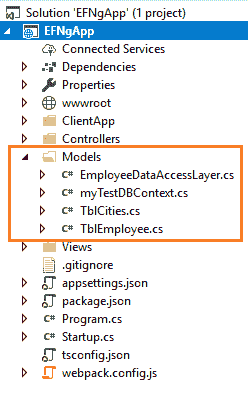*

*打开“employeedataaccesslayer . cs”*，插入以下代码处理数据库操作。**

```
**`using Microsoft.EntityFrameworkCore;  using System;  using System.Collections.Generic;  using System.Linq;  using System.Threading.Tasks;    namespace EFNgApp.Models  {      public class EmployeeDataAccessLayer      {          myTestDBContext db = new myTestDBContext();            public IEnumerable<TblEmployee> GetAllEmployees()          {              try              {                  return db.TblEmployee.ToList();              }              catch              {                  throw;              }          }            //To Add new employee record           public int AddEmployee(TblEmployee employee)          {              try              {                  db.TblEmployee.Add(employee);                  db.SaveChanges();                  return 1;              }              catch              {                  throw;              }          }            //To Update the records of a particluar employee          public int UpdateEmployee(TblEmployee employee)          {              try              {                  db.Entry(employee).State = EntityState.Modified;                  db.SaveChanges();                    return 1;              }              catch              {                  throw;              }          }            //Get the details of a particular employee          public TblEmployee GetEmployeeData(int id)          {              try              {                  TblEmployee employee = db.TblEmployee.Find(id);                  return employee;              }              catch              {                  throw;              }          }            //To Delete the record of a particular employee          public int DeleteEmployee(int id)          {              try              {                  TblEmployee emp = db.TblEmployee.Find(id);                  db.TblEmployee.Remove(emp);                  db.SaveChanges();                  return 1;              }              catch              {                  throw;              }          }            //To Get the list of Cities          public List<TblCities> GetCities()          {              List<TblCities> lstCity = new List<TblCities>();              lstCity = (from CityList in db.TblCities select CityList).ToList();                return lstCity;          }      }  }`**
```

**现在，我们将继续创建我们的 Web API 控制器。**

### **向应用程序添加 Web API 控制器**

**右键单击控制器文件夹并选择添加>>新项目。**

**将会打开“添加新项目”对话框。选择“ASP。净*从左侧面板。然后，从模板面板中选择“Web API 控制器类”，并将名称设为`EmployeeController.cs`。点击“添加”。***

***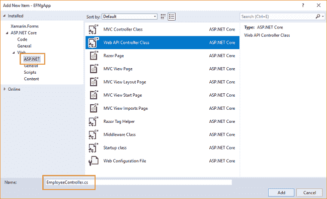***

***这将创建我们的 Web API“employee controller”*类。我们将把所有的业务逻辑放在这个控制器中。我们将调用“EmployeeDataAccessLayer”*的方法来获取数据并将数据传递给 Angular 前端。*****

***打开“employee controller . cs”*文件，将以下代码插入其中:****

```
***`using System;  using System.Collections.Generic;  using System.Linq;  using System.Threading.Tasks;  using EFNgApp.Models;  using Microsoft.AspNetCore.Mvc;     namespace EFNgApp.Controllers  {        public class EmployeeController : Controller      {          EmployeeDataAccessLayer objemployee = new EmployeeDataAccessLayer();            [HttpGet]          [Route("api/Employee/Index")]          public IEnumerable<TblEmployee> Index()          {              return objemployee.GetAllEmployees();          }            [HttpPost]          [Route("api/Employee/Create")]          public int Create([FromBody] TblEmployee employee)          {              return objemployee.AddEmployee(employee);          }            [HttpGet]          [Route("api/Employee/Details/{id}")]          public TblEmployee Details(int id)          {              return objemployee.GetEmployeeData(id);          }            [HttpPut]          [Route("api/Employee/Edit")]          public int Edit([FromBody]TblEmployee employee)          {              return objemployee.UpdateEmployee(employee);          }            [HttpDelete]          [Route("api/Employee/Delete/{id}")]          public int Delete(int id)          {              return objemployee.DeleteEmployee(id);          }            [HttpGet]          [Route("api/Employee/GetCityList")]          public IEnumerable<TblCities> Details()          {              return objemployee.GetCities();          }      }  }`***
```

***我们已经完成了后端逻辑。现在我们将使用 Angular 5 对前端进行编码。***

### ***创建角度服务***

***我们将创建一个 Angular 服务，它将 Web API 响应转换为 JSON，并将其传递给我们的组件。***

***右键单击“ClientApp/app”文件夹，然后添加>>新文件夹，并将文件夹命名为“Services”。***

***右键单击“服务”文件夹，然后选择添加>>新项目。将会打开“添加新项目”对话框。从左侧面板中选择“脚本”。然后从模板面板中选择“TypeScript File ”,放入 na `me as empservice.serv` ice.ts .点击“Add”。***

***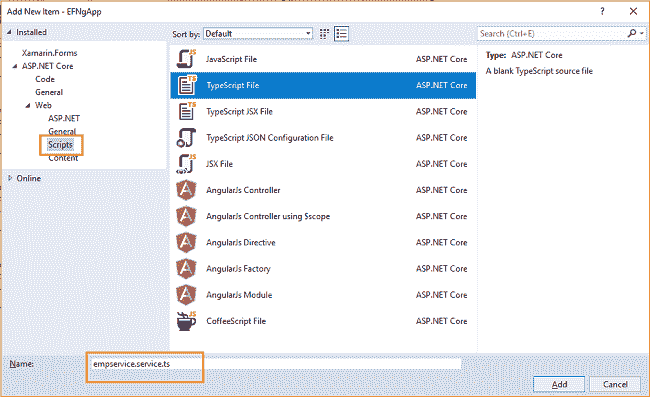***

***打开“empservice.service.ts”文件，并将以下代码插入其中:***

```
***`import { Injectable, Inject } from '@angular/core';  import { Http, Response } from '@angular/http';  import { Observable } from 'rxjs/Observable';  import { Router } from '@angular/router';  import 'rxjs/add/operator/map';  import 'rxjs/add/operator/catch';  import 'rxjs/add/observable/throw';    @Injectable()  export class EmployeeService {      myAppUrl: string = "";        constructor(private _http: Http, @Inject('BASE_URL') baseUrl: string) {          this.myAppUrl = baseUrl;      }        getCityList() {          return this._http.get(this.myAppUrl + 'api/Employee/GetCityList')              .map(res => res.json())              .catch(this.errorHandler);      }        getEmployees() {          return this._http.get(this.myAppUrl + 'api/Employee/Index')              .map((response: Response) => response.json())              .catch(this.errorHandler);      }        getEmployeeById(id: number) {          return this._http.get(this.myAppUrl + "api/Employee/Details/" + id)              .map((response: Response) => response.json())              .catch(this.errorHandler)      }        saveEmployee(employee) {          return this._http.post(this.myAppUrl + 'api/Employee/Create', employee)              .map((response: Response) => response.json())              .catch(this.errorHandler)      }        updateEmployee(employee) {          return this._http.put(this.myAppUrl + 'api/Employee/Edit', employee)              .map((response: Response) => response.json())              .catch(this.errorHandler);      }        deleteEmployee(id) {          return this._http.delete(this.myAppUrl + "api/Employee/Delete/" + id)              .map((response: Response) => response.json())              .catch(this.errorHandler);      }        errorHandler(error: Response) {          console.log(error);          return Observable.throw(error);      }  }`***
```

***此时，您可能会得到以下错误:“在“EMP service . service . ts”*文件中，参数‘employee’隐式具有‘any’类型”。****

***如果您遇到这个问题，请在“tsconfig.json”文件中添加下面一行。***

***“noImplicitAny”:假***

***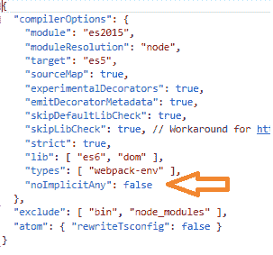***

***现在，我们将创建我们的组件。***

### ***创建角度组件***

***我们将在应用程序中添加两个角度组件:***

1.  ***`fetchemployee`组件:显示所有员工数据或删除已有员工数据。***
2.  ***`addemployee`组件:添加一个新的员工数据或编辑一个已有的员工数据。***

***右键点击“client app/app/components”*文件夹，选择添加> >新文件夹，将文件夹命名为“addem *p* loyee”。****

**右键单击【添加员工】文件夹，选择【添加  >新项。将会打开“添加新项目”对话框。**

**从左侧面板中选择“脚本*”*，然后从模板面板中选择“类型脚本文件”。把名字定为`addemployee.component.ts`。**

**点击“添加”。这将在“add employee”*文件夹内添加一个 typescript 文件。***

***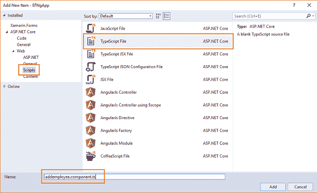***

***右键单击“添加员工”文件夹，选择添加> >新项目。将会打开“添加新项目”对话框。***

***选择“ASP。NET Core*从左侧面板，然后选择“HTML 页面”从模板面板。把名字设为`addemployee.component.html` *。*****

**点击“添加”。这将在“add employee”*文件夹内添加一个 HTML 文件。***

***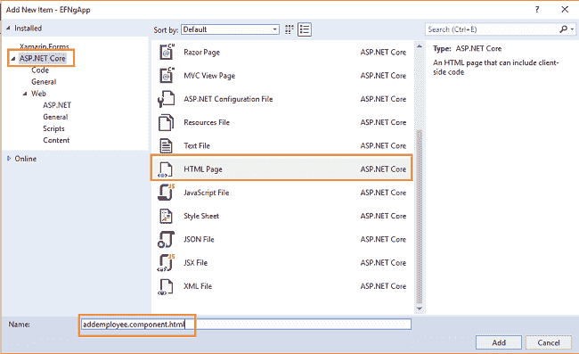***

***同样，在“client app/app/components”*文件夹内创建一个“fetchemployee”文件夹。****

***向其中添加`fetchemployee.component.ts`和`fetchemployee.component.html`文件。***

***现在，我们的“client app/app/components”*结构将如下图所示。****

***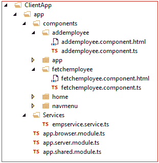***

***打开`fetchemployee.component.ts` 并插入以下代码:***

```
**`import { Component, Inject } from '@angular/core';  import { Http, Headers } from '@angular/http';  import { Router, ActivatedRoute } from '@angular/router';  import { EmployeeService } from '../../services/empservice.service'    @Component({      templateUrl: './fetchemployee.component.html'  })    export class FetchEmployeeComponent {      public empList: EmployeeData[];        constructor(public http: Http, private _router: Router, private _employeeService: EmployeeService) {          this.getEmployees();      }        getEmployees() {          this._employeeService.getEmployees().subscribe(              data => this.empList = data          )      }        delete(employeeID) {          var ans = confirm("Do you want to delete customer with Id: " + employeeID);          if (ans) {              this._employeeService.deleteEmployee(employeeID).subscribe((data) => {                  this.getEmployees();              }, error => console.error(error))          }      }  }    interface EmployeeData {      employeeId: number;      name: string;      gender: string;      city: string;      department: string;    }`**
```

**让我们来理解这个代码。**

**在最顶端，我们导入了 Angular 模块和 EmployeeService 引用。之后，我们使用`@Component` decorator 为我们的组件定义模板 URL。**

**在`FetchEmployeeComponent`类中，我们声明了一个`EmployeeData` *类型的数组变量`empList`。* `EmployeeData`是一个与我们的`TblEmployeeModel`类属性相同的接口。**

**在`getEmployees` 方法中，我们调用服务`EmployeeService`的`getEmployees`方法。这将返回一个存储在`empList`变量中的`Employees`数组。在构造函数内部调用了`getEmployees`方法，以便在页面加载时显示雇员数据。**

**接下来，我们有一个接受`employeeID`作为参数的`delete`方法。这将提示用户一个确认框。如果用户选择“是”,那么它将删除具有该 employeeID 的雇员。**

**打开`fetchemployee.component.html` 并插入以下代码:**

```
**`<h1>Employee Data</h1>    <p>This component demonstrates fetching Employee data from the server.</p>    <p *ngIf="!empList"><em>Loading...</em></p>    <p>      <a [routerLink]="['/register-employee']">Create New</a>  </p>    <table class='table' *ngIf="empList">      <thead>          <tr>              <th>EmployeeId</th>              <th>Name</th>              <th>Gender</th>              <th>Department</th>              <th>City</th>          </tr>      </thead>      <tbody>          <tr *ngFor="let emp of empList">              <td>{{ emp.employeeId }}</td>              <td>{{ emp.name }}</td>              <td>{{ emp.gender }}</td>              <td>{{ emp.department }}</td>              <td>{{ emp.city }}</td>              <td>              <td>                  <a [routerLink]="['/employee/edit/', emp.employeeId]">Edit</a> |                  <a [routerLink]="" (click)="delete(emp.employeeId)">Delete</a>              </td>          </tr>      </tbody>  </table>`**
```

**这个 HTML 文件的代码非常简单。**

**顶部有一个创建新员工记录的链接。之后，它有一个显示雇员数据的表，以及两个用于编辑和删除每个雇员记录的链接。**

**我们已经完成了我们的`fetchemployee`组件。**

**现在打开`addemployee.component.ts` 并插入下面的代码。**

```
**`import { Component, OnInit } from '@angular/core';  import { Http, Headers } from '@angular/http';  import { NgForm, FormBuilder, FormGroup, Validators, FormControl } from '@angular/forms';  import { Router, ActivatedRoute } from '@angular/router';  import { FetchEmployeeComponent } from '../fetchemployee/fetchemployee.component';  import { EmployeeService } from '../../services/empservice.service';    @Component({      templateUrl: './AddEmployee.component.html'  })    export class createemployee implements OnInit {      employeeForm: FormGroup;      title: string = "Create";      employeeId: number;      errorMessage: any;      cityList: Array<any> = [];        constructor(private _fb: FormBuilder, private _avRoute: ActivatedRoute,          private _employeeService: EmployeeService, private _router: Router) {          if (this._avRoute.snapshot.params["id"]) {              this.employeeId = this._avRoute.snapshot.params["id"];          }            this.employeeForm = this._fb.group({              employeeId: 0,              name: ['', [Validators.required]],              gender: ['', [Validators.required]],              department: ['', [Validators.required]],              city: ['', [Validators.required]]          })      }        ngOnInit() {            this._employeeService.getCityList().subscribe(              data => this.cityList = data          )            if (this.employeeId > 0) {              this.title = "Edit";              this._employeeService.getEmployeeById(this.employeeId)                  .subscribe(resp => this.employeeForm.setValue(resp)                  , error => this.errorMessage = error);          }        }        save() {            if (!this.employeeForm.valid) {              return;          }            if (this.title == "Create") {              this._employeeService.saveEmployee(this.employeeForm.value)                  .subscribe((data) => {                      this._router.navigate(['/fetch-employee']);                  }, error => this.errorMessage = error)          }          else if (this.title == "Edit") {              this._employeeService.updateEmployee(this.employeeForm.value)                  .subscribe((data) => {                      this._router.navigate(['/fetch-employee']);                  }, error => this.errorMessage = error)          }      }        cancel() {          this._router.navigate(['/fetch-employee']);      }        get name() { return this.employeeForm.get('name'); }      get gender() { return this.employeeForm.get('gender'); }      get department() { return this.employeeForm.get('department'); }      get city() { return this.employeeForm.get('city'); }  }`**
```

**该组件将用于添加和编辑员工数据。**

**由于我们使用表单模型以及客户端验证来添加和编辑员工数据，所以我们从@angular/forms 导入了类。创建表单的代码已经放在构造函数中，以便在页面加载时显示表单。**

**该组件将处理添加和编辑请求。那么系统如何区分这两种请求呢？答案是路由。我们需要定义两个不同的路由参数。一个用于添加雇员记录。另一个用于编辑员工记录。这些路线参数将在下一节的`app.shared.module.ts`中定义。**

**我们已经声明了显示在页面顶部的变量`title`和存储雇员 id 的变量`id`，在编辑请求的情况下，雇员 id 作为参数传递。为了从 URL 中读取雇员 ID，我们将在构造函数中使用`ActivatedRoute.snapshot`，并设置变量`id`的值。**

**在`ngOnInit`内部，我们正在执行两项操作:**

1.  **我们通过调用服务中的`getCityList`方法来获取城市列表。我们将城市列表绑定到 HTML 页面的下拉列表中。因为我们调用了`ngOnInit`中的`getCityList`方法，所以当页面加载时，下拉列表将被填充。**
2.  **我们将检查是否设置了`id`,然后将标题改为“Edit ”,从我们的服务中获取该`id`的数据，并填充表单中的字段。从数据库中读取的值将作为 JSON 返回。它将具有与我们在`FormBuilder`中声明的所有相同的属性，因此我们使用`setValue`方法来填充我们的表单。**

**单击表单的“保存”按钮时，将调用 save 方法。**添加**和**编辑**操作将从我们的服务中调用相应的方法，然后在成功后，重定向回 fetch-employee 组件。**

**在上一个示例中，我们还为表单的控件名定义了 getter 函数，以支持客户端验证。**

**打开`addemployee.component.html` ，插入以下代码。**

```
**`<!DOCTYPE html>  <html>  <head>      <meta charset="utf-8" />      <title></title>  </head>  <body>        <h1>{{title}}</h1>      <h3>Employee</h3>      <hr />      <form [formGroup]="employeeForm" (ngSubmit)="save()" #formDir="ngForm" novalidate>            <div class="form-group row">              <label class=" control-label col-md-12" for="Name">Name</label>              <div class="col-md-4">                  <input class="form-control" type="text" formControlName="name">              </div>              <span class="text-danger" *ngIf="employeeForm.hasError('required', 'name') && formDir.submitted">                  Name is required.              </span>          </div>          <div class="form-group row">              <label class="control-label col-md-12" for="Gender">Gender</label>              <div class="col-md-4">                  <select class="form-control" data-val="true" formControlName="gender">                      <option value="">-- Select Gender --</option>                      <option value="Male">Male</option>                      <option value="Female">Female</option>                  </select>              </div>              <span class="text-danger" *ngIf="employeeForm.hasError('required', 'gender') && formDir.submitted">                  Gender is required              </span>          </div>          <div class="form-group row">              <label class="control-label col-md-12" for="Department">Department</label>              <div class="col-md-4">                  <input class="form-control" type="text" formControlName="department">              </div>              <span class="text-danger" *ngIf="employeeForm.hasError('required', 'department') && formDir.submitted">                  Department is required              </span>          </div>          <div class="form-group row">              <label class="control-label col-md-12" for="City">City</label>              <div class="col-md-4">                  <select class="form-control" data-val="true" formControlName="city">                      <option value="">--Select City--</option>                      <option *ngFor="let city of cityList"                              value={{city.cityName}}>                          {{city.cityName}}                      </option>                  </select>              </div>              <span class="text-danger" *ngIf="employeeForm.hasError('required', 'city') && formDir.submitted">                  City is required              </span>          </div>          <div class="form-group">              <button type="submit" class="btn btn-default">Save</button>              <button class="btn" (click)="cancel()">Cancel</button>          </div>      </form>  </body>  </html>`**
```

**这里您可以看到我们有属性`[formGroup]=“employeeForm”`，这是我们在`addemployee.component.ts`中定义的表单组名称。`(ngSubmit)=“save()”`将在表单提交时调用我们的`save`方法。**

**同样，每个输入控件都有属性`formControlName=“xyz”`。这用于将`FormControl`绑定到 HTML。我们还为客户端验证检查定义了错误消息。这些将仅在表单提交时调用。**

**为了绑定下拉列表，我们使用从`tblCities`填充的`cityList`属性。它是通过调用我们的服务中的`getCityList`方法填充的，在`*addemployee.component.ts*` *的`ngOnInit`方法中。***

### **为我们的应用程序定义路线和导航菜单**

**在“app”文件夹内，打开`app.shared.module.ts` ，插入以下代码:**

```
**`import { NgModule } from '@angular/core';  import { EmployeeService } from './services/empservice.service'  import { CommonModule } from '@angular/common';  import { FormsModule, ReactiveFormsModule } from '@angular/forms';  import { HttpModule } from '@angular/http';  import { RouterModule } from '@angular/router';    import { AppComponent } from './components/app/app.component';  import { NavMenuComponent } from './components/navmenu/navmenu.component';  import { HomeComponent } from './components/home/home.component';  import { FetchEmployeeComponent } from './components/fetchemployee/fetchemployee.component'  import { createemployee } from './components/addemployee/AddEmployee.component'    @NgModule({      declarations: [          AppComponent,          NavMenuComponent,          HomeComponent,          FetchEmployeeComponent,          createemployee,      ],      imports: [          CommonModule,          HttpModule,          FormsModule,          ReactiveFormsModule,          RouterModule.forRoot([              { path: '', redirectTo: 'home', pathMatch: 'full' },              { path: 'home', component: HomeComponent },              { path: 'fetch-employee', component: FetchEmployeeComponent },              { path: 'register-employee', component: createemployee },              { path: 'employee/edit/:id', component: createemployee },              { path: '**', redirectTo: 'home' }          ])      ],      providers: [EmployeeService]  })  export class AppModuleShared {  }`**
```

**这里，我们还导入了所有组件，并为我们的应用程序定义了如下路径:**

*   **home:这将重定向到`home`组件**
*   **fetch-employee:使用`fetchemployee`组件显示所有员工数据**
*   **register-employee:使用`createemployee`组件添加新的员工记录**
*   **employee/edit/:id:使用`createemployee`组件编辑现有的雇员记录**

**最后一件事是为我们的应用程序定义导航菜单。在“/app/components/navmenu/”中，打开 `navmenu.component.html`并插入以下代码。**

```
**`<div class='main-nav'>      <div class='navbar navbar-inverse'>          <div class='navbar-header'>              <button type='button' class='navbar-toggle' data-toggle='collapse' data-target='.navbar-collapse'>                  <span class='sr-only'>Toggle navigation</span>                  <span class='icon-bar'></span>                  <span class='icon-bar'></span>                  <span class='icon-bar'></span>              </button>              <a class='navbar-brand' [routerLink]="['/home']">ASPCoreWithAngular</a>          </div>          <div class='clearfix'></div>          <div class='navbar-collapse collapse'>              <ul class='nav navbar-nav'>                  <li [routerLinkActive]="['link-active']">                      <a [routerLink]="['/home']">                          <span class='glyphicon glyphicon-home'></span> Home                      </a>                  </li>                  <li [routerLinkActive]="['link-active']">                      <a [routerLink]="['/fetch-employee']">                          <span class='glyphicon glyphicon-th-list'></span> Fetch employee                      </a>                  </li>              </ul>          </div>      </div>  </div>`**
```

**仅此而已。我们已经使用 Angular 5 和 Entity Framework 核心数据库优先方法创建了我们的第一个 ASP.NET 核心应用程序。**

### **执行演示**

**按 F5 启动应用程序。**

**将打开一个网页，如下图所示。注意显示我们的 home 组件的路径的 URL。左侧的导航菜单显示了“主页”和“获取员工”页面的导航链接。**

**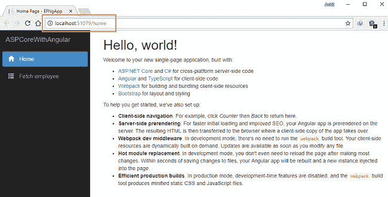**

**点击导航菜单中的“获取员工”。它将重定向到`fetchemployee`组件，并在页面上显示所有员工数据。**

**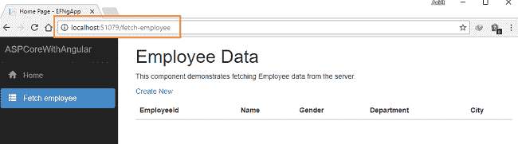**

**因为我们没有添加任何数据，所以它是空的。**

**点击“新建*”*进入“/注册-员工*”*页面。如下图所示，添加新的员工记录。您可以看到**城市**字段是一个下拉列表，包含我们插入到`tblCities`中的所有城市名称。**

**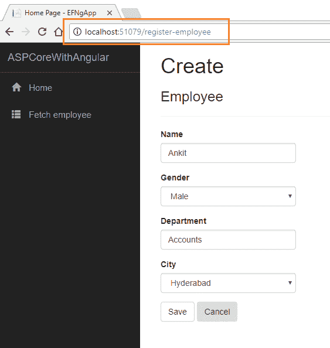**

**如果我们在创建员工记录时遗漏了任何字段中的数据，我们将收到一条必填字段验证错误消息**

**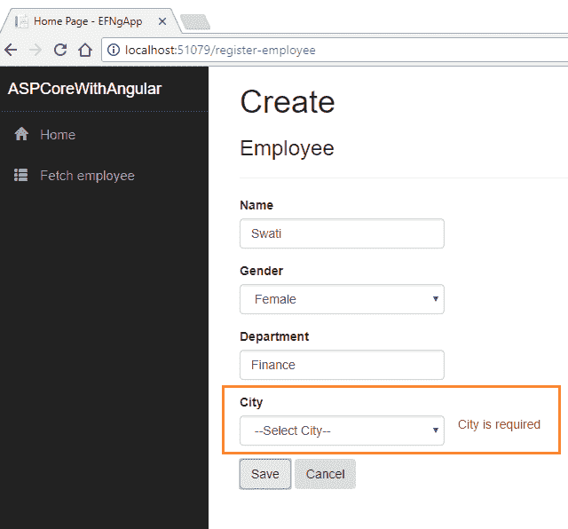**

**在所有字段中插入数据后，单击“保存”按钮。新的员工记录将被创建，您将被重定向到“/fetch-employee*”*页面。此页面显示所有员工的记录。在这里，我们还可以看到操作方法“编辑”和“删除”。**

**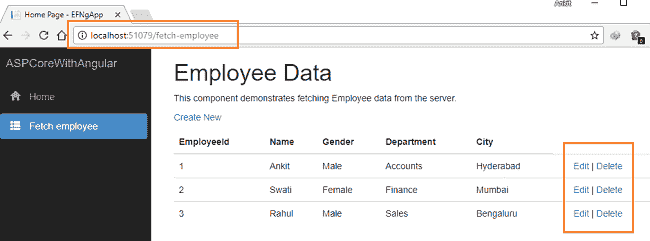**

**如果我们想要编辑现有的员工记录，请单击“编辑”操作链接。它将打开如下所示的“编辑”页面，我们可以在其中更改员工数据。注意，我们已经在 URL 参数中传递了 EmployeeId。**

**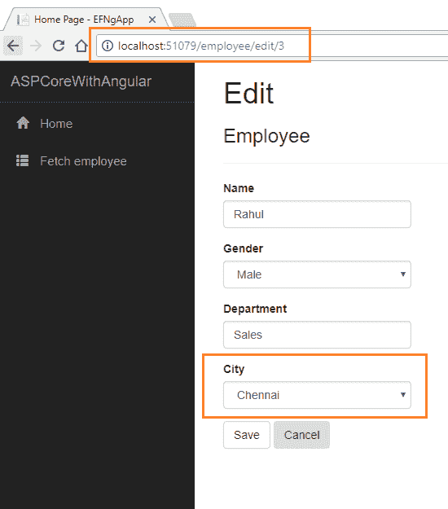**

**在这里，我们将员工 Rahul 的`City`从海得拉巴改为钦奈。点击“保存”返回“获取-员工”页面，查看下图中突出显示的更新后的更改。**

**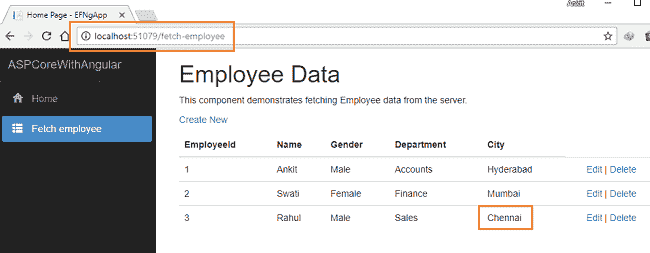**

**如果我们在编辑员工记录时遗漏了任何字段，则编辑视图还会抛出必填字段验证错误消息，如下图所示:**

**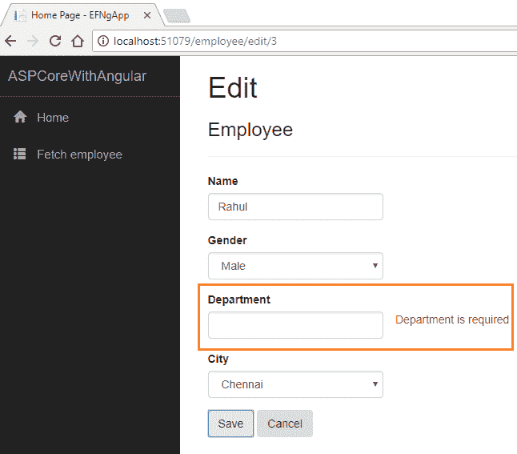**

**现在，我们将对名为 Swati、雇员 Id 为 2 的雇员执行“删除”操作。单击“删除”操作链接。这将打开一个 JavaScript 确认框，要求确认删除。**

**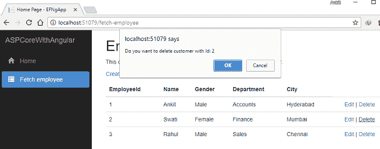**

**单击“确定”后，员工 Id 为 2 的 Swati 将从我们的记录中删除。您可以看到更新后的员工列表，如下所示。**

**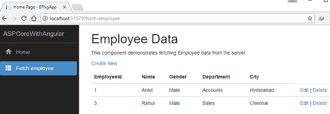**

### **其他有用的来源:**

*   **[使用角度 5°和 ADO.NET 的 ASP.NET 堆芯的积垢操作](http://ankitsharmablogs.com/crud-operations-asp-net-core-using-angular-5-ado-net/)**
*   **[使用 Visual Studio 代码开始使用 Angular 5](http://ankitsharmablogs.com/getting-started-with-angular-5-using-visual-studio-code/)**
*   **[使用 Visual Studio 代码和 EF 的 ASP.NET 核心 MVC 的 CRUD 操作](http://ankitsharmablogs.com/crud-operation-asp-net-core-mvc-using-visual-studio-code-ef/)**
*   **[使用 ADO.NET 和 Visual Studio 2017 的 ASP.NET 核心 MVC 的 CRUD 操作](http://ankitsharmablogs.com/crud-operation-with-asp-net-core-mvc-using-ado-net/)**
*   **[使用 Visual Studio 代码和 ADO.NET 的 ASP.NET 核心 MVC 的 CRUD 操作](http://ankitsharmablogs.com/crud-operation-with-asp-net-core-mvc-using-visual-studio-code-and-ado-net/)**
*   **[ASP.NET 核心 Blazor 入门](http://ankitsharmablogs.com/asp-net-core-getting-started-with-blazor/)**

### **结论**

**在 Visual Studio 2017 和 SQL Server 2012 的帮助下，我们使用 Angular 5 和 Entity Framework 核心数据库优先方法成功创建了一个 ASP.NET 核心应用程序。我们使用角度表单从用户那里获取数据，并使用实体框架将下拉列表绑定到数据库表。**

**你可以看看我关于 ASP 的其他文章。网芯[这里](http://ankitsharmablogs.com/category/asp-net-core/)。**

**最初发表于[https://ankitsharmablogs.com/](https://ankitsharmablogs.com/)**