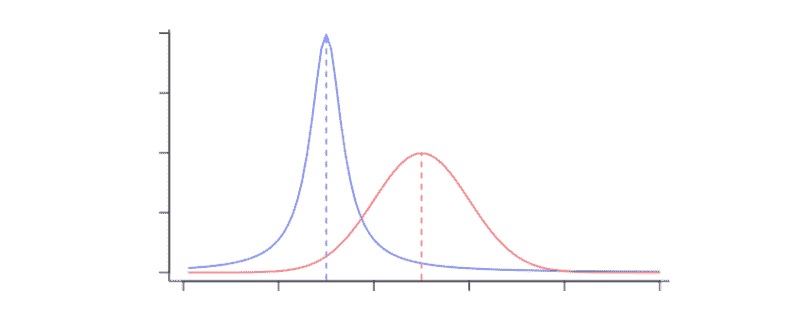
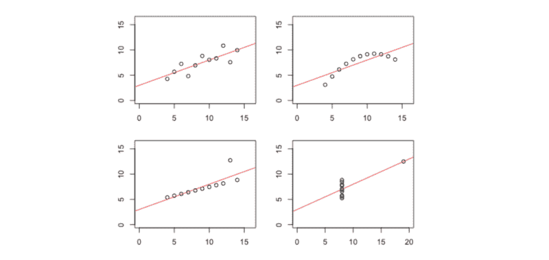
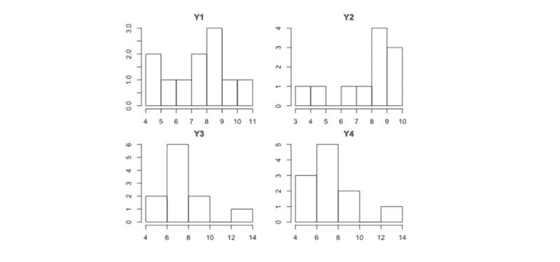
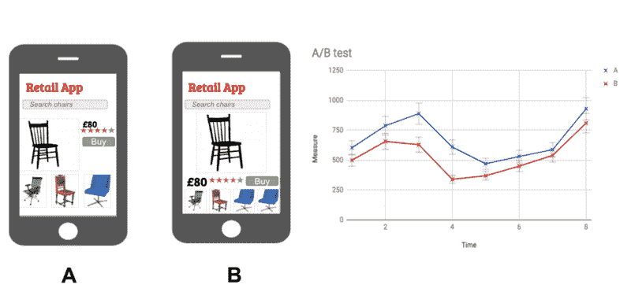
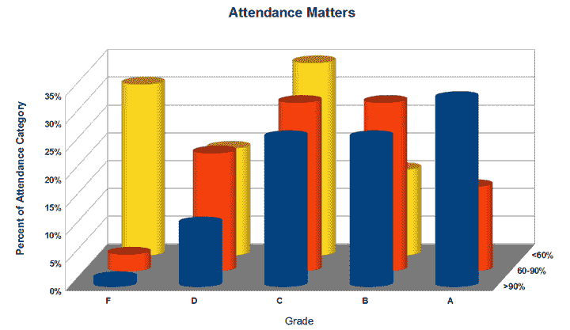
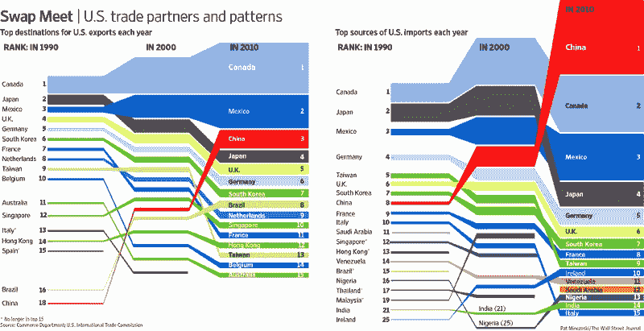

# 作为一名数据科学家？掌握这些基本面。

> 原文：<https://www.freecodecamp.org/news/aspiring-data-scientist-master-these-fundamentals-be7c54350868/>

数据科学是一个令人兴奋的、快速发展的领域。对有才华、有分析头脑的人的需求并不缺乏。各种规模的公司都在招聘数据科学家，这一角色为广泛的行业和应用提供了真正的价值。

通常，人们第一次接触这个领域是通过阅读主要研究机构的科幻标题。最近的进展提升了机器学习在一代人时间内改变我们所知的世界的前景。

然而，在学术和研究之外，数据科学不仅仅是头条主题，如[深度学习](https://www.technologyreview.com/s/513696/deep-learning/)和 [NLP](https://www.wired.com/insights/2014/02/growing-importance-natural-language-processing/) 。

数据科学家的大部分商业价值来自于提供大量数据所能带来的清晰性和洞察力。该角色可以涵盖从数据工程到数据分析和报告的所有内容，可能还会加入一些机器学习。

在创业公司尤其如此。早期和中期公司的数据需求通常远离神经网络和计算机视觉领域。(当然，除非这些是他们产品/服务的核心特征)。

相反，他们需要准确的分析、可靠的流程和快速扩展的能力。

因此，许多广告数据科学角色所需的技能是广泛而多样的。像生活中的任何追求一样，大部分价值来自于掌握基础知识。传说中的 [80:20 法则](https://betterexplained.com/articles/understanding-the-pareto-principle-the-8020-rule/)适用——大约 80%的价值来自 20%的技能组合。

这里概述了任何有抱负的数据科学家都应该掌握的一些基本技能。

### 从统计数据开始

数据科学家给公司带来的主要特征是从复杂性中提炼洞察力的能力。实现这一点的关键是理解如何从嘈杂的数据中发现意义。

因此，统计分析是一项需要掌握的重要技能。统计数据允许您:

*   描述数据，向利益相关者提供详细的描述
*   比较数据和测试假设，为业务决策提供信息
*   确定提供真正预测价值的趋势和关系

统计学为理解商业和运营数据提供了一套强大的工具。

但是要警惕！比有限的洞察力更糟糕的是误导性的洞察力。这就是为什么理解统计分析的基本原理是至关重要的。

幸运的是，有一些指导原则你可以遵循。

#### 评估你的假设

了解你对数据的假设是非常重要的。

总是对出处持批评态度，对结果持怀疑态度。对于你的数据中观察到的任何趋势，有没有一个[‘无趣’的解释](https://en.wikipedia.org/wiki/Selection_bias)？你选择的统计测试或方法的有效性如何？您的数据符合所有潜在的假设吗？

知道哪些发现是“有趣的”和值得报道的也取决于你的假设。一个基本的例子是判断是报告一个数据集的平均值还是中位数更合适。

通常比知道采取哪种方法更重要的是知道哪些*不要*去做。通常有几种方法来分析一组给定的数据，但是要确保避免常见的陷阱。

例如，[多次比较](https://www.stat.berkeley.edu/~mgoldman/Section0402.pdf)应该总是被校正。在任何情况下，你都不应该试图用产生假设的相同数据来证实假设！你会惊讶这是多么容易做到的。

#### 分布>位置

每当我谈论介绍性统计时，我总是确保强调一个特别的点:变量的分布通常*至少*和它的位置一样有趣/信息丰富。事实上，往往更是如此。

Central tendency is useful to know, but the distribution is often more interesting to understand!

这是因为变量的分布通常包含有关基本生成(或采样)过程的信息。

例如，计数数据通常遵循[泊松分布](https://brilliant.org/wiki/poisson-distribution/)，而呈现正反馈(“强化”)的系统往往会呈现[幂律分布](https://www.theguardian.com/commentisfree/2011/nov/11/occupy-movement-wealth-power-law-distribution)。在没有仔细检查之前，不要依赖正态分布的数据。

其次，了解数据的分布对于知道如何使用它是必不可少的！许多统计测试和方法依赖于关于数据分布的假设。

作为一个虚构的例子，一定要区别对待单峰和双峰数据。它们可能有相同的平均值，但是如果你忽略它们的分布，你会丢失大量的重要信息。

一个更有趣的例子说明了为什么你应该在报告汇总统计数据之前检查你的数据，看看 [Anscombe 的四重奏](https://en.wikipedia.org/wiki/Anscombe%27s_quartet):

Different data; but nearly identical means, variances and correlations

每个图看起来都很有特色，对吧？然而，每个都有相同的汇总统计数据，包括它们的均值、方差和相关系数。绘制一些分布图显示它们有很大的不同。

最后，变量的分布决定了你对其真实值的确定性。“窄”分布允许更高的确定性，而“宽”分布允许更低的确定性。

平均值的方差对于提供上下文至关重要。通常情况下，置信区间非常宽的平均值与置信区间非常窄的平均值一起报告。这可能会产生误导。

#### 合适的取样

现实情况是，对于以商业为导向的数据科学家来说，采样可能是一个棘手的问题，尤其是对于那些有研究或工程背景的科学家来说。

在研究环境中，您可以用许多不同的因素和水平微调精确设计的实验，并控制处理。然而，从数据收集的角度来看,“实时”商业条件通常不是最佳的。每一个决定都必须与打断“正常业务”的风险仔细权衡。

这要求数据科学家在解决问题的方法上既要有创造性，又要现实。

[A/B 测试是一种方法的典型示例](https://www.theguardian.com/technology/2014/feb/05/why-google-engineers-designers),说明了如何在粒度级别优化产品和平台，而不会对日常业务造成重大干扰。

A/B testing is an industry standard for comparing different versions of products, in order to optimize them

如果你有一个合理的[信息量的先验集](http://www.stats.org.uk/priors/Bayes6.pdf)，贝叶斯方法可能对处理较小的数据集有用。

无论你收集什么数据，一定要认识到它的局限性。

调查数据容易出现抽样偏差(通常是意见最强烈的受访者花时间完成调查)。时间序列和空间数据会受到[自相关](https://www.investopedia.com/terms/a/autocorrelation.asp)的影响。最后但同样重要的是，在分析来自相关来源的数据时，要时刻注意[多重共线性](http://www.statisticshowto.com/multicollinearity/)。

### 数据工程

这是数据科学中的老生常谈，但事实是，大部分数据工作流都花费在寻找、清理和存储更有洞察力的上游分析所需的原始数据上。

从零开始实现算法实际上花费的时间相对较少。事实上，大多数统计工具的内部工作都封装在整洁的 R 包和 Python 模块中。

“[提取-转换-加载](https://medium.freecodecamp.org/sqlalchemy-makes-etl-magically-easy-ab2bd0df928)”(ETL)流程对于任何数据科学团队的成功都至关重要。较大的组织将有专门的数据工程师来满足其复杂的数据基础架构要求，但较年轻的公司通常会依赖他们的数据科学家来拥有自己强大的、全面的数据工程技能。

#### 实践编程

数据科学是高度跨学科的。除了高级分析技能和特定领域的知识，该角色还需要扎实的编程技能。

对于一个有抱负的数据科学家应该学习使用哪种编程语言，没有完美的答案。也就是说，至少有一个 [Python](https://www.python.org/) 和/或 [R](https://www.r-project.org/) 会很好地为你服务。

Either (or both) of these languages make a great starting point if you want to work with data

无论你选择哪种语言，都要熟悉它的所有特性和周围的生态系统。浏览各种可用的包和模块，并设置您的完美 IDE。了解访问公司核心平台和服务所需的 API。

数据库是任何数据工作流拼图中不可或缺的一部分。一定要掌握一些 SQL 的方言。确切的选择并不太重要，因为必要时在它们之间切换是一个可管理的过程。

NoSQL 数据库(如 [MongoDB](https://www.mongodb.com/) )也值得学习，如果你的公司使用它们的话。

成为一名自信的命令行用户将大大提高您的日常工作效率。即使只是熟悉简单的 bash 脚本，也能让您在自动化重复任务方面有一个良好的开端。

#### 有效编码

有抱负的数据科学家需要掌握的一项非常重要的技能是有效编码。可重用性是关键。值得花时间(如果有的话)在一个抽象层次上编写代码，使它能够被多次使用。

然而，需要在短期和长期优先事项之间取得平衡。

如果一个特别的脚本没有机会再次发挥作用，那么花两倍的时间来编写一个可重用的脚本是没有意义的。然而，花在重构要重新运行的旧代码上的每一分钟都是以前可以节省的一分钟。

为了编写真正高性能的产品代码，软件工程最佳实践值得开发。

Git 之类的版本管理工具使得代码的部署和维护更加简化。任务计划程序允许您自动执行例行程序。定期的代码审查和一致同意的文档标准将会使你的团队未来的生活变得更加容易。

在任何技术专业化领域，通常没有必要重新发明轮子。数据工程也不例外。像 [Airflow](https://airflow.apache.org/) 这样的框架使得调度和监控 ETL 过程变得更加容易和健壮。对于分布式数据存储和处理，有 [Apache Spark](https://spark.apache.org/) 和 [Hadoop](http://hadoop.apache.org/) 。

初学者没有必要深入学习这些。然而，了解周围的生态系统和可用的工具总是一个优势。

### 清晰地交流

数据科学是一个完整的学科，有一个重要的面向利益相关者的前端:报告层。

事实很简单——有效的沟通会带来巨大的商业价值。对于数据科学，有效报告有四个方面。

*   准确性
    这是至关重要的，原因显而易见。这里的技巧是知道如何解释你的结果，同时清楚任何可能适用的限制或警告。重要的是不要过度或低估任何特定结果的相关性。
*   精确度
    这很重要，因为你报告中的任何模糊之处都可能导致对研究结果的误解。这可能会对未来产生负面影响。
*   **简洁**
    让你的报告尽可能简短，但不能更短。一个好的格式可以为主要问题提供一些背景，包括可用数据的简要描述，并给出“标题”结果和图形的概述。额外的细节可以(也应该)包含在附录中。
*   **我们一直需要在报告的技术准确性和现实之间取得平衡，因为大多数读者都是各自领域的专家，而不一定是数据科学专家。这里没有简单的、放之四海而皆准的答案。频繁的沟通和反馈将有助于建立适当的平衡。**

#### **图形游戏**

**强大的数据可视化将帮助您有效地向利益相关者传达复杂的结果。一个设计良好的图表可以一眼看出需要几段文字来解释什么。**

**有很多免费和付费的可视化和仪表板构建工具，包括 Plotly、Tableau、Chartio、d3.js 和许多其他工具。**

**对于快速的模型，有时你不能击败优秀的老式电子表格软件，如 Excel 或 Google Sheets。虽然缺少专门构建的可视化软件的功能，但这些软件可以根据需要完成工作。**

**在构建仪表板和图形时，有许多指导原则需要考虑。潜在的挑战是最大化可视化的信息价值，而不牺牲“可读性”。**

**

How not to present data — in general, keep it simple (for more on this example, read [this cool blog post](http://glengilchrist.co.uk/post/the-3d-challenge-can-you-read-this-chart))** 

**一个有效的可视化展示了一个高层次的概览。对于浏览者来说，更复杂的图形可能需要更长的时间来消化，因此应该提供更多的信息内容。**

**如果你只读过一本关于数据可视化的书，那么爱德华·塔夫特的经典之作**是优秀的选择。****

****Tufte 单枪匹马地推广和发明了数据可视化的大部分领域。广泛使用的术语，如“图表垃圾”和“数据密度”都源于 Tufte 的工作。他的“[数据-墨水比率](http://www-personal.umich.edu/~jpboyd/eng403_chap2_tuftegospel.pdf)的概念在三十年后仍然具有影响力。****

****色彩、布局和交互性的使用往往会决定一个好的视觉效果和一个高质量、专业的视觉效果。****

****

Data visualization done better [[Source](https://www.wsj.com/articles/SB10001424052748703786804576137932801470052)]**** 

****最终，创建一个伟大的数据可视化涉及的技能更多的是与 UX 和图形设计相关，而不是数据科学。在你的空闲时间阅读这些主题是一个很好的方法，可以让你意识到什么有用，什么没用。****

****一定要去 bl.ocks.org 等网站寻找灵感！****

### ****数据科学需要多样化的技能组合****

****作为一名有抱负的数据科学家，您应该重点发展四个核心技能领域。它们是:****

*   ****统计学，包括基础理论和现实世界的应用。****
*   ****使用 Python 或 R 以及 SQL 中的至少一种语言进行编程，并使用命令行****
*   ****数据工程最佳实践****
*   ****有效地交流你的工作****

#### ****奖金！不断学习****

****如果你读到这里，并感到气馁，请放心。在这样一个快速发展的领域中，主要的技能是学会如何学习和再学习。毫无疑问，新的框架、工具和方法将在未来几年出现。****

****你现在学到的技能可能需要在五到十年内完全更新。期待这个。通过这样做，并做好准备，你可以通过不断的重新学习来保持领先。****

****你不可能什么都知道，事实是——从来没有人知道。但是，如果你掌握了基本原则，你就能在需要知道的基础上学会其他任何东西。****

****这可以说是任何快速发展的学科取得成功的关键。****