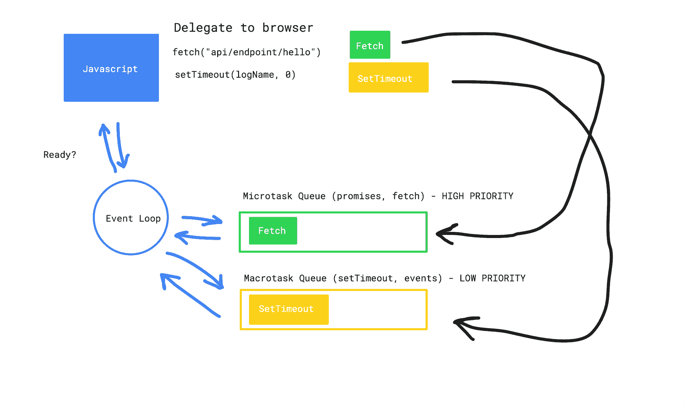

# Async Await JavaScript 教程——如何在 JS 中等待函数完成

> 原文：<https://www.freecodecamp.org/news/async-await-javascript-tutorial/>

异步函数什么时候结束？为什么这个问题如此难以回答？

事实证明，理解异步函数需要大量关于 JavaScript 基本工作原理的知识。

让我们来探索一下这个概念，并在这个过程中学习很多关于 JavaScript 的知识。

你准备好了吗？我们走吧。

## 什么是异步代码？

根据设计，JavaScript 是一种同步编程语言。这意味着当执行代码时，JavaScript 从文件的顶部开始，一行一行地运行代码，直到完成。

这种设计决策的结果是任何时候只能发生一件事。

你可以把这个想象成你在玩六个小球。当你在玩杂耍的时候，你的手被占用了，不能处理其他的事情。

JavaScript 也是如此:一旦代码开始运行，它就会被那些代码弄得焦头烂额。我们称之为这种同步代码*阻塞*。因为它有效地阻止了其他代码的运行。

让我们回到杂耍的例子。如果你想再加一个球会怎么样？你想玩七个球，而不是六个球。这可能是个问题。

你不想停止杂耍，因为它太有趣了。但是你也不能去拿另一个球，因为那意味着你必须停下来。

解决办法？将工作委托给朋友或家人。他们不是在玩杂耍，所以他们可以去给你拿球，然后在你的手空闲的时候把球扔进你的杂耍中，你可以在杂耍中加入另一个球。

这就是异步代码。JavaScript 是将工作委托给其他人，然后继续做自己的事。然后，当它准备好了，它会收到工作的结果。

## 谁在做另一项工作？

好的，我们知道 JavaScript 是同步的和懒惰的。它不想自己做所有的工作，所以它把工作外包给其他人。

但是这个为 JavaScript 工作的神秘实体是谁呢？它是如何被 JavaScript 雇佣的呢？

让我们来看一个异步代码的例子。

```
const logName = () => {
   console.log("Han")
}

setTimeout(logName, 0)

console.log("Hi there")
```

运行此代码会在控制台中产生以下输出:

```
// in console
Hi there
Han
```

好吧。这是怎么回事？

事实证明，我们在 JavaScript 中外包工作的方式是使用特定于环境的函数和 API。这是 JavaScript 中非常混乱的一个来源。

JavaScript 总是在一个环境中运行。

通常，这个环境就是浏览器。但也可以在有 NodeJS 的服务器上。但是到底有什么区别呢？

区别——这一点很重要——在于浏览器和服务器(NodeJS)在功能上是不同的。它们往往相似，但又不相同。

让我们用一个例子来说明这一点。假设 JavaScript 是一本史诗奇幻书的主角。只是一个普通的农家子弟。

现在让我们假设这个农场小孩发现了两套特殊的盔甲，这两套盔甲给了他们超越自身的力量。

当他们使用盔甲的浏览器套装时，他们获得了一些特定的能力。

当他们使用服务器盔甲时，他们获得了另一套能力。

这些诉讼有一些重叠，因为这些诉讼的创造者在某些地方有相同的需求，但在其他地方没有。

这就是环境。一个运行代码的地方，那里有构建在现有 JavaScript 语言之上的工具。它们不是语言的一部分，但是界限经常很模糊，因为我们每天在写代码的时候都会用到这些工具。

[setTimeout](https://developer.mozilla.org/en-US/docs/Web/API/WindowOrWorkerGlobalScope) 、 [fetch](https://developer.mozilla.org/en-US/docs/Web/API/Fetch_API) 和 [DOM](https://developer.mozilla.org/en-US/docs/Web/API/Document_Object_Model) 都是 Web APIs 的例子。(你可以在这里看到 Web APIs 的完整列表。它们是内置在浏览器中的工具，当我们的代码运行时，它们对我们是可用的。

因为我们总是在一个环境中运行 JavaScript，所以这些似乎是语言的一部分。但事实并非如此。

所以如果你曾经想知道为什么在浏览器中运行时可以在 JavaScript 中使用 fetch(但在 NodeJS 中运行时需要安装一个包)，这就是为什么。有人认为 fetch 是个好主意，并将其作为 NodeJS 环境的工具。

迷惑？是啊！

但是现在我们终于可以理解 JavaScript 的工作是由什么承担的，以及它是如何被雇佣的。

原来是环境承担了这项工作，而让环境完成这项工作的方法，就是使用属于环境的功能。例如浏览器环境中的*获取*或*设置超时*。

## 工作会发生什么？

太好了。所以环境承担了这项工作。然后呢？

在某些时候，您需要取回结果。但是让我们想想这是如何工作的。

让我们从头回到杂耍的例子。想象一下，你想要一个新球，一个朋友在你没有准备好的时候就开始把球扔向你。

那将是一场灾难。也许你可以幸运地抓住它，并有效地将其纳入你的日常生活。但是这很有可能会让你丢掉所有的球，打乱你的常规。如果你对什么时候接球做出严格的指示不是更好吗？

事实证明，JavaScript 何时可以接受委托工作有严格的规则。

这些规则由事件循环控制，涉及微任务和宏任务队列。是的，我知道。太多了。但是请原谅我。



好吧。因此，当我们将异步代码委托给浏览器时，浏览器会获取并运行代码，并承担相应的工作负载。但是可能会有多个任务被分配给浏览器，所以我们需要确保我们可以优先处理这些任务。

这就是微任务队列和宏任务队列发挥作用的地方。浏览器将接受工作，完成工作，然后根据接收到的工作类型将结果放入两个队列中的一个。

例如，承诺被放在微任务队列中，具有更高的优先级。

事件和 setTimeout 是放在宏任务队列中的工作的例子，具有较低的优先级。

现在，一旦工作完成，并被放入两个队列之一，事件循环将来回运行，并检查 JavaScript 是否准备好接收结果。

只有当 JavaScript 运行完它所有的同步代码，并且准备好了，事件循环才会开始从队列中挑选，并将函数交还给 JavaScript 来运行。

让我们来看一个例子:

```
setTimeout(() => console.log("hello"), 0) 

fetch("https://someapi/data").then(response => response.json())
                             .then(data => console.log(data))

console.log("What soup?")
```

这里的顺序是什么？

1.  首先，setTimeout 被委托给浏览器，由浏览器完成工作并将结果函数放入宏任务队列中。
2.  其次，fetch 被委托给浏览器，由它来完成这项工作。它从端点检索数据，并将结果函数放入微任务队列中。
3.  Javascript 登出“什么汤”？
4.  事件循环检查 JavaScript 是否准备好接收来自排队工作的结果。
5.  当 console.log 完成后，JavaScript 就准备好了。事件循环从具有更高优先级的微任务队列中挑选排队的函数，并将它们返回给 JavaScript 执行。
6.  在微任务队列为空之后，setTimeout 回调从宏任务队列中取出，并返回给 JavaScript 执行。

```
In console:
// What soup?
// the data from the api
// hello
```

## 承诺

现在，您应该对 JavaScript 和浏览器环境如何处理异步代码有了很好的了解。那么我们来谈谈承诺。

承诺是代表未来未知值的 JavaScript 结构。从概念上来说，promise 只是 JavaScript，承诺返回值*。它可能是 API 调用的结果，也可能是失败的网络请求的错误对象。你一定会有所收获。*

```
const promise = new Promise((resolve, reject) => {
	// Make a network request
   if (response.status === 200) {
      resolve(response.body)
   } else {
      const error = { ... }
      reject(error)
   }
})

promise.then(res => {
	console.log(res)
}).catch(err => {
	console.log(err)
})
```

承诺可以有以下几种状态:

*   已完成-操作已成功完成
*   拒绝-操作失败
*   待定-两个操作都没有完成
*   已解决-已完成或被拒绝

promise 接收一个 resolve 和一个 reject 函数，可以调用该函数来触发这些状态之一。

承诺的一大卖点是，我们可以将我们希望在成功(解决)或失败(拒绝)时发生的功能串联起来:

*   注册一个函数在成功时运行。然后
*   为了注册一个函数在失败时运行，我们使用。捕捉

```
// Fetch returns a promise
fetch("https://swapi.dev/api/people/1")
	.then((res) => console.log("This function is run when the request succeeds", res)
    .catch(err => console.log("This function is run when the request fails", err)

// Chaining multiple functions
 fetch("https://swapi.dev/api/people/1")
	.then((res) => doSomethingWithResult(res))
    .then((finalResult) => console.log(finalResult))
    .catch((err => doSomethingWithErr(err))
```

完美。现在，让我们以 fetch 为例，更仔细地看一看这在幕后是什么样子的:

```
const fetch = (url, options) => {
  // simplified
  return new Promise((resolve, reject) => {

  const xhr = new XMLHttpRequest()
  // ... make request
  xhr.onload = () => {
    const options = {
        status: xhr.status,
        statusText: xhr.statusText
        ...
    }

    resolve(new Response(xhr.response, options))
  }

  xhr.onerror = () => {
    reject(new TypeError("Request failed"))
  }
}

 fetch("https://swapi.dev/api/people/1")
   // Register handleResponse to run when promise resolves
	.then(handleResponse)
  .catch(handleError)

 // conceptually, the promise looks like this now:
 // { status: "pending", onsuccess: [handleResponse], onfailure: [handleError] }

 const handleResponse = (response) => {
  // handleResponse will automatically receive the response, ¨
  // because the promise resolves with a value and automatically injects into the function
   console.log(response)
 }

  const handleError = (response) => {
  // handleError will automatically receive the error, ¨
  // because the promise resolves with a value and automatically injects into the function
   console.log(response)
 }

// the promise will either resolve or reject causing it to run all of the registered functions in the respective arrays
// injecting the value. Let's inspect the happy path:

// 1\. XHR event listener fires
// 2\. If the request was successfull, the onload event listener triggers
// 3\. The onload fires the resolve(VALUE) function with given value
// 4\. Resolve triggers and schedules the functions registered with .then 
```

因此，我们可以使用承诺来做异步工作，并确保我们可以处理这些承诺的任何结果。这就是价值主张。如果你想了解更多关于承诺的信息，你可以在这里和阅读更多。

当我们使用承诺时，我们将我们的功能链接到承诺上来处理不同的场景。

这是可行的，但是一旦我们得到结果，我们仍然需要在回调(嵌套函数)中处理我们的逻辑。如果我们可以使用承诺，但是编写看起来同步的代码会怎么样？事实证明我们可以。

## 异步/等待

Async/Await 是一种编写 promises 的方式，它允许我们以同步的方式编写*异步代码。*我们来看看。

```
const getData = async () => {
    const response = await fetch("https://jsonplaceholder.typicode.com/todos/1")
    const data = await response.json()

    console.log(data)
}

getData()
```

在这里，一切都没有改变。我们仍然使用承诺来获取数据，但现在它看起来是同步的，我们不再有了。然后和。接住滑轮。

Async / Await 实际上只是一种语法糖，提供了一种创建更容易推理的代码的方法，而不会改变底层的动态。

让我们来看看它是如何工作的。

Async/Await 允许我们使用[生成器](https://developer.mozilla.org/en-US/docs/Web/JavaScript/Reference/Global_Objects/Generator)来*暂停*函数的执行。当我们使用 async / await 时，我们没有阻塞，因为该函数将控制权交还给主程序。

然后，当承诺完成时，我们使用生成器将控制权交还给异步函数，并使用已完成承诺的值。[](https://github.com/getify/You-Dont-Know-JS/blob/1st-ed/async%20%26%20performance/ch4.md)

你可以在这里阅读更多关于生成器和异步代码的概述。

实际上，我们现在可以编写看起来像同步代码的异步代码。这意味着更容易推理，我们可以使用同步工具进行错误处理，如 try / catch:

```
const getData = async () => {
    try {
    	const response = await fetch("https://jsonplaceholder.typicode.com/todos/1")
    	const data = await response.json()
        console.log(data)
    } catch (err) {
       console.log(err)
    }

}

getData()
```

好吧。那么我们如何使用它呢？为了使用 async / await，我们需要在函数前面加上 async。这并没有使它成为一个异步函数，它只是允许我们在其中使用 await。

当试图在常规函数中使用 await 时，未提供 async 关键字将导致语法错误。

```
const getData = async () => {
	console.log("We can use await in this function")
}
```

因此，我们不能在顶层代码上使用 async / await。但是 async 和 await 仍然只是承诺之上的语法糖衣。因此，我们可以通过承诺链处理顶级案例:

```
async function getData() {
  let response = await fetch('http://apiurl.com');
}

// getData is a promise
getData().then(res => console.log(res)).catch(err => console.log(err); 
```

这暴露了关于 async / await 的另一个有趣的事实。当定义一个函数为 async 时，它总是会返回一个承诺。

一开始，使用 async / await 似乎很神奇。但就像任何魔法一样，它只是经过多年发展的足够先进的技术。希望现在您已经牢固地掌握了基础知识，并且可以放心地使用 async / await。

# 结论

如果你成功了，恭喜你。您刚刚向工具箱中添加了一条关于 JavaScript 及其如何与其环境协同工作的关键知识。

这绝对是一个令人困惑的主题，而且界限并不总是很清楚。但是现在您有望理解 JavaScript 如何在浏览器中与异步代码一起工作，并且更好地理解 promises 和 async / await。

如果你喜欢这篇文章，你可能也会喜欢我的 youtube 频道。我目前有一个 [web 基础系列](https://www.youtube.com/watch?v=kmvg9C8hVa0&list=PL_kr51suci7XVVw4SJLZ0QQBAsL2K8Opy)，我将通过 [HTTP](https://www.youtube.com/watch?v=0ykAOzJb-U8&t=19s) 、[从头开始构建 web 服务器](https://www.youtube.com/watch?v=R5uwuG1wPR8)等等。

还有一个系列正在进行[用 React](https://www.youtube.com/playlist?list=PL_kr51suci7WkVde-b09G4XHEWQrmzcpJ) 构建一个完整的应用程序，如果那是你的难题的话。我计划将来在这里添加更多关于 JavaScript 主题的内容。

如果你想和我打招呼或者聊聊 web 开发，你可以通过 Twitter @ fose Berg 联系我。感谢阅读！