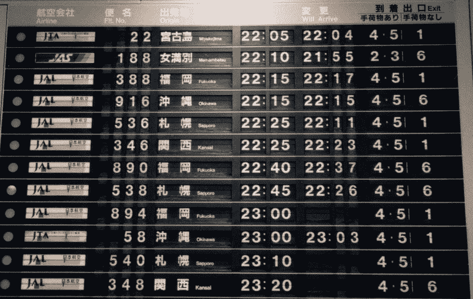
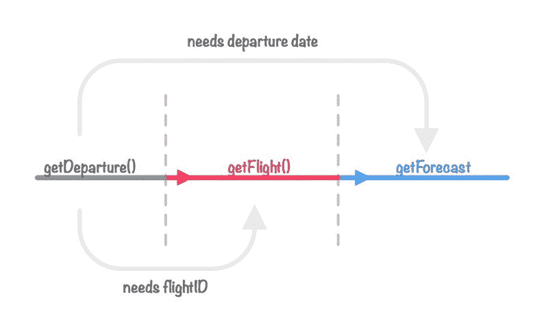
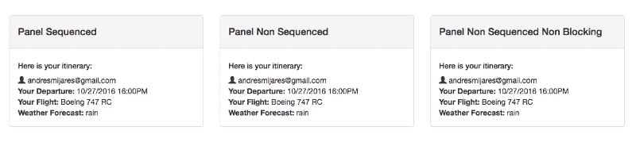
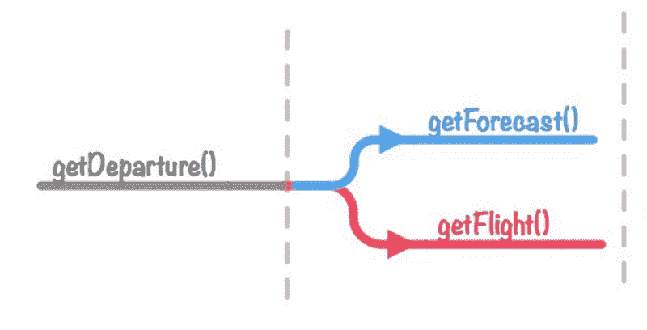

# 使用 redux-saga 的异步操作

> 原文：<https://www.freecodecamp.org/news/async-operations-using-redux-saga-2ba02ae077b3/>

安德烈斯·米哈斯

# 使用 redux-saga 的异步操作



**2017 年 8 月更新:**

*   我发表了这篇文章的第二部分， [Redux-saga 常见模式](https://medium.com/shiftgig-blog/redux-saga-common-patterns-48437892e11c)

**2017 年 4 月更新:**

*   感谢 [Eduardo](https://medium.com/@oieduardorabelo) 将这篇文章翻译成**葡萄牙语，**T4【在这里找到。
*   还有这个把这篇文章翻译成**中文、**T2 的不知名的家伙在这里找到了。

几天前，我的同事做了一个关于管理异步操作的演讲。他使用几个工具来扩展 redux 的功能。听了他的演讲，我真正理解了 JavaScript 疲劳的现实。

让我们面对现实吧:如果你习惯于做你的工作并根据你的需求使用技术——而不是为了技术本身——建立一个 React 生态系统可能会被证明是令人沮丧和耗时的。

我花了两年的时间从事 Angular 项目，享受模型-视图-控制器的艺术状态。我必须说，即使学习曲线是来自 Backbone.js 背景的一个问题，学习 Angular 真的有回报。我找到了一份更好的工作，也有机会合作一些有趣的项目。我从 Angular 的支持社区中学到了很多。

那些日子真的很酷，但是，嗯，*疲劳必须继续下去*(商标待定)，我继续与时尚同行:React、Redux 和 Sagas。

几年前，我偶然看到一篇名为[拉平承诺链](http://solutionoptimist.com/2013/12/27/javascript-promise-chains-2/)的文章，作者是[托马斯·伯利森](https://twitter.com/thomasburleson)。我从阅读它中学到了很多。即使两年后，我仍然记得很多这些见解。

这些天我一直在迁移 React，我发现 Redux 和使用 sagas 来管理异步操作有很大的威力。所以我写这篇文章是为了借用托马斯的帖子，并使用 [redux-saga](https://github.com/yelouafi/redux-saga) 创建一个类似的方法。我们希望这能回报宇宙，帮助一些人理解这些重要技术是如何工作的。

免责声明:我将使用相同的场景并扩展它，我希望(如果我幸运的话)能引起对这两种方法的讨论。我假设读者对承诺、反应、重复和(哦！)...JavaScript。

### 重要的事情先来。

根据 redux-saga 的创作者 Yassine Elouafi 的说法:

> redux-saga 是一个库，旨在使 React/Redux 应用程序中的副作用(即异步的事情，如数据获取和不纯的事情，如访问浏览器缓存)变得更容易和更好。

基本上是一个助手库，它允许我们基于 Sagas 和 ES6 函数生成器组织所有的异步和分布式操作。如果你想更多地了解传奇模式本身， [Caitie McCaffrey](https://twitter.com/caitie?lang=en) 在这个[视频](https://www.youtube.com/watch?v=xDuwrtwYHu8)中做得很好，更多地了解函数生成器。查看这个免费的书呆子[视频](https://egghead.io/lessons/ecmascript-6-generators)(至少在我发这篇文章的时候是免费的)。

### 飞行仪表板箱

托马斯设置了一个我们要重现的案例。最终代码是[这里](https://github.com/andresmijares/async-redux-saga)，演示是[这里](http://async-redux-saga.surge.sh/)。

场景是这样的:



Image by Thomas Burleson

正如我们所看到的，一系列的三个 API 调用:get department-> get flight-> get forecast，因此我们的 API 服务类如下所示:

```
class TravelServiceApi {
```

```
 static getUser() {   return new Promise((resolve) => {     setTimeout(() => {       resolve({            email : "somemockemail@email.com",            repository: "http://github.com/username"       });     }, 3000);   }); }
```

```
 static getDeparture(user) {  return new Promise((resolve) => {   setTimeout(() => {    resolve({      userID : user.email,      flightID : “AR1973”,      date : “10/27/2016 16:00PM”     });    }, 2500);   }); }
```

```
 static getForecast(date) {  return new Promise((resolve) => {      setTimeout(() => {        resolve({            date: date,            forecast: "rain"        });      }, 2000);   });  }
```

```
}
```

这是一个简单明了的 API，带有一些模拟信息，允许我们设置场景。首先我们需要有一个用户。然后，利用这些信息，我们将获得出发、航班和预测，这样我们就可以创建几个难看的仪表板面板，如下所示:



反应成分可以在[这里](https://github.com/andresmijares/async-redux-saga/blob/master/src/components/Dashboard.js)找到。它们是三个不同的组件，在 redux 存储上的表示由三个 reducers 给出，如下所示:

```
const dashboard = (state = {}, action) => { switch(action.type) {  case ‘FETCH_DASHBOARD_SUCCESS’:  return Object.assign({}, state, action.payload);  default :  return state; }};
```

我们为每个面板使用不同的缩减器，有三种不同的场景，使用 *StateToProps* redux 函数让组件访问用户的部分:

```
const mapStateToProps =(state) => ({ user : state.user, dashboard : state.dashboard});
```

一切都准备好了之后(是的，我知道我没有解释很多东西，但是我只想把重点放在传奇上…)我们准备好开始游戏了！

### 给我看看传说

威廉·戴明曾经说过:

> 如果你不能把你在做的事情描述成一个过程，那么你就不知道你在做什么。

好吧，让我们创建一个如何使用 Redux Saga 的分步过程。

#### 1.记录传奇故事

我将用我自己的话来描述 API 公开了哪些方法。如果您需要更多技术细节，请随意参考此处的文档[。](https://yelouafi.github.io/redux-saga/docs/api/index.html)

首先，我们需要创建我们的 saga 生成器并注册它们:

```
function* rootSaga() {  yield[    fork(loadUser),    takeLatest('LOAD_DASHBOARD', loadDashboardSequenced)  ];}
```

Redux saga 曝光的几种方法叫做**我们将要定义其中的几种:**

*   ****Fork** 对传递的函数执行非阻塞操作。**
*   ****采取**暂停，直到收到动作。**
*   **比赛同时运行特效，然后在一个特效完成后取消所有特效。**
*   ****调用**运行一个函数。如果它返回一个承诺，暂停传奇直到承诺被解决。**
*   ****Put** 分派一个动作。**
*   ****Select** 运行一个选择器函数，从状态中获取数据**
*   ****takeLatest** 表示我们将要执行操作，然后只返回最后一次调用的结果。如果我们触发了几个案例，它将忽略除最后一个案例之外的所有案例。**
*   ****takeEvery** 将返回所有已触发呼叫的结果。**

**我们刚刚登记了两个不同的传说。我们稍后将定义它们。到目前为止，我们为使用 **fork** 的用户取一个，另一个 **takeLatest，**将等待一个名为“ **LOAD_DASHBOARD** 的动作被执行。步骤 3 中有更多信息。**

#### **2.将 Saga 中间件注入 Redux store。**

**当我们定义 Redux 存储并初始化它时，大多数情况下它看起来像这样:**

```
**`const sagaMiddleware = createSagaMiddleware();const store = createStore(rootReducer, [], compose(      applyMiddleware(sagaMiddleware)  );sagaMiddleware.run(rootSaga); /* inject our sagas into the middleware*/`**
```

#### **3.创造传奇。**

**首先，我们将定义 **loadUser** 传奇的序列:**

```
**`function* loadUser() {  try {   //1st step    const user = yield call(getUser);   //2nd step    yield put({type: 'FETCH_USER_SUCCESS', payload: user});`**
```

```
 **`} catch(error) {    yield put({type: 'FETCH_FAILED', error});  }}`**
```

**我们可以这样理解:**

*   **首先，调用一个名为 **getUser** 的函数，并将结果赋给 const **用户**。**
*   **稍后，调度一个名为 **FETCH_USER_SUCCESS** 的动作，并将**用户**的值传递给商店消费。**
*   **如果事情变糟，调度一个名为 **FETCH_FAILED 的动作。****

**如您所见，我们可以将 yield 操作的结果添加到变量中，这真的很酷。**

**现在我们要创造一个有序的传奇:**

```
**`function* loadDashboardSequenced() {`**
```

```
 **`try {    yield take(‘FETCH_USER_SUCCESS’);`**
```

```
 **`const user = yield select(state => state.user);    const departure = yield call(loadDeparture, user);`**
```

```
 **`const flight = yield call(loadFlight, departure.flightID);`**
```

```
 **`const forecast = yield call(loadForecast, departure.date);`**
```

```
 **`yield put({type: ‘FETCH_DASHBOARD_SUCCESS’, payload: {forecast,  flight, departure} });`**
```

```
 **`} catch(error) {    yield put({type: ‘FETCH_FAILED’, error: error.message});  }`**
```

```
**`}`**
```

**我们可以这样解读这个故事:**

*   **等待调度 **FETCH_USER_SUCCESS** 动作。这基本上会被搁置，直到一个事件触发它。我们用**拍出**的效果。**
*   **我们从商店里取一个值。**选择**效果接收一个可以访问存储器的函数。我们将用户信息分配给常量用户。**
*   **我们执行一个异步操作来加载出发信息，并使用**调用**效果将用户作为参数传递。**
*   **在**load department**完成后，我们执行 **loadFlight** ，并在之前的操作中获取出发对象。**
*   **这同样适用于预测，我们需要等到航班装载后才能执行下一个**调用**效果。**
*   **最后，一旦所有的操作都完成了，我们就使用 **put** 效果向商店发送调度和动作，并使用整个事件中加载的信息发送所有的参数。**

**正如您所看到的，saga 是一个步骤的集合，这些步骤从先前的操作等待修改它们的行为。完成后，所有信息都可以在商店中使用。**

**很漂亮，是吧？**

**现在让我们检查一个不同的案例。考虑 **getFlight** 和 **getForecast** 可以同时触发。他们不需要一个完成才能启动另一个，因此我们可以为这种情况创建一个不同的面板。**

**

Image by Thomas Burleson** 

#### **无阻塞传奇**

**为了执行两个非阻塞操作，我们需要对前面的例子做一点修改:**

```
**`function* loadDashboardNonSequenced() {  try {    //Wait for the user to be loaded    yield take('FETCH_USER_SUCCESS');`**
```

```
 **`//Take the user info from the store    const user = yield select(getUserFromState);`**
```

```
 **`//Get Departure information    const departure = yield call(loadDeparture, user);`**
```

```
 **`//Here is when the magic happens    const [flight, forecast] = yield [call(loadFlight, departure.flightID), call(loadForecast, departure.date)];`**
```

```
 **`//Tell the store we are ready to be displayed    yield put({type: 'FETCH_DASHBOARD2_SUCCESS', payload: {departure, flight, forecast}});`**
```

```
**`} catch(error) {    yield put({type: 'FETCH_FAILED', error: error.message});  }}`**
```

**我们必须将 yield 注册为一个数组:**

```
**`const [flight, forecast] = yield [call(loadFlight, departure.flightID), call(loadForecast, departure.date)];`**
```

**所以这两个操作都是并行调用的，但是在一天结束时，如果需要的话，我们可以等待两个操作都结束来更新 UI。**

**然后，我们需要将该传奇注册到 rootSaga 中:**

```
**`function* rootSaga() {  yield[    fork(loadUser),    takeLatest('LOAD_DASHBOARD', loadDashboardSequenced),    takeLatest('LOAD_DASHBOARD2' loadDashboardNonSequenced)`**
```

```
 **`];}`**
```

**如果我们需要在操作完成后立即更新 UI，该怎么办？**

**别担心，我会支持你的。**

#### ****无序列和无阻塞的传奇****

**我们也可以将我们的传奇故事分离出来，然后组合起来，这意味着它们可以独立工作。这正是我们所需要的。让我们来看看。**

**第一步:我们分离出预测和飞行传奇。他们都依赖于离开。**

```
**`/* **************Flight Saga************** */function* isolatedFlight() {  try {    /* departure will take the value of the object passed by the put*/    const departure = yield take('FETCH_DEPARTURE3_SUCCESS');     const flight = yield call(loadFlight, departure.flightID);     yield put({type: 'FETCH_DASHBOARD3_SUCCESS', payload: {flight}});`**
```

```
 **`} catch (error) {    yield put({type: 'FETCH_FAILED', error: error.message});  }}`**
```

```
**`/* **************Forecast Saga************** */function* isolatedForecast() {    try {      /* departure will take the value of the object passed by the put*/     const departure = yield take('FETCH_DEPARTURE3_SUCCESS');`**
```

```
 **`const forecast = yield call(loadForecast, departure.date);          yield put({type: 'FETCH_DASHBOARD3_SUCCESS', payload: { forecast, }});`**
```

```
**`} catch(error) {      yield put({type: 'FETCH_FAILED', error: error.message});    }}`**
```

**注意到这里非常重要的东西了吗？这就是我们如何构建我们的传奇:**

*   **它们都在等待同一个**动作事件** (FETCH_DEPARTURE3_SUCCESS)开始。**
*   **当此事件被触发时，他们将收到一个值。下一步会有更多的细节。**
*   **它们将使用**调用效果**执行它们的异步操作，并且在完成后都将触发相同的事件。但是它们都向商店发送不同的数据。多亏了 Redux 的强大功能，我们无需对减速器做任何修改就可以做到这一点。**

****步骤#2** :让我们对出发序列进行更改，并确保它发送一个带有另外两个传奇的出发值:**

```
**`function* loadDashboardNonSequencedNonBlocking() {  try {    //Wait for the action to start    yield take('FETCH_USER_SUCCESS');`**
```

```
 **`//Take the user info from the store    const user = yield select(getUserFromState);`**
```

```
 **`//Get Departure information    const departure = yield call(loadDeparture, user);`**
```

```
 **`//Update the store so the UI get updated    yield put({type: 'FETCH_DASHBOARD3_SUCCESS', payload: { departure, }});`**
```

```
 **`//trigger actions for Forecast and Flight to start...    //We can pass and object into the put statement    yield put({type: 'FETCH_DEPARTURE3_SUCCESS', departure});`**
```

```
 **`} catch(error) {    yield put({type: 'FETCH_FAILED', error: error.message});  }}`**
```

**这里没有什么不同，直到我们到达 **put 效果**。我们可以将一个对象传递给动作，它将被生成到出发和飞行传奇中的出发常量中。我喜欢这个。**

**请随意观看[演示](http://async-redux-saga.surge.sh)，并注意第三个面板如何在飞行前加载预测，因为超时时间更长，以模拟更慢的请求。**

**在生产应用程序中，我可能会做一些不同的事情。我只是想指出，当使用 **put** 效果时，可以传递值。**

#### **测试呢？**

> **你确实测试了你的代码…对吗？**

**传奇很容易测试，但它们与你的步骤相结合，由于发生器的性质，它们被设置成序列。让我们看一个例子。(并且可以随意检查到 sagas 文件夹中的 [repo](https://github.com/andresmijares/async-redux-saga) 中的所有测试):**

```
**`describe('Sequenced Saga', () => {  const saga = loadDashboardSequenced();  let output = null;`**
```

```
**`it('should take fetch users success', () => {      output = saga.next().value;      let expected = take('FETCH_USER_SUCCESS');      expect(output).toEqual(expected);  });`**
```

```
**`it('should select the state from store', () => {      output = saga.next().value;      let expected = select(getUserFromState);      expect(output).toEqual(expected);  });`**
```

```
**`it('should call LoadDeparture with the user obj', (done) => {    output = saga.next(user).value;    let expected = call(loadDeparture, user);    done();    expect(output).toEqual(expected);  });`**
```

```
**`it('should Load the flight with the flightId', (done) => {    let output = saga.next(departure).value;    let expected = call(loadFlight, departure.flightID);    done();    expect(output).toEqual(expected);  });`**
```

```
**`it('should load the forecast with the departure date', (done) => {      output = saga.next(flight).value;      let expected = call(loadForecast, departure.date);      done();      expect(output).toEqual(expected);    });`**
```

```
**`it('should put Fetch dashboard success', (done) => {       output = saga.next(forecast, departure, flight ).value;       let expected = put({type: 'FETCH_DASHBOARD_SUCCESS', payload: {forecast, flight, departure}});       const finished = saga.next().done;       done();       expect(finished).toEqual(true);       expect(output).toEqual(expected);    });});`**
```

1.  **确保您导入了将要测试的所有效果和函数辅助对象。**
2.  **当在 yield 上存储一个值时，需要将模拟数据传递给下一个函数。注意第三、第四和第五个测试。**
3.  **在后台，当调用下一个方法时，每个生成器在一个 yield 之后移动到下一行。这就是我们使用 **saga.next()的原因。这里的值**。**
4.  **这个顺序是固定不变的。如果你改变传奇的步骤，测试就不会通过。**

### ****结论。****

**我非常喜欢测试新技术，在前端开发中，我们几乎每天都会发现新的东西。这就像一种时尚:一旦某个东西被社区接受，就好像每个人都想使用它。有时候我发现这些东西很有价值，但坐下来检查一下我们是否真的需要一些东西仍然很重要。**

**我发现 *thunks* 更容易实现和维护。但是对于更复杂的操作，Redux-Saga 做得非常好。**

**我再次感谢 Thomas 给了我写这篇文章的灵感。我希望有人在这篇文章中找到和我在他的文章中一样多的灵感:)。**

**如果您有任何问题，请随时[发微博给我](http://twitter.com/andresmijares25)。我很乐意帮忙。**

**如果你碰巧对这个话题更感兴趣，请随意查看本系列的第 2 部分 [Redux-saga 常见模式。](https://medium.com/shiftgig-blog/redux-saga-common-patterns-48437892e11c)**

**[**平庸的工程师**](https://www.youtube.com/channel/UCSBzbeNuDamKpX6N4Q5SaHA)
[*更多类似这样的内容，请考虑订阅我的频道*www.youtube.com](https://www.youtube.com/channel/UCSBzbeNuDamKpX6N4Q5SaHA)**

**现在终于可以随意查看我的开源项目了:**

*   **[**反应日历多日**](https://github.com/sgrepo/react-calendar-multiday)**