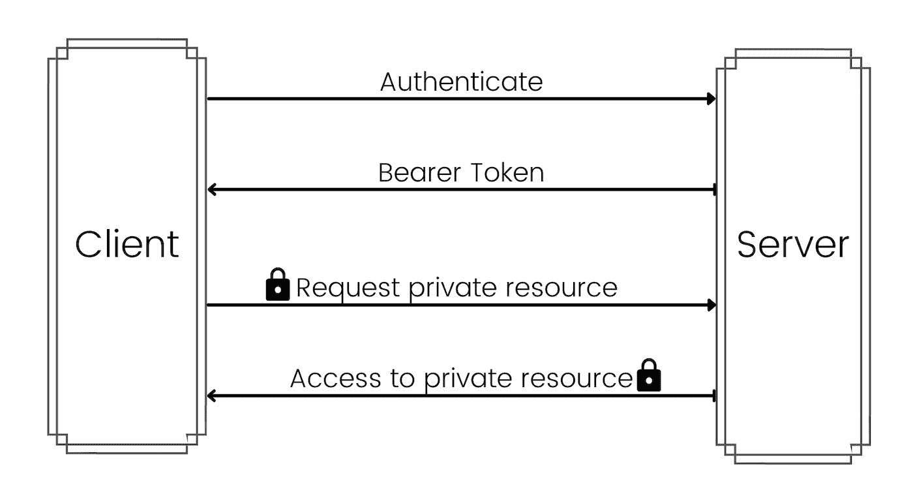
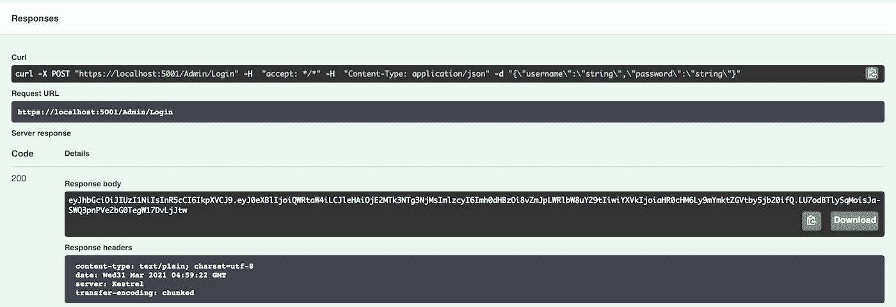
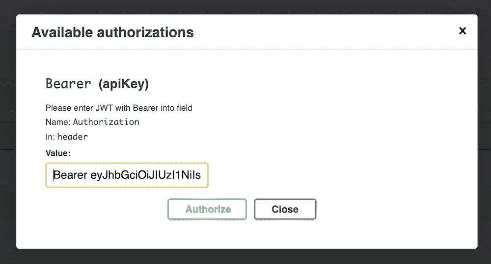

# API 安全–如何在中认证和授权 API。网络 5

> 原文：<https://www.freecodecamp.org/news/authenticate-and-authorize-apis-in-dotnet5/>

在我 11 年的开发生涯中，我见过太多存在重大安全缺陷的 API。它们或者缺乏适当的认证或授权，或者两者都缺乏。

开发人员可能觉得一切正常，因为这些端点通常不是公共的。但这是一个巨大的安全漏洞，任何人都可以很容易地锁定它。

为了更好地理解 API 安全性，让我们为 FBI 创建一个演示项目。将有一个管理员可以登记联邦调查局特工，并改变他们的许可级别。

拥有*许可级别 1* 的联邦调查局特工将能够访问公共文件，拥有*许可级别 2* 的特工将能够访问公共和机密文件。

但在我们开始之前，这里有一些理论。

## 身份验证的工作原理

我们的代理已经成功通过了他们所有的考试；是时候让他们注册了。为了做到这一点，他们将提供他们的文件，作为回报，将获得他们的徽章。

在上面的场景中，*提供文档*就像登录一样——一旦通过验证，代理将获得一个令牌(徽章)。这个过程被称为*认证*。它决定了代理是否是他们所声称的那个人。

我们将使用 JSON Web 令牌(JWT)不记名令牌进行身份验证。*不记名令牌*是一种由服务器生成的令牌，包含试图登录的用户的声明/角色的详细信息。不记名令牌大多是结构化令牌，如 JWT。如果你想了解更多，你可以[在这里](https://jwt.io/introduction)阅读更多关于 JWT 的信息。

## 授权如何工作

现在联邦调查局特工已经拿到了徽章，他们可以进入联邦调查局大楼。他们也能够访问公共文件，但当试图访问机密文件时，他们会得到一个 [401 错误](https://www.freecodecamp.org/news/http-401-error-vs-http-403-error-status-code-responses-explained/)。

这是因为联邦调查局特工没有得到授权访问机密文件。*授权*决定代理可以访问和不可以访问的内容。

如上所述，JWT 承载令牌包含声明/角色。基于此，我们的服务器决定是否允许访问私有资源。

## 访问流程



如上图所示，成功登录后，服务器会返回一个不记名令牌。客户端在后续调用中使用承载令牌来访问私有资源。

这是我们将在本文中实现的两个主要概念。

理论讲够了，给我看看代码！

## 如何建立我们的项目

从 CLI 执行命令 **`dotnet new webapi --name FBI`** 创建一个新项目。它将创建一个带有示例 WeatherForecast API 的项目。

我们可以在联邦调查局工作，为什么还要在天气预报上工作？继续删除`WeatherForecast.cs`文件。

通过执行以下命令添加必要的依赖项:

```
dotnet add package Microsoft.IdentityModel.Tokens --version 6.9.0
dotnet add package Microsoft.AspNetCore.Authentication.JwtBearer --version 5.0.4 
```

在`Startup.cs`文件的`ConfigureServices`函数中，添加以下代码:

```
var TokenValidationParameters = new TokenValidationParameters
{
    ValidIssuer = "https://fbi-demo.com",
    ValidAudience = "https://fbi-demo.com",
    IssuerSigningKey = new SymmetricSecurityKey(Encoding.UTF8.GetBytes("SXkSqsKyNUyvGbnHs7ke2NCq8zQzNLW7mPmHbnZZ")),
    ClockSkew = TimeSpan.Zero // remove delay of token when expire
}; 
```

我们正在定义验证令牌的参数。确保生成`SymmetricSecurityKey`的字符串长度为 32。

接下来，设置服务，为 API 添加身份验证，如下所示:

```
services
    .AddAuthentication(options =>
    {
        options.DefaultScheme = JwtBearerDefaults.AuthenticationScheme;
    })
    .AddJwtBearer(cfg =>
    {
        cfg.TokenValidationParameters = TokenValidationParameters;
    }); 
```

`AddAuthentication`方法注册认证服务所需的服务。它还将 JWT 承载认证配置为默认方案。

`AddJwtBearer`启用 JWT 载体认证并设置上面定义的`TokenValidationParameters`。

现在让我们为我们的`Agent`和`Admin`添加一些授权声明。

```
services.AddAuthorization(cfg =>
    {
        cfg.AddPolicy("Admin", policy => policy.RequireClaim("type", "Admin"));
        cfg.AddPolicy("Agent", policy => policy.RequireClaim("type", "Agent"));
        cfg.AddPolicy("ClearanceLevel1", policy => policy.RequireClaim("ClearanceLevel", "1", "2"));
        cfg.AddPolicy("ClearanceLevel2", policy => policy.RequireClaim("ClearanceLevel", "2"));
    }); 
```

`AddAuthorization`方法注册授权所需的服务。我们还通过调用`AddPolicy`来添加对`Admin`、`Agent`、`ClearanceLevel1`和`ClearanceLevel2`的声明。

声明是一个名称值对，表示主题是什么。由于许可级别 2 也可以访问许可级别 1，所以我们将*“1”*放在了许可级别 1 中。你可以在这里阅读更多关于。

最后，在`Configure`方法中，在`app.UseAuthorization();`的正上方添加下面一行:

```
app.UseAuthentication(); 
```

## 管理控制器文件

将您的文件`WeatherForecastController.cs`重命名为`AdminController.cs`。也要更改类名和构造函数名。最后，移除除构造函数之外的所有内容。

```
using Microsoft.AspNetCore.Mvc;

namespace FBI.Controllers
{
    [ApiController]
    [Route("[controller]")]
    public class AdminController : ControllerBase
    {
        public AdminController() { }
    }
} 
```

### 如何设置登录 API

让我们为`Admin`创建一个登录 API，这样他们就可以获得一个令牌来执行其他任务。

```
[HttpPost]
[Route("[action]")]
public IActionResult Login([FromBody] User User)
{
    // TODO: Authenticate Admin with Database
    // If not authenticate return 401 Unauthorized
    // Else continue with below flow

    var Claims = new List<Claim>
            {
                new Claim("type", "Admin"),
            };

    var Key = new SymmetricSecurityKey(Encoding.UTF8.GetBytes("SXkSqsKyNUyvGbnHs7ke2NCq8zQzNLW7mPmHbnZZ"));

    var Token = new JwtSecurityToken(
        "https://fbi-demo.com",
        "https://fbi-demo.com",
        Claims,
        expires: DateTime.Now.AddDays(30.0),
        signingCredentials: new SigningCredentials(Key, SecurityAlgorithms.HmacSha256)
    );

    return new OkObjectResult(new JwtSecurityTokenHandler().WriteToken(Token));
} 
```

在上面的代码中，`User`是一个具有属性`Username`和`Password`的模型。我们还使用我们在`Startup.cs`文件中使用的配置创建了一个`JwtSecurityToken`对象。然后，令牌被转换成字符串，并在`OkObjectResult`中返回。

现在，您可以打开 Swagger 并执行 API 来查看不记名令牌。将返回一个不记名令牌，如下所示。



请将令牌放在手边，因为我们将在下一节中使用它。您也可以访问 [https://jwt.io](https://jwt.io) 来分析您的令牌。

### 如何生成徽章 API

为`Agent`生成徽章是一项敏感任务，只能由`Admin`授权。我们将为`GenerateBadge` API 添加一个`Authorize`属性。

```
[HttpPost]
[Route("[action]")]
[Authorize(Policy = "Admin")]
public IActionResult GenerateBadge([FromBody] Agent Agent)
{
    var Claims = new List<Claim>
    {
        new Claim("type", "Agent"),
        new Claim("ClearanceLevel", Agent.ClearanceLevel.ToString()),
    };

    var Key = new SymmetricSecurityKey(Encoding.UTF8.GetBytes("SXkSqsKyNUyvGbnHs7ke2NCq8zQzNLW7mPmHbnZZ"));

    var Token = new JwtSecurityToken(
        "https://fbi-demo.com",
        "https://fbi-demo.com",
        Claims,
        expires: DateTime.Now.AddDays(30.0),
        signingCredentials: new SigningCredentials(Key, SecurityAlgorithms.HmacSha256)
    );

    return new OkObjectResult(new JwtSecurityTokenHandler().WriteToken(Token));
}
```

这里，`Agent`是一个模型，其属性`Name`为 string，`ClearanceLevel`为 int。

现在，当你回到 swagger 并试图执行`GenerateBadge` API 时，它会给你一个 401 未授权响应。我们得到这个错误是因为我们没有传递不记名令牌。

为了能够在 Swagger 中添加授权头，将`services.AddSwaggerGen`更改如下:

```
services.AddSwaggerGen(c =>
{
    c.SwaggerDoc("v1", new OpenApiInfo { Title = "FBI", Version = "v1" });
    c.AddSecurityDefinition("Bearer", new OpenApiSecurityScheme
    {
        In = ParameterLocation.Header,
        Description = "Please enter JWT with Bearer into field",
        Name = "Authorization",
        Type = SecuritySchemeType.ApiKey
    });
    c.AddSecurityRequirement(new OpenApiSecurityRequirement {
    { new OpenApiSecurityScheme
            {
                Reference = new OpenApiReference { Type = ReferenceType.SecurityScheme, Id = "Bearer"}
            },
        new string[] {}
    }
    });
}); 
```

当您在浏览器中刷新 Swagger 时，您会注意到 API 列表上方右侧有一个*授权*按钮。

单击 Swagger 中新添加的授权按钮，这将打开一个对话框。我们需要提到它是什么类型的令牌。因此，首先在字段中输入 *Bearer* ，然后输入一个空格，然后输入从前面部分的 */Admin/Login* API 生成的令牌。



单击标题以锁定令牌。现在你都准备好了。当您再次执行`GenerateBadge` API 时，您将获得一个令牌(类似于徽章)。将这个令牌放在手边，因为我们在下一节中需要它。同时确保**暂时将 ClearanceLevel 作为 1** 传递。

## 如何设置代理控制器

用以下内容创建一个名为`AgentController.cs`的新文件:

```
using Microsoft.AspNetCore.Mvc;

namespace FBI.Controllers
{
    [ApiController]
    [Route("[controller]")]
    [Authorize(Policy = "Agent")]
    public class AgentController : ControllerBase
    {
        public AgentController() { }
    }
} 
```

正如您在上面看到的，我们授权整个控制器仅供代理访问。因此，即使是管理员也无法访问我们将要创建的 API。

### 如何访问记录的 API

让我们添加 API 来访问公共文件和机密文件。

```
[HttpGet]
[Route("[action]")]
[Authorize(Policy = "ClearanceLevel1")]
public ActionResult<String> AccessPublicFiles()
{
    return new OkObjectResult("Public Files Accessed");
}

[HttpGet]
[Route("[action]")]
[Authorize(Policy = "ClearanceLevel2")]
public ActionResult<String> AccessClassifiedFiles()
{
    return new OkObjectResult("Classified Files Accessed");
} 
```

我们为两个 API 都添加了`Authorize`属性，这样公共文件可以被`ClearanceLevel1`访问，机密文件可以被`ClearanceLevel2`访问。

如果你试图用管理令牌访问这些 API，你会得到 403 禁止错误。所以继续操作，再次点击*授权*按钮，然后点击*注销*。然后，从上面的步骤中得到令牌，粘贴到以*持有者*为前缀*的字段中。*

现在，当您访问*/Agent/AccessPublicFiles*API 时，您将看到响应 200 和消息 *Public Files Accessed* 。但是当你尝试分类 API 时，你会得到 403 禁止错误。

## 如何更改许可级别

一晃 3 年过去了，我们的*代理商的*业绩好得令人难以置信。管理层现在已经决定将他们提升到清算级别 2。

*代理*去找*管理员*并要求他们提供许可级别为 2 的令牌/徽章。

*管理员*首先调用*/管理员/登录* API 来生成他们自己的令牌。然后他们在*授权*对话框中输入密码。

管理员然后调用 ClearanceLevel 中值为 2 的 */Admin/GenerageBadge* API。这将生成一个新的令牌/徽章，然后交给*代理*。

*代理*在*授权*对话框中输入这个令牌/徽章，当他们现在调用*/代理/访问分类文件*时，他们很高兴看到结果*分类文件被访问*。

## 结论

你可以在 GitHub 的这里找到整个项目。

API 安全性极其重要，不应该掉以轻心，即使它仅供内部使用。设置认证和授权，你就成功了一半。

您还可以采取其他安全措施来抵御 DDoS 攻击，比如只接受来自特定 IP 或域的 API，等等。

你觉得这篇文章怎么样？你通常采取什么其他安全措施？有任何反馈或意见吗？

你可以在我的网站上查看更多的教程。