# 在 ASP.NET 核心 2.0 中使用 Twitter 进行身份验证

> 原文：<https://www.freecodecamp.org/news/authentication-using-twitter-in-asp-net-core-2-0-c7e02be30678/>

作者:安基特·夏尔马

# 在 ASP.NET 核心 2.0 中使用 Twitter 进行身份验证


Photo by [William Iven](https://unsplash.com/photos/SpVHcbuKi6E?utm_source=unsplash&utm_medium=referral&utm_content=creditCopyText) on [Unsplash](https://unsplash.com/search/photos/security?utm_source=unsplash&utm_medium=referral&utm_content=creditCopyText)

### 介绍

有时，我们希望用户使用他们现有的来自第三方应用程序的凭证登录，比如脸书、Twitter、Google 等等。在本文中，我们将研究使用 Twitter 对 ASP.NET 核心应用的认证。

### 先决条件

*   安装。NET Core 2.0.0 以上 SDK 从[这里](https://www.microsoft.com/net/learn/get-started/windows#windowscmd)。
*   从[这里](https://www.visualstudio.com/downloads/)安装最新版本的 Visual Studio 2017 社区版。

### 创建 MVC Web 应用程序

打开 Visual Studio 并选择文件>>新建>>项目。选择项目后，将会打开一个“新项目”对话框。选择。NET Core 里面的 Visual C#菜单从左侧面板。然后，选择“ASP。NET 核心 Web 应用程序”。将**项目的名称设为 Dem** *o* TwitterAuth，然后按 OK。

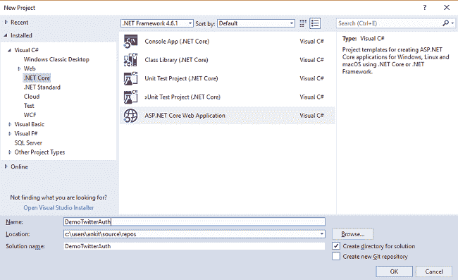

单击 OK 后，将打开一个新对话框，要求选择项目模板。您可以在模板窗口的左上角看到两个下拉菜单。选择”。NET Core”和“ASP。NET Core 2.0”。然后，选择“Web 应用程序(模型-视图-控制器)”模板。单击“更改验证”按钮，将会打开一个更改验证对话框。选择“个人用户帐户”并单击确定。现在，再次单击确定创建您的 web 应用程序。

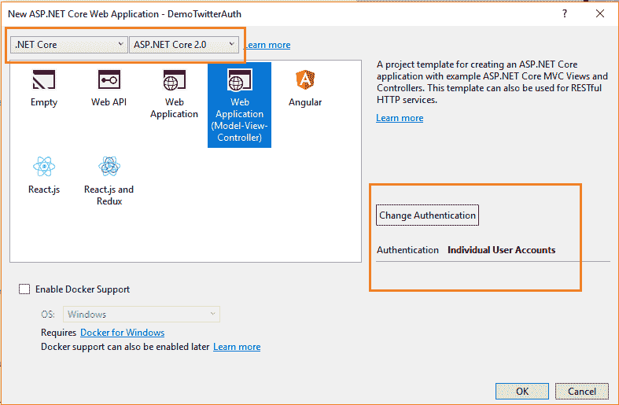

在运行应用程序之前，我们需要将迁移应用到我们的应用程序中。导航到工具>>获取软件包管理器>>软件包管理器控制台。

它将打开软件包管理器控制台。输入 **Update-Database** 命令，并点击回车。这将使用实体框架代码优先迁移来更新数据库。


按 F5 运行应用程序。您可以看到如下所示的主页。

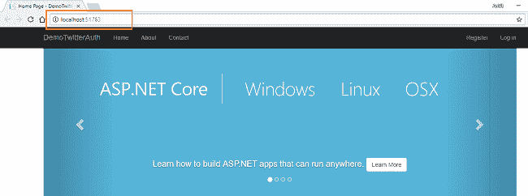

请注意浏览器地址栏中的 URL。在这种情况下，URL 是 [http://localhost:51763/。](http://localhost:51763/.)我们需要这个 URL 来配置我们的 Twitter 应用程序，这将在下一节中进行。

### 创建 Twitter 应用程序

在我们开始构建我们的 ASP.NET 核心 2.0 应用程序之前，我们需要创建和配置 Twitter 应用程序，以便我们可以使用它来认证我们的应用程序。

导航至[https://apps.twitter.com/](https://apps.twitter.com/)，使用您现有的 Twitter 账户登录。如果您没有 Twitter 帐户，您需要创建一个。没有 Twitter 帐户，您无法继续。登录后，您将被重定向到类似于下图所示的应用程序管理页面。

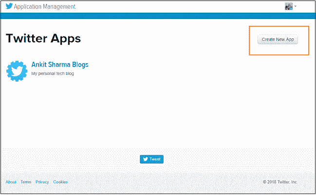

它会显示你所有配置的 Twitter 应用程序。因为我已经配置了一个 Twitter 应用程序，所以它正在显示。如果您是第一次创建，它不会显示任何内容。点击右上角的“创建新应用程序”按钮。它将打开一个表单，并要求填写详细信息以创建一个新的应用程序。

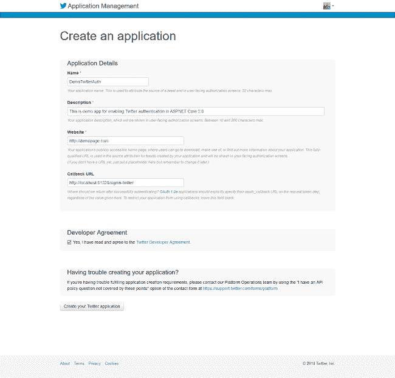

你可以用下面提到的细节填写表格。

*   **名字**
    给出你选择的任何名字。但它应该是普遍唯一的。这意味着任何人都不应该在创建 Twitter 应用程序时使用这个名字。这与电子邮件 id 的作用相同。两个人不能有相同的电子邮件 id。我在本教程中使用“DemoTwitterAuth”这个名字。如果您使用一个已经存在的名字，那么您将得到一个错误"*客户端应用程序验证失败:<您输入的名字>已经被用作*的名字。"
*   **描述**
    给出一个恰当的描述。
*   **网站**
    给出你的公共网站网址。但是出于演示的目的，我们将使用一个虚拟 URL[http://demopage.com。](http://demopage.com.)

如果您使用的 URL 格式为[*【www.demopage.com】*，](http://www.demopage.com,)，您将得到一个错误“*客户端应用程序验证失败:不是有效的 URL 格式。*“总是使用 URL 格式作为[http://demopage.com](http://demopage.com)

*   **回调 URL**
    给出你的应用程序的基本 URL，并在后面加上 */signin-twitter* 。对于本教程，URL 将是[http://localhost:51763/sign in-Twitter](http://localhost:51763/signin-twitter)。

单击复选框接受开发者协议，然后单击“创建您的 Twitter 应用程序”按钮。您将被重定向到您新创建的 Twitter 应用程序页面，您还会看到一条成功消息，如下图所示。

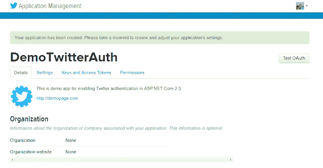

导航到“密钥和访问令牌”选项卡，记下消费者密钥(API 密钥)和消费者秘密(API 秘密)字段值。我们将在 ASP.NET 核心应用程序中使用这些值。

出于安全目的，此图像中的字段被屏蔽。

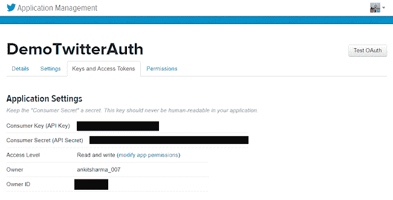

我们的 Twitter 应用程序已成功创建。

### 将 Web 应用程序配置为使用 Twitter 认证

我们需要在应用程序中存储消费者密钥(API 密钥)和消费者秘密(API 秘密)字段值。为此，我们将使用 Secret Manager 工具。

Secret Manager 工具是一个项目工具，可用于在开发过程中存储. NET 核心项目的密码、API 密钥等秘密。借助秘密管理器工具，我们可以将应用程序秘密与特定项目相关联，并在多个项目之间共享它们。

再次打开 web 应用程序，并在解决方案资源管理器中右击该项目。从上下文菜单中选择“管理用户机密”。

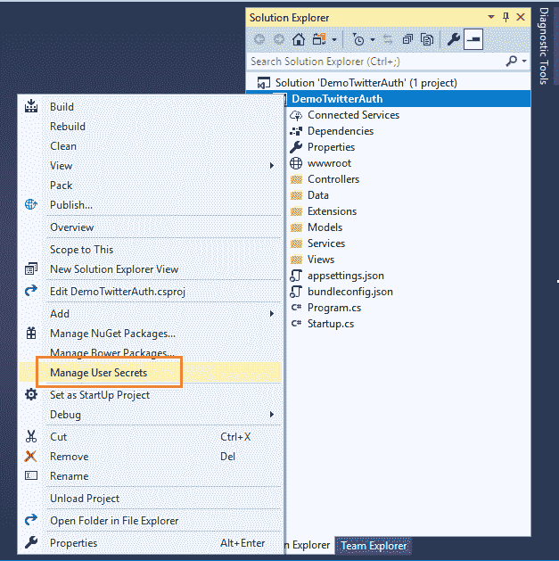

一个 **secrets.json** 文件将会打开。把下面的代码放进去。

```
{  
    "Authentication:Twitter:ConsumerKey": "Your Consumer Key here",  
    "Authentication:Twitter:ConsumerSecret": "Your Consumer Secret here"  
}
```

现在打开 **Startup.cs** 文件，将下面的代码放到 **ConfigureServices** 方法中。

```
services.AddAuthentication().AddTwitter(twitterOptions => {  
    twitterOptions.ConsumerKey = Configuration["Authentication:Twitter:ConsumerKey"];  
    twitterOptions.ConsumerSecret = Configuration["Authentication:Twitter:ConsumerSecret"];  
});
```

在这段代码中，我们将读取 ConsumerKey 和 ConsumerSecret 以进行身份验证。所以最后， **Startup.cs** 会是这个样子。

```
using System;  
using System.Collections.Generic;  
using System.Linq;  
using System.Threading.Tasks;  
using Microsoft.AspNetCore.Builder;  
using Microsoft.AspNetCore.Identity;  
using Microsoft.EntityFrameworkCore;  
using Microsoft.AspNetCore.Hosting;  
using Microsoft.Extensions.Configuration;  
using Microsoft.Extensions.DependencyInjection;  
using DemoTwitterAuth.Data;  
using DemoTwitterAuth.Models;  
using DemoTwitterAuth.Services;  
namespace DemoTwitterAuth {  
    public class Startup {  
        public Startup(IConfiguration configuration) {  
            Configuration = configuration;  
        }  
        public IConfiguration Configuration {  
            get;  
        }  
        // This method gets called by the runtime. Use this method to add services to the container.  
        public void ConfigureServices(IServiceCollection services) {  
            services.AddDbContext < ApplicationDbContext > (options => options.UseSqlServer(Configuration.GetConnectionString("DefaultConnection")));  
            services.AddIdentity < ApplicationUser, IdentityRole > ().AddEntityFrameworkStores < ApplicationDbContext > ().AddDefaultTokenProviders();  
            services.AddAuthentication().AddTwitter(twitterOptions => {  
                twitterOptions.ConsumerKey = Configuration["Authentication:Twitter:ConsumerKey"];  
                twitterOptions.ConsumerSecret = Configuration["Authentication:Twitter:ConsumerSecret"];  
            });  
            // Add application services.  
            services.AddTransient < IEmailSender, EmailSender > ();  
            services.AddMvc();  
        }  
        // This method gets called by the runtime. Use this method to configure the HTTP request pipeline.  
        public void Configure(IApplicationBuilder app, IHostingEnvironment env) {  
            if (env.IsDevelopment()) {  
                app.UseBrowserLink();  
                app.UseDeveloperExceptionPage();  
                app.UseDatabaseErrorPage();  
            } else {  
                app.UseExceptionHandler("/Home/Error");  
            }  
            app.UseStaticFiles();  
            app.UseAuthentication();  
            app.UseMvc(routes => {  
                routes.MapRoute(name: "default", template: "{controller=Home}/{action=Index}/{id?}");  
            });  
        }  
    }  
}
```

这样，我们的应用程序就准备好了。

### 执行演示

启动应用程序，点击主页右上角的“登录”。

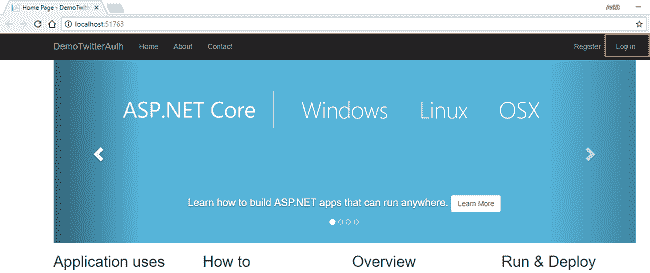

您将被重定向到[http://localhost:51763/Account/log in](http://localhost:51763/Account/Login)页面，您可以在页面右侧看到使用 Twitter 登录的选项。

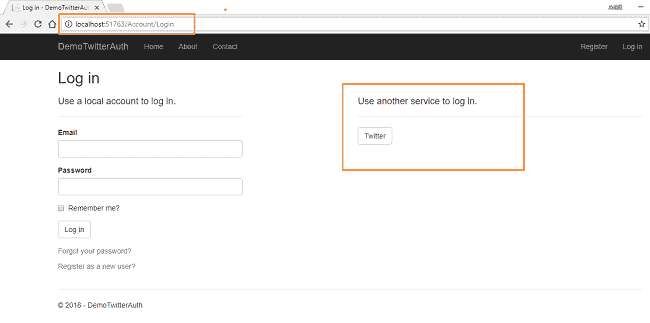

点击 **Twitter** 按钮将带您进入 Twitter 授权页面。在那里，您将被要求填写您的 Twitter 凭据，并授权 Twitter 应用程序使用您的 Twitter 帐户。

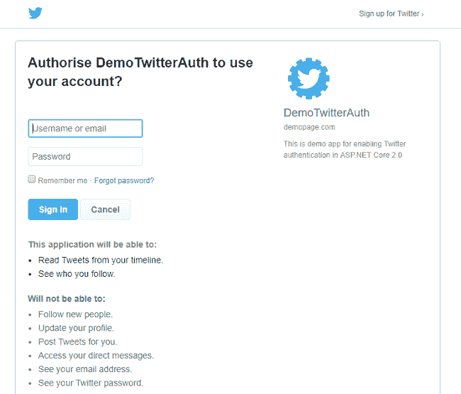

一旦你点击授权应用程序，该应用程序将需要一些时间来验证你的 Twitter 帐户。身份验证成功后，您将被重定向到应用程序中的注册页面，您需要填写电子邮件 id 来标记您的帐户。

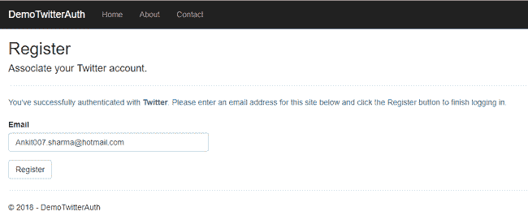

给一个电子邮件 id，然后点击“注册”。你将再次被重定向到主页，但这一次，你还可以看到你的注册电子邮件在右上角。

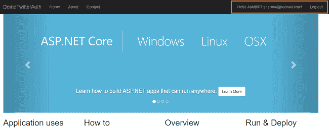

### 结论

我们已经成功地创建了一个 Twitter 应用程序，并使用它来验证我们的 ASP.NET 核心应用程序。

可以从 [GitHub](https://github.com/AnkitSharma-007/ASPCore.TwitterAuth) 获取源代码。

请注意，在源代码中， **secrets.json** 文件包含虚拟值。因此，在执行之前，您需要用 Twitter 应用程序的键替换这些值。

你也可以在 [C#角](http://www.c-sharpcorner.com/article/authentication-using-twitter-in-asp-net-core-2-0/)找到这篇文章。

你可以看看我在 ASP 上的其他文章。网芯[这里](http://ankitsharmablogs.com/category/asp-net-core/)

### 请参见

*   [在 ASP.NET 核心 2.0 中使用脸书进行认证](http://ankitsharmablogs.com/authentication-using-facebook-in-asp-net-core-2-0/)
*   [在 ASP.NET 核心 2.0 中使用谷歌认证](http://ankitsharmablogs.com/authentication-using-google-asp-net-core-2-0/)
*   [在 ASP.NET 核心 2.0 中使用 LinkedIn 进行身份验证](http://ankitsharmablogs.com/authentication-using-linkedin-asp-net-core-2-0/)
*   [使用 ASP.NET 核心 2.0 进行 Cookie 认证](http://ankitsharmablogs.com/cookie-authentication-with-asp-net-core-2-0/)
*   [ASP.NET 核心—使用谷歌认证器的双因素认证](http://ankitsharmablogs.com/asp-net-core-two-factor-authentication-using-google-authenticator/)

最初发表于