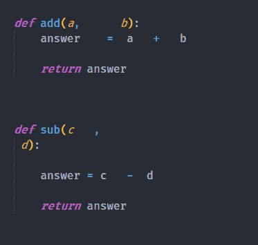
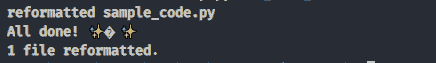
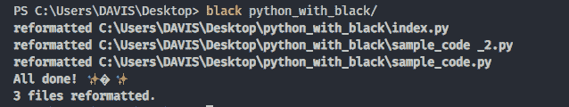
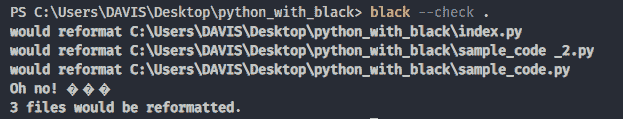
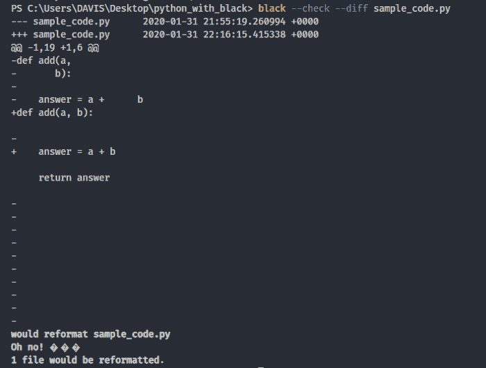
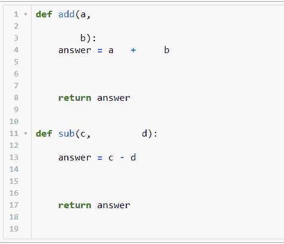
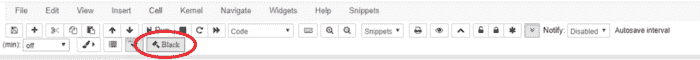
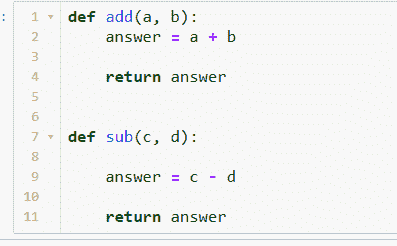

# 如何用黑色自动格式化你的 Python 代码

> 原文：<https://www.freecodecamp.org/news/auto-format-your-python-code-with-black/>

编写 Python 代码是一回事，以良好的格式编写代码是另一回事。初级程序员经常专注于确保他们的代码能够正常工作，却忘记了如何正确格式化代码。

如果你写一个小程序(有 1000 行代码),你可能不需要格式化你的代码。

但是随着程序变得越来越复杂，它们变得越来越难理解。在某些时候(大约 15，000 行代码)，理解您自己编写的代码变得更加困难。

处理格式良好的代码和处理格式糟糕的代码之间的区别就像住在宫殿里和住在肮脏的房子里之间的区别。

# **为什么格式化 python 代码很重要**

### 可读性

格式化你的代码将帮助你 ****高效地阅读**** 你的代码**。它看起来更有条理，当有人看你的代码时，他们会留下好印象。**

### **这将有助于你的编码面试**

**当你在进行编码面试时，有时面试官会关心你的代码格式是否正确。如果你忘记了格式化，你可能会失去你的工作前景，仅仅是因为你的代码格式不好。**

### **团队支持**

**当你在 ****团队**中工作时，格式化你的代码变得更加重要。几个人可能会从事同一个软件项目，你写的代码必须被你的队友理解。否则合作会变得更加困难。****

### **这使得发现漏洞变得很容易**

**格式不良的代码会让你很难发现错误，甚至很难编写程序。它看起来真的很可怕。 **这是对你眼睛的冒犯。****

# **Pylint 和 Flake8**

**大多数 Python 开发人员喜欢使用 [Pylint](https://www.pylint.org/) 或 [Flake8](http://flake8.pycqa.org/en/latest/) 来检查他们的代码错误和样式指南。**

******Pylint**** 是一个检查 Python 中错误的工具。它试图执行一个编码标准，并寻找代码气味。它还可以查找某些类型错误，它可以推荐关于如何重构特定块的建议，并可以向您提供关于代码复杂性的详细信息。**

******Flake8**** 是一个 Python 库，封装了 ****PyFlakes**** 、 ****pycodestyle**** 和 ****Ned Batchelder 的 McCabe 脚本**** 。这是一个很棒的工具包，可以根据编码风格 ****(PEP8)**** 、编程错误如“库已导入但未使用”、“未定义的名称”和代码未缩进来检查您的代码库。**

**问题是，这些工具只报告它们在源代码中发现的问题，而把修复它们的负担留给 Python 开发人员！**

**但是如果我们有一种工具可以同时识别和解决问题，那会怎么样呢？ ****黑色**** 是一个工具，可以让你 ****识别错误**** 和 ****同时格式化你的 python 代码**** 。因此，这会让你更有效率。**

# ****黑色介绍****

**

Black Logo** 

**来自项目自述文件:**

> **通过使用*黑色*，你同意放弃对手写格式细节的控制。作为回报， *Black* 给了你速度、确定性和摆脱 pycodestyle 关于格式的唠叨。你将节省时间和精力去做更重要的事情。**

**Black 可以根据 Black code 样式重新格式化您的整个文件。它帮助你的大脑专注于你想要解决的问题和编码解决方案，而不是被代码结构和微小的风格差异分散注意力。**

**所以我们来看看怎么用。**

### **安装黑色**

**运行`pip install black`可以安装黑色。它需要 Python 3.6.0+才能运行。一旦安装了 black，您的 shell 中将有一个名为 Black 的新命令行工具可供您使用，您已经准备好开始了！**

**要立即开始使用合理的默认值，请选择您想要格式化的 python 文件，然后在终端中编写 ****black filename.py**** 。然后 Black 会格式化你的 python 文件。**

**现在我们来看看黑棋能帮我们做什么。**

### **格式化单个文件**

**让我们看看这个简单的例子:这是我的 python 文件 sample_code.py 中的两个 python 函数。**

**

sample_code.py** 

**您可以在终端中使用`black sample_code.py`来更改格式。运行 Black 后，您将看到以下输出:**

****

**然后，您可以打开 sample_code.py 查看格式化的 python 代码:**

****

**Python 代码现在已经格式化，可读性更好了。**

### **格式化多个文件**

**要格式化多个 python 文件，在终端中写入`black folder_name/`。**

******

Format all python files inside the folder** 

**名为 python_with_black 的文件夹中的三个 python 文件已被重新格式化。**

### **检查文件格式**

**如果您不希望 Black 更改您的文件，但您想知道 Black 是否认为某个文件应该更改，您可以使用以下命令之一:**

**`black --check .`:这将检查哪些 python 文件可以在当前文件夹中格式化(但实际上并不修改 python 文件)。**

**

Check file(s) to format** 

**`black --check --diff file_name.py` :显示需要对文件做什么，但不修改文件。**

**

check diff after formatting** 

### **更改每行的字符数**

**请注意，黑色默认为 88 个字符的行长度，但是您可以使用“-l”或“- -line-length”选项进行更改。**

**比如要改成 60 个字符:`black -l 60 python_file.py`。**

# **木星笔记本中的黑色**

**对于 Jupyter 笔记本用户来说，您仍然可以使用这个简单的扩展 [Jupyter Black](https://github.com/drillan/jupyter-black) 来自动格式化您的 python 代码。这个扩展通过[黑](https://black.readthedocs.io/en/stable/)来重新格式化/修饰笔记本代码单元中的代码。**

**木星黑扩展提供**

*   **工具栏按钮。**
*   **用于重新格式化当前代码单元的键盘快捷键(默认值:Ctrl-B)。**
*   **用于重新格式化整个代码单元格的键盘快捷键(默认为:Ctrl-Shift-B)。**

### **安装木星黑**

**首先确保你已经安装了[jupyter-contrib-nb extensions](https://github.com/ipython-contrib/jupyter_contrib_nbextensions)和 [black](https://black.readthedocs.io/en/stable/) ，然后运行下面的命令。**

```
`jupyter nbextension install https://github.com/drillan/jupyter-black/archive/master.zip — user`
```

**然后通过运行以下命令来启用扩展:**

```
`jupyter nbextension enable jupyter-black-master/jupyter-black` 
```

**现在，您可以开始在每个笔记本单元格中格式化您的 python 代码了。**

**首先，选择想要格式化 python 代码的笔记本单元格，然后单击名为 Black 的扩展按钮。**

**

Before using Jupyter Black** 

**然后点击 Jupyter 黑色按钮:**

**

Jupyter Black Button** **

After using Jupyter Black** 

# **编辑器集成**

**你可以把黑色和你喜欢的编辑器融合在一起。目前 Black 支持 PyCharm/IntelliJ IDEA、Wing IDE、Vim、Visual Studio Code、Sublime Text 3、Atom/核素、Kakoune、Thonny。按照此处的说明[将黑色与你最喜欢的编辑器整合。](https://black.readthedocs.io/en/latest/editor_integration.html)**

**如果你想了解更多关于黑色的知识，我推荐你观看由 ukasz Langa 主持的 [PyCon 2019 演讲](https://youtu.be/esZLCuWs_2Y)。**

**如果你学到了新的东西或者喜欢阅读这篇文章，请分享给其他人看。在那之前，下期帖子再见！也可以通过 Twitter [@Davis_McDavid](https://twitter.com/Davis_McDavid) 联系到我。**