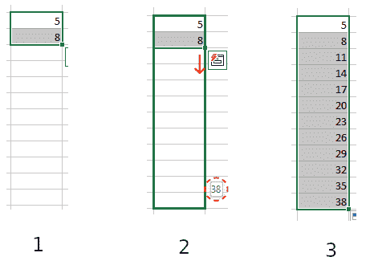
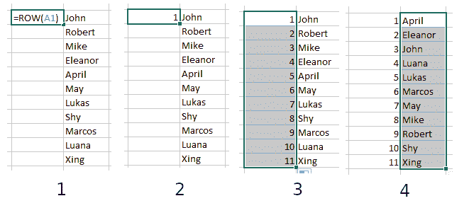

# Excel 中的自动编号–如何自动对单元格进行编号

> 原文：<https://www.freecodecamp.org/news/auto-numbering-in-excel/>

在 Excel 中，给单元格编号是一项经常要执行的任务。但是在每个单元格中手动写入数字需要很多时间。

幸运的是，有一些方法可以帮助你自动添加数字。在本文中，我将向您展示两种方法:第一种是简单的方法，第二种让您拥有动态编号的单元格。所以让我们开始吧。

# 如何用规则模式对单元格进行自动编号

对于这种方法，您可以在一个单元格中设置起始数字，在下一个单元格中设置序列中的下一个数字。

一旦你有两个相邻的单元格填充了你的两个起始数字，你可以选择这两个单元格，点击绿色轮廓右下角的手柄，拖动选择所有你想要遵循你的模式的单元格。

一个有用的工具提示出现在绿色轮廓的右下角附近，显示如果您在该点释放，序列中的最后一个数字是什么。

所以，如果你想从数字 5 开始，增加 3 直到 38，你应该在你的第一个单元格中写 5，在下一个单元格中写 8。然后选择包含 5 和 8 的单元格，单击手柄，拖动选择其他单元格，直到工具提示中出现`38`。然后你就可以放行了，数字会自动填写。

1) Select the cells. 2) Drag the handle on the outline (you can also see the tooltip with the last number in the series) 3) Release

这些数字也可以按降序排列:如果您从 7 开始，然后输入 5，则模式将继续为 3、1、-1 等等。

您也可以对行而不是列进行同样的操作。用图案的开头填充一行中两个连续的单元格，然后选择它们并将轮廓水平拖过您想要继续该图案的单元格。它会自动填入这些数字。

您也可以向上执行相同的操作-填充两个单元格，选择它们，单击手柄并向上拖动以填充两个起始单元格上方的单元格。

注意:这将总是添加你已经开始的模式中均匀分布的数字。它不适用于其他类型的数列。

# 如何使用 ROW()函数对单元格进行自动编号

如果你有可以用不同方式排序的数据(比如，一个名字列表——按字母顺序，等等),当你排序其他数据时，如果你的行的编号被打乱了，那就很烦人了。

为了避免这种情况，您可以使用`ROW()`函数对您的行进行动态编号。

在您想要开始编号的单元格中，写入`=ROW(A1)`。这将在单元格中产生数字 1。

选择单元格，并从角上的手柄拖动轮廓，以在其余单元格中填充相同的公式(或者，如果要在已经存在的数据块附近添加行号，只需双击所选内容角上的手柄)。

1) Write `=ROW(A1)` in your first cell, 2) It will appear as the number`1`, 3) Click and drag or double-click to fill all other cells. 4) Now if you sort the data, the line numbers will stay in order.

如果你想有一个不同的规则模式，你可以使用一点数学:要让数字的间距为 2，你可以在第一个单元格中写`=ROW(A1) * 2`，然后继续上述相同的步骤。这将产生数字 2，4，6...诸如此类。

如果你想改变图案的起点——例如，可能只有奇数——你可以减去一:`=ROW(A1) * 2 - 1`，这将产生数字 1、3、5、7...

作为一个通用公式，要得到任何模式，你可以写`=ROW(A1) * a + b`。`a`用于确定步长，`b`(可以是正数也可以是负数)用于改变图形的起点。

如果你想给你的列编号，你可以像使用`ROW()`一样使用`COLUMN()`函数。只需在您的第一个单元格中填入`=COLUMN(A1)`，选择该单元格，然后将选择范围扩展到您希望您的数字所在的其余单元格。

**注意**:如果您添加或删除行，您将需要通过选择第一个单元格并再次拖动或双击来恢复模式，从而再次设置自动编号。

# 结论

在单元格中书写数字是 Excel 中经常执行的任务，这里我们看到了两个简单的方法，它们可以帮助我们节省时间。第一种方法只是在两个单元格中输入数字，然后点击几次。另一个只需要在一个单元格中写一个公式，然后点击几下。

Excel 中还有一些其他的单元格编号方法，但这些是最直接的方法。