# 如何使用 Python、AWS 和 IEX 云创建股票市场数据的自动更新 Excel 电子表格

> 原文：<https://www.freecodecamp.org/news/auto-updating-excel-python-aws/>

金融界的许多 Python 开发人员都有创建 Excel 文档供非技术用户分析的任务。

这实际上比听起来要困难得多。从获取数据到格式化电子表格，再到将最终文档部署到一个中心位置，这个过程中涉及到许多步骤。

在本教程中，我将向您展示如何使用 Python 创建 Excel 电子表格:

*   使用 IEX 云的股票市场数据
*   部署在一个集中的 S3 存储桶中，因此任何拥有正确 URL 的人都可以访问它们
*   使用`cron`命令行实用程序每天自动更新

## 步骤 1:创建 IEX 云帐户

[IEX 云](https://iexcloud.io/)是 [IEX 证券交易所](https://iextrading.com/)的数据提供商子公司。

如果你对 IEX 不熟悉，它是“投资者交易所”的缩写。IEX 由 Brad Katsuyama 创立，旨在建立一个更好的证券交易所，避免出现抢先交易和高频交易等不利于投资者的行为。胜山的功绩被著名地记录在迈克尔·刘易斯的畅销书《闪光男孩》中。

我调查了许多金融数据提供商，IEX 云拥有以下最佳组合:

*   高质量数据
*   负担得起的价格

它们的价格如下:


9 美元/月**的发布**计划对于许多用例来说已经足够了。

**关于使用 IEX 云(以及任何其他按使用付费的数据提供商)的警告:**从一开始就设定使用预算是非常重要的。一旦你一个月的花费达到一定的金额，这些预算就会把你锁在你的账户之外。

当我第一次开始使用 IEX 云时，我在一个星期五的下午意外地创建了一个无限循环，其中包含一个对 IEX 云的 API 调用。这些 API 调用是基于每次调用的成本来定价的...这导致了一封来自 IEX 的恐怖邮件:


这是 IEX 以客户为中心的证明，他们同意重新设置我的使用，只要我设置使用预算向前发展。加油 IEX！

与大多数 API 订阅一样，创建 IEX 云帐户的主要好处是拥有一个 API 密钥。

由于显而易见的原因，我不会在本文中分享一个 API 键。

但是，只要将 API 键指定给以下变量名，您仍然可以使用自己的 API 键完成本教程:

```
IEX_API_Key
```

在本教程的剩余部分，您将在我的代码块中看到空白的`IEX_API_Key`变量。

## 步骤 2:编写您的 Python 脚本

既然您已经获得了收集财务数据所需的 API 键，那么是时候编写 Python 脚本了。

这将是本教程最长的部分。它也是最灵活的——我们将创建一个满足某些预先指定的标准的 Python 脚本，但是您可以修改这一部分来真正创建您想要的任何电子表格！

首先，让我们列出我们的目标。我们将编写一个 Python 脚本，生成一个包含股票市场数据的 Excel 文件，该文件具有以下特征:

*   它将包括美国十大股票
*   它将包含四列:股票代码、公司名称、股价和股息收益率。
*   它将被格式化为标题的背景色为`#135485`并且文本为白色，而电子表格主体的背景色为`#DADADA`并且字体颜色为黑色(默认)。

让我们从导入第一个包开始。

由于电子表格本质上只是具有行和列的数据结构，那么`pandas`库——包括其内置的`DataFrame`对象——是本教程中操纵数据的完美候选。

我们将开始在别名`pd`下导入`pandas`，如下所示:

```
import pandas as pd
```

接下来，我们将指定我们的 IEX 云 API 密钥。正如我之前提到的，我不会真的包括我的 API 密钥，所以你必须从你的 IEX 帐户中获取你自己的 API 密钥，并将其包括在这里:

```
IEX_API_Key = ''
```

我们的下一步是确定美国最大的十家公司。

你可以用谷歌快速搜索来回答这个问题。

为了简洁起见，我在下面的 Python 列表中包含了这些公司(或者更确切地说，它们的股票代码):

```
tickers = [
            'MSFT',
            'AAPL',
            'AMZN',
            'GOOG',
            'FB',
            'BRK.B',
            'JNJ',
            'WMT',
            'V',
            'PG'
            ]
```

These are the largest 10 companies in the United States based on market capitalization. Note that the actual list of top 10 companies will change over time. This list is current as of mid-April 2020.

接下来，是时候弄清楚如何 ping IEX 云 API 来获取我们需要的每个公司的指标了。

IEX 云 API 返回 JSON 对象来响应 HTTP 请求。由于我们在本教程中使用了多个滚动条，因此我们将使用 IEX 云的批处理 API 调用功能，该功能允许您一次请求多个滚动条上的数据。使用批处理 API 调用有两个好处:

*   它减少了您需要发出的 HTTP 请求的数量，这将使您的代码更具性能。
*   对于大多数数据提供者来说，批量 API 调用的价格稍好一些。

下面是 HTTP 请求的一个示例，其中有几个占位符，我们需要在这里自定义请求:

```
https://cloud.iexapis.com/stable/stock/market/batch?symbols=TICKERS&types=ENDPOINTS&range=RANGE&token=IEX_API_Key
```

在此 URL 中，我们将用以下值替换这些变量:

*   `TICKERS`将被替换为一个字符串，该字符串包含由逗号分隔的我们的每个报价机。
*   `ENDPOINTS`将被替换为一个字符串，该字符串包含我们想要到达的每个 IEX 云端点，用逗号分隔。
*   `RANGE`将替换为`1y`。这些端点都包含时间点数据，而不是时间序列数据，因此这个范围可以是您想要的任何值。

让我们将这个 URL 放入一个名为`HTTP_request`的变量中，以便稍后修改:

```
HTTP_request = 'https://cloud.iexapis.com/stable/stock/market/batch?symbols=TICKERS&types=ENDPOINTS&range=RANGE&token=IEX_API_Key'
```

让我们逐一研究这些变量，以确定我们需要访问的确切 URL。

对于`TICKERS`变量，我们可以通过一个简单的`for`循环生成一个真正的 Python 变量(而不仅仅是一个占位符单词):

```
#Create an empty string called `ticker_string` that we'll add tickers and commas to
ticker_string = ''

#Loop through every element of `tickers` and add them and a comma to ticker_string
for ticker in tickers:
    ticker_string += ticker
    ticker_string += ','

#Drop the last comma from `ticker_string`
ticker_string = ticker_string[:-1]
```

现在我们可以将我们的`ticker_string`变量插入到我们之前使用 f 字符串创建的`HTTP_request`变量中:

```
HTTP_request = f'https://cloud.iexapis.com/stable/stock/market/batch?symbols={ticker_string}&types=ENDPOINTS&range=RANGE&token=IEX_API_Key'
```

接下来，我们需要确定需要 ping 哪个 IEX 云端点。

对 IEX 云文档的一些快速调查显示，我们只需要`price`和`stats`端点来创建我们的电子表格。

因此，我们可以用下面的变量替换原始 HTTP 请求中的占位符`ENDPOINTS`单词:

```
endpoints = 'price,stats'
```

就像我们处理`ticker_string`变量一样，让我们将`endpoints`变量代入`ticker_string`变量:

```
HTTP_request = f'https://cloud.iexapis.com/stable/stock/market/batch?symbols={ticker_string}&types={endpoints}&range=RANGE&token=IEX_API_Key'
```

我们需要替换的最后一个占位符是`RANGE`。我们不会用这个变量来代替。相反，我们可以像这样将一个`1y`直接硬编码到 URL 路径中:

```
https://cloud.iexapis.com/stable/stock/market/batch?symbols={ticker_string}&types={endpoints}&range=1y&token=IEX_API_Key
```

到目前为止，我们已经做了很多，所以让我们回顾一下我们的代码库:

```
import pandas as pd

IEX_API_Key = ''

#Specify the stock tickers that will be included in our spreadsheet
tickers = [
            'MSFT',
            'AAPL',
            'AMZN',
            'GOOG',
            'FB',
            'BRK.B',
            'JNJ',
            'WMT',
            'V',
            'PG'
            ]

#Create an empty string called `ticker_string` that we'll add tickers and commas to
ticker_string = ''

#Loop through every element of `tickers` and add them and a comma to ticker_string
for ticker in tickers:
    ticker_string += ticker
    ticker_string += ','

#Drop the last comma from `ticker_string`
ticker_string = ticker_string[:-1]

#Create the endpoint strings
endpoints = 'price,stats'

#Interpolate the endpoint strings into the HTTP_request string
HTTP_request = f'https://cloud.iexapis.com/stable/stock/market/batch?symbols={ticker_string}&types={endpoints}&range=1y&token={IEX_API_Key}'
```

现在是时候 ping API 并将其数据保存到 Python 应用程序的数据结构中了。

我们可以用熊猫的`read_json`方法读取 JSON 对象。在我们的例子中，我们将把 JSON 数据保存到一个名为`raw_data`的`pandas DataFrame`中，就像这样:

```
raw_data = pd.read_json(HTTP_request)
```

现在让我们花一点时间来确保数据已经以良好的格式导入到我们的应用程序中。

如果你正在用 [Jupyter 笔记本](https://jupyter.org/)学习本教程，你可以简单地在代码单元格的最后一行键入`pandas DataFrame`变量的名称，Jupyter 会很好地呈现数据的图像，就像这样:

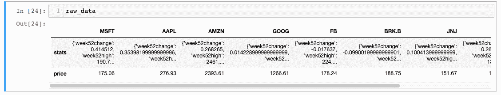

如您所见，`pandas DataFrame`包含每个股票代码的一列和两行:一行用于`stats`端点，一行用于`price`端点。我们需要解析这个数据帧来获得我们想要的四个度量。让我们在下面的步骤中逐一查看这些指标。

### 指标 1:股票代码

这一步非常简单，因为股票代码包含在`pandas DataFrame`的列中。我们可以像这样通过`pandas DataFrame`的`columns`属性来访问它们:

```
raw_data.columns
```

为了访问`raw_data`中的其他指标，我们将创建一个`for`循环，遍历`raw_data.columns`中的每个 ticker。在循环的每次迭代中，我们将把数据添加到一个名为`output_data`的新的`pandas DataFrame`对象中。

首先我们需要创建`output_data`，它应该是一个空的有四列的`pandas DataFrame`。下面是如何做到这一点:

```
output_data = pd.DataFrame(pd.np.empty((0,4)))
```

这创建了一个空的有 0 行 4 列的`pandas DataFrame`。

现在这个对象已经被创建了，下面是我们如何构建这个`for`循环:

```
for ticker in raw_data.columns:

    #Parse the company's name - not completed yet
    company_name = ''

    #Parse the company's stock price - not completed yet
    stock_price = 0

    #Parse the company's dividend yield - not completed yet
    dividend_yield = 0

    new_column = pd.Series([ticker, company_name, stock_price, dividend_yield])
    output_data = output_data.append(new_column, ignore_index = True)
```

接下来，让我们决定如何从`raw_data`对象解析`company_name`变量。

### 指标 2:公司名称

`company_name`变量是需要从`raw_data`对象中解析的第一个变量。简单回顾一下，这里是`raw_data`的样子:

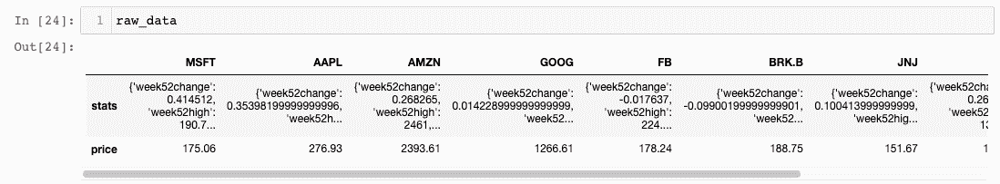

`company_name`变量保存在字典键`companyName`下的`stats`端点中。为了解析`raw_data`中的数据点，我们可以使用这些索引:

```
raw_data[ticker]['stats']['companyName']
```

在我们之前的`for`循环中包含这一点给出了:

```
output_data = pd.DataFrame(pd.np.empty((0,4)))

for ticker in raw_data.columns:

    #Parse the company's name - not completed yet
    company_name = raw_data[ticker]['stats']['companyName']

    #Parse the company's stock price - not completed yet
    stock_price = 0

    #Parse the company's dividend yield - not completed yet
    dividend_yield = 0

    new_column = pd.Series([ticker, company_name, stock_price, dividend_yield])
    output_data = output_data.append(new_column, ignore_index = True)
```

让我们继续解析`stock_price`。

### 指标 3:股票价格

`stock_price`变量包含在`price`端点中，它只返回一个值。这意味着我们不需要像使用`company_name`那样将索引链接在一起。

下面是我们如何从`raw_data`中解析`stock_price`:

```
raw_data[ticker]['price']
```

将这个包含在我们的`for`循环中，我们得到:

```
output_data = pd.DataFrame(pd.np.empty((0,4)))

for ticker in raw_data.columns:

    #Parse the company's name - not completed yet
    company_name = raw_data[ticker]['stats']['companyName']

    #Parse the company's stock price - not completed yet
    stock_price = raw_data[ticker]['price']

    #Parse the company's dividend yield - not completed yet
    dividend_yield = 0

    new_column = pd.Series([ticker, company_name, stock_price, dividend_yield])
    output_data = output_data.append(new_column, ignore_index = True)
```

我们需要解析的最后一个指标是`dividend_yield`。

### 指标 4:股息收益率

如同`company_name`，`dividend_yield`包含在`stats`端点中。它被保存在`dividendYield`字典键下。

下面是我们如何从`raw_data`中解析它:

```
raw_data[ticker]['stats']['dividendYield']
```

将这个添加到我们的`for`循环中，我们得到:

```
output_data = pd.DataFrame(pd.np.empty((0,4)))

for ticker in raw_data.columns:

    #Parse the company's name - not completed yet
    company_name = raw_data[ticker]['stats']['companyName']

    #Parse the company's stock price - not completed yet
    stock_price = raw_data[ticker]['price']

    #Parse the company's dividend yield - not completed yet
    dividend_yield = raw_data[ticker]['stats']['dividendYield']

    new_column = pd.Series([ticker, company_name, stock_price, dividend_yield])
    output_data = output_data.append(new_column, ignore_index = True)
```

让我们打印出我们的`output_data`对象，看看数据是什么样子的:

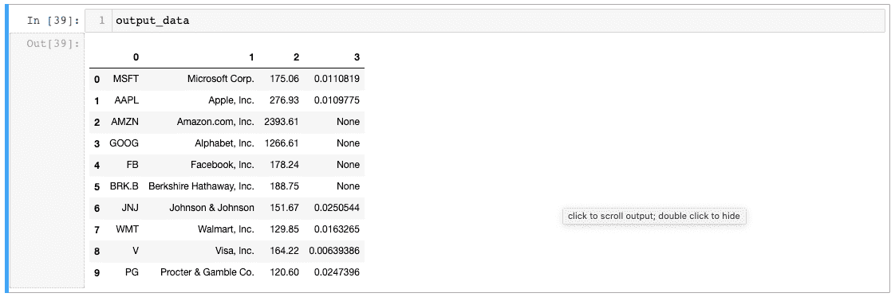

到目前为止一切顺利！接下来的两个步骤是命名`pandas DataFrame`的列并改变它的索引。

### 如何命名熊猫数据框架的列

我们可以通过创建一个列名列表并将其分配给`output_data.columns`属性来更新我们的`output_data`对象的列名，如下所示:

```
output_data.columns = ['Ticker', 'Company Name', 'Stock Price', 'Dividend Yield']
```

让我们打印出我们的`output_data`对象，看看数据是什么样子的:

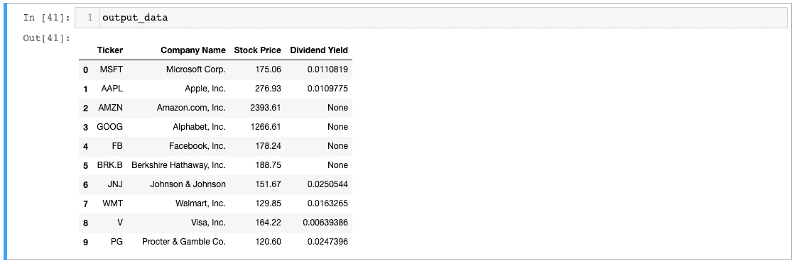

好多了！接下来我们来改变一下`output_data`的索引。

### 如何更改熊猫数据框的索引

`pandas DataFrame`的索引是一个特殊的列，有点类似于 SQL 数据库表的主键。在我们的`output_data`对象中，我们希望将`Ticker`列设置为`DataFrame`的索引。

下面是我们如何使用`set_index`方法实现这一点:

```
output_data.set_index('Ticker', inplace=True)
```

让我们打印出我们的`output_data`对象，看看数据是什么样子的:

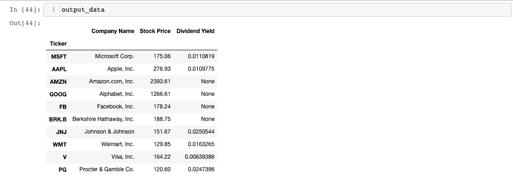

又一个增量改进！

接下来，我们来处理一下`output_data`中的缺失数据。

### 如何处理熊猫数据框中的缺失数据

如果您仔细查看`output_data`，您会注意到在`Dividend Yield`列中有几个`None`值:


这些`None`值只是表明该行的公司目前没有支付股息。虽然`None`是代表不分红股票的一种方式，但更常见的是显示`0`的`Dividend Yield`。

幸运的是，解决这个问题非常简单。`pandas`库包括一个优秀的`fillna`方法，允许我们替换`pandas DataFrame`中缺失的值。

下面是我们如何使用`fillna`方法用`0`替换`Dividend Yield`列的`None`值:

```
output_data['Dividend Yield'].fillna(0,inplace=True)
```

`output_data`物体现在看起来干净多了:

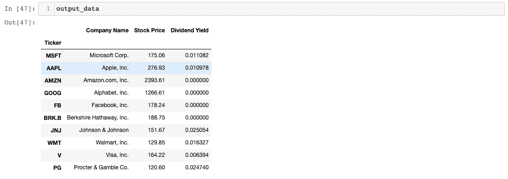

我们现在准备将数据框导出到 Excel 文档中！简单回顾一下，下面是我们迄今为止的 Python 脚本:

```
import pandas as pd

IEX_API_Key = ''

#Specify the stock tickers that will be included in our spreadsheet
tickers = [
            'MSFT',
            'AAPL',
            'AMZN',
            'GOOG',
            'FB',
            'BRK.B',
            'JNJ',
            'WMT',
            'V',
            'PG'
            ]

#Create an empty string called `ticker_string` that we'll add tickers and commas to
ticker_string = ''

#Loop through every element of `tickers` and add them and a comma to ticker_string
for ticker in tickers:
    ticker_string += ticker
    ticker_string += ','

#Drop the last comma from `ticker_string`
ticker_string = ticker_string[:-1]

#Create the endpoint strings
endpoints = 'price,stats'

#Interpolate the endpoint strings into the HTTP_request string
HTTP_request = f'https://cloud.iexapis.com/stable/stock/market/batch?symbols={ticker_string}&types={endpoints}&range=1y&token={IEX_API_Key}'

#Create an empty pandas DataFrame to append our parsed values into during our for loop
output_data = pd.DataFrame(pd.np.empty((0,4)))

for ticker in raw_data.columns:

    #Parse the company's name
    company_name = raw_data[ticker]['stats']['companyName']

    #Parse the company's stock price
    stock_price = raw_data[ticker]['price']

    #Parse the company's dividend yield
    dividend_yield = raw_data[ticker]['stats']['dividendYield']

    new_column = pd.Series([ticker, company_name, stock_price, dividend_yield])
    output_data = output_data.append(new_column, ignore_index = True)

#Change the column names of output_data
output_data.columns = ['Ticker', 'Company Name', 'Stock Price', 'Dividend Yield']

#Change the index of output_data
output_data.set_index('Ticker', inplace=True)

#Replace the missing values of the 'Dividend Yield' column with 0
output_data['Dividend Yield'].fillna(0,inplace=True)

#Print the DataFrame
output_data 
```

### 如何使用 XlsxWriter 从 Pandas 数据框架中导出样式化的 Excel 文档

从`pandas DataFrame`中导出`xlsx`文件有多种方式。

最简单的方法是使用内置函数`to_excel`。例如，下面是我们如何将`output_data`导出到 Excel 文件:

```
output_data.to_excel('my_excel_document.xlsx)
```

这种方法的问题是 Excel 文件没有任何格式。输出如下所示:

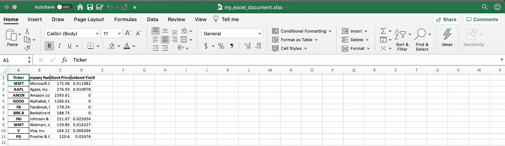

这份文件缺少格式，很难解释。

解决方法是什么？

我们可以使用 Python 包`XlsxWriter`来生成格式良好的 Excel 文件。首先，我们希望将以下导入添加到 Python 脚本的开头:

```
import xlsxwriter
```

接下来，我们需要创建实际的 Excel 文件。XlsxWriter 包实际上有一个关于如何使用`pandas DataFrames`的专用文档页面，可以从[这里](https://xlsxwriter.readthedocs.io/working_with_pandas.html)获得。

我们的第一步是调用`pd.ExcelWriter`函数，并传入我们的`xlsx`文件的期望名称作为第一个参数，传入`engine='xlsxwriter`作为第二个参数。我们将把它赋给一个名为`writer`的变量:

```
writer = pd.ExcelWriter('stock_market_data.xlsx', engine='xlsxwriter') 
```

从那里，我们需要在我们的`pandas DataFrame`上调用`to_excel`方法。这一次，我们将传入刚刚创建的`writer`对象，而不是传入我们试图导出的文件名:

```
output_data.to_excel(writer, sheet_name='Sheet1') 
```

最后，我们将在我们的`writer`对象上调用`save`方法，它将`xlsx`文件保存到我们当前的工作目录中。当所有这些都完成后，这里是我们的 Python 脚本将`output_data`保存到 Excel 文件的部分。

```
writer = pd.ExcelWriter('stock_market_data.xlsx', engine='xlsxwriter')

output_data.to_excel(writer, sheet_name='Sheet1')

writer.save()
```

我们将包含在`xlsx`文件中的所有格式化代码需要包含在`ExcelWriter`对象的创建和`writer.save()`语句之间。

### 如何样式化用 Python 创建的`xlsx`文件

使用 Python 设计 Excel 文件的样式实际上比您想象的要困难。

这部分是因为 XlsxWriter 包的一些限制。其文件规定:

> XlsxWriter 和 Pandas 除了默认格式(如标题和索引单元格以及任何包含日期或日期时间的单元格)之外，很少支持格式化数据帧的输出数据。此外，不能格式化任何已经应用了默认格式的单元格。

> 如果您需要对数据帧输出进行严格控制的格式化，那么您最好直接使用 Xlsxwriter 来处理来自 Pandas 的原始数据。但是，有些格式选项是可用的。

根据我的经验，对 XlsxWriter 创建的`xlsx`文件中的单元格进行样式化的最灵活的方式是使用条件格式，该格式仅在单元格不等于`None`时应用样式化。

这有三个优点:

1.  与 XlsxWriter 中可用的普通格式选项相比，它提供了更大的样式灵活性。
2.  您不需要手动遍历每个数据点，并逐个将它们导入到`writer`对象中。
3.  它可以让你很容易地看到什么时候`None`值已经进入你的最终`xlsx`文件，因为它们将会丢失所需的格式。

要使用条件格式应用样式，我们首先需要创建几个样式模板。具体来说，我们需要四个模板:

*   一个`header_template`将应用于电子表格顶部的列名
*   一个`string_template`将应用于`Ticker`和`Company Name`列
*   一个将应用于`Stock Price`列的`dollar_template`
*   一个将应用于`Dividend Yield`列的`percent_template`

这些格式模板中的每一个都需要添加到类似 CSS 语法的字典中的`writer`对象中。我的意思是:

```
header_template = writer.book.add_format(
        {
            'font_color': '#ffffff',
            'bg_color': '#135485',
            'border': 1
        }
    )

string_template = writer.book.add_format(
        {
            'bg_color': '#DADADA',
            'border': 1
        }
    )

dollar_template = writer.book.add_format(
        {
            'num_format':'$0.00',
            'bg_color': '#DADADA',
            'border': 1
        }
    )

percent_template = writer.book.add_format(
        {
            'num_format':'0.0%',
            'bg_color': '#DADADA',
            'border': 1
        }
    )
```

为了将这些格式应用到我们的`xlsx`文件中的特定单元格，我们需要在`writer.sheets['Stock Market Data']`上调用包的`conditional_format`方法。这里有一个例子:

```
writer.sheets['Stock Market Data'].conditional_format('A2:B11', 
                             {
                                'type':     'cell',
                                'criteria': '<>',
                                'value':    '"None"',
                                'format':   string_template
                                }
                            ) 
```

如果我们将这种格式推广到我们正在应用的其他三种格式，下面是 Python 脚本的格式部分:

```
writer = pd.ExcelWriter('stock_market_data.xlsx', engine='xlsxwriter')

output_data.to_excel(writer, sheet_name='Stock Market Data')

header_template = writer.book.add_format(
        {
            'font_color': '#ffffff',
            'bg_color': '#135485',
            'border': 1
        }
    )

string_template = writer.book.add_format(
        {
            'bg_color': '#DADADA',
            'border': 1
        }
    )

dollar_template = writer.book.add_format(
        {
            'num_format':'$0.00',
            'bg_color': '#DADADA',
            'border': 1
        }
    )

percent_template = writer.book.add_format(
        {
            'num_format':'0.0%',
            'bg_color': '#DADADA',
            'border': 1
        }
    )

#Format the header of the spreadsheet
writer.sheets['Stock Market Data'].conditional_format('A1:D1', 
                             {
                                'type':     'cell',
                                'criteria': '<>',
                                'value':    '"None"',
                                'format':   header_template
                                }
                            )

#Format the 'Ticker' and 'Company Name' columns
writer.sheets['Stock Market Data'].conditional_format('A2:B11', 
                             {
                                'type':     'cell',
                                'criteria': '<>',
                                'value':    '"None"',
                                'format':   string_template
                                }
                            )

#Format the 'Stock Price' column
writer.sheets['Stock Market Data'].conditional_format('C2:C11', 
                             {
                                'type':     'cell',
                                'criteria': '<>',
                                'value':    '"None"',
                                'format':   dollar_template
                                }
                            )

#Format the 'Dividend Yield' column
writer.sheets['Stock Market Data'].conditional_format('D2:D11', 
                             {
                                'type':     'cell',
                                'criteria': '<>',
                                'value':    '"None"',
                                'format':   percent_template
                                }
                            )

writer.save()
```

让我们看看我们的 Excel 文档，看看它是什么样子的:

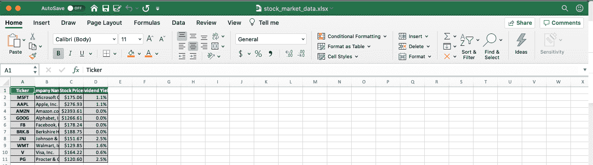

到目前为止一切顺利！我们可以对这个文档进行的最后一个增量改进是使它的列更宽一些。

我们可以通过调用`writer.sheets['Stock Market Data']`上的`set_column`方法来指定列宽。

为此，我们将在 Python 脚本中添加以下内容:

```
#Specify all column widths
writer.sheets['Stock Market Data'].set_column('B:B', 32)
writer.sheets['Stock Market Data'].set_column('C:C', 18)
writer.sheets['Stock Market Data'].set_column('D:D', 20)
```

这是电子表格的最终版本:

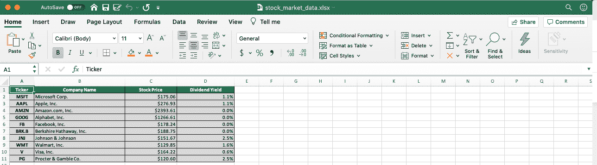

瞧啊。我们可以走了！[你可以在 GitHub 上点击](https://github.com/nicholasmccullum/freecodecamp-articles)获得这个 Python 脚本的最终版本。该文件被命名为`stock_market_data.py`。

## 步骤 3:设置一个 AWS EC2 虚拟机来运行 Python 脚本

您的 Python 脚本已经完成，可以运行了。

然而，我们不希望只是在本地机器上临时运行它。

相反，我们将使用亚马逊网络服务的弹性计算云服务建立一个虚拟机。

如果您还没有 AWS 帐户，您需要先创建一个。为此，请导航到此 URL，然后单击右上角的“创建 AWS 帐户”:


AWS 的 web 应用程序将引导您完成创建帐户的步骤。

创建帐户后，您需要创建一个 EC2 实例。这只是一个在 AWS 基础设施上运行代码的虚拟服务器。

EC2 实例有各种操作系统和规模，从符合 AWS 免费层的非常小的服务器到能够运行复杂应用程序的非常大的服务器。

我们将使用 AWS 最小的服务器来运行我们在本文中编写的 Python 脚本。首先，在 AWS 管理控制台中导航到 EC2。到达 EC2 后，点击`Launch Instance`:


这将把您带到一个包含 AWS EC2 中所有可用实例类型的屏幕。任何符合 AWS 免费等级的机器都足够了。

我选择了`Amazon Linux 2 AMI (HVM)`:


点击`Select`继续。

在下一页，AWS 将要求您为您的机器选择规格。您可以选择的字段包括:

*   `Family`
*   `Type`
*   `vCPUs`
*   `Memory`
*   `Instance Storage (GB)`
*   `EBS-Optimized`
*   `Network Performance`
*   `IPv6 Support`

出于本教程的目的，我们只想选择符合自由层条件的单台计算机。它的特点是有一个看起来像这样的绿色小标签:


一旦您选择了符合自由层条件的机器，单击屏幕底部的`Review and Launch`继续。下一个屏幕将显示新实例的详细信息，供您查看。快速查看机器的规格，然后点击右下角的`Launch`。

点击`Launch`按钮将触发一个弹出窗口，要求您`Select an existing key pair or create a new key pair`。一个密钥对由 AWS 持有的一个公钥和一个私钥组成，您必须下载并存储在一个`.pem`文件中。您必须能够访问那个`.pem`文件，以便访问您的 EC2 实例(通常通过 SSH)。您也可以选择在没有密钥对的情况下继续，但是出于安全原因，不建议使用**而不是**。

一旦您为这个 EC2 实例选择或创建了一个密钥对，并单击单选按钮`I acknowledge that I have access to the selected private key file (data-feeds.pem), and that without this file, I won't be able to log into my instance`，您就可以单击`Launch Instances`继续。

您的实例现在将开始启动。这些实例启动需要一些时间，但是一旦准备好，它的`Instance State`将在 EC2 仪表板中显示为`running`。

接下来，您需要将 Python 脚本推入 EC2 实例。下面是一个通用的命令状态语句，允许您将文件移动到 EC2 实例中:

```
scp -i path/to/.pem_file path/to/file   username@host_address.amazonaws.com:/path_to_copy 
```

使用必要的替换来运行该语句，以将`stock_market_data.py`移动到 EC2 实例中。

此时尝试运行`stock_market_data.py`实际上会导致错误，因为 EC2 实例没有附带必要的 Python 包。

要解决这个问题，您可以导出一个`requirements.txt`文件并使用`pip`导入适当的包，或者您可以简单地运行以下命令:

```
sudo yum install python3-pip
pip3 install pandas
pip3 install xlsxwriter
```

完成后，您可以通过 SSH 进入 EC2 实例，并使用以下语句从命令行运行 Python 脚本:

```
python3 stock_market_data.py
```

## 步骤 4:创建一个 AWS S3 存储桶来存放完成的 Python 脚本

到目前为止，通过我们已经完成的工作，我们的 Python 脚本可以在 EC2 实例内部执行。

这样做的问题是,`xlsx`文件将被保存到 AWS 虚拟服务器。

除了服务器中我们之外，任何人都不能访问它，这限制了它的有用性。

为了解决这个问题，我们将在 AWS S3 上创建一个公共存储桶来保存`xlsx`文件。一旦更改完成，任何拥有正确 URL 的人都可以下载该文件。

首先，从 AWS 管理控制台导航到 AWS S3。点击右上角的`Create bucket`:

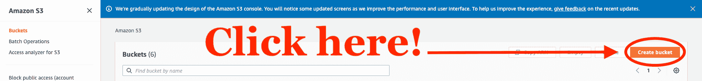

在下一个屏幕上，您需要为您的存储桶选择一个名称，并为存储桶选择一个 AWS 区域。存储桶名称必须唯一，并且不能包含空格或大写字母。对于本教程来说，区域并不重要，所以我将使用默认的区域`US East (Ohio) us-east-2)`。

您需要在下一节中更改公共访问设置以匹配此配置:

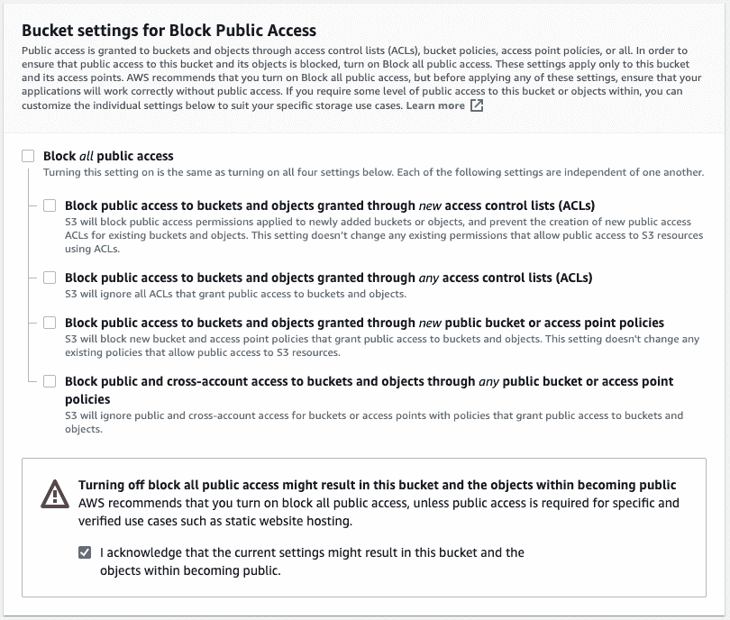

点击`Create bucket`创建您的桶，并结束本教程的这一步！

## 步骤 5:修改 Python 脚本，将 xlsx 文件推送到 AWS S3

我们的 AWS S3 桶现在已经准备好容纳我们最终确定的`xlsx`文档。我们现在将对我们的`stock_market_data.py`文件做一个小小的更改，将最终完成的文档推送到我们的 S3 存储桶。

我们将需要使用`boto3`包来完成这项工作。`boto3`是用于 Python 的 AWS 软件开发工具包(SDK)，允许 Python 开发人员编写连接到 AWS 服务的软件。首先，您需要在 EC2 虚拟机上安装`boto3`。为此，请运行以下命令行语句:

```
pip3 install boto3 
```

您还需要将下面的语句添加到 Python 脚本的顶部，将库导入到`stock_market_data.py`中。

```
import boto3
```

我们需要在`stock_market_data.py`的末尾添加几行代码，将最终文档推送到 AWS S3。

```
s3 = boto3.resource('s3')
s3.meta.client.upload_file('stock_market_data.xlsx', 'my-S3-bucket', 'stock_market_data.xlsx', ExtraArgs={'ACL':'public-read'})
```

这段代码的第一行`s3 = boto3.resource('s3')`，允许我们的 Python 脚本连接到 Amazon Web 服务。

第二行代码调用了来自`boto3`的一个方法，该方法实际上将我们的文件上传到 S3。它需要四个参数:

*   `stock_market_data.xlsx` -本地机器上的文件名。
*   我们上传文件的 S3 存储桶的名字。
*   `stock_market_data.xlsx`-S3 存储桶中所需的文件名。在大多数情况下，这将与传递给此方法的第一个参数具有相同的值。
*   `ExtraArgs={'ACL':'public-read'}` -这是一个可选参数，告诉 AWS 让上传的文件公开可读。

## 步骤 6:使用 Cron 安排 Python 脚本定期运行

到目前为止，我们已经完成了以下工作:

*   构建了我们的 Python 脚本
*   创建了一个 EC2 实例，并在那里部署了我们的代码
*   创建了一个 S3 存储桶，我们可以在那里推送最终的`xlsx`文档
*   修改了原始 Python 脚本，将最终确定的`stock_market_data.xlsx`文件上传到 AWS S3 存储桶

剩下的唯一一步是安排 Python 脚本定期运行。

我们可以使用名为`cron`的命令行实用程序来实现这一点。首先，我们需要创建一个`cron`表达式，告诉实用程序何时运行代码。T2 crontab guru T3 网站是这方面的一个很好的资源。

以下是如何使用 crontab guru 获得表示`every day at noon`的`cron`表达式:


现在我们需要指示 EC2 实例的`cron`守护进程在每天的这个时间运行`stock_market_data.py`。

为此，我们将首先在 EC2 实例中创建一个名为`stock_market_data.cron`的新文件。

打开这个文件，输入我们的 cron 表达式，然后输入应该在指定时间在命令行执行的语句。

我们的命令行语句是`python3 stock_market_data.py`，所以下面是`stock_market_data.cron`中应该包含的内容:

```
00 12 * * * python3 stock_market_data.py
```

如果您在 EC2 实例中运行一个`ls`命令，您现在应该会看到两个文件:

```
stock_market_data.py	stock_market_data.cron
```

本教程的最后一步是将`stock_market_data.cron`加载到`crontab`中。您可以将`crontab`视为一个文件，其中包含供`cron`守护进程执行的命令和指令。换句话说，`crontab`包含了一批`cron`作业。

首先，让我们看看我们的`crontab`里有什么。它应该是空的，因为我们没有在里面放任何东西！您可以使用以下命令查看您的`crontab`的内容:

```
crontab -l
```

要将`stock_market_data.cron`加载到`crontab`中，请在命令行上运行以下语句:

```
crontab stock_market_data.cron
```

现在，当您运行`crontab -l`时，您应该会看到:

```
00 12 * * * python3 stock_market_data.py
```

我们的`stock_market_data.py`脚本现在将每天中午在我们的 AWS EC2 虚拟机上运行！

## 最后的想法

在本文中，您了解了如何使用 Python、IEX 云和 Amazon Web Services 创建自动更新财务数据的 Excel 电子表格。

以下是我们在本教程中介绍的具体步骤:

*   如何使用 IEX 云创建帐户
*   如何使用 pandas 和 XlsxWriter 编写一个 Python 脚本来生成漂亮的 Excel 文档
*   如何启动 AWS EC2 实例并在其上部署代码
*   如何创建 AWS S3 存储桶
*   如何从 Python 脚本中将文件推送到 AWS S3 存储桶
*   如何使用`cron`软件实用程序调度代码运行

这篇文章由 Nick McCullum 发表，他在自己的网站上教人们如何编码。