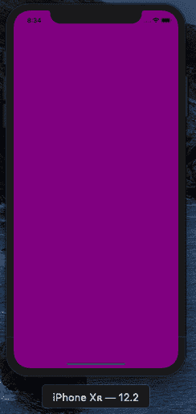
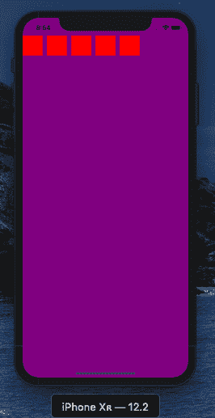
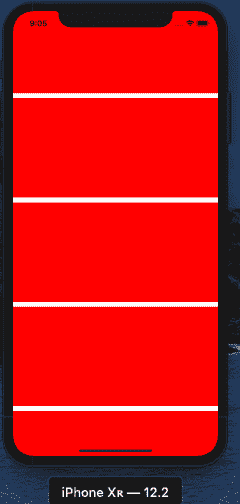
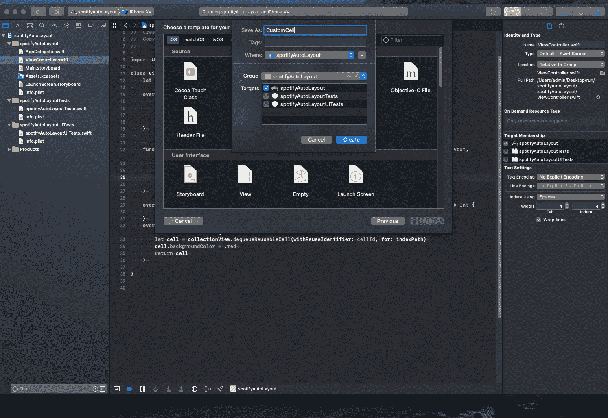
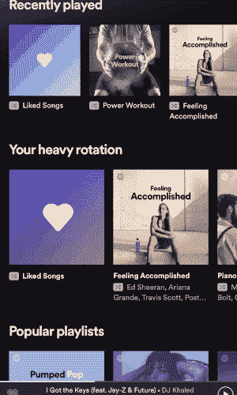
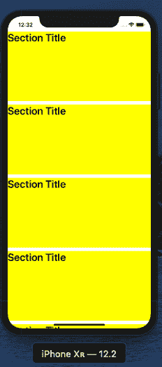
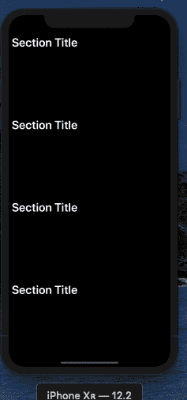
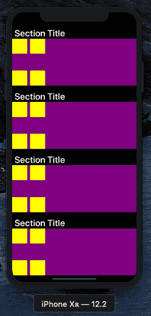
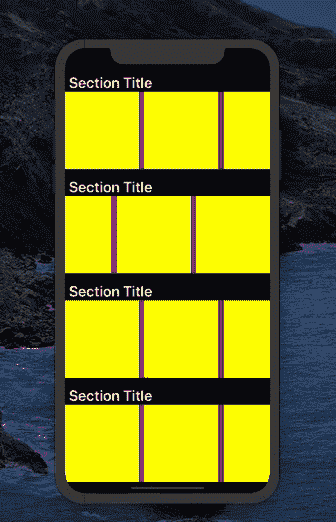

# 如何使用 AutoLayout 以编程方式为 iOS 构建 Spotify 克隆

> 原文：<https://www.freecodecamp.org/news/autolayout-programmatically-spotify-clone-in-swift/>

在本帖中，我们将尝试以编程方式在 Swift 中重新创建 Spotify 主屏幕布局。为什么以编程方式？我认为知道如何以不同的方式构建东西总是好的，我喜欢编写代码以编程的方式做事。如果您正在与团队合作或者使用版本控制，这些技能尤其有用。


这是 Spotify 移动应用程序的实际主屏幕。因此，为了实现这种布局，我们将使用`UICollectionView`，也可以使用`TabBarController`来创建选项卡导航器。

> 基本要求:首先确保你安装了 Xcode +10 和 swift +4。

让我们从使用 Xcode 创建一个新的 Xcode 项目开始:


在`ViewController.swift`中我们需要做的第一件事是将超类改为`UICollectionViewController`而不是`UIViewController`，因为我们的类将基于`collectionView`。

```
//
//  ViewController.swift
//  spotifyAutoLayout
//
//  Created by admin on 10/31/19.
//  Copyright © 2019 Said Hayani. All rights reserved.
//

import UIKit

class ViewController: UICollectionViewController {

    override func viewDidLoad() {
        super.viewDidLoad()
        collectionView.backgroundColor = .purple
        // Do any additional setup after loading the view.
    }

} 
```

如果您尝试运行应用程序，构建将会失败。我们需要在`didFinishLaunchingWithOptions`函数中的`AppDelegate.swift`文件中添加一些代码，这些代码在`return`语句之前:

```
 let layout = UICollectionViewFlowLayout()
        window = UIWindow()
        window?.rootViewController = ViewController(collectionViewLayout: layout)
```

代码应该是这样的:

```
func application(_ application: UIApplication, didFinishLaunchingWithOptions launchOptions: [UIApplication.LaunchOptionsKey: Any]?) -> Bool {
        // Override point for customization after application launch.
        let layout = UICollectionViewFlowLayout()
        window = UIWindow()
        window?.rootViewController = ViewController(collectionViewLayout: layout)
        return true
    }
```

现在，您应该能够运行应用程序，并看到`backgroundColor`更改为`purple`:



下一步是分配布局，并在各部分之间平均分配空间。

让我们定义一下我们的`CollectionView`的方法。

步骤:

*   用唯一标识符注册可重复使用的单元
*   定义区段中的项目数
*   使用注册的单元格

为了使用某些`CollectionView`方法，我们需要始终遵循`UICollectionViewDelegateFlowLayout`作为超类，并获得方法的自动完成。所以让我们从注册 CollectionViewCell 开始。

在`View.DidLoad()`中，我们调用`collectionView.register()`方法来注册可重用的单元格:

```
 collectionView.register(UICollectionViewCell.self, forCellWithReuseIdentifier: cellId)
```

然后我们使用`numberOfItemsInSection`定义`collectionView`中的单元格数量。现在我们只需要做 5 个项目:

```
 override func collectionView(_ collectionView: UICollectionView, numberOfItemsInSection section: Int) -> Int {
        return 5
    }
```

下一步是使用`cellForItemAt`定义可重用的单元格，该单元格应该返回`UICollectionViewCell`并具有名为`cellId`的惟一 id。代码如下所示:

```
 override func collectionView(_ collectionView: UICollectionView, cellForItemAt indexPath: IndexPath) -> UICollectionViewCell {
        let cell = collectionView.dequeueReusableCell(withReuseIdentifier: cellId, for: indexPath)
        cell.backgroundColor = .red
        return cell
    }
```

完整的代码应该如下所示:

```
import UIKit

class ViewController: UICollectionViewController, UICollectionViewDelegateFlowLayout {
    let cellId : String = "cellId"

    override func viewDidLoad() {
        super.viewDidLoad()
        collectionView.backgroundColor = .purple
        collectionView.register(UICollectionViewCell.self, forCellWithReuseIdentifier: cellId)

    }

    override func collectionView(_ collectionView: UICollectionView, numberOfItemsInSection section: Int) -> Int {
        return 5
    }
    override func collectionView(_ collectionView: UICollectionView, cellForItemAt indexPath: IndexPath) -> UICollectionViewCell {
        let cell = collectionView.dequeueReusableCell(withReuseIdentifier: cellId, for: indexPath)
        cell.backgroundColor = .red
        return cell
    }

}
```

您应该可以在屏幕上看到 5 个红色背景的项目:



## 为单元格添加自定义宽度和高度

现在我们需要按照正确的顺序放置单元格，并给它们一个`width`和`height`。每个单元格将屏幕的`width`作为`width`。

我们很幸运拥有`sizeForItemAt`方法，所以我们可以给单元格一个自定义的`width`和`height`。这是一个应该返回一个`CGSize`类型的方法:

```
 func collectionView(_ collectionView: UICollectionView, layout collectionViewLayout: UICollectionViewLayout, sizeForItemAt indexPath: IndexPath) -> CGSize {
        let width = view.frame.width
        let height = CGFloat(200)

        return CGSize(width: width, height: height)
    }
```

所以我们用`view.frame.width`和一个`CGFloat`类型的自定义`height`让`Cell`取屏幕的`width`。

现在，您可以在模拟器中看到以下结果:



到目前为止一切看起来都很好。这次让我们创建一个可重用的自定义单元格。创建一个名为`CustomCell`的新 Swift 文件:



`CustomCell.swift`应该是下面这个样子:

```
 import UIKit

class CustomCell: UICollectionViewCell {
    override init(frame: CGRect) {
        super.init(frame: frame)

    }

    required init?(coder aDecoder: NSCoder) {
        fatalError("init(coder:) has not been implemented")
    }
} 
```

现在我们要做的下一件事是修改两个方法来支持可重用单元，`collectionView.register`和`cellForItemAt`。让我们首先修改注册方法。将`UICollectionViewCell.**self**` 替换为`CustomCell`:

```
 collectionView.register(UICollectionViewCell.self, forCellWithReuseIdentifier: cellId) 
```

接下来我们需要将`cellForItemAt`转换成符合`CustomCell`的形式，如下所示:

```
 let cell = collectionView.dequeueReusableCell(withReuseIdentifier: cellId, for: indexPath) as! CustomCell
```

如果你运行这个程序，你可能不会注意到任何变化，所以给 CustomCell 一个 backgroundColor `backgroundColor = .yellow`。不要忘记拆下`cellForItemAt`中的线`cell.backgroundColor = .red`。你应该看到背景颜色变成了黄色。


现在是时候给:D 加点盐了

如果您查看 Spotify 主屏幕，我们示例中的每个部分`CustomCell`都包含一个部分标题、子单元格，并且是水平的:



## 添加章节标题

让我们给单元格添加一个标题标签。在`CutomCell`类中创建`titleLabel`元素:

```
let titleLabel: UILabel = {
        let lb  = UILabel()
        lb.text = "Section Title"
        lb.font = UIFont.boldSystemFont(ofSize: 14)
        lb.font = UIFont.boldSystemFont(ofSize: 14)

        return lb
    }()
```

然后将元素添加到`init()`块内的视图中:

```
addSubview(titleLabel)
```

如果你运行应用程序，你不会看到任何变化，这是因为我们还没有对元素进行任何约束。所以让我们添加一些约束——将这个属性`lb.translatesAutoresizingMaskIntoConstraints = **false**` 添加到`titleLabel`中，以便能够对元素应用约束:

将`titleLabel`添加到视图后，我们定义约束:

```
 addSubview(titleLabel)
titleLabel.topAnchor.constraint(equalTo: topAnchor, constant: 8).isActive = truetitleLabel.leftAnchor.constraint(equalTo: leftAnchor,constant: 8 ).isActive = true
```

务必添加`.isActive = true`属性——没有它，约束将不起作用！



在我们进入下一部分之前，让我们首先将屏幕的背景颜色改为黑色，并删除单元格的黄色:



现在最重要的部分来了:将亚细胞放入每个细胞中。为了实现这一点，我们将在`CustomCell`中添加一个`CollectionView`。

要在`UICollectionViewCell`中添加一个`CollectionView`，我们需要添加属性`UICollectionViewDelegate`、`UICollectionViewDelegateFlowLayout`和`UICollectionViewDataSource`作为`CustomCell`的超类。

让我们将`collectionView`元素创建为任何简单的视图:

```
 let collectionView : UICollectionView = {
        // init the layout
        let layout = UICollectionViewFlowLayout()
        // set the direction to be horizontal
        layout.scrollDirection = .horizontal

        // the instance of collectionView

        let cv = UICollectionView(frame: .zero, collectionViewLayout: layout)

        // Activate constaints

        cv.translatesAutoresizingMaskIntoConstraints = false

        return cv

    }()
```

Reference: [https://stackoverflow.com/questions/44614743/add-uicollectionview-in-uicollectionviewcell](https://stackoverflow.com/questions/44614743/add-uicollectionview-in-uicollectionviewcell)

注意，我们将`layout`添加到初始化器中的`collectionView`层，就像我们第一次处理`viewController.swift`一样。这里我们还指定`FlowLayout`的方向为`.horizontal`。

让我们将`collectionView`柠檬作为子视图添加到视图中。

我们要做一个函数，让代码更简洁。

```
 fileprivate  func setupSubCells(){
        // add collectionView to the view
        addSubview(collectionView)

        collectionView.dataSource = self
        collectionView.delegate = self
        // setup constrainst
        // make it fit all the space of the CustomCell
        collectionView.topAnchor.constraint(equalTo: titleLabel.bottomAnchor).isActive = true
        collectionView.leftAnchor.constraint(equalTo: leftAnchor).isActive = true
        collectionView.bottomAnchor.constraint(equalTo: bottomAnchor).isActive = true
        collectionView.rightAnchor.constraint(equalTo: rightAnchor).isActive = true
    } 
```

确保将`collectionView`和数据源的委托设置为`self`:

`collectionView.dataSource = self`

`collectionView.delegate = self`

然后调用`init`块内的函数。

如果您尝试构建应用程序，Xcode 会显示一些错误，因为我们不符合`UICollectionViewDelegate`和`UICollectionViewDelegateFlowLayout`协议。要解决这个问题，我们首先需要将子单元注册为可重用单元。

在类的顶部创建一个变量，并给它命名为`cellId`，这样我们就可以在需要单元格标识符时使用它:

`let cellId : String = "subCellID"`

```
collectionView.register(UICollectionViewCell.self, forCellWithReuseIdentifier: cellId)
```

现在，我们又缺少了两个方法来消除错误:`numberOfItemsInSection`定义了节中单元格的数量，而`cellForItemAt`定义了可重用的单元格。这些方法是`collectionView`正常工作所必需的:

```
 // number of cells
func collectionView(_ collectionView: UICollectionView, numberOfItemsInSection section: Int) -> Int {
       return  4
    }

    // reusable Cell
     func collectionView(_ collectionView: UICollectionView, cellForItemAt indexPath: IndexPath) -> UICollectionViewCell {
        let cell = collectionView.dequeueReusableCell(withReuseIdentifier: cellId, for: indexPath)
         cell.backgroundColor = .yellow

        return cell
    }
```

结果应该是这样的:



如你所见，`collectionView`是紫色的背景，子单元格是黄色的。

在结束这篇文章之前，我们可以做的最后一件事是让`subCells`具有部分的高度和宽度。我们再次使用`sizeForItemAt`来定义单元的`height`和`width`。

```
 func collectionView(_ collectionView: UICollectionView, layout collectionViewLayout: UICollectionViewLayout, sizeForItemAt indexPath: IndexPath) -> CGSize {

        let width = frame.height
        let height = frame.height

        return CGSize(width: width, height: height)

    }
```

我们在这里？：



不错！我就讲到这里，所以这篇文章不会太长。我将制作第二部分，我们将添加一些模拟图片，并用一些数据填充它。

### 完整源代码？[这里](https://github.com/hayanisaid/autoLayout-programmatically-in-swift)

如果你有任何补充、问题或更正，请在下面的评论中发表？或者在推特上给我打电话。

**[订阅](https://webege.us16.list-manage.com/subscribe?u=311846a57d1e1a666287ad128&id=2b386b2ebb)** 到我的电子邮件列表，在本教程第二部分发布时会得到通知