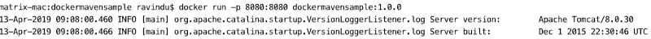
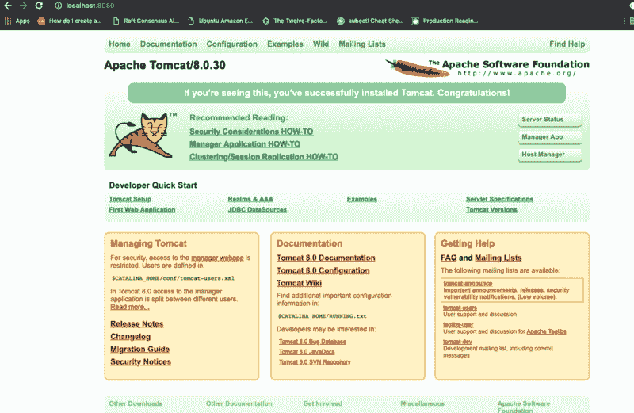
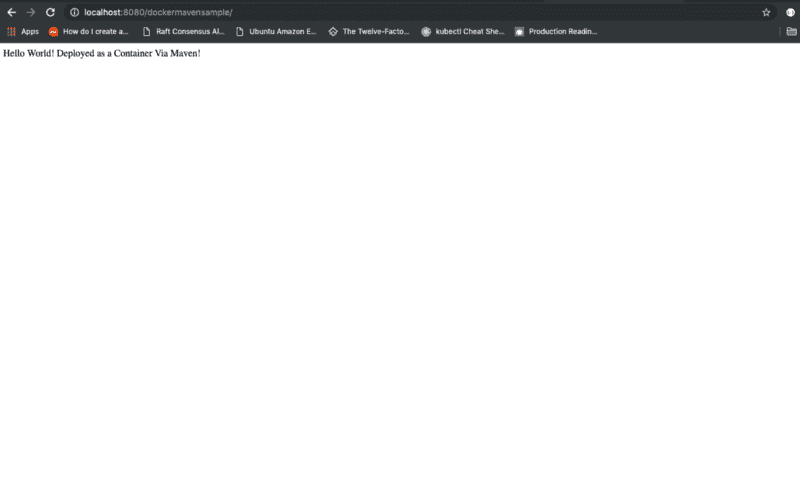

# 如何通过 Maven 自动化 Docker 容器部署

> 原文：<https://www.freecodecamp.org/news/automate-docker-container-deployment-via-maven-53a855e26d3e/>

作者:拉温杜·费尔南多

本文面向使用 Maven 作为 JAVA 应用程序的构建和依赖管理工具的人。它将向您展示如何将 docker 容器构建、标记和推送工作流集成到他们现有的 Maven 构建管理生态系统中。

能够直接从 Maven 生命周期命令中构建、标记和推送应用程序作为容器是一件非常酷的事情。如果您试图利用容器的力量来部署您的应用程序，并准备好使用 Maven 进行依赖关系管理，这会让事情变得简单快捷。

如果我们看看将 docker 容器部署集成到 Maven 中的现有解决方案，有几个解决方案，如 [spotify maven docker 插件](https://github.com/spotify/docker-client)、 [fabric8io docker maven 插件](https://github.com/fabric8io/docker-maven-plugin)等。但是所有这些解决方案都会带来不必要的复杂性、额外的学习曲线以及对现有应用程序代码的太多更改。然而，有一种更简单、更容易的方法来实现这一点，无需使用任何第三方插件。

如果你注意到 Maven 的 Ant 插件，它允许我们运行外部命令。因此，通过使用 Ant 插件，我们能够运行 docker 构建、标记、推送或任何您希望的命令。我们唯一要做的就是提供一个合适的 Docker 文件，用于为您的应用程序构建 Docker 映像，并将一组必要的命令和 Maven 配置放入 pom.xml 文件中。

> 为了解释这个过程中涉及的步骤，我将使用一个示例 JAVA 应用程序。它包含以下步骤中使用的所有代码示例。你可以从[这里](https://github.com/rav94/dockermavensample)克隆。

### **步骤 1 |创建 Dockerfile 文件**

> Dockerfile 应该存储在 JAVA 应用程序的路径***src/main/docker/docker file****中。*

```
*`# Pull base imageFROM tomcat:8.0.30-jre7# MaintainerMAINTAINER "ravindu@emojot.com"`*
```

```
*`# Set Environment propertiesENV JAVA_OPTS=-Denvironment=production# Copy war file to tomcat webapps folderCOPY /dockermavensample.war /usr/local/tomcat/webapps/`*
```

### ***步骤 2 |更新 pom.xml，将所有 Docker 相关资源复制到目标目录***

> *我们可以使用 maven-resource-plugin 来复制资源。*

```
*`<plugin>    <artifactId>maven-resources-plugin</artifactId>    <executions>        <execution>            <id>copy-resources</id>            <phase>validate<;/phase>            <goals>                <goal>copy-resources</goal>            </goals>            <configuration>                <outputDirectory>${basedir}/target</outputDirectory>;                <resources>                    <resource>                        <directory>src/main/docker</directory>                        <filtering>true</filtering>                    </resource>                </resources>            </configuration>        </execution>    </executions></plugin>`*
```

### ***步骤 3 |更新 pom.xml 以允许通过 Maven 的 Ant 插件构建和标记 Docker 映像***

```
*`&lt;plugin>    &lt;groupId>org.apache.maven.plugins</groupId&gt;    <artifactId&gt;maven-antrun-plugin&lt;/artifactId>    <version>1.6&lt;/version>    <executions>        <execution&gt;            <id>prepare-package<;/id>            <phase&gt;package</phase>            &lt;inherited>false<;/inherited>            <configuration>                &lt;target>                    <exec executable="docker">                        <arg value="build"/>                        <arg value="-t"/>                        <arg value="dockermavensample:${project.version}"/>                        <arg value="target"/>;                    <;/exec>                &lt;/target&gt;            </configuration>            <goals>                <goal>run</goal>            </goals>        </execution>    </executions></plugin>`*
```

*Maven 的 Ant 插件将按照以下顺序在 Maven 生命周期的打包阶段执行 docker 命令，这将从在步骤 2 中复制到目标文件夹中的 docker 文件构建 docker 映像。*

```
*`docker build -t dockermavensample:1.0.0 target`*
```

### ***步骤 4 |更新 pom.xml 文件，允许将 Docker 映像推送到远程 Docker 存储库***

> *理想情况下，对于生产，您必须将您的 Docker 映像推送到您自己的私有 Docker 注册表中，或者使用第三方 Docker 映像存储库来存储私有 Docker 映像，这样其他人就无法直接获取您的 Docker 映像。*

```
*`<plugin>    <;groupId>org.apache.maven.plugins</groupId>;    <artifactId>maven-antrun-plugin<;/artifactId>    <version>1.6</version>    <executions>;        <execution>            <phase>install</phase>            <inherited>false</inherited>            &lt;configuration>                <target&gt;                    <exec executable="docker">                        <arg value="tag"/>                        <arg value="dockermavensample:${project.version}"/>                        <arg value="dockermavensample:latest"/&gt;                    </exec>                    <exec executable="docker">                        <arg value="push"/>                        <arg value="dockermavensample:latest"/>                    </exec>                </target>            </configuration>            <goals>                <goal>run</goal>            </goals>        </execution>    </executions></plugin>`*
```

*除了上述步骤之外，您可能想要控制如何在 Maven 生命周期中运行这些 docker 相关命令。为此，您可以使用 Maven 概要文件对上述插件定义进行逻辑划分。然后，仅当调用与该操作相关的概要文件时，才执行这些操作。*

***看看下面的样本配置文件:***

```
*`&lt;profile>    <id>dockerBuild</id>    <build>        <plugins>            <plugin>                <artifactId>maven-resources-plugin</artifactId>                <executions>                    &lt;execution>                        <id>copy-resources</id>                        <phase>validate</phase>;                        <goals&gt;                            <goal&gt;copy-resources</goal>                        </goals&gt;                        <configuration&gt;                            <outputDirectory&gt;${basedir}/target</outputDirectory>                            &lt;resources>                                <resource>                                    <directory>src/main/docker</directory&gt;                                    &lt;filtering>true</filtering>                                </resource&gt;                            </resources>;                        &lt;/configuration>                    </execution&gt;                </executions&gt;            </plugin>            <plugin>                <groupId>org.apache.maven.plugins</groupId>                <;artifactId>maven-antrun-plugin</artifactId>                <;version>1.6</version>                <executions>                    <execution>                        <id&gt;prepare-package</id>                        &lt;phase>package</phase>                        <inherited>false</inherited&gt;                        <configuration&gt;                            <target>                                <exec executable="docker">                                    <arg value="build"/>                                    &lt;arg value="-t"/>                                    <arg value="dockermavensample:${project.version}"/>                                    <arg value="target"/>                                </exec>                            </target>                        </configuration>                        <goals>                            <goal>run</goal>                        </goals>                    </execution>                </executions>            </plugin>        </plugins>    </build>`*
```

```
 *`&lt;activation>        <activeByDefault>true</activeByDefault>;    </activation></profile>`*
```

```
*`<!-- docker Image push and release profile -->&lt;profile>    <id&gt;dockerRelease</id&gt;    <build>        <plugins>            <plugin>                <groupId>org.apache.maven.plugins</groupId>                <artifactId&gt;maven-antrun-plugin</artifactId>                <version>1.6</version>                <executions>                    <execution>                        <phase&gt;install</phase>                        &lt;inherited>false</inherited&gt;                        <configuration>                            <target>                                <exec executable="docker">                                    <arg value="tag"/>                                    <arg value="dockermavensample:${project.version}"/>                                    <arg value="dockermavensample:latest"/>                                </exec&gt;                                <exec executable="docker">                                    <arg value="push"/>                                    <arg value="dockermavensample:latest"/>                                </exec>                            <;/target&gt;                        &lt;/configuration>                        <goals>                            <goal>run</goal>                        </goals>                    </execution>                </executions>            </plugin>        </plugins>    </build></profile>`*
```

*完成以上步骤后，运行*

```
*`mvn clean install -P dockerBuild,dockerRelease`*
```

*现在，您的 JAVA 应用程序被打包成一个容器，并被推入远程 docker 存储库。您可以通过运行以下命令来测试您创建的映像是否正常工作，*

*

After running dockerBuild profile, the Docker image should be available locally* *

Run dockermavensample:1.0.0 Docker Image* *

Apache Tomcat Home Page* *

Kaboom! :)* 

*正如您所看到的，我们可以使用已经可用的 Maven 特性和插件来创建一个结构良好的构建管道，用于将我们的应用程序部署为容器。*

***样本项目:***

*[**rav 94/dockermavensample**](https://github.com/rav94/dockermavensample)
[*展示通过 Maven-rav 94/dockermavensample*github.com](https://github.com/rav94/dockermavensample)实现自动化容器部署的演示项目*

*感谢阅读！*